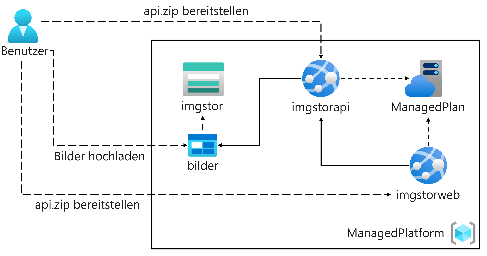
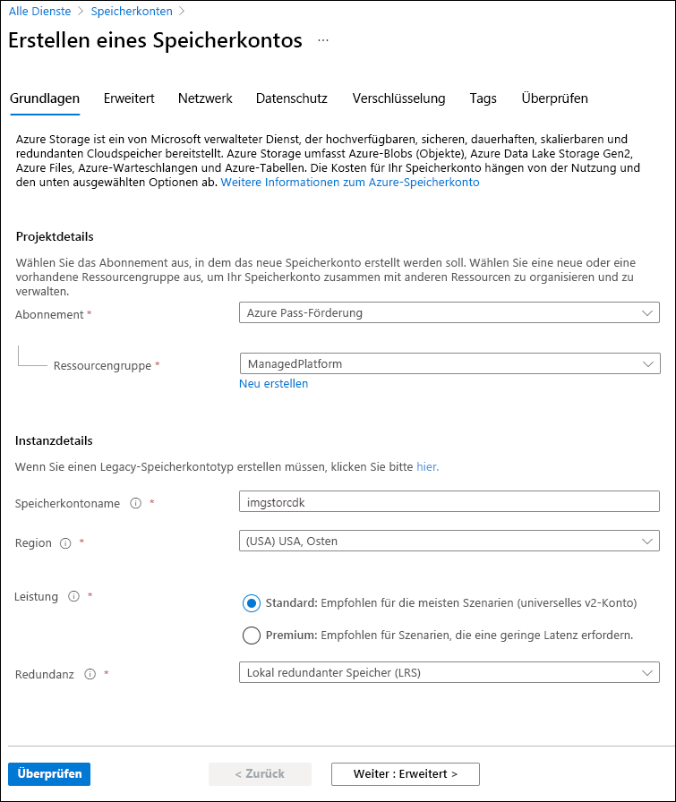
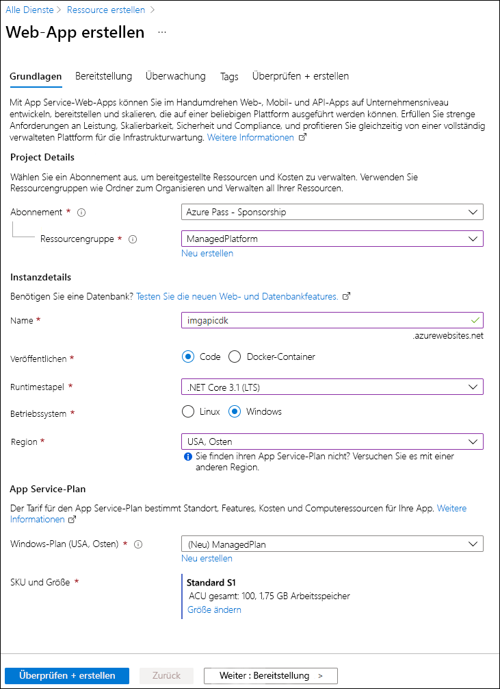
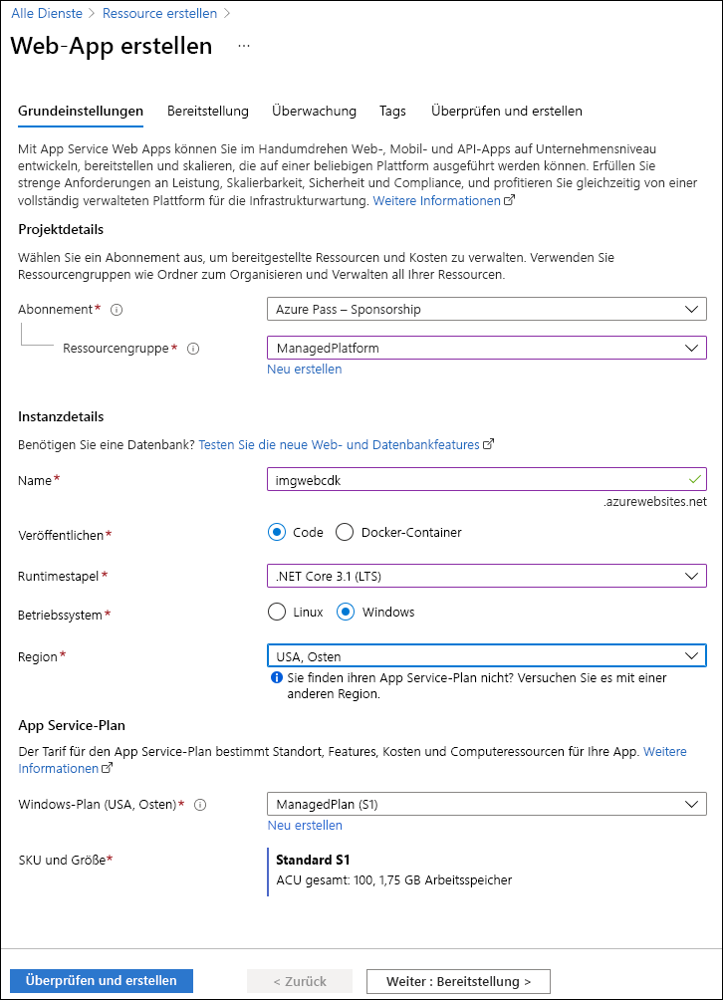

---
lab:
  az204Title: 'Lab 01: Build a web application on Azure platform as a service offerings'
  az204Module: 'Learning Path 01: Implement Azure App Service Web Apps'
---

# Lab 01: Erstellen einer Webanwendung auf einem Azure-PaaS-Angebot (Platform as a Service)

## Microsoft Azure-Benutzeroberfläche

Aufgrund der dynamischen Natur der Microsoft-Cloudtools kann es vorkommen, dass sich die Azure-Benutzeroberfläche nach der Entwicklung dieses Trainingsinhalts ändert. Daher sind die Lab-Anweisungen und Lab-Schritte möglicherweise nicht mehr zutreffend.

Microsoft aktualisiert diesen Trainingskurs, wenn die Community uns über die erforderlichen Änderungen informiert. Cloudupdates kommen jedoch häufig vor, sodass möglicherweise Änderungen an der Benutzeroberfläche auftreten, bevor diese Trainingsinhalte aktualisiert werden. **Wenn dies der Fall ist, stellen Sie sich auf die Veränderungen ein, und arbeiten Sie sie bei Bedarf in den Labs durch.**

## Anweisungen

### Vorbereitung

#### Anmelden bei der Laborumgebung

Melden Sie sich mithilfe der folgenden Anmeldeinformationen bei Ihrer Windows 11-VM an:

- Benutzername: `Admin`
- Kennwort: `Pa55w.rd`

> **Hinweis**: Ihr Kursleiter stellt Anweisungen zum Herstellen einer Verbindung mit der virtuellen Laborumgebung zur Verfügung.

#### Überprüfen der installierten Anwendungen

Suchen Sie auf Ihrem Windows 11-Desktop nach der Taskleiste. Die Taskleiste enthält die Symbole für die Anwendungen, die Sie in diesem Lab verwenden, darunter:

- Microsoft Edge
- Datei-Explorer
- Terminal
- Visual Studio Code

## Übungsszenario

In diesem Lab erfahren Sie, wie Sie mithilfe des PaaS-Modells eine Webanwendung in Azure erstellen. Nachdem die Webanwendung erstellt wurde, erfahren Sie, wie Sie vorhandene Webanwendungsdateien mithilfe der ZIP-Bereitstellungsoption von Apache Kudu hochladen. Anschließend zeigen Sie die neu bereitgestellte Webanwendung an und testen sie.

<em>Sehen Sie sich dieses Video an, indem Sie mit der rechten Maustaste auf diesen **[Videolink](https://youtu.be/EiSEcU9qjfo)** klicken und dann „Link in neuem Tab öffnen“ oder „Link in neuem Fenster öffnen“ auswählen.</em>


## Architekturdiagramm



### Übung 1: Erstellen einer Back-End-API mit Azure Storage und dem Web-Apps-Feature von Azure App Service

#### Aufgabe 1: Öffnen des Azure-Portals

1. Wählen Sie auf der Taskleiste das Symbol **Microsoft Edge** aus.

1. Wechseln Sie im Browserfenster zum Azure-Portal unter `https://portal.azure.com`, und melden Sie sich dann mit dem Konto an, das Sie für dieses Lab verwenden werden.

   > **Hinweis**: Wenn Sie sich zum ersten Mal am Azure-Portal anmelden, wird Ihnen eine Tour durch das Portal angeboten. Wenn Sie den Überblick überspringen möchten, wählen Sie **Vielleicht später** aus, um das Portal zu verwenden.

#### Aufgabe 2: Erstellen eines Speicherkontos

1. Verwenden Sie im Azure-Portal das Textfeld **Ressourcen, Dienste und Dokumente durchsuchen**, um nach **Speicherkonten** zu suchen, und wählen Sie dann in der Ergebnisliste **Speicherkonten** aus.

1. Wählen Sie auf dem Blatt  **Speicherkonten**  die Option **+ Erstellen** aus.

1. Führen Sie auf der Registerkarte **Grundlagen** des Blatts  **Speicherkonto erstellen** die folgenden Aktionen aus, und wählen Sie dann **Überprüfen** aus:

   | Einstellung                           | Aktion                                                                   |
   | --------------------------------- | ------------------------------------------------------------------------ |
   | Dropdownliste **Abonnement**   | Übernehmen Sie den Standardwert.                                                 |
   | Abschnitt **Ressourcengruppe**        | Wählen Sie **Neu erstellen** aus, geben Sie **ManagedPlatform** ein, und wählen Sie dann **OK** aus. |
   | Textfeld **Speicherkontoname**  | Geben Sie **imgstor** _[Ihr Name]_ ein.                                            |
   | Dropdownliste **Region**         | Wählen Sie **USA, Osten** aus.                                                  |
   | Abschnitt **Leistung**           | Wählen Sie die Option **Standard** aus.                                           |
   | Dropdownliste **Redundanz**     | Wählen Sie **Lokal redundanter Speicher (LRS)** aus.                               |

   Der folgende Screenshot zeigt die konfigurierten Einstellungen auf der Registerkarte **Grundlagen** des Blatts **Speicherkonto erstellen**.

   

1. Überprüfen Sie auf der Registerkarte **Überprüfen** die Optionen, die Sie in den vorherigen Schritten ausgewählt haben.

1. Wählen Sie **Erstellen** aus, um das Speicherkonto mithilfe Ihrer angegebenen Konfiguration zu erstellen.

   > **Hinweis**: Warten Sie, bis die Erstellungsaufgabe abgeschlossen ist, bevor Sie mit diesem Lab fortfahren.

1. Wählen Sie auf dem Blatt **Übersicht** die Schaltfläche **Gehe zu Ressource** aus, um zum Blatt des neu erstellten Speicherkontos zu navigieren.

1. Wählen Sie auf dem Blatt **Speicherkonto** im Abschnitt **Sicherheit + Netzwerk** den Eintrag **Zugriffsschlüssel** aus.

1. Überprüfen Sie auf dem Blatt **Zugriffsschlüssel**  eine der **Verbindungszeichenfolgen** (mithilfe der Schaltfläche **Anzeigen**), und notieren Sie dann den Wert einer der **Verbindungszeichenfolgen**  im Editor. Die **Schlüssel** sind plattformverwaltete Verschlüsselungsschlüssel und werden für dieses Lab **nicht** verwendet.

   > **Hinweis**: Es spielt keine Rolle, welche Verbindungszeichenfolge Sie auswählen. Sie können synonym verwendet werden.

1. Öffnen Sie Editor, und fügen Sie dann den kopierten Verbindungszeichenfolgenwert in Editor ein. Sie verwenden diesen Wert später in diesem Lab.

#### Aufgabe 3: Hochladen eines Beispielblobs

1. Wählen Sie auf dem Blatt **Speicherkonto** im Abschnitt **Datenspeicher** den Link **Container** aus.

1. Wählen Sie auf dem Blatt **Container** die Option **+ Container** aus.

1. Führen Sie im Fenster **Neuer Container** die folgenden Aktionen aus, und wählen Sie dann **Erstellen** aus.

   | Einstellung                         | Aktion                                                               |
   | ------------------------------- | -------------------------------------------------------------------- |
   | Textfeld **Name**               | Geben Sie **images** ein.                                                     |

1. Gehen Sie auf dem Blatt **Container** zum neu erstellten Container **images**.

1. Wählen Sie auf dem Blatt **images** die Option **Hochladen** aus.

1. Führen Sie im Fenster **Blob hochladen** die folgenden Aktionen aus:

   | Einstellung                                        | Aktion                                                                                                                            |
   | ---------------------------------------------- | --------------------------------------------------------------------------------------------------------------------------------- |
   | Abschnitt **Dateien**                              | Wählen Sie **Nach Dateien durchsuchen** aus, oder verwenden Sie das Feature zum Ziehen und Ablegen.                                                                      |
   | Fenster **Datei-Explorer**                       | Wechseln Sie zu **Allfiles (F):\\Allfiles\\Labs\\01\\Starter\\Images**, und wählen Sie zuerst die Datei **grilledcheese.jpg** und dann **Öffnen** aus. |
   | Kontrollkästchen **Überschreiben, falls Dateien bereits vorhanden sind** | Stellen Sie sicher, dass das Kontrollkästchen aktiviert ist, und wählen Sie dann **Hochladen** aus.                                                                 |

   > **Hinweis**: Warten Sie, bis das Blob hochgeladen wurde, bevor Sie mit diesem Lab fortfahren.

#### Aufgabe 4: Erstellen einer Web-App

1. Wählen Sie im Navigationsbereich des Azure-Portals die Option **Ressource erstellen** aus.

1. Geben Sie auf dem Blatt **Ressource erstellen** im Textfeld **Dienste und Marketplace durchsuchen** den Text **Web App** ein, und drücken Sie dann die EINGABETASTE.

1. Wählen Sie auf dem Blatt mit den **Marketplace**-Suchergebnissen das Ergebnis **Web-App** aus.

1. Klicken Sie auf dem Blatt **Web-App** auf **Erstellen**.

1. Führen Sie auf dem Blatt **Web-App erstellen** auf der Registerkarte **Grundlagen** die folgenden Aktionen aus, und wählen Sie dann die Registerkarte **Überwachen** aus:

   | Einstellung                            | Aktion                                                                                                  |
   | ---------------------------------- | ------------------------------------------------------------------------------------------------------- |
   | Dropdownliste **Abonnement**    | Übernehmen Sie den Standardwert.                                                                                |
   | Abschnitt **Ressourcengruppe**         | Wählen Sie **ManagedPlatform** aus.                                                                              |
   | Textfeld **Name**                   | Geben Sie **imgapi** _[Ihr Name]_ ein.                                                                            |
   | Abschnitt **Veröffentlichen**                | Wählen Sie **Code** aus.                                                                                         |
   | Dropdownliste **Laufzeitstapel**   | Wählen Sie **.NET 8 (LTS)** aus.                                                                                 |
   | Abschnitt **Betriebssystem**       | Wählen Sie **Windows** aus.                                                                                      |
   | Dropdownliste **Region**          | Wählen Sie die Region **USA, Osten** aus.                                                                           |
   | Abschnitt **Windows-Plan (USA, Osten)** | Wählen Sie **Neu erstellen** aus, geben Sie den Wert **ManagedPlan** in das Textfeld **Name** ein, und wählen Sie dann **OK** aus. |
   | Abschnitt **Tarif**           | Wählen Sie **Standard (S1)** aus.                                                                                  |

   Der folgende Screenshot veranschaulicht die konfigurierten Einstellungen auf dem Blatt **Web-App erstellen**.

   

1. Wählen Sie auf der Registerkarte **Überwachung** im Abschnitt **Application Insights aktivieren** die Option **Nein** aus, und wählen Sie dann **Überprüfen und erstellen** aus.

1. Überprüfen Sie auf der Registerkarte **Überprüfen und erstellen** die Optionen, die Sie in den vorherigen Schritten ausgewählt haben.

1. Wählen Sie **Erstellen** aus, um die Web-App mit Ihrer angegebenen Konfiguration zu erstellen.

   > **Hinweis**: Warten Sie, bis die Web-App erstellt wurde, bevor Sie mit diesem Lab fortfahren.

1. Wählen Sie auf dem Blatt **Übersicht** die Schaltfläche **Zu Ressource wechseln** aus, um zum Blatt der neu erstellen Web-App zu navigieren.

#### Aufgabe 5: Konfigurieren der Web-App

1. Wählen Sie auf dem Blatt **App Service** im Abschnitt **Einstellungen** den Link **Konfiguration** aus.

1. Führen Sie im Abschnitt **Konfiguration** die folgenden Aktionen aus, und wählen Sie zuerst **Speichern** und dann **Weiter** aus.

   | Einstellung                                        | Aktion                                                                                                                  |
   | ---------------------------------------------- | ----------------------------------------------------------------------------------------------------------------------- |
   | Registerkarte **Anwendungseinstellungen**                   | Wählen Sie **+ Neue Anwendungseinstellung** aus.                                                                                    |
   | Popupdialogfeld **Anwendungseinstellung hinzufügen/bearbeiten** | Geben Sie im Textfeld **Name** den Namen **StorageConnectionString** ein.                                                             |
   | Textfeld **Wert**                             | Fügen Sie die Verbindungszeichenfolge für den Speicher ein, die Sie zuvor in Editor kopiert haben.                                               |
   | Kontrollkästchen **Bereitstellungssloteinstellung**          | Behalten Sie den Standardwert bei, und wählen Sie dann **OK** aus, um das Popupdialogfeld zu schließen und zum Abschnitt **Konfiguration** zurückzukehren. |
   | Klicken Sie im oberen Menü auf **Speichern**.                | Dadurch wird der soeben eingegebene Konfigurationswert gespeichert. |

   Warten Sie, bis Ihre Anwendungseinstellungen gespeichert sind, bevor Sie mit dem Lab fortfahren.

1. Wählen Sie auf dem Blatt **App Service** im Abschnitt Einstellungen den Link **Eigenschaften** aus, um weitere Informationen zu App Services anzuzeigen.

1. Um die App Services-URL abzurufen, wechseln Sie zum Link **Übersicht**, kopieren Sie den Wert aus dem Abschnitt **Standarddomäne**, und fügen Sie ihn dann in Editor ein. Stellen Sie `https://` dem Domänennamen in Editor voran. Sie verwenden diesen Wert später im Lab.

   > **Hinweis**: An diesem Punkt gibt der Webserver unter dieser URL eine Platzhalterwebseite zurück. Sie haben noch keinen Code für die Web-App bereitgestellt. Sie stellen später in diesem Lab Code für die Web-App bereit.

#### Aufgabe 6: Bereitstellen einer `ASP.NET`-Webanwendung für Web-Apps

1. Wählen Sie auf der Taskleiste das Symbol **Visual Studio Code** aus.

1. Klicken Sie im Menü **Datei** auf **Ordner öffnen**.

1. Wechseln Sie im Fenster **Datei-Explorer** zu **Allfiles (F):\\Allfiles\\Labs\\01\\Starter\\API**, und wählen Sie dann **Ordner auswählen** aus.

   > **Hinweis**: Ignorieren Sie alle Anweisungen, in denen Sie aufgefordert werden, erforderliche Ressourcen zum Erstellen und Debuggen hinzuzufügen und den Wiederherstellungsbefehl auszuführen, um nicht gelöste Abhängigkeiten zu beheben.

1. Erweitern Sie im Bereich **Explorer** des **Visual Studio Code**-Fensters den Ordner **Controller**, und wählen Sie dann die Datei **ImagesController.cs** aus, um sie im Editor zu öffnen.

1. Beachten Sie im Editor in der **ImagesController**-Klasse in Zeile 26 die **GetCloudBlobContainer**-Methode sowie den Code, der zum Abrufen eines Containers verwendet wird.

1. Beachten Sie in der **ImagesController**-Klasse in Zeile 36 die **Get**-Methode sowie den Code, mit dem alle Blobs asynchron aus dem Container **images** abgerufen werden.

1. Beachten Sie in der **ImagesController**-Klasse in Zeile 68 die **Post**-Methode sowie den Code, mit dem ein hochgeladenes Bild im Speicher dauerhaft gespeichert wird.

1. Wählen Sie auf der Taskleiste das Symbol **Terminal** aus.

1. Geben Sie im geöffneten Terminal den folgenden Befehl ein, und drücken Sie dann die Eingabetaste, um sich bei der Azure CLI (Command-Line Interface, Befehlszeilenschnittstelle) anzumelden:

   ```
   az login
   ```

1. Geben Sie im **Microsoft Edge**-Browserfenster die E-Mail-Adresse und das Kennwort für Ihr Microsoft-Konto ein, und wählen Sie dann **Anmelden** aus.

1. Kehren Sie zum derzeit geöffneten **Terminal**-Fenster zurück. Warten Sie, bis der Anmeldevorgang abgeschlossen ist.

1. Geben Sie den folgenden Befehl im Terminal ein, und drücken Sie dann die Eingabetaste, um alle Apps in Ihrer Ressourcengruppe **ManagedPlatform** aufzulisten:

   ```
   az webapp list --resource-group ManagedPlatform
   ```

1. Geben Sie den folgenden Befehl ein, und drücken Sie dann die EINGABETASTE, um die Apps mit dem Präfix **imgapi\*** zu suchen:

   ```
   az webapp list --resource-group ManagedPlatform --query "[?starts_with(name, 'imgapi')]"
   ```

1. Geben Sie den folgenden Befehl ein, und drücken Sie dann die EINGABETASTE, um nur den Namen der einzelnen App zu rendern, der das Präfix **imgapi\*** trägt:

   ```
   az webapp list --resource-group ManagedPlatform --query "[?starts_with(name, 'imgapi')].{Name:name}" --output tsv
   ```

1. Geben Sie den folgenden Befehl ein, und drücken Sie dann die EINGABETASTE, um vom aktuellen Verzeichnis in das Verzeichnis **Allfiles (F):\\Allfiles\\Labs\\01\\Starter\\API** zu wechseln, das die Labdateien enthält:

   ```
   cd F:\Allfiles\Labs\01\Starter\API\
   ```

1. Geben Sie den folgenden Befehl ein, und drücken Sie dann die EINGABETASTE, um die Datei **api.zip** für die Web-App bereitzustellen, die Sie zuvor in diesem Lab erstellt haben:

   ```
   az webapp deployment source config-zip --resource-group ManagedPlatform --src api.zip --name <name-of-your-api-app>
   ```

   > **Hinweis**: Ersetzen Sie den Platzhalter *\<name-of-your-api-app\>* durch den Namen der Web-App, die Sie zuvor in diesem Lab erstellt haben. Sie haben den Namen dieser App vor Kurzem in den vorherigen Schritten abgefragt.

   Warten Sie, bis die Bereitstellung abgeschlossen ist, bevor Sie mit diesem Lab fortfahren.

1. Wählen Sie im **Navigations**bereich des Azure-Portals den Link **Ressourcengruppen** aus.

1. Wählen Sie auf dem Blatt **Ressourcengruppen** die Ressourcengruppe **ManagedPlatform** aus, die Sie zuvor in diesem Lab erstellt haben.

1. Wählen Sie auf dem Blatt **ManagedPlatform** die Web-App **imgapi** _[Ihr Name]_ aus, die Sie zuvor in diesem Lab erstellt haben.

1. Wählen Sie auf dem Blatt **App Service** die Option **Durchsuchen** aus.

   > **Hinweis**: Der Befehl **Durchsuchen** führt eine GET-Anforderung an den Stamm der Website aus, die ein JSON-Array (JavaScript Object Notation) zurückgibt. Dieses Array sollte die URL für Ihr einzelnes hochgeladenes Bild in Ihrem Speicherkonto enthalten.

1. Kehren Sie zu Ihrem Browserfenster zurück, das das Azure-Portal enthält.

1. Schließen Sie die derzeit ausgeführten Visual Studio Code- und Windows-Terminal-Anwendungen.

#### Überprüfung

In dieser Übung haben Sie eine Web-App in Azure erstellt und dann Ihre `ASP.NET`-Webanwendung mithilfe der Azure CLI und des ZIP-Dateibereitstellungstools von Apache Kudu für Web-Apps bereitgestellt.

### Übung 2: Erstellen einer Front-End-Webanwendung mithilfe von Azure-Web-Apps

#### Aufgabe 1: Erstellen einer Web-App

1. Wählen Sie im **Navigations**bereich des Azure-Portals die Option **Ressource erstellen** aus.

1. Geben Sie auf dem Blatt **Ressource erstellen** im Textfeld **Dienste und Marketplace durchsuchen** den Text **Web App** ein, und drücken Sie dann die EINGABETASTE.

1. Wählen Sie auf dem Blatt mit den **Marketplace**-Suchergebnissen den Eintrag **Web-App** aus.

1. Klicken Sie auf dem Blatt **Web-App** auf **Erstellen**.

1. Führen Sie auf dem Blatt **Web-App erstellen** auf der Registerkarte **Grundlagen** die folgenden Aktionen aus, und wählen Sie dann die Registerkarte **Überwachen** aus:

   | Einstellung                            | Aktion                        |
   | ---------------------------------- | ----------------------------- |
   | Dropdownliste **Abonnement**    | Übernehmen Sie den Standardwert.      |
   | Abschnitt **Ressourcengruppe**         | Wählen Sie **ManagedPlatform** aus.    |
   | Textfeld **Name**                   | Geben Sie **imgweb** _[Ihr Name]_ ein.  |
   | Abschnitt **Veröffentlichen**                | Wählen Sie **Code** aus.               |
   | Dropdownliste **Laufzeitstapel**   | Wählen Sie **.NET 8 (LTS)** aus.       |
   | Abschnitt **Betriebssystem**       | Wählen Sie **Windows** aus.            |
   | Dropdownliste **Region**          | Wählen Sie die Region **USA, Osten** aus. |
   | Abschnitt **Windows-Plan (USA, Osten)** | Wählen Sie **ManagedPlan (S1)** aus.   |

Der folgende Screenshot veranschaulicht die konfigurierten Einstellungen auf dem Blatt **Web-App erstellen**.



1. Wählen Sie auf der Registerkarte **Überwachung** im Abschnitt **Application Insights aktivieren** die Option **Nein** aus, und wählen Sie dann **Überprüfen und erstellen** aus.

1. Überprüfen Sie auf der Registerkarte **Überprüfen und erstellen** die Optionen, die Sie in den vorherigen Schritten ausgewählt haben.

1. Wählen Sie **Erstellen** aus, um die Web-App mit Ihrer angegebenen Konfiguration zu erstellen.

   > **Hinweis**: Warten Sie, bis die Erstellungsaufgabe abgeschlossen ist, bevor Sie mit diesem Lab fortfahren.

1. Wählen Sie auf dem Blatt **Übersicht** die Schaltfläche **Zu Ressource wechseln** aus, um zum Blatt der neu erstellen Web-App zu navigieren.

#### Aufgabe 2: Konfigurieren einer Web-App

1. Wählen Sie auf dem Blatt **App Service** im Abschnitt **Einstellungen** den Link **Konfiguration** aus.

1. Führen Sie im Abschnitt **Konfiguration** die folgenden Aktionen aus, und wählen Sie zuerst **Speichern** und dann **Weiter** aus:

   | Einstellung                                        | Aktion                                                                                                                                                                                                     |
   | ---------------------------------------------- | ---------------------------------------------------------------------------------------------------------------------------------------------------------------------------------------------------------- |
   | Registerkarte **Anwendungseinstellungen**                   | Wählen Sie **Neue Anwendungseinstellung** aus.                                                                                                                                                                         |
   | Popupdialogfeld **Anwendungseinstellung hinzufügen/bearbeiten** | Geben Sie im Textfeld **Name** den Namen **ApiUrl** ein.                                                                                                                                                                 |
   | Textfeld **Wert**                             | Geben Sie die Web-App-URL ein, die Sie zuvor in diesem Lab kopiert haben. **Hinweis**: Stellen Sie sicher, dass Sie das Protokoll **https://** in die URL einschließen, die Sie in das Textfeld **Wert** für diese Anwendungseinstellung kopieren. |
   | Kontrollkästchen **Bereitstellungssloteinstellung**          | Behalten Sie den Standardwert bei, und wählen Sie dann **OK** aus.                                                                                                                                                           |
   | Klicken Sie im oberen Menü auf **Speichern**.                | Dadurch wird der soeben eingegebene Konfigurationswert gespeichert. |

   > **Hinweis**: Warten Sie, bis die Anwendungseinstellungen gespeichert sind, bevor Sie mit diesem Lab fortfahren.

#### Aufgabe 3: Bereitstellen einer `ASP.NET`-Webanwendung für Web-Apps

1. Wählen Sie auf der Taskleiste das Symbol **Visual Studio Code** aus.

1. Klicken Sie im Menü **Datei** auf **Ordner öffnen**.

1. Wechseln Sie im Fenster **Datei-Explorer** zu **Allfiles (F):\\Allfiles\\Labs\\01\\Starter\\Web**, und wählen Sie dann **Ordner auswählen** aus.

   > **Hinweis**: Ignorieren Sie alle Anweisungen, in denen Sie aufgefordert werden, erforderliche Ressourcen zum Erstellen und Debuggen hinzuzufügen und den Wiederherstellungsbefehl auszuführen, um nicht gelöste Abhängigkeiten zu beheben.

1. Erweitern Sie im Bereich **Explorer** des **Visual Studio Code**-Fensters den Ordner **Seiten**, und wählen Sie dann die Datei **Index.cshtml.cs** aus, um sie im Editor zu öffnen.

1. Beachten Sie im Editor in der **IndexModel**-Klasse in Zeile 30 die **OnGetAsync**-Methode sowie den Code, der zum Abrufen der Liste von Bildern aus der API verwendet wird.

1. Beachten Sie im Editor in der **IndexModel**-Klasse in Zeile 41 die **OnPostAsync**-Methode sowie den Code, der zum Streamen eines hochgeladenen Bilds an die Back-End-API verwendet wird.

1. Wählen Sie auf der Taskleiste das Symbol **Terminal** aus.

1. Geben Sie im geöffneten Terminal den folgenden Befehl ein, und drücken Sie dann die Eingabetaste, um sich bei der Azure CLI anzumelden:

   ```
   az login
   ```

1. Geben Sie im **Microsoft Edge**-Browserfenster die E-Mail-Adresse und das Kennwort für Ihr Microsoft-Konto ein, und wählen Sie dann **Anmelden** aus.

1. Kehren Sie zum derzeit geöffneten **Terminal**-Fenster zurück. Warten Sie, bis der Anmeldevorgang abgeschlossen ist.

1. Geben Sie den folgenden Befehl ein, und drücken Sie dann die EINGABETASTE, um alle Apps in Ihrer Ressourcengruppe **ManagedPlatform** aufzulisten:

   ```
   az webapp list --resource-group ManagedPlatform
   ```

1. Geben Sie den folgenden Befehl ein, und drücken Sie dann die EINGABETASTE, um die Apps mit dem Präfix **imgweb\*** zu suchen:

   ```
   az webapp list --resource-group ManagedPlatform --query "[?starts_with(name, 'imgweb')]"
   ```

1. Geben Sie den folgenden Befehl ein, und drücken Sie dann die EINGABETASTE, um nur den Namen der einzelnen App zu rendern, der das Präfix **imgweb\*** trägt:

   ```
   az webapp list --resource-group ManagedPlatform --query "[?starts_with(name, 'imgweb')].{Name:name}" --output tsv
   ```

1. Geben Sie den folgenden Befehl ein, und drücken Sie dann die EINGABETASTE, um vom aktuellen Verzeichnis in das Verzeichnis **Allfiles (F):\\Allfiles\\Labs\\01\\Starter\\Web** zu wechseln, das die Labdateien enthält:

   ```
   cd F:\Allfiles\Labs\01\Starter\Web\
   ```

1. Geben Sie den folgenden Befehl ein, und drücken Sie dann die EINGABETASTE, um die Datei **web.zip** für die Web-App bereitzustellen, die Sie zuvor in diesem Lab erstellt haben:

   ```
   az webapp deployment source config-zip --resource-group ManagedPlatform --src web.zip --name <name-of-your-web-app>
   ```

   > **Hinweis**: Ersetzen Sie den Platzhalter *\<name-of-your-web-app\>* durch den Namen der Web-App, die Sie zuvor in diesem Lab erstellt haben. Sie haben den Namen dieser App vor Kurzem in den vorherigen Schritten abgefragt.

   Warten Sie, bis die Bereitstellung abgeschlossen ist, bevor Sie mit diesem Lab fortfahren.

1. Wählen Sie im **Navigations**bereich des Azure-Portals die Option **Ressourcengruppen** aus.

1. Wählen Sie auf dem Blatt **Ressourcengruppen** die Ressourcengruppe **ManagedPlatform** aus, die Sie zuvor in diesem Lab erstellt haben.

1. Wählen Sie auf dem Blatt **ManagedPlatform** die Web-App **imgweb** _[Ihr Name]_ aus, die Sie zuvor in diesem Lab erstellt haben.

1. Wählen Sie auf dem Blatt **App Service** die Option **Durchsuchen** aus.

1. Sehen Sie sich die Liste der Bilder im Katalog an. Der Katalog sollte ein einzelnes Bild auflisten, das zuvor im Lab in den Speicher hochgeladen wurde.

1. Führen Sie auf der Webseite **Contoso Photo Gallery** im Abschnitt **Upload a new image** (Neues Bild hochladen) die folgenden Aktionen aus:

   a. Wählen Sie **Durchsuchen** aus.

   b. Wechseln Sie im Fenster **Datei-Explorer** zu **Allfiles (F):\\Allfiles\\Labs\\01\\Starter\\Images**, wählen Sie die Datei **bahnmi.jpg** und dann **Öffnen** aus.

   c. Wählen Sie die Option **Hochladen**.

1. Beachten Sie, dass die Liste der Katalogbilder mit Ihrem neuen Bild aktualisiert wurde.

   > **Hinweis**: In einigen seltenen Fällen müssen Sie möglicherweise Ihr Browserfenster aktualisieren, um das neue Bild abzurufen.

1. Kehren Sie zum Browserfenster zurück, das das Azure-Portal enthält.

1. Schließen Sie die derzeit ausgeführten Visual Studio Code- und Windows-Terminal-Anwendungen.

#### Überprüfung

In dieser Übung haben Sie eine Azure-Web-App erstellt und den Code einer vorhandenen Webanwendung für die Ressource in der Cloud bereitgestellt.
