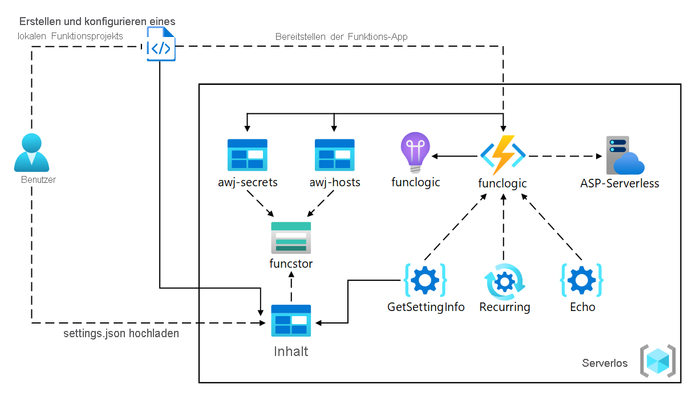
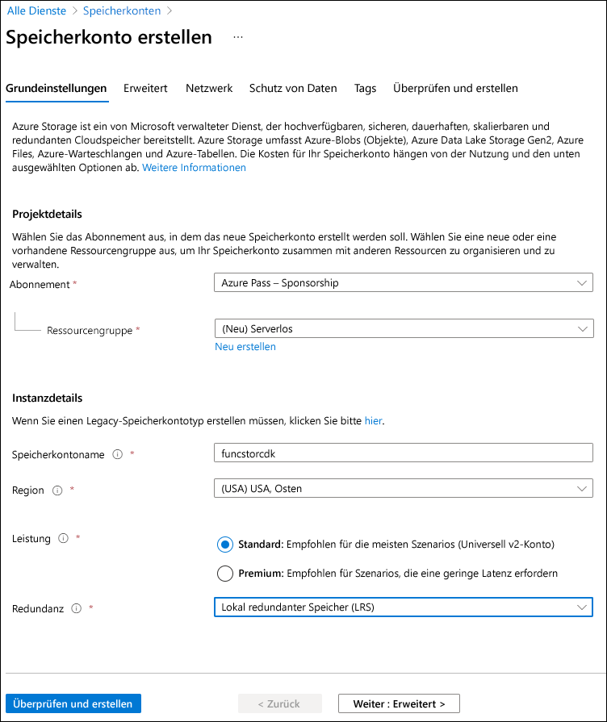
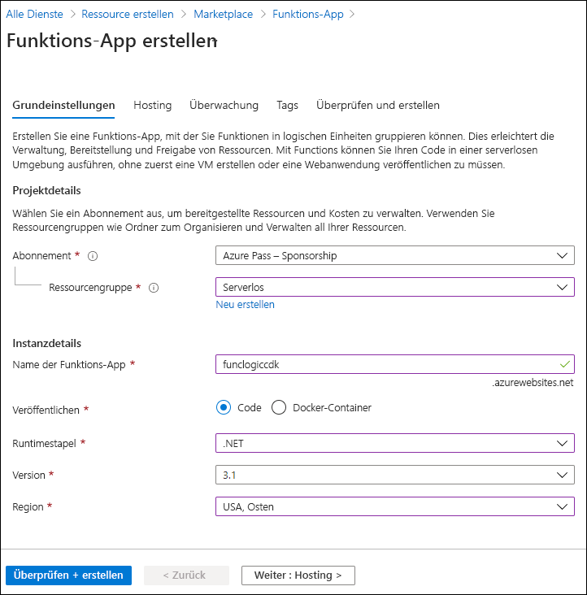

---
lab:
  az204Title: 'Lab 02: Implement task processing logic by using Azure Functions'
  az204Module: 'Learning Path 02: Implement Azure Functions'
---

# Lab 02: Implementieren der Aufgabenverarbeitungslogik mittels Azure Functions

## Microsoft Azure-Benutzeroberfläche

Aufgrund der dynamischen Natur der Microsoft-Cloudtools kann es vorkommen, dass sich die Azure-Benutzeroberfläche nach der Entwicklung dieses Trainingsinhalts ändert. Daher sind die Lab-Anweisungen und Lab-Schritte möglicherweise nicht mehr zutreffend.

Microsoft aktualisiert diesen Trainingskurs, wenn die Community uns über die erforderlichen Änderungen informiert. Cloudupdates kommen jedoch häufig vor, sodass möglicherweise Änderungen an der Benutzeroberfläche auftreten, bevor diese Trainingsinhalte aktualisiert werden. **Wenn dies der Fall ist, stellen Sie sich auf die Veränderungen ein, und arbeiten Sie sie bei Bedarf in den Labs durch.**

## Anweisungen

### Vorbereitung

#### Anmelden bei der Laborumgebung

Melden Sie sich mithilfe der folgenden Anmeldeinformationen bei Ihrer Windows 10-VM an:

- Benutzername: `Admin`
- Kennwort: `Pa55w.rd`

> **Hinweis**: Ihr Kursleiter stellt Anweisungen zum Herstellen einer Verbindung mit der virtuellen Laborumgebung zur Verfügung.

#### Überprüfen der installierten Anwendungen

Suchen Sie auf ihrem Windows 10-Desktop nach der Taskleiste. Die Taskleiste enthält die Symbole für die Anwendungen, die Sie in diesem Lab verwenden, darunter:

- Microsoft Edge
- Datei-Explorer
- Windows-Terminal
- Visual Studio Code

## Übungsszenario

In diesem Lab zeigen Sie, wie eine einfache Azure-Funktion erstellt werden kann, die Text zurückgibt, der eingegeben und mithilfe von HTTP POST-Befehlen an die Funktion gesendet wird. Dadurch wird veranschaulicht, wie die Funktion über HTTP ausgelöst werden kann. 

Außerdem zeigen Sie, wie eine Azure-Funktion ausgeführt wird, indem Sie sie auf einen festen Zeitplan festlegen. Die Funktion schreibt jedes Mal, wenn der Zeitplan ausgelöst wird, eine Nachricht in ein Protokoll.

Schließlich veranschaulichen Sie, wie eine Azure-Funktion eine Verbindung mit anderen Azure-Ressourcen herstellen kann, z. B. mit einem Speicherkonto. Die Funktion stellt eine Verbindung mit einem Speicherkonto her, das Sie erstellen, und gibt den Inhalt einer Datei zurück, die im Azure-Speicherkonto gespeichert ist.

### Architekturdiagramm



### Übung 1: Erstellen von Azure-Ressourcen

#### Aufgabe 1: Öffnen des Azure-Portals

1. Wählen Sie auf der Taskleiste das Symbol **Microsoft Edge** aus.
1. Wechseln Sie im Browserfenster zum Azure-Portal unter `https://portal.azure.com`, und melden Sie sich dann mit dem Konto an, das Sie für dieses Lab verwenden werden.

    > **Hinweis**: Wenn Sie sich zum ersten Mal am Azure-Portal anmelden, wird Ihnen eine Tour durch das Portal angeboten. Wenn Sie die Tour lieber überspringen möchten, wählen Sie **Erste Schritte** aus, um mit der Verwendung des Portals zu beginnen.

#### Aufgabe 2: Erstellen eines Azure-Speicherkontos

1. Verwenden Sie im Azure-Portal das Textfeld **Ressourcen, Dienste und Dokumente durchsuchen**, um nach **Speicherkonten** zu suchen, und wählen Sie dann in der Ergebnisliste **Speicherkonten** aus.

1. Wählen Sie auf dem Blatt  **Speicherkonten**  die Option **+ Erstellen** aus.

1. Führen Sie auf der Registerkarte **Grundlagen** des Blatts **Speicherkonto erstellen** die folgenden Aktionen aus, und wählen Sie dann **Überprüfen** aus:

    | Einstellung | Aktion |
    | -- | -- |
    | Dropdownliste **Abonnement** | Übernehmen Sie den Standardwert. |
    | Abschnitt **Ressourcengruppe** | Wählen Sie **Neu erstellen** aus, geben Sie **Serverlos** ein, und wählen Sie dann **OK** aus. |
    | Textfeld **Speicherkontoname**  | Geben Sie **funcstor** _[Ihr Name]_ ein. |
    | Dropdownliste **Region** | Wählen Sie **USA, Osten** aus. |
    | Abschnitt **Leistung** | Wählen Sie die Option **Standard** aus. |
    | Dropdownliste **Redundanz** | Wählen Sie **Lokal redundanter Speicher (LRS)** aus. |

    Der folgende Screenshot zeigt die konfigurierten Einstellungen im Blatt **Speicherkonto erstellen**.

    

1. Überprüfen Sie auf der Registerkarte **Überprüfen** die Optionen, die Sie in den vorherigen Schritten ausgewählt haben.

1. Wählen Sie **Erstellen** aus, um das Speicherkonto mithilfe Ihrer angegebenen Konfiguration zu erstellen.

    > **Hinweis**: Warten Sie, bis die Erstellungsaufgabe abgeschlossen ist, bevor Sie mit diesem Lab fortfahren.

1. Wählen Sie auf dem Blatt **Übersicht** die Schaltfläche **Gehe zu Ressource** aus, um zum Blatt des neu erstellten Speicherkontos zu navigieren.

1. Wählen Sie auf dem Blatt **Speicherkonto** im Abschnitt **Sicherheit + Netzwerk** den Eintrag **Zugriffsschlüssel** aus.

1. Wählen Sie auf dem Blatt **Zugriffsschlüssel** die Option **Schlüssel anzeigen** aus.

1. Überprüfen Sie alle Schlüssel, und kopieren Sie dann den Wert aus einem der Felder **Verbindungszeichenfolge** in die Zwischenablage.

     > **Hinweis**: Es spielt keine Rolle, welche Verbindungszeichenfolge Sie auswählen. Sie können synonym verwendet werden.

1. Öffnen Sie Editor, und fügen Sie dann den kopierten Verbindungszeichenfolgenwert in Editor ein. Sie verwenden diesen Wert später in diesem Lab.

#### Aufgabe 3: Erstellen einer Funktions-App

1. Wählen Sie im Navigationsbereich des Azure-Portals den Link **Ressource erstellen** aus.

1. Geben Sie auf dem Blatt **Ressource erstellen** im Textfeld **Dienste und Marketplace durchsuchen** den Text **Funktion** ein, und drücken Sie dann die EINGABETASTE.

1. Wählen Sie auf dem Blatt mit den **Marketplace**-Suchergebnissen das Ergebnis **Funktions-App** aus.

1. Wählen Sie auf dem Blatt **Funktions-App** die Option **Erstellen** aus.

1. Führen Sie auf dem Blatt **Funktions-App erstellen** auf der Registerkarte **Grundlagen** die folgenden Aktionen aus, und wählen Sie **Weiter: Speicher** aus:

    | Einstellung | Aktion |
    | -- | -- |
    | Dropdownliste **Abonnement** | Übernehmen Sie den Standardwert. |
    | Abschnitt **Ressourcengruppe** | Wählen Sie **Serverlos** aus. |
    | Textfeld **Name der Funktions-App**  | Geben Sie **funclogic** _[Ihr Name]_ ein. |
    | Abschnitt **Veröffentlichen** | Wählen Sie **Code** aus. |
    | Dropdownliste **Laufzeitstapel** | Wählen Sie **.NET** aus. |
    | Dropdownliste **Version** | Wählen Sie **6** aus. |
    | Dropdownliste **Region** | Wählen Sie die Region **USA, Osten** aus. |
    | Option **Betriebssystem** | Wählen Sie **Linux** aus. |
    | Dropdownliste **Plantyp** | Wählen Sie **Verbrauch (Serverlos)** aus. |

    Der folgende Screenshot veranschaulicht die konfigurierten Einstellungen auf dem Blatt **Funktions-App erstellen**.

    

1. Führen Sie auf der Registerkarte **Speicher** die folgenden Aktionen aus, und wählen Sie dann **Überprüfen + erstellen** aus:

    | Einstellung | Aktion |
    | -- | -- |
    | Dropdownliste **Speicherkonto** | Wählen Sie das Speicherkonto **funcstor** _[Ihr Name]_ aus. |

1. Überprüfen Sie auf der Registerkarte **Überprüfen und erstellen** die Optionen, die Sie in den vorherigen Schritten ausgewählt haben.

1. Wählen Sie **Erstellen** aus, um die Funktions-App mit Ihrer angegebenen Konfiguration zu erstellen.

    > **Hinweis**: Warten Sie, bis der Erstellungstask abgeschlossen ist, bevor Sie mit diesem Lab fortfahren.

#### Überprüfung

In dieser Übung haben Sie alle Ressourcen erstellt, die Sie in diesem Lab verwenden werden.

### Übung 2: Konfigurieren eines lokalen Azure Functions-Projekts

#### Aufgabe 1: Initialisieren eines Funktionsprojekts

1. Wählen Sie auf der Taskleiste das Symbol **Windows-Terminal** aus.

1. Führen Sie den folgenden Befehl aus, um vom aktuellen Verzeichnis in das leere Verzeichnis **Allfiles (F):\\Allfiles\\Labs\\02\\Starter\\func** zu wechseln:

    ```powershell
    cd F:\Allfiles\Labs\02\Starter\func
    ```

    > **Hinweis**: Entfernen Sie in Windows-Explorer das **schreibgeschützte** Attribut aus der Datei **F:\\Allfiles\\Labs\\02\\Starter\\func\\.gitignore**.

1. Führen Sie den folgenden Befehl aus, um mithilfe der **Azure Functions Core Tools** und unter Verwendung der **dotnet**-Runtime ein neues lokales Azure Functions-Projekt im aktuellen Verzeichnis zu erstellen:

    ```powershell
    func init --worker-runtime dotnet --force
    ```

    > **Hinweis**: Sie können die Dokumentation zum [Erstellen eines neuen Projekts][azure-functions-core-tools-new-project] mithilfe der **Azure Functions Core Tools** lesen.
    
1. Schließen Sie die Anwendung **Windows-Terminal**.

#### Aufgabe 2: Konfigurieren einer Verbindungszeichenfolge

1. Wählen Sie auf dem **Startbildschirm** die Kachel **Visual Studio Code** aus.
1. Klicken Sie im Menü **Datei** auf **Ordner öffnen**.
1. Suchen Sie im Fenster **Datei-Explorer**, das geöffnet wird, nach **Allfiles (F):\\Allfiles\\Labs\\02\\Starter\\func**, und wählen Sie dann **Ordner auswählen** aus.
1. Öffnen Sie im **Explorer**-Bereich des **Visual Studio Code**-Fensters die Datei **local.settings.json**.
1. Beachten Sie den aktuellen Wert der Einstellung **AzureWebJobsStorage**:

    ```json
    "AzureWebJobsStorage": "UseDevelopmentStorage=true",
    ```

1. Ändern Sie den Wert des Elements **AzureWebJobsStorage** in die **Verbindungszeichenfolge** des Speicherkontos, die Sie sich zuvor in diesem Lab notiert haben.
1. Speichern Sie die Datei **local.settings.json**.

#### Aufgabe 3: Erstellen und Überprüfen eines Projekts

1. Wählen Sie auf der Taskleiste das Symbol **Windows-Terminal** aus.
1. Führen Sie den folgenden Befehl aus, um vom aktuellen Verzeichnis in das Verzeichnis **Allfiles (F):\\Allfiles\\Labs\\02\\Starter\\func** zu wechseln:

    ```powershell
    cd F:\Allfiles\Labs\02\Starter\func
    ```

1. Führen Sie den folgenden Befehl aus, um das .NET Core 3.1-Projekt zu **erstellen**:

    ```powershell
    dotnet build
    ```

#### Überprüfung

In dieser Übung haben Sie ein lokales Projekt erstellt, das für die Azure Functions-Entwicklung verwendet werden soll.

### Übung 3: Erstellen einer Funktion, die von einer HTTP-Anforderung ausgelöst wird

#### Aufgabe 1: Erstellen einer durch HTTP ausgelösten Funktion

1. Wählen Sie auf der Taskleiste das Symbol **Windows-Terminal** aus.
1. Führen Sie den folgenden Befehl aus, um vom aktuellen Verzeichnis in das Verzeichnis **Allfiles (F):\\Allfiles\\Labs\\02\\Starter\\func** zu wechseln:

    ```powershell
    cd F:\Allfiles\Labs\02\Starter\func
    ```

1. Führen Sie den folgenden Befehl aus, um die **Azure Functions Core Tools** zu verwenden, um mithilfe der **HTTP-Trigger**-Vorlage eine neue Funktion namens **Echo** zu erstellen:

    ```powershell
    func new --template "HTTP trigger" --name "Echo"
    ```

    > **Hinweis**: Sie können die Dokumentation zum [Erstellen einer neuen Funktion][azure-functions-core-tools-new-function] mithilfe der **Azure Functions Core Tools** lesen.

1. Schließen Sie die aktuell ausgeführte **Windows-Terminal**-Anwendung.

#### Aufgabe 2: Schreiben von durch HTTP ausgelöstem Funktionscode

1. Wählen Sie auf dem **Startbildschirm** die Kachel **Visual Studio Code** aus.
1. Klicken Sie im Menü **Datei** auf **Ordner öffnen**.
1. Suchen Sie im Fenster **Datei-Explorer**, das geöffnet wird, nach **Allfiles (F):\\Allfiles\\Labs\\02\\Starter\\func**, und wählen Sie dann **Ordner auswählen** aus.
1. Öffnen Sie im **Explorer**-Bereich des **Visual Studio Code**-Fensters die Datei **Echo.cs**.

1. Löschen Sie den gesamten Inhalt in der Datei **Echo.cs**, und fügen Sie den folgenden Code hinzu. Er definiert eine von HTTP ausgelöste Funktion namens „Echo“, die eine POST-Anforderung akzeptiert und den Anforderungstext als OkObjectResult zurückgibt. Die ILogger-Schnittstelle wird auch zum Protokollieren von Informationen verwendet. Diese Funktion kann verwendet werden, um HTTP-Anforderungen und -Antworten zu testen.

    ```csharp
    using Microsoft.AspNetCore.Mvc;
    using Microsoft.Azure.WebJobs;
    using Microsoft.AspNetCore.Http;
    using Microsoft.Extensions.Logging;
    /*The following lines of code to add using directives for the 
    Microsoft.AspNetCore.Mvc, Microsoft.Azure.WebJobs, 
    Microsoft.AspNetCore.Http, and Microsoft.Extensions.Logging namespaces.*/
    public static class Echo
    {/*The following code block to create a new public static method 
    named Run that returns a variable of type IActionResult and that 
    also takes in variables of type HttpRequest and ILogger as parameters
    named request and logger.*/
        [FunctionName("Echo")]
        public static IActionResult Run(        
            [HttpTrigger("POST")] HttpRequest request,
            ILogger logger)
        {
            logger.LogInformation("Received a request");
            return new OkObjectResult(request.Body);
            /*The following line of code to echo the body of the HTTP request as the HTTP response.*/
        }
    }
    ```

1. Wählen Sie **Speichern** aus, um Ihre Änderungen in der Datei **Echo.cs** zu speichern.

#### Aufgabe 3: Testen der durch HTTP ausgelösten Funktion mittels httprepl

1. Wählen Sie auf der Taskleiste das Symbol **Windows-Terminal** aus.
1. Führen Sie den folgenden Befehl aus, um vom aktuellen Verzeichnis in das Verzeichnis **Allfiles (F):\\Allfiles\\Labs\\02\\Starter\\func** zu wechseln:

    ```powershell
    cd F:\Allfiles\Labs\02\Starter\func
    ```

1. Führen Sie den folgenden Befehl aus, um das Funktions-App-Projekt auszuführen:

    ```powershell
    func start --build
    ```

    > **Hinweis**: Sie können die Dokumentation lesen, um das [Funktions-App-Projekt lokal](https://docs.microsoft.com/azure/azure-functions/functions-develop-local) mithilfe von **Azure Functions Core Tools** zu beginnen.
    
1. Wählen Sie auf der Taskleiste erneut das Symbol **Windows-Terminal** aus, um eine neue Instanz der Anwendung zu öffnen. Führen Sie den folgenden Befehl aus, um vom aktuellen Verzeichnis in das leere Verzeichnis **Allfiles (F):\\Allfiles\\Labs\\02\\Starter\\func** zu wechseln:

    ```powershell
    cd F:\Allfiles\Labs\02\Starter\func
    ```
    
1. Führen Sie an der Eingabeaufforderung den folgenden Befehl aus, um das Tool **httprepl** zu installieren und zu starten. Legen Sie dabei den Basis-URI (Uniform Resource Identifier) auf ``http://localhost:7071`` fest:

    ```powershell
    dotnet tool install -g Microsoft.dotnet-httprepl
    httprepl http://localhost:7071
    ```

    > **Hinweis**: Das **httprepl**-Tool zeigt eine Fehlermeldung an. Zu dieser Meldung kommt es, weil das Tool nach einer Swagger-Definitionsdatei sucht, die zum Durchlaufen der API verwendet werden soll. Da Ihr Funktionsprojekt keine Swagger-Definitionsdatei erzeugt, müssen Sie die API manuell durchlaufen.
1. Führen Sie an der Eingabeaufforderung des Tools den folgenden Befehl aus, um zum relativen **api**-Verzeichnis zu wechseln:

    ```powershell
    cd api
    ```

1. Führen Sie den folgenden Befehl aus, um zum relativen **echo**-Verzeichnis zu wechseln:

    ```powershell
    cd echo
    ```

1. Führen Sie den folgenden Befehl aus, um den **post**-Befehl auszuführen, wobei Sie mithilfe der **\-\-content**-Option einen HTTP-Anforderungstext als Eingabe senden, der auf den numerischen Wert **3** festgelegt ist:

    ```powershell
    post --content 3
    ```

1. Führen Sie den folgenden Befehl aus, um den **post**-Befehl auszuführen, wobei Sie mithilfe der **\-\-content**-Option einen HTTP-Anforderungstext als Eingabe senden, der auf den numerischen Wert **5** festgelegt ist:

    ```powershell
    post --content 5
    ```

1. Führen Sie den folgenden Befehl aus, um den **post**-Befehl auszuführen, wobei Sie mithilfe der **\-\-content**-Option einen HTTP-Anforderungstext als Eingabe senden, der auf den Zeichenfolgenwert **Hello** (Hallo) festgelegt ist:

    ```powershell
    post --content "Hello"
    ```

1. Führen Sie den folgenden Befehl aus, um den **post**-Befehl auszuführen, wobei Sie mithilfe der **\-\-content**-Option einen HTTP-Anforderungstext als Eingabe senden, der auf den JSON-Wert (JavaScript Object Notation) **{"msg": "Successful"}** festgelegt ist:

    ```powershell
    post --content "{"msg": "Successful"}"
    ```

1. Führen Sie den folgenden Befehl aus, um die Anwendung **httprepl** zu beenden:

    ```powershell
    exit
    ```

1. Schließen Sie alle aktuell ausgeführten Instanzen der **Windows-Terminal**-Anwendung.

#### Überprüfung

In dieser Übung haben Sie eine einfache Funktion erstellt, die den über eine HTTP POST-Anforderung gesendeten Inhalt wiederholt.

### Übung 4: Erstellen einer Funktion, die nach einem Zeitplan ausgelöst wird

#### Aufgabe 1: Erstellen einer nach Zeitplan ausgelösten Funktion

1. Wählen Sie auf der Taskleiste das Symbol **Windows-Terminal** aus.
1. Führen Sie den folgenden Befehl aus, um vom aktuellen Verzeichnis in das Verzeichnis **Allfiles (F):\\Allfiles\\Labs\\02\\Starter\\func** zu wechseln:

    ```powershell
    cd F:\Allfiles\Labs\02\Starter\func
    ```

1. Führen Sie an der Eingabeaufforderung den folgenden Befehl aus, um mithilfe der **Azure Functions Core Tools** und der **Timertrigger**-Vorlage eine neue Funktion namens **Recurring** (Wiederkehrend) zu erstellen:

    ```powershell
    func new --template "Timer trigger" --name "Recurring"
    ```

    > **Hinweis**: Sie können die Dokumentation zum [Erstellen einer neuen Funktion][azure-functions-core-tools-new-function] mithilfe der **Azure Functions Core Tools** lesen.
    
1. Schließen Sie die aktuell ausgeführte **Windows-Terminal**-Anwendung.

#### Aufgabe 2: Beobachten des Funktionscodes

1. Wählen Sie auf dem **Startbildschirm** die Kachel **Visual Studio Code** aus.
1. Klicken Sie im Menü **Datei** auf **Ordner öffnen**.
1. Suchen Sie im Fenster **Datei-Explorer**, das geöffnet wird, nach **Allfiles (F):\\Allfiles\\Labs\\02\\Starter\\func**, und wählen Sie dann **Ordner auswählen** aus.
1. Öffnen Sie im **Explorer**-Bereich des **Visual Studio Code**-Fensters die Datei **Recurring.cs**.
1. Sehen Sie sich im Code-Editor die Implementierung an:

    ```csharp
    using System;
    using Microsoft.Azure.WebJobs;
    using Microsoft.Azure.WebJobs.Host;
    using Microsoft.Extensions.Logging;    
    namespace func
    {
        public static class Recurring
        {
            [FunctionName("Recurring")]
            public static void Run([TimerTrigger("0 */5 * * * *")]TimerInfo myTimer, ILogger log)
            {
                log.LogInformation($"C# Timer trigger function executed at: {DateTime.Now}");
            }
        }
    }
    ```

#### Aufgabe 3: Beobachten von Funktionsausführungen

1. Wählen Sie auf der Taskleiste das Symbol **Windows-Terminal** aus.
1. Führen Sie den folgenden Befehl aus, um vom aktuellen Verzeichnis in das Verzeichnis **Allfiles (F):\\Allfiles\\Labs\\02\\Starter\\func** zu wechseln:

    ```powershell
    cd F:\Allfiles\Labs\02\Starter\func
    ```

1. Führen Sie den folgenden Befehl an der Eingabeaufforderung aus, um das Funktions-App-Projekt auszuführen:

    ```powershell
    func start --build
    ```

    > **Hinweis**: Sie können die Dokumentation zum [lokalen Starten des Funktions-App-Projekts][azure-functions-core-tools-start-function] mithilfe der **Azure Functions Core Tools** lesen.
1. Beobachten Sie die Ausführung der Funktion, die etwa alle fünf Minuten erfolgt. Jede Funktionsausführung sollte eine einfache Nachricht im Protokoll rendern.
1. Schließen Sie die aktuell ausgeführte **Windows-Terminal**-Anwendung.

#### Aufgabe 4: Aktualisieren der Konfiguration der Funktionsintegration

1. Wählen Sie auf dem **Startbildschirm** die Kachel **Visual Studio Code** aus.
1. Klicken Sie im Menü **Datei** auf **Ordner öffnen**.
1. Suchen Sie im Fenster **Datei-Explorer**, das geöffnet wird, nach **Allfiles (F):\\Allfiles\\Labs\\02\\Starter\\func**, und wählen Sie dann **Ordner auswählen** aus.
1. Öffnen Sie im **Explorer**-Bereich des **Visual Studio Code**-Fensters die Datei **Recurring.cs**.
1. Sehen Sie sich im Code-Editor die vorhandene **Run**-Methodensignatur an:

    ```csharp
    [FunctionName("Recurring")]
    public void Run([TimerTrigger("0 */5 * * * *")]TimerInfo myTimer, ILogger log)
    ```

1. Aktualisieren Sie den Codeblock der **Run**-Methodensignatur, um den Zeitplan so zu ändern, dass die Ausführung alle **30 Sekunden** erfolgt:

    ```csharp
    [FunctionName("Recurring")]
    public void Run([TimerTrigger("*/30 * * * * *")]TimerInfo myTimer, ILogger log)
    ```

1. Wählen Sie **Speichern** aus, um Ihre Änderungen in der Datei **Recurring.cs** zu speichern.

#### Aufgabe 5: Beobachten von Funktionsausführungen

1. Wählen Sie auf der Taskleiste das Symbol **Windows-Terminal** aus.

1. Führen Sie den folgenden Befehl aus, um vom aktuellen Verzeichnis in das Verzeichnis **Allfiles (F):\\Allfiles\\Labs\\02\    \Starter\\func** zu wechseln:

    ```powershell
    cd F:\Allfiles\Labs\02\Starter\func
    ```

1. 1. Führen Sie den folgenden Befehl an der Eingabeaufforderung aus, um das Funktions-App-Projekt auszuführen:

    ```powershell
    func start --build
    ```
    
    > **Hinweis**: Sie können die Dokumentation zum [lokalen Starten des Funktions-App-Projekts][azure-functions-core-tools-start-function] mithilfe der **Azure Functions Core Tools** lesen.
    
1. Beobachten Sie die Ausführung der Funktion, die etwa alle 30 Sekunden erfolgt. Jede Funktionsausführung sollte eine einfache Nachricht im Protokoll rendern.

1. Schließen Sie die aktuell ausgeführte **Windows-Terminal**-Anwendung.

1. Schließen Sie das Visual Studio Code-Fenster.

#### Überprüfung

In dieser Übung haben Sie eine Funktion erstellt, die automatisch nach einem festen Zeitplan ausgeführt wird.

### Übung 5: Erstellen einer Funktion, die sich in andere Dienste integriert

#### Aufgabe 1: Hochladen von Beispielinhalten in Azure Blob Storage

1. Wählen im **Navigations**bereich des Azure-Portals den Link **Ressourcengruppen** aus.
1. Wählen Sie auf dem Blatt **Ressourcengruppen** die Ressourcengruppe **Serverlos** aus, die Sie zuvor in diesem Lab erstellt haben.
1. Wählen Sie auf dem Blatt **Serverlos** das Speicherkonto **funcstor** _[Ihr Name]_ aus, das Sie zuvor in diesem Lab erstellt haben.
1. Wählen Sie auf dem Blatt **Speicherkonto** den Link **Container** im Abschnitt **Datenspeicher** aus.
1. Wählen Sie im Abschnitt **Container** die Option **+ Container** aus.
1. Führen Sie im Popupfenster **Neuer Container** die folgenden Aktionen aus, und wählen Sie dann **Erstellen** aus:

    | Einstellung | Aktion |
    | -- | -- |
    | Textfeld **Name**  | Geben Sie **content** ein. |
    | Dropdownliste **Öffentliche Zugriffsebene**  | Wählen Sie **Privat (kein anonymer Zugriff)** aus. |

1. Kehren Sie zum Abschnitt **Container** zurück, und wählen Sie dann den zuletzt erstellten Container **content** (Inhalt) aus.
1. Wählen Sie auf dem Blatt **Container** die Option **Hochladen** aus.
1. Führen Sie im Fenster **Blob hochladen** die folgenden Aktionen aus, und wählen Sie dann **Hochladen** aus:

    | Einstellung | Aktion |
    | -- | -- |
    | Abschnitt **Dateien**  | Wählen Sie **Nach Dateien durchsuchen** aus, oder verwenden Sie das Feature zum Ziehen und Ablegen. |
    | Fenster **Datei-Explorer**  | Wechseln Sie zu **Allfiles (F):\\Allfiles\\Labs\\02\\Starter**, und wählen Sie zuerst die Datei **settings.json** und dann **Öffnen** aus. |
    | Kontrollkästchen **Überschreiben, falls Dateien bereits vorhanden sind** | Stellen Sie sicher, dass dieses Kontrollkästchen aktiviert ist. |

      > **Hinweis**: Warten Sie, bis das Blob hochgeladen wurde, bevor Sie mit diesem Lab fortfahren.

#### Aufgabe 2: Erstellen einer durch HTTP ausgelösten Funktion

1. Wählen Sie auf der Taskleiste das Symbol **Windows-Terminal** aus.
1. Führen Sie den folgenden Befehl aus, um vom aktuellen Verzeichnis in das Verzeichnis **Allfiles (F):\\Allfiles\\Labs\\02\\Starter\\func** zu wechseln:

    ```powershell
    cd F:\Allfiles\Labs\02\Starter\func
    ```

1. Führen Sie an der Eingabeaufforderung den folgenden Befehl aus, um mithilfe der **Azure Functions Core Tools** und der **HTTP-Trigger**-Vorlage eine neue Funktion namens **GetSettingInfo** zu erstellen:

    ```powershell
    func new --template "HTTP trigger" --name "GetSettingInfo"
    ```

    > **Hinweis**: Sie können die Dokumentation zum [Erstellen einer neuen Funktion][azure-functions-core-tools-new-function] mithilfe der **Azure Functions Core Tools** lesen.
1. Schließen Sie die aktuell ausgeführte **Windows-Terminal**-Anwendung.

#### Aufgabe 3: Schreiben von durch HTTP ausgelöstem und per Blob eingegebenem Funktionscode

1. Wählen Sie auf dem **Startbildschirm** die Kachel **Visual Studio Code** aus.
1. Klicken Sie im Menü **Datei** auf **Ordner öffnen**.
1. Suchen Sie im Fenster **Datei-Explorer**, das geöffnet wird, nach **Allfiles (F):\\Allfiles\\Labs\\02\\Starter\\func**, und wählen Sie dann **Ordner auswählen** aus.
1. Öffnen Sie im **Explorer**-Bereich des **Visual Studio Code**-Fensters die Datei **GetSettingInfo.cs**.

1. Löschen Sie den gesamten Inhalt in der Datei **GetSettingInfo.cs**, und fügen Sie den folgenden Code hinzu. Dieser Code gibt den Inhalt einer JSON-Datei in einem Azure Blob Storage-Container als Reaktion auf eine HTTP GET-Anforderung zurück.

    ```csharp
    /*The following lines of code to add using directives for the
        Microsoft.AspNetCore.Http, Microsoft.AspNetCore.Mvc, and 
        Microsoft.Azure.WebJobs namespaces.*/
    using Microsoft.AspNetCore.Http;
    using Microsoft.AspNetCore.Mvc;
    using Microsoft.Azure.WebJobs;

    public static class GetSettingInfo
    {
        [FunctionName("GetSettingInfo")]
        //Specify that the name of the Azure Function is "GetSettingInfo".
        public static IActionResult Run(        
            [HttpTrigger("GET")] HttpRequest request,
            [Blob("content/settings.json")] string json)
            => new OkObjectResult(json); 

            /*The following code to update the Run expression-bodied method
             to return a new instance of the OkObjectResult class passing 
             in the value of the json method parameter as the sole 
             constructor parameter.*/         
    }
    ```

1. Wählen Sie **Speichern** aus, um Ihre Änderungen in der Datei **GetSettingInfo.cs** zu speichern.

#### Aufgabe 4: Registrieren von Azure Storage Blob-Erweiterungen

1. Wählen Sie auf der Taskleiste das Symbol **Windows-Terminal** aus.
1. Führen Sie den folgenden Befehl aus, um vom aktuellen Verzeichnis in das Verzeichnis **Allfiles (F):\\Allfiles\\Labs\\02\\Starter\\func** zu wechseln:

    ```powershell
    cd F:\Allfiles\Labs\02\Starter\func
    ```

1. Führen Sie an der Eingabeaufforderung den folgenden Befehl aus, um die Erweiterung [Microsoft.Azure.WebJobs.Extensions.Storage](https://www.nuget.org/packages/Microsoft.Azure.WebJobs.Extensions.Storage/) zu registrieren:

    ```powershell
    func extensions install --package Microsoft.Azure.WebJobs.Extensions.Storage --version 5.0.1
    ```

1. Führen Sie den folgenden Befehl aus, um das .NET-Projekt zu erstellen und zu überprüfen, ob die Erweiterungen ordnungsgemäß installiert wurden:

    ```powershell
    dotnet build
    ```

1. Schließen Sie alle aktuell ausgeführten Instanzen der **Windows-Terminal**-Anwendung.

#### Aufgabe 5: Testen der Funktion mittels httprepl

1. Wählen Sie auf der Taskleiste das Symbol **Windows-Terminal** aus.
1. Führen Sie den folgenden Befehl aus, um vom aktuellen Verzeichnis in das Verzeichnis **Allfiles (F):\\Allfiles\\Labs\\02\\Starter\\func** zu wechseln:

    ```powershell
    cd F:\Allfiles\Labs\02\Starter\func
    ```

1. Führen Sie den folgenden Befehl an der Eingabeaufforderung aus, um das Funktions-App-Projekt auszuführen:

    ```powershell
    func start --build
    ```

    > **Hinweis**: Sie können die Dokumentation zum [lokalen Starten des Funktions-App-Projekts][azure-functions-core-tools-start-function] mithilfe der **Azure Functions Core Tools** lesen.
1. Wählen Sie auf der Taskleiste erneut das Symbol **Windows-Terminal** aus, um eine neue Instanz der Anwendung **Windows-Terminal** zu öffnen.
1. Führen Sie an der Eingabeaufforderung den folgenden Befehl aus, um das Tool **httprepl** zu starten. Legen Sie dabei den Basis-URI (Uniform Resource Identifier) auf ``http://localhost:7071`` fest:

    ```powershell
    httprepl http://localhost:7071
    ```

    > **Hinweis**: Das **httprepl**-Tool zeigt eine Fehlermeldung an. Zu dieser Meldung kommt es, weil das Tool nach einer Swagger-Definitionsdatei sucht, die zum Durchlaufen der API verwendet werden soll. Da Ihr Funktionsprojekt keine Swagger-Definitionsdatei erzeugt, müssen Sie die API manuell durchlaufen.

1. Wenn die Eingabeaufforderung des Tools angezeigt wird, führen Sie den folgenden Befehl aus, um zum relativen **api**-Endpunkt zu wechseln:

    ```powershell
    cd api
    ```

1. Führen Sie den folgenden Befehl aus, um zum relativen **getsettinginfo**-Endpunkt zu wechseln:

    ```powershell
    cd getsettinginfo
    ```

1. Führen Sie den folgenden Befehl aus, um den Befehl **get** für den aktuellen Endpunkt auszuführen:

    ```powershell
    get
    ```

1. Sehen Sie sich den JSON-Inhalt der Antwort der Funktions-App an, der nun Folgendes enthalten sollte:

    ```json
    {
        "version": "0.2.4",
        "root": "/usr/libexec/mews_principal/",
        "device": {
            "id": "21e46d2b2b926cba031a23c6919"
        },
        "notifications": {
            "email": "joseph.price@contoso.com",
            "phone": "(425) 555-0162 x4151"
        }
    }
    ```

1. Führen Sie den folgenden Befehl aus, um die Anwendung **httprepl** zu beenden:

    ```powershell
    exit
    ```

1. Schließen Sie alle aktuell ausgeführten Instanzen der **Windows-Terminal**-Anwendung.

#### Überprüfung

In dieser Übung haben Sie eine Funktion erstellt, die den Inhalt einer JSON-Datei in Storage zurückgibt.

### Übung 6: Bereitstellen eines lokalen Funktionsprojekts für eine Azure Functions-App

#### Aufgabe 1: Bereitstellen mithilfe der Azure Functions Core Tools

1. Wählen Sie auf der Taskleiste das Symbol **Windows-Terminal** aus.
1. Führen Sie den folgenden Befehl aus, um vom aktuellen Verzeichnis in das Verzeichnis **Allfiles (F):\\Allfiles\\Labs\\02\\Starter\\func** zu wechseln:

    ```powershell
    cd F:\Allfiles\Labs\02\Starter\func
    ```

1. Führen Sie an der Eingabeaufforderung den folgenden Befehl aus, um sich bei der Azure CLI (Command-Line Interface, Befehlszeilenschnittstelle) anzumelden:

    ```powershell
    az login
    ```

1. Geben Sie im **Microsoft Edge**-Browserfenster den Namen und das Kennwort des Microsoft- oder Azure Active Directory-Kontos ein, das Sie in diesem Lab verwenden, und wählen Sie dann **Anmelden** aus.
1. Kehren Sie zum derzeit geöffneten **Windows-Terminal**-Fenster zurück. Warten Sie, bis der Anmeldevorgang abgeschlossen ist.
1. Führen Sie an der Eingabeaufforderung den folgenden Befehl aus, um das Funktions-App-Projekt zu veröffentlichen (ersetzen Sie den Platzhalter `<function-app-name>` durch den Namen der Funktions-App, die Sie zuvor in diesem Lab erstellt haben):

    ```powershell
    func azure functionapp publish <function-app-name>
    ```

    > **Hinweis**: Wenn Ihr **Funktions-App-Name** beispielsweise **funclogicstudent** lautet, wäre Ihr Befehl ``func azure functionapp publish funclogicstudent``. Sie können die Dokumentation zum [Veröffentlichen des lokalen Funktions-App-Projekts][azure-functions-core-tools-publish-azure] mithilfe der **Azure Functions Core Tools** lesen.

1. Warten Sie, bis die Bereitstellung fertig gestellt ist, bevor Sie mit dem Lab fortfahren.
1. Schließen Sie die aktuell ausgeführte **Windows-Terminal**-Anwendung.

#### Aufgabe 2: Überprüfen der Bereitstellung

1. Wählen Sie auf der Taskleiste das Symbol für **Microsoft Edge** aus, und wählen Sie die Registerkarte aus, die das Azure-Portal anzeigt.
2. Wählen im **Navigations**bereich des Azure-Portals den Link **Ressourcengruppen** aus.
3. Wählen Sie auf dem Blatt **Ressourcengruppen** die Ressourcengruppe **Serverlos** aus, die Sie zuvor in diesem Lab erstellt haben.
4. Wählen Sie auf dem Blatt **Serverlos** die Funktions-App **funclogic** _[Ihr Name]_ aus, die Sie zuvor in diesem Lab erstellt haben.
5. Wählen Sie auf dem Blatt **Funktions-App** im Abschnitt **Funktionen** die Option **Funktionen** aus.
6. Wählen Sie im Bereich **Funktionen** die vorhandene **GetSettingInfo**-Funktion aus.
7. Wählen Sie auf dem Blatt **Funktion** im Abschnitt **Entwickler** die Option **Programmieren und testen** aus.
8. Wählen Sie im Funktionen-Editor **Testen/Ausführen** aus.
9. Wählen Sie im automatisch angezeigten Bereich in der Dropdownliste **HTTP-Methode** die Option **GET** aus.
10. Wählen Sie **Ausführen** aus, um die Funktion zu testen.
11. Überprüfen Sie im **HTTP-Antwortinhalt** die Ergebnisse der Testausführung. Der JSON-Inhalt sollte nun den folgenden Code enthalten:

    ```json
    {
        "version": "0.2.4",
        "root": "/usr/libexec/mews_principal/",
        "device": {
            "id": "21e46d2b2b926cba031a23c6919"
        },
        "notifications": {
            "email": "joseph.price@contoso.com",
            "phone": "(425) 555-0162 x4151"
        }
    }
    ```

#### Überprüfung

In dieser Übung haben Sie ein lokales Funktionsprojekt in Azure Functions bereitgestellt und überprüft, ob die Funktionen in Azure funktionieren.
