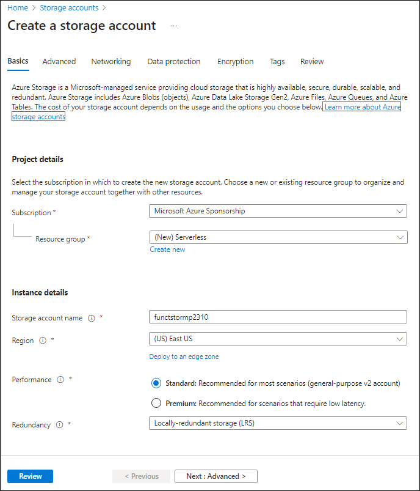
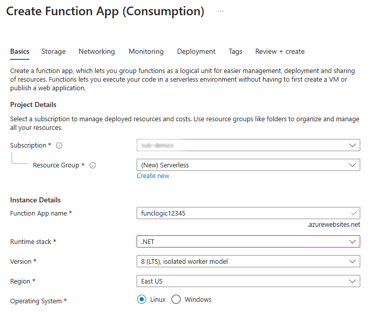

---
lab:
  az204Title: 'Lab 02: Implement task processing logic by using Azure Functions'
  az020Title: 'Lab 02: Implement task processing logic by using Azure Functions'
  az204Module: 'Module 02: Implement Azure Functions'
  az020Module: 'Module 02: Implement Azure Functions'
ms.openlocfilehash: ff0481047e07f398061649d06991fb8ab0d481c3
ms.sourcegitcommit: 412902a597da51fc2af04a5fa4ddb787200c028c
ms.translationtype: HT
ms.contentlocale: de-DE
ms.lasthandoff: 06/07/2022
ms.locfileid: "146181460"
---
# <a name="lab-02-implement-task-processing-logic-by-using-azure-functions"></a>Lab 02: Implementieren der Aufgabenverarbeitungslogik mittels Azure Functions

## <a name="microsoft-azure-user-interface"></a>Microsoft Azure-Benutzeroberfläche

Aufgrund der dynamischen Natur der Microsoft-Cloudtools kann es vorkommen, dass sich die Azure-Benutzeroberfläche nach der Entwicklung dieses Trainingsinhalts ändert. Daher sind die Lab-Anweisungen und Lab-Schritte möglicherweise nicht mehr zutreffend.

Microsoft aktualisiert diesen Trainingskurs, wenn die Community uns über die erforderlichen Änderungen informiert. Cloudupdates kommen jedoch häufig vor, sodass möglicherweise Änderungen an der Benutzeroberfläche auftreten, bevor diese Trainingsinhalte aktualisiert werden. **Wenn dies der Fall ist, stellen Sie sich auf die Veränderungen ein, und arbeiten Sie sie bei Bedarf in den Labs durch.**

## <a name="instructions"></a>Anweisungen

### <a name="before-you-start"></a>Vorbereitung

#### <a name="sign-in-to-the-lab-environment"></a>Anmelden bei der Laborumgebung

Melden Sie sich mit den folgenden Anmeldeinformationen bei Ihrer Windows 10-VM an:

- Benutzername: **Admin**
- Kennwort: **Pa55w.rd**

> **Hinweis**: Ihr Kursleiter stellt Anweisungen zum Herstellen einer Verbindung mit der virtuellen Laborumgebung zur Verfügung.

#### <a name="review-the-installed-applications"></a>Überprüfen der installierten Anwendungen

Suchen Sie auf ihrem Windows 10-Desktop nach der Taskleiste. Die Taskleiste enthält die Symbole für die Anwendungen, die Sie in diesem Lab verwenden, darunter:

- Microsoft Edge
- Datei-Explorer
- Windows-Terminal
- Visual Studio Code

## <a name="architecture-diagram"></a>Architekturdiagramm


### <a name="exercise-1-create-azure-resources"></a>Übung 1: Erstellen von Azure-Ressourcen

#### <a name="task-1-open-the-azure-portal"></a>Aufgabe 1: Öffnen des Azure-Portals

1. Wählen Sie auf der Taskleiste das Symbol **Microsoft Edge** aus.
1. Wechseln Sie im Browserfenster zum Azure-Portal (<https://portal.azure.com>), und melden Sie sich dann mit dem Konto an, das Sie für dieses Lab verwenden werden.

    > **Hinweis**: Wenn Sie sich zum ersten Mal am Azure-Portal anmelden, wird Ihnen eine Tour durch das Portal angeboten. Wenn Sie die Tour lieber überspringen möchten, wählen Sie **Erste Schritte** aus, um mit der Verwendung des Portals zu beginnen.

#### <a name="task-2-create-an-azure-storage-account"></a>Aufgabe 2: Erstellen eines Azure-Speicherkontos

1. Verwenden Sie im Azure-Portal das Textfeld **Ressourcen, Dienste und Dokumente durchsuchen**, um nach **Speicherkonten** zu suchen, und wählen Sie dann in der Ergebnisliste **Speicherkonten** aus.

1. Klicken Sie auf dem Blatt **Speicherkonten** auf **+ Erstellen**.

1. Führen Sie auf der Registerkarte **Grundlagen** des Blatts **Speicherkonto erstellen** die folgenden Aktionen aus, und wählen Sie dann **Überprüfen und erstellen** aus:

    | Einstellung                           | Aktion                                                       |
    | --------------------------------- | ------------------------------------------------------------ |
    | Dropdownliste **Abonnement**   | Übernehmen Sie den Standardwert.                                    |
    | Abschnitt **Ressourcengruppe**        | Wählen Sie **Neu erstellen** aus, geben Sie **Serverlos** ein, und wählen Sie dann **OK** aus. |
    | Textfeld **Speicherkontoname** | Geben Sie **funcstor** _[Ihr Name]_ ein.                              |
    | Dropdownliste **Region**         | Wählen Sie **(USA) USA, Osten** aus.                                     |
    | Abschnitt **Leistung**           | Wählen Sie die Option **Standard** aus.                              |
    | Dropdownliste **Redundanz**     | Wählen Sie **Lokal redundanter Speicher (LRS)** aus.                  |

    Der folgende Screenshot zeigt die konfigurierten Einstellungen im Blatt **Speicherkonto erstellen**.

    

1. Überprüfen Sie auf der Registerkarte **Überprüfen und erstellen** die Optionen, die Sie in den vorherigen Schritten ausgewählt haben.

1. Wählen Sie **Erstellen** aus, um das Speicherkonto mithilfe Ihrer angegebenen Konfiguration zu erstellen.

    > **Hinweis**: Warten Sie, bis die Erstellungsaufgabe abgeschlossen ist, bevor Sie mit diesem Lab fortfahren.

1. Wählen Sie auf dem Blatt **Übersicht** die Schaltfläche **Gehe zu Ressource** aus, um zum Blatt des neu erstellten Speicherkontos zu navigieren.

1. Wählen Sie auf dem Blatt **Speicherkonto** im Abschnitt **Sicherheit und Netzwerk** die Option **Zugriffsschlüssel** aus.

1. Wählen Sie auf dem Blatt **Zugriffsschlüssel** die Option **Schlüssel anzeigen** aus.

1. Überprüfen Sie alle Schlüssel, und kopieren Sie dann den Wert aus einem der Felder **Verbindungszeichenfolge** in die Zwischenablage.

     > **Hinweis**: Es spielt keine Rolle, welche Verbindungszeichenfolge Sie auswählen. Sie können synonym verwendet werden.

1. Öffnen Sie Editor, und fügen Sie dann den kopierten Verbindungszeichenfolgenwert in Editor ein. Sie verwenden diesen Wert später in diesem Lab.

#### <a name="task-3-create-a-function-app"></a>Aufgabe 3: Erstellen einer Funktions-App

1. Wählen Sie im Navigationsbereich des Azure-Portals den Link **Ressource erstellen** aus.

1. Geben Sie auf dem Blatt **Ressource erstellen** im Textfeld **Dienste und Marketplace durchsuchen** den Text **Funktion** ein, und drücken Sie dann die EINGABETASTE.

1. Wählen Sie auf dem Blatt mit den **Marketplace**-Suchergebnissen das Ergebnis **Funktions-App** aus.

1. Wählen Sie auf dem Blatt **Funktions-App** die Option **Erstellen** aus.

1. Führen Sie auf dem Blatt **Funktions-App erstellen** auf der Registerkarte **Grundlagen** die folgenden Aktionen aus, und wählen Sie **Weiter: Hosting** aus:

    | Einstellung                          | Aktion                           |
    | -------------------------------- | -------------------------------- |
    | Dropdownliste **Abonnement**  | Übernehmen Sie den Standardwert.        |
    | Abschnitt **Ressourcengruppe**       | Wählen Sie **Serverlos**.           |
    | Textfeld **Funktions-App-Name**   | Geben Sie **funclogic** _[Ihr Name]_ ein. |
    | Abschnitt **Veröffentlichen**              | Wählen Sie **Code** aus.                 |
    | Dropdownliste **Laufzeitstapel** | Wählen Sie **.NET** aus.                |
    | Dropdownliste **Version**       | Wählen Sie **3.1** aus.                  |
    | Dropdownliste **Region**        | Wählen Sie die Region **USA, Osten** aus.   |
    | Abschnitt **Betriebssystem**     | Wählen Sie **Linux** aus.                                  |
    | Dropdownliste **Plantyp**     | Wählen Sie **Verbrauch (Serverlos)** aus.               |

    Der folgende Screenshot veranschaulicht die konfigurierten Einstellungen auf dem Blatt **Funktions-App erstellen**.

    

1. Führen Sie auf der Registerkarte **Hosting** die folgenden Aktionen aus, und wählen Sie dann **Überprüfen + erstellen** aus:

    | Einstellung                            | Aktion                                             |
    | ---------------------------------- | -------------------------------------------------- |
    | Dropdownliste **Speicherkonto** | Wählen Sie das Speicherkonto **funcstor** _[Ihr Name]_ aus. |

    Der folgende Screenshot veranschaulicht die konfigurierten Einstellungen auf der Registerkarte **Hosting** auf dem Blatt **Funktions-App erstellen**.

    

1. Überprüfen Sie auf der Registerkarte **Überprüfen und erstellen** die Optionen, die Sie in den vorherigen Schritten ausgewählt haben.

1. Wählen Sie **Erstellen** aus, um die Funktions-App mit Ihrer angegebenen Konfiguration zu erstellen.

    > **Hinweis**: Warten Sie, bis der Erstellungstask abgeschlossen ist, bevor Sie mit diesem Lab fortfahren.

#### <a name="review"></a>Überprüfung

In dieser Übung haben Sie alle Ressourcen erstellt, die Sie in diesem Lab verwenden werden.

### <a name="exercise-2-configure-a-local-azure-functions-project"></a>Übung 2: Konfigurieren eines lokalen Azure Functions-Projekts

#### <a name="task-1-initialize-a-function-project"></a>Aufgabe 1: Initialisieren eines Funktionsprojekts

1. Wählen Sie auf der Taskleiste das Symbol **Windows-Terminal** aus.

1. Führen Sie den folgenden Befehl aus, um vom aktuellen Verzeichnis in das leere Verzeichnis **Allfiles (F):\\Allfiles\\Labs\\02\\Starter\\func** zu wechseln:

    ```powershell
    cd F:\Allfiles\Labs\02\Starter\func
    ```

    > **Hinweis**: Entfernen Sie in Windows-Explorer das **schreibgeschützte** Attribut aus der Datei **F:\\Allfiles\\Labs\\02\\Starter\\func\\.gitignore**.

1. Führen Sie den folgenden Befehl aus, um mithilfe der **Azure Functions Core Tools** und unter Verwendung der **dotnet**-Runtime ein neues lokales Azure Functions-Projekt im aktuellen Verzeichnis zu erstellen:

    ```powershell
    func init --worker-runtime dotnet --force
    ```

    > **Hinweis**: Sie können die Dokumentation zum [Erstellen eines neuen Projekts][azure-functions-core-tools-new-project] mithilfe der **Azure Functions Core Tools** lesen.
    
1. Schließen Sie die Anwendung **Windows-Terminal**.

#### <a name="task-2-configure-a-connection-string"></a>Aufgabe 2: Konfigurieren einer Verbindungszeichenfolge

1. Wählen Sie auf dem **Startbildschirm** die Kachel **Visual Studio Code** aus.

1. Klicken Sie im Menü **Datei** auf **Ordner öffnen**.

1. Suchen Sie im Fenster **Datei-Explorer**, das geöffnet wird, nach **Allfiles (F):\\Allfiles\\Labs\\02\\Starter\\func**, und wählen Sie dann **Ordner auswählen** aus.

1. Öffnen Sie im **Explorer**-Bereich des **Visual Studio Code**-Fensters die Datei **local.settings.json**.

1. Beachten Sie den aktuellen Wert der Einstellung **AzureWebJobsStorage**:

    ```json
    "AzureWebJobsStorage": "UseDevelopmentStorage=true",
    ```

1. Aktualisieren Sie den Wert von **AzureWebJobsStorage**, indem Sie ihn auf die **Verbindungszeichenfolge** des Speicherkontos festlegen, die Sie sich zuvor in diesem Lab notiert haben.

1. Speichern Sie die Datei **local.settings.json**.

#### <a name="task-3-build-and-validate-a-project"></a>Aufgabe 3: Erstellen und Überprüfen eines Projekts

1. Wählen Sie auf der Taskleiste das Symbol **Windows-Terminal** aus.

1. Führen Sie den folgenden Befehl aus, um vom aktuellen Verzeichnis in das Verzeichnis **Allfiles (F):\\Allfiles\\Labs\\02\\Starter\\func** zu wechseln:

    ```powershell
    cd F:\Allfiles\Labs\02\Starter\func
    ```

1. Führen Sie den folgenden Befehl aus, um das .NET Core 3.1-Projekt zu **erstellen**:

    ```powershell
    dotnet build
    ```

#### <a name="review"></a>Überprüfung

In dieser Übung haben Sie ein lokales Projekt erstellt, das für die Azure Functions-Entwicklung verwendet werden soll.

### <a name="exercise-3-create-a-function-thats-triggered-by-an-http-request"></a>Übung 3: Erstellen einer Funktion, die von einer HTTP-Anforderung ausgelöst wird

#### <a name="task-1-create-an-http-triggered-function"></a>Aufgabe 1: Erstellen einer durch HTTP ausgelösten Funktion

1. Wählen Sie auf der Taskleiste das Symbol **Windows-Terminal** aus.

1. Führen Sie den folgenden Befehl aus, um vom aktuellen Verzeichnis in das Verzeichnis **Allfiles (F):\\Allfiles\\Labs\\02\\Starter\\func** zu wechseln:

    ```powershell
    cd F:\Allfiles\Labs\02\Starter\func
    ```

1. Führen Sie den folgenden Befehl aus, um die **Azure Functions Core Tools** zu verwenden, um mithilfe der **HTTP-Trigger**-Vorlage eine neue Funktion namens **Echo** zu erstellen:

    ```powershell
    func new --template "HTTP trigger" --name "Echo"
    ```

    > **Hinweis**: Sie können die Dokumentation zum [Erstellen einer neuen Funktion][azure-functions-core-tools-new-function] mithilfe der **Azure Functions Core Tools** lesen.

1. Schließen Sie die aktuell ausgeführte **Windows-Terminal**-Anwendung.

#### <a name="task-2-write-http-triggered-function-code"></a>Aufgabe 2: Schreiben von durch HTTP ausgelöstem Funktionscode

1. Wählen Sie auf dem **Startbildschirm** die Kachel **Visual Studio Code** aus.

1. Klicken Sie im Menü **Datei** auf **Ordner öffnen**.

1. Suchen Sie im Fenster **Datei-Explorer**, das geöffnet wird, nach **Allfiles (F):\\Allfiles\\Labs\\02\\Starter\\func**, und wählen Sie dann **Ordner auswählen** aus.

1. Öffnen Sie im **Explorer**-Bereich des **Visual Studio Code**-Fensters die Datei **Echo.cs**.

1. Sehen Sie sich im Code-Editor die Beispielimplementierung an:

    ```csharp
    using System;
    using System.IO;
    using System.Threading.Tasks;
    using Microsoft.AspNetCore.Mvc;
    using Microsoft.Azure.WebJobs;
    using Microsoft.Azure.WebJobs.Extensions.Http;
    using Microsoft.AspNetCore.Http;
    using Microsoft.Extensions.Logging;
    using Newtonsoft.Json;
    namespace func
    {
        public static class Echo
        {
            [FunctionName("Echo")]
            public static async Task<IActionResult> Run(
                [HttpTrigger(AuthorizationLevel.Function, "get", "post", Route = null)] HttpRequest req,
                ILogger log)
            {
                log.LogInformation("C# HTTP trigger function processed a request.");
                string name = req.Query["name"];
                string requestBody = await new StreamReader(req.Body).ReadToEndAsync();
                dynamic data = JsonConvert.DeserializeObject(requestBody);
                name = name ?? data?.name;
                string responseMessage = string.IsNullOrEmpty(name)
                    ? "This HTTP triggered function executed successfully. Pass a name in the query string or in the request body for a personalized response."
                    : $"Hello, {name}. This HTTP triggered function executed successfully.";
                return new OkObjectResult(responseMessage);
            }
        }
    }
    ```

1. Löschen Sie den gesamten Inhalt der Datei **Echo.cs**.
1. Fügen Sie die folgenden Codezeilen hinzu, um **using-Anweisungen** für die Namespaces **Microsoft.AspNetCore.Mvc**, **Microsoft.Azure.WebJobs**, **Microsoft.AspNetCore.Http** und **Microsoft.Extensions.Logging** hinzuzufügen:

    ```csharp
    using Microsoft.AspNetCore.Mvc;
    using Microsoft.Azure.WebJobs;
    using Microsoft.AspNetCore.Http;
    using Microsoft.Extensions.Logging;
    ```

1. Erstellen Sie eine neue **öffentliche statische** (public static) Klasse namens **Echo**:

    ```csharp
    public static class Echo
    { }
    ```

1. Sehen Sie sich die Datei **Echo.cs** erneut an, die nun Folgendes enthalten sollte:

    ```csharp
    using Microsoft.AspNetCore.Mvc;
    using Microsoft.Azure.WebJobs;
    using Microsoft.AspNetCore.Http;
    using Microsoft.Extensions.Logging;
    public static class Echo
    { }
    ```

1. Fügen Sie innerhalb der **Echo**-Klasse den folgenden Codeblock hinzu, um eine neue **öffentliche statische** (public static) Methode namens **Run** zu erstellen, die eine Variable vom Typ **IActionResult** zurückgibt und außerdem Variablen vom Typ **HttpRequest** und **ILogger** als Parameter namens *request* und *logger* als Eingabe akzeptiert:

    ```csharp
    public static IActionResult Run(
        HttpRequest request,
        ILogger logger)
    { }
    ```

1. Fügen Sie den folgenden Code hinzu, um der **Run**-Methode des Typs **FunctionNameAttribute** ein Attribut hinzuzufügen, dessen **name**-Parameter auf den Wert **Echo** festgelegt ist:

    ```csharp
    [FunctionName("Echo")]
    public static IActionResult Run(
        HttpRequest request,
        ILogger logger)
    { }
    ```

1. Fügen Sie den folgenden Code hinzu, um dem **request**-Parameter des Typs **HttpTriggerAttribute** ein Attribut hinzuzufügen, dessen **methods**-Parameterarray auf den einzelnen Wert **POST** festgelegt ist:

    ```csharp
    [FunctionName("Echo")]
    public static IActionResult Run(
        [HttpTrigger("POST")] HttpRequest request,
        ILogger logger)
    { }
    ```

1. Sehen Sie sich die Datei **Echo.cs** erneut an, die nun den folgenden Code enthalten sollte:

    ```csharp
    using Microsoft.AspNetCore.Mvc;
    using Microsoft.Azure.WebJobs;
    using Microsoft.AspNetCore.Http;
    using Microsoft.Extensions.Logging;
    public static class Echo
    {
        [FunctionName("Echo")]
        public static IActionResult Run(
            [HttpTrigger("POST")] HttpRequest request,
            ILogger logger)
        { }
    }
    ```

1. Geben Sie in der **Run**-Methode die folgende Codezeile ein, um eine feste Nachricht zu protokollieren:

    ```csharp
    logger.LogInformation("Received a request");
    ```

1. Geben Sie die folgende Codezeile ein, um den Text der HTTP-Anforderung als HTTP-Antwort zu wiederholen (echo):

    ```csharp
    return new OkObjectResult(request.Body);
    ```

1. Sehen Sie sich die Datei **Echo.cs** erneut an, die nun den folgenden Code enthalten sollte:

    ```csharp
    using Microsoft.AspNetCore.Mvc;
    using Microsoft.Azure.WebJobs;
    using Microsoft.AspNetCore.Http;
    using Microsoft.Extensions.Logging;
    public static class Echo
    {
        [FunctionName("Echo")]
        public static IActionResult Run(
            [HttpTrigger("POST")] HttpRequest request,
            ILogger logger)
        {
            logger.LogInformation("Received a request");
            return new OkObjectResult(request.Body);
        }
    }
    ```

1. Wählen Sie **Speichern** aus, um Ihre Änderungen in der Datei **Echo.cs** zu speichern.

#### <a name="task-3-test-the-http-triggered-function-by-using-httprepl"></a>Aufgabe 3: Testen der durch HTTP ausgelösten Funktion mittels httprepl

1. Wählen Sie auf der Taskleiste das Symbol **Windows-Terminal** aus.

1. Führen Sie den folgenden Befehl aus, um vom aktuellen Verzeichnis in das Verzeichnis **Allfiles (F):\\Allfiles\\Labs\\02\\Starter\\func** zu wechseln:

    ```powershell
    cd F:\Allfiles\Labs\02\Starter\func
    ```

1. Führen Sie den folgenden Befehl aus, um das Funktions-App-Projekt auszuführen:

    ```powershell
    func start --build
    ```

    > **Hinweis**: Sie können die Dokumentation lesen, um das [Funktions-App-Projekt lokal](https://docs.microsoft.com/azure/azure-functions/functions-develop-local) mithilfe von **Azure Functions Core Tools** zu beginnen.
    
1. Wählen Sie auf der Taskleiste erneut das Symbol **Windows-Terminal** aus, um eine neue Instanz der Anwendung zu öffnen. Führen Sie den folgenden Befehl aus, um vom aktuellen Verzeichnis in das leere Verzeichnis **Allfiles (F):\\Allfiles\\Labs\\02\\Starter\\func** zu wechseln:

    ```powershell
    cd F:\Allfiles\Labs\02\Starter\func
    ```
    
1. Wenn Ihnen die geöffnete Eingabeaufforderung angezeigt wird, führen Sie den folgenden Befehl aus, um das **httprepl**-Tool zu starten, wobei Sie den Basis-URI (Uniform Resource Identifier) auf ``http://localhost:7071`` festlegen:

    ```powershell
    httprepl http://localhost:7071
    ```

    > **Hinweis**: Das **httprepl**-Tool zeigt eine Fehlermeldung an. Zu dieser Meldung kommt es, weil das Tool nach einer Swagger-Definitionsdatei sucht, die zum Durchlaufen der API verwendet werden soll. Da Ihr Funktionsprojekt keine Swagger-Definitionsdatei erzeugt, müssen Sie die API manuell durchlaufen.

1. Wenn die Eingabeaufforderung des Tools angezeigt wird, führen Sie den folgenden Befehl aus, um zum relativen **api**-Verzeichnis zu wechseln:

    ```powershell
    cd api
    ```

1. Führen Sie den folgenden Befehl aus, um zum relativen **echo**-Verzeichnis zu wechseln:

    ```powershell
    cd echo
    ```

1. Führen Sie den folgenden Befehl aus, um den **post**-Befehl auszuführen, wobei Sie mithilfe der **\-\-content**-Option einen HTTP-Anforderungstext als Eingabe senden, der auf den numerischen Wert **3** festgelegt ist:

    ```powershell
    post --content 3
    ```

1. Führen Sie den folgenden Befehl aus, um den **post**-Befehl auszuführen, wobei Sie mithilfe der **\-\-content**-Option einen HTTP-Anforderungstext als Eingabe senden, der auf den numerischen Wert **5** festgelegt ist:

    ```powershell
    post --content 5
    ```

1. Führen Sie den folgenden Befehl aus, um den **post**-Befehl auszuführen, wobei Sie mithilfe der **\-\-content**-Option einen HTTP-Anforderungstext als Eingabe senden, der auf den Zeichenfolgenwert **Hello** (Hallo) festgelegt ist:

    ```powershell
    post --content "Hello"
    ```

1. Führen Sie den folgenden Befehl aus, um den **post**-Befehl auszuführen, wobei Sie mithilfe der **\-\-content**-Option einen HTTP-Anforderungstext als Eingabe senden, der auf den JSON-Wert (JavaScript Object Notation) **{"msg": "Successful"}** festgelegt ist:

    ```powershell
    post --content "{"msg": "Successful"}"
    ```

1. Führen Sie den folgenden Befehl aus, um die Anwendung **httprepl** zu beenden:

    ```powershell
    exit
    ```

1. Schließen Sie alle aktuell ausgeführten Instanzen der **Windows-Terminal**-Anwendung.

#### <a name="review"></a>Überprüfung

In dieser Übung haben Sie eine einfache Funktion erstellt, die den über eine HTTP POST-Anforderung gesendeten Inhalt wiederholt.

### <a name="exercise-4-create-a-function-that-triggers-on-a-schedule"></a>Übung 4: Erstellen einer Funktion, die nach einem Zeitplan ausgelöst wird

#### <a name="task-1-create-a-schedule-triggered-function"></a>Aufgabe 1: Erstellen einer nach Zeitplan ausgelösten Funktion

1. Wählen Sie auf der Taskleiste das Symbol **Windows-Terminal** aus.

1. Führen Sie den folgenden Befehl aus, um vom aktuellen Verzeichnis in das Verzeichnis **Allfiles (F):\\Allfiles\\Labs\\02\\Starter\\func** zu wechseln:

    ```powershell
    cd F:\Allfiles\Labs\02\Starter\func
    ```

1. Wenn Ihnen die geöffnete Eingabeaufforderung angezeigt wird, führen Sie den folgenden Befehl aus, um die **Azure Functions Core Tools** zu verwenden, um mithilfe der **Timer-Trigger**-Vorlage eine neue Funktion namens **Recurring** (Wiederkehrend) zu erstellen:

    ```powershell
    func new --template "Timer trigger" --name "Recurring"
    ```

    > **Hinweis**: Sie können die Dokumentation zum [Erstellen einer neuen Funktion][azure-functions-core-tools-new-function] mithilfe der **Azure Functions Core Tools** lesen.
    
1. Schließen Sie die aktuell ausgeführte **Windows-Terminal**-Anwendung.

#### <a name="task-2-observe-function-code"></a>Aufgabe 2: Beobachten des Funktionscodes

1. Wählen Sie auf dem **Startbildschirm** die Kachel **Visual Studio Code** aus.

1. Klicken Sie im Menü **Datei** auf **Ordner öffnen**.

1. Suchen Sie im Fenster **Datei-Explorer**, das geöffnet wird, nach **Allfiles (F):\\Allfiles\\Labs\\02\\Starter\\func**, und wählen Sie dann **Ordner auswählen** aus.

1. Öffnen Sie im **Explorer**-Bereich des **Visual Studio Code**-Fensters die Datei **Recurring.cs**.

1. Sehen Sie sich im Code-Editor die Implementierung an:

    ```csharp
    using System;
    using Microsoft.Azure.WebJobs;
    using Microsoft.Azure.WebJobs.Host;
    using Microsoft.Extensions.Logging;
    namespace func
    {
        public static class Recurring
        {
            [FunctionName("Recurring")]
            public static void Run([TimerTrigger("0 */5 * * * *")]TimerInfo myTimer, ILogger log)
            {
                log.LogInformation($"C# Timer trigger function executed at: {DateTime.Now}");
            }
        }
    }
    ```

#### <a name="task-3-observe-function-runs"></a>Aufgabe 3: Beobachten von Funktionsausführungen

1. Wählen Sie auf der Taskleiste das Symbol **Windows-Terminal** aus.

1. Führen Sie den folgenden Befehl aus, um vom aktuellen Verzeichnis in das Verzeichnis **Allfiles (F):\\Allfiles\\Labs\\02\\Starter\\func** zu wechseln:

    ```powershell
    cd F:\Allfiles\Labs\02\Starter\func
    ```

1. Wenn Ihnen die geöffnete Eingabeaufforderung angezeigt wird, führen Sie den folgenden Befehl aus, um das Funktions-App-Projekt auszuführen:

    ```powershell
    func start --build
    ```

    > **Hinweis**: Sie können die Dokumentation zum [lokalen Starten des Funktions-App-Projekts][azure-functions-core-tools-start-function] mithilfe der **Azure Functions Core Tools** lesen.

1. Beobachten Sie die Ausführung der Funktion, die etwa alle fünf Minuten erfolgt. Jede Funktionsausführung sollte eine einfache Nachricht im Protokoll rendern.

1. Schließen Sie die aktuell ausgeführte **Windows-Terminal**-Anwendung.

#### <a name="task-4-update-the-function-integration-configuration"></a>Aufgabe 4: Aktualisieren der Konfiguration der Funktionsintegration

1. Wählen Sie auf dem **Startbildschirm** die Kachel **Visual Studio Code** aus.

1. Klicken Sie im Menü **Datei** auf **Ordner öffnen**.

1. Suchen Sie im Fenster **Datei-Explorer**, das geöffnet wird, nach **Allfiles (F):\\Allfiles\\Labs\\02\\Starter\\func**, und wählen Sie dann **Ordner auswählen** aus.

1. Öffnen Sie im **Explorer**-Bereich des **Visual Studio Code**-Fensters die Datei **Recurring.cs**.

1. Sehen Sie sich im Code-Editor die vorhandene **Run**-Methodensignatur an:

    ```csharp
    [FunctionName("Recurring")]
    public static void Run([TimerTrigger("0 */5 * * * *")]TimerInfo myTimer, ILogger log)
    ```

1. Aktualisieren Sie den Codeblock der **Run**-Methodensignatur, um den Zeitplan so zu ändern, dass die Ausführung alle **30 Sekunden** erfolgt:

    ```csharp
    [FunctionName("Recurring")]
    public static void Run([TimerTrigger("*/30 * * * * *")]TimerInfo myTimer, ILogger log)
    ```

1. Wählen Sie **Speichern** aus, um Ihre Änderungen in der Datei **Recurring.cs** zu speichern.

#### <a name="task-5-observe-function-runs"></a>Aufgabe 5: Beobachten von Funktionsausführungen

1. Wählen Sie auf der Taskleiste das Symbol **Windows-Terminal** aus.

1. Führen Sie den folgenden Befehl aus, um vom aktuellen Verzeichnis in das Verzeichnis **Allfiles (F):\\Allfiles\\Labs\\02\\Starter\\func** zu wechseln:

    ```powershell
    cd F:\Allfiles\Labs\02\Starter\func
    ```

1. Wenn Ihnen die geöffnete Eingabeaufforderung angezeigt wird, führen Sie den folgenden Befehl aus, um das Funktions-App-Projekt auszuführen:

    ```powershell
    func start --build
    ```
    
    > **Hinweis**: Sie können die Dokumentation zum [lokalen Starten des Funktions-App-Projekts][azure-functions-core-tools-start-function] mithilfe der **Azure Functions Core Tools** lesen.
    
1. Beobachten Sie die Ausführung der Funktion, die etwa alle 30 Sekunden erfolgt. Jede Funktionsausführung sollte eine einfache Nachricht im Protokoll rendern.

1. Schließen Sie die aktuell ausgeführte **Windows-Terminal**-Anwendung.

1. Schließen Sie das Visual Studio Code-Fenster.

#### <a name="review"></a>Überprüfung

In dieser Übung haben Sie eine Funktion erstellt, die automatisch nach einem festen Zeitplan ausgeführt wird.

### <a name="exercise-5-create-a-function-that-integrates-with-other-services"></a>Übung 5: Erstellen einer Funktion, die sich in andere Dienste integriert

#### <a name="task-1-upload-sample-content-to-azure-blob-storage"></a>Aufgabe 1: Hochladen von Beispielinhalten in Azure Blob Storage

1. Wählen im **Navigations** bereich des Azure-Portals den Link **Ressourcengruppen** aus.

1. Wählen Sie auf dem Blatt **Ressourcengruppen** die Ressourcengruppe **Serverlos** aus, die Sie zuvor in diesem Lab erstellt haben.

1. Wählen Sie auf dem Blatt **Serverlos** das Speicherkonto **funcstor** _[Ihr Name]_ aus, das Sie zuvor in diesem Lab erstellt haben.

1. Wählen Sie auf dem Blatt **Speicherkonto** den Link **Container** im Abschnitt **Datenspeicher** aus.

1. Wählen Sie im Abschnitt **Container** die Option **+ Container** aus.

1. Führen Sie im Popupfenster **Neuer Container** die folgenden Aktionen aus, und wählen Sie dann **Erstellen** aus:

    | Einstellung                          | Aktion                           |
    | -------------------------------- | -------------------------------- |
    | Textfeld **Name**  | Geben Sie **content** (Inhalt) ein.     |
    | Dropdownliste **Öffentliche Zugriffsebene**  | Wählen Sie **Privat (kein anonymer Zugriff)** aus.     |

1. Kehren Sie zum Abschnitt **Container** zurück, und wählen Sie dann den zuletzt erstellten Container **content** (Inhalt) aus.

1. Wählen Sie auf dem Blatt **Container** die Option **Hochladen** aus.

1. Führen Sie im Fenster **Blob hochladen** die folgenden Aktionen aus, und wählen Sie dann **Hochladen** aus:

    | Einstellung                          | Aktion                           |
    | -------------------------------- | -------------------------------- |
    | Abschnitt **Dateien**  | Wählen Sie das Symbol **Ordner** aus.    |
    | Fenster **Datei-Explorer**  | Wechseln Sie zu **Allfiles (F):\\Allfiles\\Labs\\02\\Starter**, und wählen Sie zuerst die Datei **settings.json** und dann **Öffnen** aus.    |
    | Kontrollkästchen **Überschreiben, falls Dateien bereits vorhanden sind**  | Stellen Sie sicher, dass dieses Kontrollkästchen aktiviert ist.   |

      > **Hinweis**: Warten Sie, bis das Blob hochgeladen wurde, bevor Sie mit diesem Lab fortfahren.

#### <a name="task-2-create-an-http-triggered-function"></a>Aufgabe 2: Erstellen einer durch HTTP ausgelösten Funktion

1. Wählen Sie auf der Taskleiste das Symbol **Windows-Terminal** aus.

1. Führen Sie den folgenden Befehl aus, um vom aktuellen Verzeichnis in das Verzeichnis **Allfiles (F):\\Allfiles\\Labs\\02\\Starter\\func** zu wechseln:

    ```powershell
    cd F:\Allfiles\Labs\02\Starter\func
    ```

1. Wenn Ihnen die geöffnete Eingabeaufforderung angezeigt wird, führen Sie den folgenden Befehl aus, um die **Azure Functions Core Tools** zu verwenden, um mithilfe der **HTTP-Trigger**-Vorlage eine neue Funktion namens **GetSettingInfo** zu erstellen:

    ```powershell
    func new --template "HTTP trigger" --name "GetSettingInfo"
    ```

    > **Hinweis**: Sie können die Dokumentation zum [Erstellen einer neuen Funktion][azure-functions-core-tools-new-function] mithilfe der **Azure Functions Core Tools** lesen.

1. Schließen Sie die aktuell ausgeführte **Windows-Terminal**-Anwendung.

#### <a name="task-3-register-azure-storage-blob-extensions"></a>Aufgabe 3: Registrieren von Azure Storage Blob-Erweiterungen

1. Wählen Sie auf der Taskleiste das Symbol **Windows-Terminal** aus.
1. Führen Sie den folgenden Befehl aus, um vom aktuellen Verzeichnis in das Verzeichnis **Allfiles (F):\\Allfiles\\Labs\\02\\Starter\\func** zu wechseln:

    ```powershell
    cd F:\Allfiles\Labs\02\Starter\func
    ```

1. Wenn Ihnen die geöffnete Eingabeaufforderung angezeigt wird, führen Sie den folgenden Befehl aus, um die Erweiterung [Microsoft.Azure.WebJobs.Extensions.Storage](https://www.nuget.org/packages/Microsoft.Azure.WebJobs.Extensions.Storage/4.0.4) zu registrieren:

    ```powershell
    func extensions install --package Microsoft.Azure.WebJobs.Extensions.Storage --version 4.0.4
    ```

1. Führen Sie den folgenden Befehl aus, um das .NET-Projekt zu erstellen und zu überprüfen, ob die Erweiterungen ordnungsgemäß installiert wurden:

    ```powershell
    dotnet build
    ```

1. Schließen Sie alle aktuell ausgeführten Instanzen der **Windows-Terminal**-Anwendung.

1. #### <a name="task-4-write-http-triggered-and-blob-inputted-function-code"></a>Aufgabe 4: Schreiben von durch HTTP ausgelöstem und per Blob eingegebenem Funktionscode

1. Wählen Sie auf dem **Startbildschirm** die Kachel **Visual Studio Code** aus.
1. Klicken Sie im Menü **Datei** auf **Ordner öffnen**.
1. Suchen Sie im Fenster **Datei-Explorer**, das geöffnet wird, nach **Allfiles (F):\\Allfiles\\Labs\\02\\Starter\\func**, und wählen Sie dann **Ordner auswählen** aus.
1. Öffnen Sie im **Explorer**-Bereich des **Visual Studio Code**-Fensters die Datei **GetSettingInfo.cs**.
1. Sehen Sie sich im Code-Editor die Beispielimplementierung an:

    ```csharp
    using System;
    using System.IO;
    using System.Threading.Tasks;
    using Microsoft.AspNetCore.Mvc;
    using Microsoft.Azure.WebJobs;
    using Microsoft.Azure.WebJobs.Extensions.Http;
    using Microsoft.AspNetCore.Http;
    using Microsoft.Extensions.Logging;
    using Newtonsoft.Json;
    namespace func
    {
        public static class GetSettingInfo
        {
            [FunctionName("GetSettingInfo")]
            public static async Task<IActionResult> Run(
                [HttpTrigger(AuthorizationLevel.Function, "get", "post", Route = null)] HttpRequest req,
                ILogger log)
            {
                log.LogInformation("C# HTTP trigger function processed a request.");
                string name = req.Query["name"];
                string requestBody = await new StreamReader(req.Body).ReadToEndAsync();
                dynamic data = JsonConvert.DeserializeObject(requestBody);
                name = name ?? data?.name;
                string responseMessage = string.IsNullOrEmpty(name)
                    ? "This HTTP triggered function executed successfully. Pass a name in the query string or in the request body for a personalized response."
                    : $"Hello, {name}. This HTTP triggered function executed successfully.";
                return new OkObjectResult(responseMessage);
            }
        }
    }
    ```

1. Löschen Sie den gesamten Inhalt der Datei **GetSettingInfo.cs**.

1. Fügen Sie die folgenden Codezeilen hinzu, um **using-Anweisungen** für die Namespaces **Microsoft.AspNetCore.Http**, **Microsoft.AspNetCore.Microsoft.AspNetCore.Mvc** und **Microsoft.Azure.WebJobs** hinzuzufügen:

    ```csharp
    using Microsoft.AspNetCore.Http;
    using Microsoft.AspNetCore.Mvc;
    using Microsoft.Azure.WebJobs;
    ```

1. Erstellen Sie eine neue **öffentliche statische** (public static) Klasse namens **GetSettingInfo**:

    ```csharp
    public static class GetSettingInfo
    { }
    ```

1. Sehen Sie sich die Datei **GetSettingInfo.cs** erneut an, die nun den folgenden Code enthalten sollte:

    ```csharp
    using Microsoft.AspNetCore.Http;
    using Microsoft.AspNetCore.Mvc;
    using Microsoft.Azure.WebJobs;
    public static class GetSettingInfo
    { }
    ```

1. Fügen Sie innerhalb der **GetSettingInfo**-Klasse den folgenden Codeblock hinzu, um eine neue **öffentliche statische** (public static) Ausdruckskörpermethode namens **Run** zu erstellen, die eine Variable vom Typ **IActionResult** zurückgibt und außerdem Variablen vom Typ **HttpRequest** und **string** als Parameter namens *request* und *json* als Eingabe akzeptiert:

    ```csharp
    public static IActionResult Run(
        HttpRequest request,
        string json)
        => null;
    ```

    > **Hinweis**: Sie legen den Rückgabewert nur vorübergehend auf **null** fest.

1. Fügen Sie den folgenden Code hinzu, um der **Run**-Methode des Typs **FunctionNameAttribute** ein Attribut hinzuzufügen, dessen **name**-Parameter auf den Wert **GetSettingInfo** festgelegt ist:

    ```csharp
    [FunctionName("GetSettingInfo")]
    public static IActionResult Run(
        HttpRequest request,
        string json)
        => null;
    ```

1. Fügen Sie den folgenden Code hinzu, um dem **request**-Parameter des Typs **HttpTriggerAttribute** ein Attribut hinzuzufügen, dessen **methods**-Parameterarray auf den einzelnen Wert **GET** festgelegt ist:

    ```csharp
    [FunctionName("GetSettingInfo")]
    public static IActionResult Run(
        [HttpTrigger("GET")] HttpRequest request,
        string json)
        => null;
    ```

1. Fügen Sie den folgenden Code hinzu, um dem **json**-Parameter des Typs **BlobAttribute** ein Attribut hinzuzufügen, dessen **blobPath**-Parameter auf den Wert **content/settings.json** festgelegt ist:

    ```csharp
    [FunctionName("GetSettingInfo")]
    public static IActionResult Run(
        [HttpTrigger("GET")] HttpRequest request,
        [Blob("content/settings.json")] string json)
        => null;
    ```

1. Fügen Sie den folgenden Code hinzu, um die **Run**-Ausdruckskörpermethode so zu aktualisieren, dass eine neue Instanz der **OkObjectResult-** Klasse zurückgegeben wird, die den Wert des **json**-Methodenparameters als einzigen Konstruktorparameter als Eingabe übergibt:

    ```csharp
    [FunctionName("GetSettingInfo")]
    public static IActionResult Run(
        [HttpTrigger("GET")] HttpRequest request,
        [Blob("content/settings.json")] string json)
        => new OkObjectResult(json);
    ```

1. Sehen Sie sich die Datei **GetSettingInfo.cs** erneut an, die nun den folgenden Code enthalten sollte:

    ```csharp
    using Microsoft.AspNetCore.Http;
    using Microsoft.AspNetCore.Mvc;
    using Microsoft.Azure.WebJobs;
    public static class GetSettingInfo
    {
        [FunctionName("GetSettingInfo")]
        public static IActionResult Run(
            [HttpTrigger("GET")] HttpRequest request,
            [Blob("content/settings.json")] string json)
            => new OkObjectResult(json);
    }
    ```

1. Wählen Sie **Speichern** aus, um Ihre Änderungen in der Datei **GetSettingInfo.cs** zu speichern.

#### <a name="task-5-test-the-function-by-using-httprepl"></a>Aufgabe 5: Testen der Funktion mittels httprepl

1. Wählen Sie auf der Taskleiste das Symbol **Windows-Terminal** aus.

1. Führen Sie den folgenden Befehl aus, um vom aktuellen Verzeichnis in das Verzeichnis **Allfiles (F):\\Allfiles\\Labs\\02\\Starter\\func** zu wechseln:

    ```powershell
    cd F:\Allfiles\Labs\02\Starter\func
    ```

1. Wenn Ihnen die geöffnete Eingabeaufforderung angezeigt wird, führen Sie den folgenden Befehl aus, um das Funktions-App-Projekt auszuführen:

    ```powershell
    func start --build
    ```

    > **Hinweis**: Sie können die Dokumentation zum [lokalen Starten des Funktions-App-Projekts][azure-functions-core-tools-start-function] mithilfe der **Azure Functions Core Tools** lesen.

1. Wählen Sie auf der Taskleiste erneut das Symbol **Windows-Terminal** aus, um eine neue Instanz der Anwendung **Windows-Terminal** zu öffnen.

1. Wenn Ihnen die geöffnete Eingabeaufforderung angezeigt wird, führen Sie den folgenden Befehl aus, um das **httprepl**-Tool zu starten, wobei Sie den Basis-URI (Uniform Resource Identifier) auf ``http://localhost:7071`` festlegen:

    ```powershell
    httprepl http://localhost:7071
    ```

    > **Hinweis**: Das **httprepl**-Tool zeigt eine Fehlermeldung an. Zu dieser Meldung kommt es, weil das Tool nach einer Swagger-Definitionsdatei sucht, die zum Durchlaufen der API verwendet werden soll. Da Ihr Funktionsprojekt keine Swagger-Definitionsdatei erzeugt, müssen Sie die API manuell durchlaufen.

1. Wenn die Eingabeaufforderung des Tools angezeigt wird, führen Sie den folgenden Befehl aus, um zum relativen **api**-Endpunkt zu wechseln:

    ```powershell
    cd api
    ```

1. Führen Sie den folgenden Befehl aus, um zum relativen **getsettinginfo**-Endpunkt zu wechseln:

    ```powershell
    cd getsettinginfo
    ```

1. Führen Sie den folgenden Befehl aus, um den Befehl **get** für den aktuellen Endpunkt auszuführen:

    ```powershell
    get
    ```

1. Sehen Sie sich den JSON-Inhalt der Antwort der Funktions-App an, der nun Folgendes enthalten sollte:

    ```json
    {
        "version": "0.2.4",
        "root": "/usr/libexec/mews_principal/",
        "device": {
            "id": "21e46d2b2b926cba031a23c6919"
        },
        "notifications": {
            "email": "joseph.price@contoso.com",
            "phone": "(425) 555-0162 x4151"
        }
    }
    ```

1. Führen Sie den folgenden Befehl aus, um die Anwendung **httprepl** zu beenden:

    ```powershell
    exit
    ```

1. Schließen Sie alle aktuell ausgeführten Instanzen der **Windows-Terminal**-Anwendung.

#### <a name="review"></a>Überprüfung

In dieser Übung haben Sie eine Funktion erstellt, die den Inhalt einer JSON-Datei in Storage zurückgibt.

### <a name="exercise-6-deploy-a-local-function-project-to-an-azure-functions-app"></a>Übung 6: Bereitstellen eines lokalen Funktionsprojekts für eine Azure Functions-App

#### <a name="task-1-deploy-using-the-azure-functions-core-tools"></a>Aufgabe 1: Bereitstellen mithilfe der Azure Functions Core Tools

1. Wählen Sie auf der Taskleiste das Symbol **Windows-Terminal** aus.
1. Führen Sie den folgenden Befehl aus, um vom aktuellen Verzeichnis in das Verzeichnis **Allfiles (F):\\Allfiles\\Labs\\02\\Starter\\func** zu wechseln:

    ```powershell
    cd F:\Allfiles\Labs\02\Starter\func
    ```

1. Wenn Ihnen die geöffnete Eingabeaufforderung angezeigt wird, führen Sie den folgenden Befehl aus, um sich bei der Azure CLI (Command-Line Interface, Befehlszeilenschnittstelle) anzumelden:

    ```powershell
    az login
    ```

1. Geben Sie im **Microsoft Edge**-Browserfenster die E-Mail-Adresse und das Kennwort für Ihr Microsoft-Konto ein, und wählen Sie dann **Anmelden** aus.

1. Kehren Sie zum derzeit geöffneten **Windows-Terminal**-Fenster zurück. Warten Sie, bis der Anmeldevorgang abgeschlossen ist.

1. Führen Sie den folgenden Befehl aus, um das Funktions-App-Projekt zu veröffentlichen:

    ```powershell
    func azure functionapp publish <function-app-name>
    ```

    > **Hinweis**: Wenn Ihr **Funktions-App-Name** beispielsweise **funclogicstudent** lautet, wäre Ihr Befehl ``func azure functionapp publish funclogicstudent``. Sie können die Dokumentation zum [Veröffentlichen des lokalen Funktions-App-Projekts][azure-functions-core-tools-publish-azure] mithilfe der **Azure Functions Core Tools** lesen.

1. Warten Sie, bis die Bereitstellung fertig gestellt ist, bevor Sie mit dem Lab fortfahren.

1. Schließen Sie die aktuell ausgeführte **Windows-Terminal**-Anwendung.

#### <a name="task-2-validate-deployment"></a>Aufgabe 2: Überprüfen der Bereitstellung

1. Wählen Sie auf der Taskleiste das Symbol **Microsoft Edge** aus, und wählen Sie die Registerkarte aus, die das Azure-Portal (<https://portal.azure.com>) enthält.

1. Wählen im **Navigations** bereich des Azure-Portals den Link **Ressourcengruppen** aus.

1. Wählen Sie auf dem Blatt **Ressourcengruppen** die Ressourcengruppe **Serverlos** aus, die Sie zuvor in diesem Lab erstellt haben.

1. Wählen Sie auf dem Blatt **Serverlos** die Funktions-App **funclogic** _[Ihr Name]_ aus, die Sie zuvor in diesem Lab erstellt haben.

1. Wählen Sie auf dem Blatt **Funktions-App** im Abschnitt **Funktionen** die Option **Funktionen** aus.

1. Wählen Sie im Bereich **Funktionen** die vorhandene **GetSettingInfo**-Funktion aus.

1. Wählen Sie auf dem Blatt **Funktion** im Abschnitt **Entwickler** die Option **Programmieren und testen** aus.

1. Wählen Sie im Funktionen-Editor **Testen/Ausführen** aus.

1. Führen Sie im angezeigten Popupdialogfeld die folgenden Aktionen aus: <!--Conan, as there is only sub step here, can we just combine the two as follows: In the popup dialog that appears, in the **HTTP method** list, select **GET**.-->
    - Wählen Sie in der Liste **HTTP-Methode** die Option **GET** aus.

1. Wählen Sie **Ausführen** aus, um die Funktion zu testen.

1. Sehen Sie sich die Ergebnisse des Testlaufs an. Der JSON-Inhalt sollte nun den folgenden Code enthalten:

    ```json
    {
        "version": "0.2.4",
        "root": "/usr/libexec/mews_principal/",
        "device": {
            "id": "21e46d2b2b926cba031a23c6919"
        },
        "notifications": {
            "email": "joseph.price@contoso.com",
            "phone": "(425) 555-0162 x4151"
        }
    }
    ```

#### <a name="review"></a>Überprüfung

In dieser Übung haben Sie ein lokales Funktionsprojekt in Azure Functions bereitgestellt und überprüft, ob die Funktionen in Azure funktionieren.

### <a name="exercise-7-clean-up-your-subscription"></a>Übung 7: Bereinigen Ihres Abonnements

#### <a name="task-1-open-azure-cloud-shell-and-list-resource-groups"></a>Aufgabe 1: Öffnen von Azure Cloud Shell und Auflisten von Ressourcengruppen

1.  Wählen Sie im Azure-Portal das Symbol **Cloud Shell** () aus, um eine neue Bash-Sitzung zu öffnen. Wenn Cloud Shell standardmäßig eine PowerShell-Sitzung verwendet, wählen Sie **PowerShell** und dann im Dropdownmenü **Bash** aus.

    > **Hinweis**: Wenn Sie **Cloud Shell** zum ersten Mal starten, wählen Sie **PowerShell** aus, wenn Sie aufgefordert werden, **Bash** oder **PowerShell** auszuwählen. Wenn die Meldung **You have no storage mounted** (Es ist kein Speicher eingebunden) angezeigt wird, wählen Sie das Abonnement aus, das Sie in diesem Lab verwenden, und wählen Sie dann **Create storage** (Speicher erstellen) aus.

#### <a name="task-2-delete-a-resource-group"></a>Aufgabe 2: Löschen einer Ressourcengruppe

1. Führen Sie im Bereich **Cloud Shell** den folgenden Befehl aus, um die Ressourcengruppe **Serverlos** zu löschen:

    ```powershell
    az group delete --name Serverless --no-wait --yes
    ```

     > **Hinweis**: Der Befehl wird (dem *--nowait*-Parameter entsprechend) asynchron ausgeführt. Dies bedeutet, dass Sie zwar einen weiteren Azure CLI-Befehl in derselben Bash-Sitzung direkt im Anschluss ausführen können, es jedoch einige Minuten dauert, bis die Ressourcengruppen entfernt wurden.

1. Schließen Sie den Bereich **Cloud Shell** im Portal.

#### <a name="task-3-close-the-active-application"></a>Aufgabe 3: Schließen der aktiven Anwendung

- Schließen Sie die aktuell ausgeführte Microsoft Edge-Anwendung.

#### <a name="review"></a>Überprüfung

In dieser Übung haben Sie Ihr Abonnement bereinigt, indem Sie die in diesem Lab verwendeten Ressourcengruppen entfernt haben.
