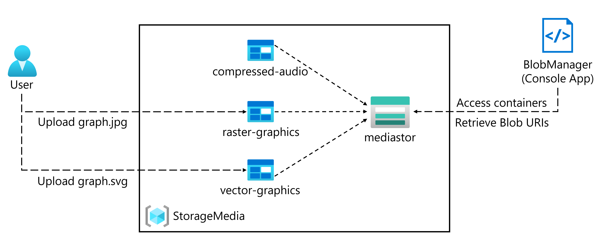

---
lab:
  az204Title: 'Lab 03: Retrieve Azure Storage resources and metadata by using the Azure Storage SDK for .NET'
  az020Title: 'Lab 03: Retrieve Azure Storage resources and metadata by using the Azure Storage SDK for .NET'
  az204Module: 'Module 03: Develop solutions that use blob storage'
  az020Module: 'Module 03: Develop solutions that use blob storage'
ms.openlocfilehash: 03c0d2410bcccd1078a858caf610f55bc23a537d
ms.sourcegitcommit: 0dbb0f4fc7f326a2c5964385b1a7e9fef2ce5e9b
ms.translationtype: HT
ms.contentlocale: de-DE
ms.lasthandoff: 03/09/2022
ms.locfileid: "139696503"
---
# <a name="lab-03-retrieve-azure-storage-resources-and-metadata-by-using-the-azure-storage-sdk-for-net"></a>Lab 03: Abrufen von Azure Storage-Ressourcen und -Metadaten mithilfe des Azure Storage SDK für .NET

## <a name="microsoft-azure-user-interface"></a>Microsoft Azure-Benutzeroberfläche

Aufgrund der dynamischen Natur der Microsoft-Cloudtools kann es vorkommen, dass sich die Azure-Benutzeroberfläche nach der Entwicklung dieses Trainingsinhalts ändert. Daher sind die Lab-Anweisungen und Lab-Schritte möglicherweise nicht mehr zutreffend.

Microsoft aktualisiert diesen Trainingskurs, wenn die Community uns über die erforderlichen Änderungen informiert. Cloudupdates kommen jedoch häufig vor, sodass möglicherweise Änderungen an der Benutzeroberfläche auftreten, bevor diese Trainingsinhalte aktualisiert werden. **Wenn dies der Fall ist, stellen Sie sich auf die Veränderungen ein, und arbeiten Sie sie bei Bedarf in den Labs durch.**

## <a name="instructions"></a>Anweisungen

### <a name="before-you-start"></a>Vorbereitung

#### <a name="sign-in-to-the-lab-environment"></a>Anmelden bei der Laborumgebung

Melden Sie sich mit den folgenden Anmeldeinformationen bei Ihrer Windows 10-VM an:

-   Benutzername: **Admin**

-   Kennwort: **Pa55w.rd**

> **Hinweis**: Ihr Kursleiter stellt Anweisungen zum Herstellen einer Verbindung mit der virtuellen Laborumgebung zur Verfügung.

#### <a name="review-the-installed-applications"></a>Überprüfen der installierten Anwendungen

Suchen Sie auf Ihrem Windows 10-Desktop nach der Taskleiste. Die Taskleiste enthält die Symbole für die Anwendungen, die Sie in diesem Lab verwenden, darunter:

-   Microsoft Edge

-   Datei-Explorer

## <a name="architecture-diagram"></a>Architekturdiagramm



### <a name="exercise-1-create-azure-resources"></a>Übung 1: Erstellen von Azure-Ressourcen

#### <a name="task-1-open-the-azure-portal"></a>Aufgabe 1: Öffnen des Azure-Portals

1.  Wählen Sie auf der Taskleiste das Symbol **Microsoft Edge** aus.

1. Wechseln Sie im Browserfenster zum Azure-Portal (<https://portal.azure.com>), und melden Sie sich dann mit dem Konto an, das Sie für dieses Lab verwenden werden.

   > **Hinweis**: Wenn Sie sich zum ersten Mal am Azure-Portal anmelden, wird Ihnen eine Tour durch das Portal angeboten. Wählen Sie **Erste Schritte** aus, um die Tour zu überspringen und mit der Verwendung des Portals zu beginnen.

#### <a name="task-2-create-a-storage-account"></a>Aufgabe 2: Erstellen eines Speicherkontos

1.  Verwenden Sie im Azure-Portal das Textfeld **Ressourcen, Dienste und Dokumente durchsuchen**, um nach **Speicherkonten** zu suchen, und wählen Sie dann in der Ergebnisliste **Speicherkonten** aus.

1.  Klicken Sie auf dem Blatt **Speicherkonten** auf **+ Erstellen**.

1.  Führen Sie auf der Registerkarte **Grundlagen** des Blatts **Speicherkonto erstellen** die folgenden Aktionen aus, und wählen Sie dann **Überprüfen und erstellen** aus:

   | Einstellung                           | Aktion                                                       |
   | --------------------------------- | ------------------------------------------------------------ |
   | Dropdownliste **Abonnement**   | Übernehmen Sie den Standardwert.                                    |
   | Abschnitt **Ressourcengruppe**        | Wählen Sie **Neu erstellen** aus, geben Sie **StorageMedia** ein, und wählen Sie dann **OK** aus. |
   | Textfeld **Speicherkontoname** | Geben Sie **mediastor** _[Ihr Name]_ ein.                             |
   | Dropdownliste **Region**         | Wählen Sie **(USA) USA, Osten** aus.                                     |
   | Abschnitt **Leistung**           | Wählen Sie die Option **Standard** aus.                              |
   | Dropdownliste **Redundanz**     | Wählen Sie **Lokal redundanter Speicher (LRS)** aus.                  |

   Der folgende Screenshot zeigt die konfigurierten Einstellungen auf dem Blatt **Speicherkonto erstellen**.
 
   
   
1.  Überprüfen Sie auf der Registerkarte **Überprüfen und erstellen** die Optionen, die Sie in den vorherigen Schritten ausgewählt haben.

1.  Wählen Sie **Erstellen** aus, um das Speicherkonto mithilfe Ihrer angegebenen Konfiguration zu erstellen.

    > **Hinweis**: Warten Sie, bis der Erstellungstask abgeschlossen ist, bevor Sie mit diesem Lab fortfahren.

1.  Wählen Sie **Zu Ressource wechseln** aus.

1.  Wählen Sie auf dem Blatt **Speicherkonto** im Abschnitt **Einstellungen** den Link **Endpunkt** aus.

1.  Kopieren Sie im Bereich **Endpunkte** den Wert des Textfelds **Blobdienst** in die Zwischenablage.

    > **Hinweis**: Sie verwenden diesen Endpunktwert später im Lab.

1.  Öffnen Sie Editor, und fügen Sie dann den kopierten Blobdienstwert ein.

1.  Wählen Sie auf dem Blatt **Speicherkonto** im Abschnitt **Sicherheit und Netzwerk** die Option **Zugriffsschlüssel** aus.

1.  Kopieren Sie den **Speicherkontonamen** in die Zwischenablage, und fügen Sie ihn dann in Editor ein.

1.  Wählen Sie auf dem Blatt **Zugriffsschlüssel** die Option **Schlüssel anzeigen** aus.

1.  Überprüfen Sie alle Schlüssel, und kopieren Sie dann den Wert aus einem der Felder **Schlüssel** in die Zwischenablage.

    > **Hinweis**: Sie verwenden alle diese Werte später in diesem Lab.

#### <a name="review"></a>Überprüfung

In dieser Übung haben Sie ein neues Speicherkonto erstellt, das im restlichem Teil des Labs verwendet werden soll.

### <a name="exercise-2-upload-a-blob-into-a-container"></a>Übung 2: Hochladen eines Blobs in einen Container

#### <a name="task-1-create-storage-account-containers"></a>Aufgabe 1: Erstellen von Speicherkontocontainern

1. Wählen Sie auf dem Blatt **Speicherkonto** den Link **Container** im Abschnitt **Datenspeicher** aus.

1. Wählen Sie im Abschnitt **Container** die Option **+ Container** aus.

1. Führen Sie im Popupfenster **Neuer Container** die folgenden Aktionen aus, und wählen Sie dann **Erstellen** aus:

    | Einstellung                                | Aktion                                    |
    | -------------------------------------- | ----------------------------------------- |
    | Textfeld **Name**                      | Geben Sie **raster-graphics** (Rastergrafiken) ein.                |
    | Dropdownliste **Öffentliche Zugriffsebene** | Wählen Sie **Privat (kein anonymer Zugriff)** aus. |

1. Wählen Sie im Abschnitt **Container** die Option **+ Container** aus.

1. Führen Sie im Popupfenster **Neuer Container** die folgenden Aktionen aus, und wählen Sie dann **Erstellen** aus:

    | Einstellung                                | Aktion                                    |
    | -------------------------------------- | ----------------------------------------- |
    | Textfeld **Name**                      | Geben Sie **compressed-audio** (komprimierte Audiodaten) ein.               |
    | Dropdownliste **Öffentliche Zugriffsebene** | Wählen Sie **Privat (kein anonymer Zugriff)** aus. |

1. Beachten Sie im Abschnitt **Container** die aktualisierte Liste der Container.

    Der folgende Screenshot zeigt die konfigurierten Einstellungen auf dem Blatt **Speicherkonto erstellen**.

    

#### <a name="task-2-upload-a-storage-account-blob"></a>Aufgabe 2: Hochladen eines Speicherkontoblobs

1.  Wählen Sie im Abschnitt **Container** den zuletzt erstellten Container **raster-graphics** aus.

1.  Wählen Sie auf dem Blatt **Container** die Option **Hochladen** aus.

1.  Führen Sie im Fenster **Blob hochladen** die folgenden Aktionen aus, und wählen Sie dann **Hochladen** aus:

   | Einstellung                           | Aktion                                                       |
   | --------------------------------- | ------------------------------------------------------------ |
   | Abschnitt **Dateien**   | Wählen Sie das Symbol **Ordner** aus.                                    |
   | Fenster **Datei-Explorer**        | Wechseln Sie zu **Allfiles (F):\\Allfiles\\Labs\\03\\Starter\\Images**, und wählen Sie zuerst die Datei **graph.jpg** und dann **Öffnen** aus. |
   | Kontrollkästchen **Überschreiben, falls Dateien bereits vorhanden sind** | Stellen Sie sicher, dass das Kontrollkästchen aktiviert ist.                        |
   
   > **Hinweis**: Warten Sie, bis das Blob hochgeladen wurde, bevor Sie mit diesem Lab fortfahren.

#### <a name="review"></a>Überprüfung

In dieser Übung haben Sie Platzhaltercontainer im Speicherkonto erstellt und dann einen der Container mit einem Blob aufgefüllt.

### <a name="exercise-3-access-containers-by-using-the-net-sdk"></a>Übung 3: Zugreifen auf Container mit dem .NET SDK

#### <a name="task-1-create-net-project"></a>Aufgabe 1: Erstellen eines .NET-Projekts

1.  Wählen Sie auf dem **Startbildschirm** die Kachel **Visual Studio Code** aus.

1.  Wählen Sie im Menü **Datei** den Befehl **Ordner öffnen** aus, wechseln Sie zu **Allfiles (F):\\Allfiles\\Labs\\03\\Starter\\BlobManager**, und wählen Sie dann **Ordner auswählen** aus.

1.  Wählen Sie im Fenster **Visual Studio Code** auf der Menüleiste **Terminal** und dann **Neues Terminal** aus.

1.  Führen Sie im Terminal den folgenden Befehl aus, um ein neues .NET-Projekt mit dem Namen **BlobManager** im aktuellen Ordner zu erstellen:

    ```
    dotnet new console --name BlobManager --output .
    ```

    > **Hinweis**: Der Befehl **dotnet new** erstellt ein neues **Konsolen** projekt in einem Ordner mit demselben Namen wie das Projekt.

1.  Führen Sie im Terminal den folgenden Befehl aus, um Version 12.0.0 von **Azure.Storage.Blobs** aus NuGet zu importieren:

    ```
    dotnet add package Azure.Storage.Blobs --version 12.0.0
    ```

    > **Hinweis**: Der Befehl **dotnet add package** fügt das Paket **Azure.Storage.Blobs** aus NuGet hinzu. Weitere Informationen finden Sie unter [Azure.Storage.Blobs](https://www.nuget.org/packages/Azure.Storage.Blobs/12.0.0).

1.  Führen Sie im Terminal den folgenden Befehl aus, um die .NET-Webanwendung zu erstellen:

    ```
    dotnet build
    ```

1.  Wählen Sie **Terminal beenden** oder das **Papierkorb**-Symbol aus, um das aktuell geöffnete Terminal und alle zugehörigen Prozesse zu schließen.

#### <a name="task-2-modify-the-program-class-to-access-storage"></a>Aufgabe 2: Ändern der Program-Klasse für den Speicherzugriff

1.  Öffnen Sie im **Explorer**-Bereich des **Visual Studio Code**-Fensters die Datei **Program.cs**.

1.  Löschen Sie auf der Registerkarte „Code-Editor“ für die Datei **Program.cs** den gesamten Code in der vorhandenen Datei.

1.  Fügen Sie folgende Codezeile hinzu, um die Namespaces **Azure.Storage**, **Azure.Storage.Blobs** und **Azure.Storage.Blobs.Models** aus dem von NuGet importierten **Azure.Storage.Blobs**-Paket zu importieren:

    ```csharp
    using Azure.Storage;
    using Azure.Storage.Blobs;
    using Azure.Storage.Blobs.Models;
    ```
    
1.  Fügen Sie die folgenden Codezeilen hinzu, um **using**-Anweisungen für die integrierten Namespaces hinzuzufügen, die in dieser Datei verwendet werden:

    ```csharp
    using System;
    using System.Threading.Tasks;
    ```

1.  Verwenden Sie den folgenden Code, um eine neue **Program**-Klasse zu erstellen:

    ```csharp
    public class Program
    {
    }
    ```

1.  Geben Sie in der **Program**-Klasse die folgende Codezeile ein, um eine neue Zeichenfolgenkonstante namens **blobServiceEndpoint** zu erstellen:

    ```csharp
    private const string blobServiceEndpoint = "";
    ```

1.  Aktualisieren Sie die Zeichenfolgenkonstante **blobServiceEndpoint**, indem Sie ihren Wert auf den **primären Blob-Dienstendpunkt** des Speicherkontos festlegen, den Sie zuvor in diesem Lab notiert haben.

1.  Geben Sie in der **Program**-Klasse die folgende Codezeile ein, um eine neue Zeichenfolgenkonstante namens **storageAccountName** zu erstellen:

    ```csharp
    private const string storageAccountName = "";
    ```

1.  Aktualisieren Sie die Zeichenfolgenkonstante **storageAccountName**, indem Sie ihren Wert auf den **Speicherkontonamen** des Speicherkontos festlegen, den Sie zuvor in diesem Lab notiert haben.

1.  Geben Sie in der **Program**-Klasse die folgende Codezeile ein, um eine neue Zeichenfolgenkonstante namens **storageAccountKey** zu erstellen:

    ```csharp
    private const string storageAccountKey = "";
    ```

1.  Aktualisieren Sie die Zeichenfolgenkonstante **storageAccountKey**, indem Sie ihren Wert auf den **Schlüssel** des Speicherkontos festlegen, den Sie zuvor in diesem Lab notiert haben.

1.  Geben Sie in der **Program**-Klasse den folgenden Code ein, um eine neue asynchrone **Main**-Methode zu erstellen:

    ```csharp
    public static async Task Main(string[] args)
    {
    }
    ```

1.  Überprüfen Sie die Datei **Program.cs**, die nun Folgendes enthalten sollte:

    ```csharp
    using Azure.Storage;
    using Azure.Storage.Blobs;
    using Azure.Storage.Blobs.Models;
    using System;
    using System.Threading.Tasks;
    
    public class Program
    {
        private const string blobServiceEndpoint = "<primary-blob-service-endpoint>";
        private const string storageAccountName = "<storage-account-name>";
        private const string storageAccountKey = "<key>";
    
        public static async Task Main(string[] args)
        {
        }
    }
    ```

#### <a name="task-3-connect-to-the-azure-storage-blob-service-endpoint"></a>Aufgabe 3: Verbinden mit dem Azure Storage Blob-Dienstendpunkt

1.  Fügen Sie in der **Main**-Methode die folgende Codezeile hinzu, um eine neue Instanz der **StorageSharedKeyCredential**-Klasse zu erstellen, indem Sie die Konstanten **storageAccountName** und **storageAccountKey** als Konstruktorparameter verwenden:

    ```csharp
    StorageSharedKeyCredential accountCredentials = new StorageSharedKeyCredential(storageAccountName, storageAccountKey);
    ```

1.  Fügen Sie in der **Main**-Methode die folgende Codezeile hinzu, um eine neue Instanz der **BlobServiceClient**-Klasse zu erstellen, indem Sie die Konstante **blobServiceEndpoint** und die Variable *accountCredentials* als Konstruktorparameter verwenden:

    ```csharp
    BlobServiceClient serviceClient = new BlobServiceClient(new Uri(blobServiceEndpoint), accountCredentials);
    ```

1.  Fügen Sie in der **Main**-Methode die folgende Codezeile hinzu, um die **GetAccountInfoAsync**-Methode der **BlobServiceClient**-Klasse aufzurufen, um Kontometadaten aus dem Dienst abzurufen:

    ```csharp
    AccountInfo info = await serviceClient.GetAccountInfoAsync();
    ```
    
1.  Fügen Sie in der **Main**-Methode die folgende Codezeile hinzu, um eine Begrüßungsnachricht zu rendern:

    ```csharp
    await Console.Out.WriteLineAsync($"Connected to Azure Storage Account");
    ```
    
1.  Fügen Sie in der **Main**-Methode die folgende Codezeile hinzu, um den Namen des Speicherkontos zu rendern:

    ```csharp
    await Console.Out.WriteLineAsync($"Account name:\t{storageAccountName}");
    ```
    
1.  Fügen Sie in der **Main**-Methode die folgende Codezeile hinzu, um den Typ des Speicherkontos zu rendern:

    ```csharp
    await Console.Out.WriteLineAsync($"Account kind:\t{info?.AccountKind}");
    ```
    
1.  Fügen Sie in der **Main**-Methode die folgende Codezeile hinzu, um die aktuell ausgewählte SKU (Stock Keeping Unit) für das Speicherkonto zu rendern:

    ```csharp
    await Console.Out.WriteLineAsync($"Account sku:\t{info?.SkuName}");
    ```

1.  Überprüfen Sie die **Main**-Methode, die nun Folgendes enthalten sollte:

    ```csharp
    public static async Task Main(string[] args)
    {
        StorageSharedKeyCredential accountCredentials = new StorageSharedKeyCredential(storageAccountName, storageAccountKey);

        BlobServiceClient serviceClient = new BlobServiceClient(new Uri(blobServiceEndpoint), accountCredentials);

        AccountInfo info = await serviceClient.GetAccountInfoAsync();

        await Console.Out.WriteLineAsync($"Connected to Azure Storage Account");
        await Console.Out.WriteLineAsync($"Account name:\t{storageAccountName}");
        await Console.Out.WriteLineAsync($"Account kind:\t{info?.AccountKind}");
        await Console.Out.WriteLineAsync($"Account sku:\t{info?.SkuName}");
    }
    ```

1.  Speichern Sie die Datei **Program.cs**.

1.  Wählen Sie im Fenster **Visual Studio Code** auf der Menüleiste **Terminal** und dann **Neues Terminal** aus.

1.  Führen Sie an der Terminaleingabeaufforderung den folgenden Befehl aus, um die .NET-Web-App auszuführen:

    ```
    dotnet run
    ```

    > **Hinweis**: Wenn Buildfehler auftreten, überprüfen Sie die Datei **Program.cs** im Ordner **Allfiles (F):\\Allfiles\\Labs\\03\\Solution\\BlobManager**.

1.  Beobachten Sie die Ausgabe der derzeit ausgeführten Konsolenanwendung. Die Ausgabe enthält Metadaten für das Speicherkonto, das vom Dienst abgerufen wurde.

1.  Wählen Sie **Terminal beenden** oder das **Papierkorb**-Symbol aus, um das aktuell geöffnete Terminal und alle zugehörigen Prozesse zu schließen.

#### <a name="task-4-enumerate-the-existing-containers"></a>Aufgabe 4: Aufzählen der vorhandenen Container

1.  Geben Sie in der **Program**-Klasse den folgenden Code ein, um eine neue **private statische** (private static) Methode namens **EnumerateContainersAsync** zu erstellen, die asynchron ist und einen einzelnen Parametertyp aufweist, **BlobServiceClient**:

    ```csharp
    private static async Task EnumerateContainersAsync(BlobServiceClient client)
    {        
    }
    ```

1.  Geben Sie in der **EnumerateContainersAsync**-Methode den folgenden Code ein, um eine asynchrone **foreach**-Schleife zu erstellen, die die Ergebnisse eines Aufrufs der **GetBlobContainersAsync**-Methode der **BlobServiceClient**-Klasse durchläuft:

    ```csharp
    await foreach (BlobContainerItem container in client.GetBlobContainersAsync())
    {
    }
    ```

1.  Geben Sie in der **foreach**-Schleife den folgenden Code ein, um den Namen der einzelnen Container auszugeben:

    ```csharp
    await Console.Out.WriteLineAsync($"Container:\t{container.Name}");
    ```

1.  Überprüfen Sie die **EnumerateContainersAsync**-Methode, die nun Folgendes enthalten sollte:

    ```csharp
    private static async Task EnumerateContainersAsync(BlobServiceClient client)
    {        
        await foreach (BlobContainerItem container in client.GetBlobContainersAsync())
        {
            await Console.Out.WriteLineAsync($"Container:\t{container.Name}");
        }
    }
    ```

1.  Geben Sie in der **Main**-Methode den folgenden Code am Ende der Methode ein, um die **EnumerateContainersAsync**-Methode aufzurufen, wobei Sie die Variable *serviceClient* als Parameter übergeben:

    ```csharp
    await EnumerateContainersAsync(serviceClient);
    ```

1.  Sehen Sie sich die Datei **Program.cs** an, die nun Folgendes enthalten sollte:
    ```csharp
    using Azure.Storage;
    using Azure.Storage.Blobs;
    using Azure.Storage.Blobs.Models;
    using System;
    using System.Threading.Tasks;
    
    public class Program
    {
        private const string blobServiceEndpoint = "your blobServiceEndpoint";
        private const string storageAccountName = "your storageAccountName";
        private const string storageAccountKey = "your storageAccountKey";
    
        public static async Task Main(string[] args)
        {
            StorageSharedKeyCredential accountCredentials = new StorageSharedKeyCredential(storageAccountName, storageAccountKey);BlobServiceClient serviceClient = new     BlobServiceClient(new Uri(blobServiceEndpoint), accountCredentials);
            AccountInfo info = await serviceClient.GetAccountInfoAsync();
            await Console.Out.WriteLineAsync($"Connected to Azure Storage Account");
            await Console.Out.WriteLineAsync($"Account name:\t{storageAccountName}");
            await Console.Out.WriteLineAsync($"Account kind:\t{info?.AccountKind}");
            await Console.Out.WriteLineAsync($"Account sku:\t{info?.SkuName}");
            await EnumerateContainersAsync(serviceClient);
        }
        
        private static async Task EnumerateContainersAsync(BlobServiceClient client)
        {        
            await foreach (BlobContainerItem container in client.GetBlobContainersAsync())
            {
                await Console.Out.WriteLineAsync($"Container:\t{container.Name}");
            }
    }
    }
    ```

1.  Speichern Sie die Datei **Program.cs**.

1.  Wählen Sie im Fenster **Visual Studio Code** auf der Menüleiste **Terminal** und dann **Neues Terminal** aus.

1.  Führen Sie an der Terminaleingabeaufforderung den folgenden Befehl aus, um die .NET-Web-App auszuführen:

    ```
    dotnet run
    ```

    > **Hinweis**: Wenn Buildfehler auftreten, überprüfen Sie die Datei **Program.cs** im Ordner **Allfiles (F):\\Allfiles\\Labs\\03\\Solution\\BlobManager**.

1.  Beobachten Sie die Ausgabe der derzeit ausgeführten Konsolenanwendung. Die aktualisierte Ausgabe enthält eine Liste aller vorhandenen Container im Konto.

1.  Wählen Sie **Terminal beenden** oder das **Papierkorb**-Symbol aus, um das aktuell geöffnete Terminal und alle zugehörigen Prozesse zu schließen.

#### <a name="review"></a>Überprüfung

In dieser Übung haben Sie mithilfe des Azure Storage SDK auf vorhandene Container zugegriffen.

### <a name="exercise-4-retrieve-blob-uniform-resource-identifiers-uris-by-using-the-net-sdk"></a>Übung 4: Abrufen von Blob-URIs (Uniform Resource Identifiers) mit dem .NET SDK

#### <a name="task-1-enumerate-the-blobs-in-an-existing-container-by-using-the-sdk"></a>Aufgabe 1: Aufzählen der Blobs in einem vorhandenen Container mithilfe des SDK

1.  Geben Sie in der **Program**-Klasse den folgenden Code ein, um eine neue **private statische** (private static) Methode namens **EnumerateBlobsAsync** zu erstellen, die asynchron ist und zwei Parametertypen aufweist, **BlobServiceClient** und **string**:

    ```csharp
    private static async Task EnumerateBlobsAsync(BlobServiceClient client, string containerName)
    {      
    }
    ```

1.  Geben Sie in der **EnumerateBlobsAsync**-Methode den folgenden Code ein, um mithilfe der **GetBlobContainerClient**-Methode der **BlobServiceClient**-Klasse eine neue Instanz der **BlobContainerClient**-Klasse abzurufen, wobei Sie den Parameter **containerName** als Eingabe übergeben:

    ```csharp
    BlobContainerClient container = client.GetBlobContainerClient(containerName);
    ```

1.  Geben Sie in der **EnumerateBlobsAsync**-Methode den folgenden Code ein, um den Namen des Containers zu rendern, der aufgezählt wird:

    ```csharp
    await Console.Out.WriteLineAsync($"Searching:\t{container.Name}");
    ```

1.  Geben Sie in der **EnumerateBlobsAsync**-Methode den folgenden Code ein, um eine asynchrone **foreach**-Schleife zu erstellen, die die Ergebnisse eines Aufrufs der **GetBlobsAsync**-Methode der **BlobContainerClient**-Klasse durchläuft:

    ```csharp
    await foreach (BlobItem blob in container.GetBlobsAsync())
    {        
    }
    ```

1.  Geben Sie in der **foreach**-Schleife den folgenden Code ein, um den Namen der einzelnen Blobs auszugeben:

    ```csharp
     await Console.Out.WriteLineAsync($"Existing Blob:\t{blob.Name}");
    ```

1.  Überprüfen Sie die **EnumerateBlobsAsync**-Methode, die nun Folgendes enthalten sollte:

    ```csharp
    private static async Task EnumerateBlobsAsync(BlobServiceClient client, string containerName)
    {      
        BlobContainerClient container = client.GetBlobContainerClient(containerName);
        await Console.Out.WriteLineAsync($"Searching:\t{container.Name}");
        await foreach (BlobItem blob in container.GetBlobsAsync())
        {        
             await Console.Out.WriteLineAsync($"Existing Blob:\t{blob.Name}");
        }
    }
    ```

1.  Geben Sie in der **Main**-Methode den folgenden Code am Ende der Methode ein, um eine Variable namens *existingContainerName* mit dem Wert **raster-graphics** zu erstellen:

    ```csharp
    string existingContainerName = "raster-graphics";
    ```

1.  Geben Sie in der **Main**-Methode den folgenden Code am Ende der Methode ein, um die **EnumerateBlobsAsync**-Methode aufzurufen, wobei Sie die Variablen *serviceClient* und *existingContainerName* als Parameter übergeben:

    ```csharp
    await EnumerateBlobsAsync(serviceClient, existingContainerName);
    ```

1.  Sehen Sie sich die Datei **Program.cs** an, die nun Folgendes enthalten sollte:
    ```csharp
    using Azure.Storage;
    using Azure.Storage.Blobs;
    using Azure.Storage.Blobs.Models;
    using System;
    using System.Threading.Tasks;
    
    public class Program
    {
        private const string blobServiceEndpoint = "your blobServiceEndpoint";
        private const string storageAccountName = "your storageAccountName";
        private const string storageAccountKey = "your storageAccountKey";
    
        public static async Task Main(string[] args)
            StorageSharedKeyCredential accountCredentials = new StorageSharedKeyCredential(storageAccountName, storageAccountKey);BlobServiceClient serviceClient = new   BlobServiceClient(new Uri(blobServiceEndpoint), accountCredentials);
            AccountInfo info = await serviceClient.GetAccountInfoAsync();
            await Console.Out.WriteLineAsync($"Connected to Azure Storage Account");
            await Console.Out.WriteLineAsync($"Account name:\t{storageAccountName}");
            await Console.Out.WriteLineAsync($"Account kind:\t{info?.AccountKind}");
            await Console.Out.WriteLineAsync($"Account sku:\t{info?.SkuName}");
            await EnumerateContainersAsync(serviceClient);
            string existingContainerName = "raster-graphics";
            await EnumerateBlobsAsync(serviceClient, existingContainerName);
        }
        
        private static async Task EnumerateContainersAsync(BlobServiceClient client)
        {        
            await foreach (BlobContainerItem container in client.GetBlobContainersAsync())
            {
                await Console.Out.WriteLineAsync($"Container:\t{container.Name}");
            }
        }
        
        private static async Task EnumerateBlobsAsync(BlobServiceClient client, string containerName)
        {      
            BlobContainerClient container = client.GetBlobContainerClient(containerName);await Console.Out.WriteLineAsync($"Searching:\t{container.Name}");
            await foreach (BlobItem blob in container.GetBlobsAsync())
            {        
                await Console.Out.WriteLineAsync($"Existing Blob:\t{blob.Name}");
            }
    }
    ```


1.  Speichern Sie die Datei **Program.cs**.

1.  Wählen Sie im Fenster **Visual Studio Code** auf der Menüleiste **Terminal** und dann **Neues Terminal** aus.

1.  Führen Sie an der Terminaleingabeaufforderung den folgenden Befehl aus, um die .NET-Web-App auszuführen:

    ```
    dotnet run
    ```

    > **Hinweis**: Wenn Buildfehler auftreten, überprüfen Sie die Datei **Program.cs** im Ordner **Allfiles (F):\\Allfiles\\Labs\\03\\Solution\\BlobManager**.

1.  Überprüfen Sie die Ausgabe der derzeit ausgeführten Konsolenanwendung. Die aktualisierte Ausgabe enthält Metadaten zum vorhandenen Container und zu Blobs.

1.  Wählen Sie **Terminal beenden** oder das **Papierkorb**-Symbol aus, um das aktuell geöffnete Terminal und alle zugehörigen Prozesse zu schließen.

#### <a name="task-2-create-a-new-container-by-using-the-sdk"></a>Aufgabe 2: Erstellen eines neuen Containers mit dem SDK

1.  Geben Sie in der **Program**-Klasse den folgenden Code ein, um eine neue **private statische** (private static) Methode namens **GetContainerAsync** zu erstellen, die asynchron ist und zwei Parametertypen aufweist, **BlobServiceClient** und **string**:

    ```csharp
    private static async Task<BlobContainerClient> GetContainerAsync(BlobServiceClient client, string containerName)
    {      
    }
    ```

1.  Geben Sie in der **GetContainerAsync**-Methode den folgenden Code ein, um mithilfe der **GetBlobContainerClient**-Methode der **BlobServiceClient**-Klasse eine neue Instanz der **BlobContainerClient**-Klasse abzurufen, wobei Sie den Parameter **containerName** als Eingabe übergeben:

    ```csharp
    BlobContainerClient container = client.GetBlobContainerClient(containerName);
    ```

1.  Geben Sie in der **GetContainerAsync**-Methode den folgenden Code ein, um die **CreateIfNotExistsAsync**-Methode der **BlobContainerClient**-Klasse aufzurufen:

    ```csharp
    await container.CreateIfNotExistsAsync(PublicAccessType.Blob);
    ```

1.  Geben Sie in der **GetContainerAsync**-Methode den folgenden Code ein, um den Namen des Containers zu rendern, der potenziell erstellt wurde:

    ```csharp
    await Console.Out.WriteLineAsync($"New Container:\t{container.Name}");
    ```

1.  Geben Sie in der **GetContainerAsync**-Methode den folgenden Code ein, um die Instanz der **BlobContainerClient**-Klasse namens **container** als Ergebnis der **GetContainerAsync**-Methode zurückzugeben:

    ```csharp
    return container;
    ```

1.  Überprüfen Sie die **GetContainerAsync**-Methode, die nun Folgendes enthalten sollte:

    ```csharp
    private static async Task<BlobContainerClient> GetContainerAsync(BlobServiceClient client, string containerName)
    {      
        BlobContainerClient container = client.GetBlobContainerClient(containerName);
        await container.CreateIfNotExistsAsync(PublicAccessType.Blob);
        await Console.Out.WriteLineAsync($"New Container:\t{container.Name}");
        
        return container;
    }
    ```

1.  Geben Sie in der **Main**-Methode den folgenden Code am Ende der Methode ein, um eine Variable namens *newContainerName* mit dem Wert **vector-graphics** (Vektorgrafiken) zu erstellen:

    ```csharp
    string newContainerName = "vector-graphics";
    ```

1.  Geben Sie in der **Main**-Methode den folgenden Code am Ende der Methode ein, um die **GetContainerAsync**-Methode aufzurufen, wobei Sie die Variablen *serviceClient* und *newContainerName* als Parameter übergeben, um das Ergebnis in einer Variablen namens *containerClient* des Typs **BlobContainerClient** zu speichern:

    ```csharp
    BlobContainerClient containerClient = await GetContainerAsync(serviceClient, newContainerName);
    ```

1.  Überprüfen Sie die Datei **Program.cs**, die nun Folgendes enthalten sollte:
    ```csharp
    using Azure.Storage;
    using Azure.Storage.Blobs;
    using Azure.Storage.Blobs.Models;
    using System;
    using System.Threading.Tasks;
    
    public class Program
    {
        private const string blobServiceEndpoint = "your blobServiceEndpoint";
        private const string storageAccountName = "your storageAccountName";
        private const string storageAccountKey = "your storageAccountKey";
    
        public static async Task Main(string[] args)
            StorageSharedKeyCredential accountCredentials = new StorageSharedKeyCredential(storageAccountName, storageAccountKey);BlobServiceClient serviceClient = new BlobServiceClient(new Uri(blobServiceEndpoint), accountCredentials);
            AccountInfo info = await serviceClient.GetAccountInfoAsync();
            await Console.Out.WriteLineAsync($"Connected to Azure Storage Account");
            await Console.Out.WriteLineAsync($"Account name:\t{storageAccountName}");
            await Console.Out.WriteLineAsync($"Account kind:\t{info?.AccountKind}");
            await Console.Out.WriteLineAsync($"Account sku:\t{info?.SkuName}");
            await EnumerateContainersAsync(serviceClient);
            string existingContainerName = "raster-graphics";
            await EnumerateBlobsAsync(serviceClient, existingContainerName);
            string newContainerName = "vector-graphics";
            BlobContainerClient containerClient = await GetContainerAsync(serviceClient, newContainerName);
        }
        
        private static async Task EnumerateContainersAsync(BlobServiceClient client)
        {        
            await foreach (BlobContainerItem container in client.GetBlobContainersAsync())
            {
                await Console.Out.WriteLineAsync($"Container:\t{container.Name}");
            }
        }
        
        private static async Task EnumerateBlobsAsync(BlobServiceClient client, string containerName)
        {      
            BlobContainerClient container = client.GetBlobContainerClient(containerName);await Console.Out.WriteLineAsync($"Searching:\t{container.Name}");
            await foreach (BlobItem blob in container.GetBlobsAsync())
            {        
                await Console.Out.WriteLineAsync($"Existing Blob:\t{blob.Name}");
            }
        }
        
        private static async Task<BlobContainerClient> GetContainerAsync(BlobServiceClient client, string containerName)
        {      
            BlobContainerClient container = client.GetBlobContainerClient(containerName);await container.CreateIfNotExistsAsync(PublicAccessType.Blob);
            await Console.Out.WriteLineAsync($"New Container:\t{container.Name}");
            return container;
    }
    ```

1.  Speichern Sie die Datei **Program.cs**.

1.  Wählen Sie im Fenster **Visual Studio Code** auf der Menüleiste **Terminal** und dann **Neues Terminal** aus.

1.  Führen Sie an der Terminaleingabeaufforderung den folgenden Befehl aus, um die .NET-Web-App auszuführen:

    ```
    dotnet run
    ```

    > **Hinweis**: Wenn Buildfehler auftreten, überprüfen Sie die Datei **Program.cs** im Ordner **Allfiles (F):\\Allfiles\\Labs\\03\\Solution\\BlobManager**.

1.  Beobachten Sie die Ausgabe der derzeit ausgeführten Konsolenanwendung. Die aktualisierte Ausgabe enthält Metadaten zum vorhandenen Container und zu Blobs.

1.  Wählen Sie **Terminal beenden** oder das **Papierkorb**-Symbol aus, um das aktuell geöffnete Terminal und alle zugehörigen Prozesse zu schließen.

#### <a name="task-3-upload-a-new-blob-by-using-the-portal"></a>Aufgabe 3: Hochladen eines neuen Blobs über das Portal

1.  Wählen Sie im **Navigations** bereich des Azure-Portals den Link **Ressourcengruppen** aus.

1.  Wählen Sie auf dem Blatt **Ressourcengruppen** die Ressourcengruppe **StorageMedia** aus, die Sie zuvor in diesem Lab erstellt haben.

1.  Wählen Sie auf dem Blatt **StorageMedia** das Speicherkonto **mediastor** _[Ihr Name]_ aus, das Sie zuvor in diesem Lab erstellt haben.

1.  Wählen Sie auf dem Blatt **Speicherkonto** den Link **Container** im Abschnitt **Datenspeicher** aus.

1.  Wählen Sie im Abschnitt **Container** den neu erstellten Container **vector-graphics** aus. Möglicherweise müssen Sie die Seite aktualisieren, um den neuen Container zu sehen.

1.  Wählen Sie auf dem Blatt **Container** die Option **Hochladen** aus.

1.  Führen Sie im Fenster **Blob hochladen** die folgenden Aktionen aus, und wählen Sie dann **Hochladen** aus:

    | Einstellung                           | Aktion                                                       |
    | --------------------------------- | ------------------------------------------------------------ |
    | Abschnitt **Dateien**   | Wählen Sie das Symbol **Ordner** aus.                                    |
    | Fenster **Datei-Explorer**        |  Wechseln Sie zu **Allfiles (F):\\Allfiles\\Labs\\03\\Starter\\Images**, und wählen Sie zuerst die Datei **graph.svg** und dann **Öffnen** aus. |
    | Kontrollkästchen **Überschreiben, falls Dateien bereits vorhanden sind** | Stellen Sie sicher, dass das Kontrollkästchen aktiviert ist.                        |

    > **Hinweis**: Warten Sie, bis das Blob hochgeladen wurde, bevor Sie mit diesem Lab fortfahren.

#### <a name="task-4-access-blob-uri-by-using-the-sdk"></a>Aufgabe 4: Zugreifen auf den Blob-URI mit dem SDK

1.  Wechseln Sie zum **Visual Studio Code**-Fenster.

1.  Geben Sie in der **Program**-Klasse den folgenden Code ein, um eine neue **private statische** (private static) Methode namens **GetBlobAsync** zu erstellen, die asynchron ist und zwei Parametertypen aufweist, **BlobContainerClient** und **string**:

    ```csharp
    private static async Task<BlobClient> GetBlobAsync(BlobContainerClient client, string blobName)
    {      
    }
    ```

1.  Geben Sie in der **GetBlobAsync**-Methode den folgenden Code ein, um mithilfe der **GetBlobClient**-Methode der **BlobContainerClient**-Klasse eine neue Instanz der **BlobClient**-Klasse abzurufen, wobei Sie den Parameter **blobName** als Eingabe übergeben:

    ```csharp
    BlobClient blob = client.GetBlobClient(blobName);
    ```

1.  Geben Sie in der **GetBlobAsync**-Methode den folgenden Code ein, um den Namen des Blobs zu rendern, auf den verwiesen wurde:

    ```csharp
    await Console.Out.WriteLineAsync($"Blob Found:\t{blob.Name}");
    ```

1.  Geben Sie in der **GetBlobAsync**-Methode den folgenden Code ein, um die Instanz der **BlobClient**-Klasse namens **blob** als Ergebnis der **GetBlobAsync**-Methode zurückzugeben:

    ```csharp
    return blob;
    ```

1.  Überprüfen Sie die **GetBlobAsync**-Methode, die nun Folgendes enthalten sollte:

    ```csharp
    private static async Task<BlobClient> GetBlobAsync(BlobContainerClient client, string blobName)
    {      
        BlobClient blob = client.GetBlobClient(blobName);
        await Console.Out.WriteLineAsync($"Blob Found:\t{blob.Name}");
        return blob;
    }
    ```

1.  Geben Sie in der **Main**-Methode den folgenden Code am Ende der Methode ein, um eine Variable namens *uploadedBlobName* mit dem Wert **graph.svg** zu erstellen:

    ```csharp
    string uploadedBlobName = "graph.svg";
    ```

1.  Geben Sie in der **Main**-Methode den folgenden Code am Ende der Methode ein, um die **GetBlobAsync**-Methode aufzurufen, wobei Sie die Variablen *containerClient* und *uploadedBlobName* als Parameter übergeben, um das Ergebnis in einer Variablen namens *blobClient* des Typs **BlobClient** zu speichern:

    ```csharp
    BlobClient blobClient = await GetBlobAsync(containerClient, uploadedBlobName);
    ```

1.  Geben Sie in der **Main**-Methode den folgenden Code am Ende der Methode ein, um die **Uri**-Eigenschaft der *blobClient*-Variablen zu rendern:

    ```csharp
    await Console.Out.WriteLineAsync($"Blob Url:\t{blobClient.Uri}");
    ```

1.  Sehen Sie sich die Datei **Program.cs** an, die nun Folgendes enthalten sollte:
    ```csharp
    using Azure.Storage;
    using Azure.Storage.Blobs;
    using Azure.Storage.Blobs.Models;
    using System;
    using System.Threading.Tasks;
    
    public class Program
    {
        private const string blobServiceEndpoint = "your blobServiceEndpoint";
        private const string storageAccountName = "your storageAccountName";
        private const string storageAccountKey = "your storageAccountKey";
    
        public static async Task Main(string[] args)
            StorageSharedKeyCredential accountCredentials = new StorageSharedKeyCredential(storageAccountName, storageAccountKey);BlobServiceClient serviceClient = new BlobServiceClient(new Uri(blobServiceEndpoint), accountCredentials);
            AccountInfo info = await serviceClient.GetAccountInfoAsync();
            await Console.Out.WriteLineAsync($"Connected to Azure Storage Account");
            await Console.Out.WriteLineAsync($"Account name:\t{storageAccountName}");
            await Console.Out.WriteLineAsync($"Account kind:\t{info?.AccountKind}");
            await Console.Out.WriteLineAsync($"Account sku:\t{info?.SkuName}");
            await EnumerateContainersAsync(serviceClient);
            string existingContainerName = "raster-graphics";
            await EnumerateBlobsAsync(serviceClient, existingContainerName);
            string newContainerName = "vector-graphics";
            BlobContainerClient containerClient = await GetContainerAsync(serviceClient, newContainerName);
            string uploadedBlobName = "graph.svg";
            BlobClient blobClient = await GetBlobAsync(containerClient, uploadedBlobName);
            await Console.Out.WriteLineAsync($"Blob Url:\t{blobClient.Uri}");
        }
        
        private static async Task EnumerateContainersAsync(BlobServiceClient client)
        {        
            await foreach (BlobContainerItem container in client.GetBlobContainersAsync())
            {
                await Console.Out.WriteLineAsync($"Container:\t{container.Name}");
            }
        }
        
        private static async Task EnumerateBlobsAsync(BlobServiceClient client, string containerName)
        {      
            BlobContainerClient container = client.GetBlobContainerClient(containerName);await Console.Out.WriteLineAsync($"Searching:\t{container.Name}");
            await foreach (BlobItem blob in container.GetBlobsAsync())
            {        
                await Console.Out.WriteLineAsync($"Existing Blob:\t{blob.Name}");
            }
        }
        
        private static async Task<BlobContainerClient> GetContainerAsync(BlobServiceClient client, string containerName)
        {      
            BlobContainerClient container = client.GetBlobContainerClient(containerName);await container.CreateIfNotExistsAsync(PublicAccessType.Blob);
            await Console.Out.WriteLineAsync($"New Container:\t{container.Name}");
            return container;
        }
        
        private static async Task<BlobClient> GetBlobAsync(BlobContainerClient client, string blobName)
        {      
            BlobClient blob = client.GetBlobClient(blobName);
            await Console.Out.WriteLineAsync($"Blob Found:\t{blob.Name}");
            return blob;
        }
    }
    private static async Task EnumerateBlobsAsync(BlobServiceClient client, string containerName)
    {      
    BlobContainerClient container = client.GetBlobContainerClient(containerName);await Console.Out.WriteLineAsync($"Searching:\t{container.Name}");
    await foreach (BlobItem blob in container.GetBlobsAsync())
    {        
     await Console.Out.WriteLineAsync($"Existing Blob:\t{blob.Name}");
    }
    }
    private static async Task<BlobContainerClient> GetContainerAsync(BlobServiceClient client, string containerName)
    {      
    BlobContainerClient container = client.GetBlobContainerClient(containerName);await container.CreateIfNotExistsAsync(PublicAccessType.Blob);
        await Console.Out.WriteLineAsync($"Blob Url:\t{blobClient.Uri}");
    await Console.Out.WriteLineAsync($"New Container:\t{container.Name}");
    return container;
    }
    private static async Task<BlobClient> GetBlobAsync(BlobContainerClient client, string blobName)
    {      
    BlobClient blob = client.GetBlobClient(blobName);
    await Console.Out.WriteLineAsync($"Blob Found:\t{blob.Name}");
    return blob;
    }
    }
    ```

1.  Speichern Sie die Datei **Program.cs**.

1.  Aktivieren Sie im **Visual Studio Code**-Fenster das Kontextmenü für den **Explorer**-Bereich, und wählen Sie dann **Im integrierten Terminal öffnen** aus.

1.  Führen Sie an der geöffneten Eingabeaufforderung den folgenden Befehl aus, um die .NET-Webanwendung auszuführen:

    ```
    dotnet run
    ```

    > **Hinweis**: Wenn Buildfehler auftreten, überprüfen Sie die Datei **Program.cs** im Ordner **Allfiles (F):\\Allfiles\\Labs\\03\\Solution\\BlobManager**.

1.  Beobachten Sie die Ausgabe der derzeit ausgeführten Konsolenanwendung. Die aktualisierte Ausgabe enthält die endgültige URL für den Onlinezugriff auf das Blob. Notieren Sie sich den Wert dieser URL zur späteren Verwendung im Lab.

    > **Hinweis**: Die URL ähnelt wahrscheinlich der folgenden Zeichenfolge: `https://mediastor*[yourname]*.blob.core.windows.net/vector-graphics/graph.svg`.

1.  Wählen Sie **Terminal beenden** oder das **Papierkorb**-Symbol aus, um das aktuell geöffnete Terminal und alle zugehörigen Prozesse zu schließen.

#### <a name="task-5-test-the-uri-by-using-a-browser"></a>Aufgabe 5: Testen des URI mithilfe eines Browsers

1.  Aktivieren Sie auf der Taskleiste das Kontextmenü für das **Microsoft Edge**-Symbol, und wählen Sie dann **Neues Fenster** aus.

1.  Verweisen Sie im neuen Browserfenster auf die URL, die Sie zuvor in diesem Lab für das Blob kopiert haben.

1.  Sie sollten nun die SVG-Datei (Scalable Vector Graphics) in Ihrem Browserfenster sehen.

#### <a name="review"></a>Überprüfung

In dieser Übung haben Sie Container und verwaltete Blobs mithilfe des Storage SDK erstellt.

### <a name="exercise-5-clean-up-your-subscription"></a>Übung 5: Bereinigen Ihres Abonnements

#### <a name="task-1-open-azure-cloud-shell-and-list-resource-groups"></a>Aufgabe 1: Öffnen von Azure Cloud Shell und Auflisten von Ressourcengruppen

1.  Wählen Sie im Azure-Portal das Symbol **Cloud Shell** () aus, um eine neue Bash-Sitzung zu öffnen. Wenn Cloud Shell standardmäßig eine PowerShell-Sitzung verwendet, wählen Sie **PowerShell** und dann im Dropdownmenü **Bash** aus.

    > **Hinweis**: Wenn Sie **Cloud Shell** zum ersten Mal starten, wählen Sie **PowerShell** aus, wenn Sie aufgefordert werden, **Bash** oder **PowerShell** auszuwählen. Wenn die Meldung **You have no storage mounted** (Es ist kein Speicher eingebunden) angezeigt wird, wählen Sie das Abonnement aus, das Sie in diesem Lab verwenden, und wählen Sie dann **Create storage** (Speicher erstellen) aus.

#### <a name="task-2-delete-a-resource-group"></a>Aufgabe 2: Löschen einer Ressourcengruppe

1.  Führen Sie im Bereich **Cloud Shell** den folgenden Befehl aus, um die Ressourcengruppe **StorageMedia** zu löschen:

    ```
    az group delete --name StorageMedia --no-wait --yes
    ```
     > **Hinweis**: Der Befehl wird (dem *--no-wait*-Parameter entsprechend) asynchron ausgeführt. Dies bedeutet, dass Sie zwar einen weiteren Azure CLI-Befehl in derselben Bash-Sitzung direkt im Anschluss ausführen können, es jedoch einige Minuten dauert, bis die Ressourcengruppen tatsächlich entfernt wurden.

1. Schließen Sie den Bereich **Cloud Shell** im Portal.

#### <a name="task-3-close-the-active-application"></a>Aufgabe 3: Schließen der aktiven Anwendung

- Schließen Sie die aktuell ausgeführte Microsoft Edge-Anwendung.

#### <a name="review"></a>Überprüfung

In dieser Übung haben Sie Ihr Abonnement bereinigt, indem Sie die in diesem Lab verwendete Ressourcengruppe entfernt haben.
