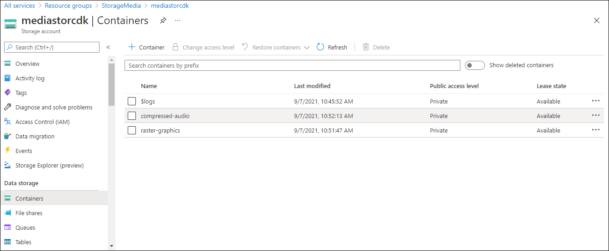

---
lab:
  az204Title: 'Lab 03: Retrieve Azure Storage resources and metadata by using the Azure Storage SDK for .NET'
  az204Module: 'Learning Path 03: Develop solutions that use blob storage'
---

# Lab 03: Abrufen von Azure Storage-Ressourcen und -Metadaten mithilfe des Azure Storage SDK für .NET

## Microsoft Azure-Benutzeroberfläche

Aufgrund der dynamischen Natur der Microsoft-Cloudtools kann es vorkommen, dass sich die Azure-Benutzeroberfläche nach der Entwicklung dieses Trainingsinhalts ändert. Daher sind die Lab-Anweisungen und Lab-Schritte möglicherweise nicht mehr zutreffend.

Microsoft aktualisiert diesen Trainingskurs, wenn die Community uns über die erforderlichen Änderungen informiert. Cloudupdates kommen jedoch häufig vor, sodass möglicherweise Änderungen an der Benutzeroberfläche auftreten, bevor diese Trainingsinhalte aktualisiert werden. **Wenn dies der Fall ist, stellen Sie sich auf die Veränderungen ein, und arbeiten Sie sie bei Bedarf in den Labs durch.**

## Anweisungen

### Vorbereitung

#### Anmelden bei der Laborumgebung

Melden Sie sich mithilfe der folgenden Anmeldeinformationen bei Ihrer Windows 10-VM an:

- Benutzername: `Admin`
- Kennwort: `Pa55w.rd`

> **Hinweis**: Ihr Kursleiter stellt Anweisungen zum Herstellen einer Verbindung mit der virtuellen Laborumgebung zur Verfügung.

#### Überprüfen der installierten Anwendungen

Suchen Sie auf ihrem Windows 10-Desktop nach der Taskleiste. Die Taskleiste enthält die Symbole für die Anwendungen, die Sie in diesem Lab verwenden, darunter:

-   Microsoft Edge
-   Datei-Explorer

## Übungsszenario

In diesem Lab erfahren Sie, wie Sie mit dem Azure Storage SDK auf Azure Storage-Container innerhalb einer C#-Anwendung zugreifen. Außerdem erfahren Sie, wie Sie auf Metadaten zugreifen und URI-Informationen verfügbar machen, um Zugriff auf den Inhalt der Container im Speicherkonto zu erhalten. 

<em>Sehen Sie sich dieses Video an, indem Sie mit der rechten Maustaste auf diesen **[Videolink](https://youtu.be/UtDXcgLv8BQ)** klicken und dann „Link in neuem Tab öffnen“ oder „Link in neuem Fenster öffnen“ auswählen.</em>

 

## Architekturdiagramm


### Übung 1: Erstellen von Azure-Ressourcen

#### Aufgabe 1: Öffnen des Azure-Portals

1. Wählen Sie auf der Taskleiste das Symbol **Microsoft Edge** aus.

1. Wechseln Sie im Browserfenster zum Azure-Portal unter `https://portal.azure.com`, und melden Sie sich dann mit dem Konto an, das Sie für dieses Lab verwenden werden.

   > **Hinweis**: Wenn Sie sich zum ersten Mal am Azure-Portal anmelden, wird Ihnen eine Tour durch das Portal angeboten. Wählen Sie **Erste Schritte** aus, um die Tour zu überspringen und mit der Verwendung des Portals zu beginnen.

#### Aufgabe 2: Erstellen eines Speicherkontos

1. Verwenden Sie im Azure-Portal das Textfeld **Ressourcen, Dienste und Dokumente durchsuchen**, um nach **Speicherkonten** zu suchen, und wählen Sie dann in der Ergebnisliste **Speicherkonten** aus.

1. Wählen Sie auf dem Blatt  **Speicherkonten**  die Option **+ Erstellen** aus.

1. Führen Sie auf der Registerkarte **Grundlagen** des Blatts **Speicherkonto erstellen** die folgenden Aktionen aus:

   | Einstellung | Aktion |
   | -- | -- |
   | Dropdownliste **Abonnement** | Übernehmen Sie den Standardwert. |
   | Abschnitt **Ressourcengruppe** | Wählen Sie **Neu erstellen** aus, geben Sie **StorageMedia** ein, und wählen Sie dann **OK** aus. |
   | Textfeld **Speicherkontoname**  | Geben Sie **mediastor** _[Ihr_Name]_ ein. |
   | Dropdownliste **Region** | Wählen Sie **USA, Osten** aus. |
   | Abschnitt **Leistung** | Wählen Sie die Option **Standard** aus. |
   | Dropdownliste **Redundanz** | Wählen Sie **Lokal redundanter Speicher (LRS)** aus. |

   Der folgende Screenshot zeigt die konfigurierten Einstellungen auf dem Blatt **Speicherkonto erstellen**.
 
   

1. Stellen Sie auf der Registerkarte **Erweitert** sicher, dass **Aktivieren des anonymen Zugriffs auf einzelne Container erlauben** aktiviert ist. Aktivieren Sie das Kontrollkästchen, wenn es nicht aktiviert ist.
    
1. Überprüfen Sie auf der Registerkarte **Überprüfen** die Optionen, die Sie in den vorherigen Schritten ausgewählt haben.

1. Wählen Sie **Erstellen** aus, um das Speicherkonto mithilfe Ihrer angegebenen Konfiguration zu erstellen.

    > **Hinweis**: Warten Sie, bis der Erstellungstask abgeschlossen ist, bevor Sie mit diesem Lab fortfahren.

1. Wählen Sie **Zu Ressource wechseln** aus.

1. Wählen Sie auf dem Blatt **Speicherkonto** im Abschnitt **Einstellungen** den Link **Endpunkte** aus.

1. Kopieren Sie im Bereich **Endpunkte** den Wert des Textfelds **Blobdienst** in die Zwischenablage.

    > **Hinweis**: Sie verwenden diesen Endpunktwert später im Lab.

1. Öffnen Sie Editor, und fügen Sie dann den kopierten Blobdienstwert ein.

1. Wählen Sie auf dem Blatt **Speicherkonto** im Abschnitt **Sicherheit und Netzwerk** die Option **Zugriffsschlüssel** aus.

1. Kopieren Sie den **Speicherkontonamen** in die Zwischenablage, und fügen Sie ihn dann in Editor ein.

1. Wählen Sie auf dem Blatt **Zugriffsschlüssel** die Option **Schlüssel anzeigen** aus.

1. Überprüfen Sie alle Schlüssel, und kopieren Sie dann den Wert aus einem der Felder **Schlüssel** in die Zwischenablage.

    > **Hinweis**: Sie verwenden alle diese Werte später in diesem Lab.

#### Überprüfung

In dieser Übung haben Sie ein neues Speicherkonto erstellt, das im restlichem Teil des Labs verwendet werden soll.

### Übung 2: Hochladen eines Blobs in einen Container

#### Aufgabe 1: Erstellen von Speicherkontocontainern

1. Wählen Sie auf dem Blatt **Speicherkonto** den Link **Container** im Abschnitt **Datenspeicher** aus.

1. Wählen Sie im Abschnitt **Container** die Option **+ Container** aus.

1. Führen Sie im Popupfenster **Neuer Container** die folgenden Aktionen aus, und wählen Sie dann **Erstellen** aus:

    | Einstellung | Aktion |
    | -- | -- |
    | Textfeld **Name** | Geben Sie **raster-graphics** ein. |
    | Dropdownliste **Öffentliche Zugriffsebene** | Wählen Sie **Privat (kein anonymer Zugriff)** aus. |

1. Wählen Sie im Abschnitt **Container** die Option **+ Container** aus.

1. Führen Sie im Popupfenster **Neuer Container** die folgenden Aktionen aus, und wählen Sie dann **Erstellen** aus:

    | Einstellung | Aktion |
    | -- | -- |
    | Textfeld **Name** | Geben Sie **compressed-audio** ein. |
    | Dropdownliste **Öffentliche Zugriffsebene** | Wählen Sie **Privat (kein anonymer Zugriff)** aus. |

1. Beachten Sie im Abschnitt **Container** die aktualisierte Liste der Container.

    Der folgende Screenshot zeigt die konfigurierten Einstellungen auf dem Blatt **Speicherkonto erstellen**.

    

#### Aufgabe 2: Hochladen eines Speicherkontoblobs

1. Wählen Sie im Abschnitt **Container** den zuletzt erstellten Container **raster-graphics** aus.

1.  Wählen Sie auf dem Blatt **Container** die Option **Hochladen** aus.

1.  Führen Sie im Fenster **Blob hochladen** die folgenden Aktionen aus, und wählen Sie dann **Hochladen** aus:

   | Einstellung | Aktion |
   | -- | -- |
   | Abschnitt **Dateien** | Wählen Sie **Nach Dateien durchsuchen** aus, oder verwenden Sie das Feature zum Ziehen und Ablegen. |
   | Fenster **Datei-Explorer** | Wechseln Sie zu **Allfiles (F):\\Allfiles\\Labs\\03\\Starter\\Images**, und wählen Sie zuerst die Datei **graph.jpg** und dann **Öffnen** aus. |
   | Kontrollkästchen **Überschreiben, falls Dateien bereits vorhanden sind** | Stellen Sie sicher, dass das Kontrollkästchen aktiviert ist. |
   
   > **Hinweis**: Warten Sie, bis das Blob hochgeladen wurde, bevor Sie mit diesem Lab fortfahren.

#### Überprüfung

In dieser Übung haben Sie Platzhaltercontainer im Speicherkonto erstellt und dann einen der Container mit einem Blob aufgefüllt.

### Übung 3: Zugreifen auf Container mit dem .NET SDK

#### Aufgabe 1: Erstellen eines .NET-Projekts

1. Wählen Sie auf dem **Startbildschirm** die Kachel **Visual Studio Code** aus.

1. Wählen Sie im Menü **Datei** den Befehl **Ordner öffnen** aus, wechseln Sie zu **Allfiles (F):\\Allfiles\\Labs\\03\\Starter\\BlobManager**, und wählen Sie dann **Ordner auswählen** aus.

1. Wählen Sie im Fenster **Visual Studio Code** auf der Menüleiste **Terminal** und dann **Neues Terminal** aus.

1. Führen Sie im Terminal den folgenden Befehl aus, um ein neues .NET-Projekt mit dem Namen **BlobManager** im aktuellen Ordner zu erstellen:

    ```
    dotnet new console --framework net6.0 --name BlobManager --output .
    ```

    > **Hinweis**: Der Befehl **dotnet new** erstellt ein neues **Konsolen**projekt in einem Ordner mit demselben Namen wie das Projekt.

1. Führen Sie im Terminal den folgenden Befehl aus, um Version 12.12.0 von **Azure.Storage.Blobs** aus NuGet zu importieren:

    ```
    dotnet add package Azure.Storage.Blobs --version 12.12.0
    ```

    > **Hinweis**: Der Befehl **dotnet add package** fügt das Paket **Azure.Storage.Blobs** aus NuGet hinzu. Weitere Informationen finden Sie unter [Azure.Storage.Blobs](https://www.nuget.org/packages/Azure.Storage.Blobs/12.12.0).

1. Führen Sie im Terminal den folgenden Befehl aus, um die .NET-Webanwendung zu erstellen:

    ```
    dotnet build
    ```

1. Wählen Sie **Terminal beenden** oder das **Papierkorb**-Symbol aus, um das aktuell geöffnete Terminal und alle zugehörigen Prozesse zu schließen.

#### Aufgabe 2: Ändern der Program-Klasse für den Speicherzugriff

1. Öffnen Sie im Bereich **Explorer** des **Visual Studio Code**-Fensters die Datei **Program.cs**.

1. Löschen Sie auf der Registerkarte „Code-Editor“ für die Datei **Program.cs** den gesamten Code in der vorhandenen Datei.

1. Fügen Sie den folgenden Code hinzu:

    ```csharp
    using Azure.Storage;
    using Azure.Storage.Blobs;
    using Azure.Storage.Blobs.Models;
    using System;
    using System.Threading.Tasks;    
    public class Program
    {
        //Update the blobServiceEndpoint value that you recorded previously in this lab.        
        private const string blobServiceEndpoint = "<primary-blob-service-endpoint>";

        //Update the storageAccountName value that you recorded previously in this lab.
        private const string storageAccountName = "<storage-account-name>";

        //Update the storageAccountKey value that you recorded previously in this lab.
        private const string storageAccountKey = "<key>";    


        //The following code to create a new asynchronous Main method
        public static async Task Main(string[] args)
        { 
        }
    }
    ```

1. Aktualisieren Sie die Zeichenfolgenkonstante **blobServiceEndpoint**, indem Sie ihren Wert auf den **primären Blobdienst-Endpunkt** des Speicherkontos festlegen, den Sie sich zuvor in diesem Lab notiert haben.

1. Aktualisieren Sie die Zeichenfolgenkonstante **storageAccountName**, indem Sie ihren Wert auf den **Speicherkontonamen** des Speicherkontos festlegen, den Sie sich zuvor in diesem Lab notiert haben.

1. Aktualisieren Sie die Zeichenfolgenkonstante **storageAccountKey**, indem Sie ihren Wert auf den **Schlüssel** des Speicherkontos festlegen, den Sie sich zuvor in diesem Lab notiert haben.
  

#### Aufgabe 3: Verbinden mit dem Azure Storage Blob-Dienstendpunkt

1. Fügen Sie in der **Main**-Methode den folgenden Code hinzu:
  
    ```csharp
     public static async Task Main(string[] args)
    {
        //The following line of code to create a new instance of the StorageSharedKeyCredential class by using the storageAccountName and storageAccountKey constants as constructor parameters
        StorageSharedKeyCredential accountCredentials = new StorageSharedKeyCredential(storageAccountName, storageAccountKey);

        //The following line of code to create a new instance of the BlobServiceClient class by using the blobServiceEndpoint constant and the accountCredentials variable as constructor parameters
        BlobServiceClient serviceClient = new BlobServiceClient(new Uri(blobServiceEndpoint), accountCredentials);

        //The following line of code to invoke the GetAccountInfoAsync method of the BlobServiceClient class to retrieve account metadata from the service
        AccountInfo info = await serviceClient.GetAccountInfoAsync();

        //Render a welcome message
        await Console.Out.WriteLineAsync($"Connected to Azure Storage Account");

        //Render the storage account's name
        await Console.Out.WriteLineAsync($"Account name:\t{storageAccountName}");

        //Render the type of storage account
        await Console.Out.WriteLineAsync($"Account kind:\t{info?.AccountKind}");

        //Render the currently selected stock keeping unit (SKU) for the storage account
        await Console.Out.WriteLineAsync($"Account sku:\t{info?.SkuName}");
    }
    ```

1. Speichern Sie die Datei  **Program.cs** .

1. Wählen Sie im Fenster **Visual Studio Code** auf der Menüleiste **Terminal** und dann **Neues Terminal** aus.

1. Führen Sie an der Terminaleingabeaufforderung den folgenden Befehl aus, um die .NET-Web-App auszuführen:

    ```
    dotnet run
    ```

    > **Hinweis**: Wenn Buildfehler auftreten, überprüfen Sie die Datei **Program.cs** im Ordner **Allfiles (F):\\Allfiles\\Labs\\03\\Solution\\BlobManager**.

1. Beobachten Sie die Ausgabe der derzeit ausgeführten Konsolenanwendung. Die Ausgabe enthält Metadaten für das Speicherkonto, das vom Dienst abgerufen wurde.

1. Wählen Sie **Terminal beenden** oder das **Papierkorb**-Symbol aus, um das aktuell geöffnete Terminal und alle zugehörigen Prozesse zu schließen.

#### Aufgabe 4: Aufzählen der vorhandenen Container

1. Geben Sie in der **Program**-Klasse den folgenden Code ein, um eine neue **private statische** (private static) Methode namens **EnumerateContainersAsync** zu erstellen, die asynchron ist und einen einzelnen Parametertyp aufweist, **BlobServiceClient**:
   
    ```csharp
    private static async Task EnumerateContainersAsync(BlobServiceClient client)
    {   
        /*Create an asynchronous foreach loop that iterates over the results of 
            an invocation of the GetBlobContainersAsync method of the BlobServiceClient class. */    
        await foreach (BlobContainerItem container in client.GetBlobContainersAsync())
        {   
            //Print the name of each container
            await Console.Out.WriteLineAsync($"Container:\t{container.Name}");
        }
    }
    ```

1. Geben Sie in der **Main**-Methode den folgenden Code am Ende der Methode ein, um die **EnumerateContainersAsync**-Methode aufzurufen, wobei Sie die Variable *serviceClient* als Parameter übergeben:

    ```csharp
    await EnumerateContainersAsync(serviceClient);
    ```

1. Sehen Sie sich die Datei **Program.cs** an, die nun Folgendes enthalten sollte:
    ```csharp
    using Azure.Storage;
    using Azure.Storage.Blobs;
    using Azure.Storage.Blobs.Models;
    using System;
    using System.Threading.Tasks;
    
    public class Program
    {
        private const string blobServiceEndpoint = "your blobServiceEndpoint";
        private const string storageAccountName = "your storageAccountName";
        private const string storageAccountKey = "your storageAccountKey";    
        public static async Task Main(string[] args)
        {
            StorageSharedKeyCredential accountCredentials = new StorageSharedKeyCredential(storageAccountName, storageAccountKey);
            BlobServiceClient serviceClient = new     BlobServiceClient(new Uri(blobServiceEndpoint), accountCredentials);
            AccountInfo info = await serviceClient.GetAccountInfoAsync();
            await Console.Out.WriteLineAsync($"Connected to Azure Storage Account");
            await Console.Out.WriteLineAsync($"Account name:\t{storageAccountName}");
            await Console.Out.WriteLineAsync($"Account kind:\t{info?.AccountKind}");
            await Console.Out.WriteLineAsync($"Account sku:\t{info?.SkuName}");

            /* To invoke the EnumerateContainersAsync method, 
            passing in the serviceClient variable as a parameter */
            await EnumerateContainersAsync(serviceClient);
        }        
        private static async Task EnumerateContainersAsync(BlobServiceClient client)
        {        
            await foreach (BlobContainerItem container in client.GetBlobContainersAsync())
            {
                await Console.Out.WriteLineAsync($"Container:\t{container.Name}");
            }
    }
    }
    ```

1. Speichern Sie die Datei  **Program.cs** .

1. Wählen Sie im Fenster **Visual Studio Code** auf der Menüleiste **Terminal** und dann **Neues Terminal** aus.

1. Führen Sie an der Terminaleingabeaufforderung den folgenden Befehl aus, um die .NET-Web-App auszuführen:

    ```
    dotnet run
    ```

    > **Hinweis**: Wenn Buildfehler auftreten, überprüfen Sie die Datei **Program.cs** im Ordner **Allfiles (F):\\Allfiles\\Labs\\03\\Solution\\BlobManager**.

1. Beobachten Sie die Ausgabe der derzeit ausgeführten Konsolenanwendung. Die aktualisierte Ausgabe enthält eine Liste aller vorhandenen Container im Konto.

1. Wählen Sie **Terminal beenden** oder das **Papierkorb**-Symbol aus, um das aktuell geöffnete Terminal und alle zugehörigen Prozesse zu schließen.

#### Überprüfung

In dieser Übung haben Sie mithilfe des Azure Storage SDK auf vorhandene Container zugegriffen.

### Übung 4: Abrufen von Blob-URIs (Uniform Resource Identifiers) mit dem .NET SDK

#### Aufgabe 1: Aufzählen der Blobs in einem vorhandenen Container mithilfe des SDK

1. Geben Sie in der **Program**-Klasse den folgenden Code ein, um eine neue **private statische** (private static) Methode namens **EnumerateBlobsAsync** zu erstellen, die asynchron ist und zwei Parametertypen aufweist, **BlobServiceClient** und **string**:
  
    ```csharp
    private static async Task EnumerateBlobsAsync(BlobServiceClient client, string containerName)
    {   
        /* Get a new instance of the BlobContainerClient class by using the
           GetBlobContainerClient method of the BlobServiceClient class, 
           passing in the containerName parameter */   
        BlobContainerClient container = client.GetBlobContainerClient(containerName);

        /* Render the name of the container that will be enumerated */
        await Console.Out.WriteLineAsync($"Searching:\t{container.Name}");

        /* Create an asynchronous foreach loop that iterates over the results of
            an invocation of the GetBlobsAsync method of the BlobContainerClient class */
        await foreach (BlobItem blob in container.GetBlobsAsync())
        {     
            //Print the name of each blob    
            await Console.Out.WriteLineAsync($"Existing Blob:\t{blob.Name}");
        }
    }
    ```

1. Geben Sie in der **Main**-Methode den folgenden Code am Ende der Methode ein, um eine Variable namens *existingContainerName* mit dem Wert **raster-graphics** zu erstellen:

    ```csharp
    string existingContainerName = "raster-graphics";
    ```

1. Geben Sie in der **Main**-Methode den folgenden Code am Ende der Methode ein, um die **EnumerateBlobsAsync**-Methode aufzurufen, wobei Sie die Variablen *serviceClient* und *existingContainerName* als Parameter übergeben:

    ```csharp
    await EnumerateBlobsAsync(serviceClient, existingContainerName);
    ```

1. Sehen Sie sich die Datei **Program.cs** an, die nun Folgendes enthalten sollte:
    ```csharp
    using Azure.Storage;
    using Azure.Storage.Blobs;
    using Azure.Storage.Blobs.Models;
    using System;
    using System.Threading.Tasks;    
    public class Program
    {
        private const string blobServiceEndpoint = "your blobServiceEndpoint";
        private const string storageAccountName = "your storageAccountName";
        private const string storageAccountKey = "your storageAccountKey";    
        public static async Task Main(string[] args)
        {
            StorageSharedKeyCredential accountCredentials = new StorageSharedKeyCredential(storageAccountName, storageAccountKey);
            BlobServiceClient serviceClient = new   BlobServiceClient(new Uri(blobServiceEndpoint), accountCredentials);
            AccountInfo info = await serviceClient.GetAccountInfoAsync();
            await Console.Out.WriteLineAsync($"Connected to Azure Storage Account");
            await Console.Out.WriteLineAsync($"Account name:\t{storageAccountName}");
            await Console.Out.WriteLineAsync($"Account kind:\t{info?.AccountKind}");
            await Console.Out.WriteLineAsync($"Account sku:\t{info?.SkuName}");
            await EnumerateContainersAsync(serviceClient);
            string existingContainerName = "raster-graphics";
            await EnumerateBlobsAsync(serviceClient, existingContainerName);
        }        
        private static async Task EnumerateContainersAsync(BlobServiceClient client)
        {        
            await foreach (BlobContainerItem container in client.GetBlobContainersAsync())
            {
                await Console.Out.WriteLineAsync($"Container:\t{container.Name}");
            }
        }        
        private static async Task EnumerateBlobsAsync(BlobServiceClient client, string containerName)
        {      
            BlobContainerClient container = client.GetBlobContainerClient(containerName);
            await Console.Out.WriteLineAsync($"Searching:\t{container.Name}");
            await foreach (BlobItem blob in container.GetBlobsAsync())
            {        
                await Console.Out.WriteLineAsync($"Existing Blob:\t{blob.Name}");
            }
        }
    }
    ```

1. Speichern Sie die Datei  **Program.cs** .

1. Wählen Sie im Fenster **Visual Studio Code** auf der Menüleiste **Terminal** und dann **Neues Terminal** aus.

1. Führen Sie an der Terminaleingabeaufforderung den folgenden Befehl aus, um die .NET-Web-App auszuführen:

    ```
    dotnet run
    ```

    > **Hinweis**: Wenn Buildfehler auftreten, überprüfen Sie die Datei **Program.cs** im Ordner **Allfiles (F):\\Allfiles\\Labs\\03\\Solution\\BlobManager**.

1. Überprüfen Sie die Ausgabe der derzeit ausgeführten Konsolenanwendung. Die aktualisierte Ausgabe enthält Metadaten zum vorhandenen Container und zu Blobs.

1. Wählen Sie **Terminal beenden** oder das **Papierkorb**-Symbol aus, um das aktuell geöffnete Terminal und alle zugehörigen Prozesse zu schließen.

#### Aufgabe 2: Erstellen eines neuen Containers mit dem SDK

1. Geben Sie in der **Program**-Klasse den folgenden Code ein, um eine neue **private statische** (private static) Methode namens **GetContainerAsync** zu erstellen, die asynchron ist und zwei Parametertypen aufweist, **BlobServiceClient** und **string**:

    ```csharp
    private static async Task<BlobContainerClient> GetContainerAsync(BlobServiceClient client, string containerName)
    {   
        /* Get a new instance of the BlobContainerClient class by using the
            GetBlobContainerClient method of the BlobServiceClient class,
            passing in the containerName parameter */   
        BlobContainerClient container = client.GetBlobContainerClient(containerName);

        /* Invoke the CreateIfNotExistsAsync method of the BlobContainerClient class */
        await container.CreateIfNotExistsAsync(PublicAccessType.Blob);

        /* Render the name of the container that was potentially created */
        await Console.Out.WriteLineAsync($"New Container:\t{container.Name}");

        /* Return the container as the result of the GetContainerAsync */        
        return container;
    }
    ```

1. Geben Sie in der **Main**-Methode den folgenden Code am Ende der Methode ein, um eine Variable namens *newContainerName* mit dem Wert **vector-graphics** (Vektorgrafiken) zu erstellen:

    ```csharp
    string newContainerName = "vector-graphics";
    ```

1. Geben Sie in der **Main**-Methode den folgenden Code am Ende der Methode ein, um die **GetContainerAsync**-Methode aufzurufen, wobei Sie die Variablen *serviceClient* und *newContainerName* als Parameter übergeben, um das Ergebnis in einer Variablen namens *containerClient* des Typs **BlobContainerClient** zu speichern:

    ```csharp
    BlobContainerClient containerClient = await GetContainerAsync(serviceClient, newContainerName);
    ```

1. Überprüfen Sie die Datei **Program.cs**, die nun Folgendes enthalten sollte:
    ```csharp
    using Azure.Storage;
    using Azure.Storage.Blobs;
    using Azure.Storage.Blobs.Models;
    using System;
    using System.Threading.Tasks;    
    public class Program
    {
        private const string blobServiceEndpoint = "your blobServiceEndpoint";
        private const string storageAccountName = "your storageAccountName";
        private const string storageAccountKey = "your storageAccountKey";
        public static async Task Main(string[] args)
        {
            StorageSharedKeyCredential accountCredentials = new StorageSharedKeyCredential(storageAccountName, storageAccountKey);
            BlobServiceClient serviceClient = new BlobServiceClient(new Uri(blobServiceEndpoint), accountCredentials);
            AccountInfo info = await serviceClient.GetAccountInfoAsync();
            await Console.Out.WriteLineAsync($"Connected to Azure Storage Account");
            await Console.Out.WriteLineAsync($"Account name:\t{storageAccountName}");
            await Console.Out.WriteLineAsync($"Account kind:\t{info?.AccountKind}");
            await Console.Out.WriteLineAsync($"Account sku:\t{info?.SkuName}");
            await EnumerateContainersAsync(serviceClient);
            string existingContainerName = "raster-graphics";
            await EnumerateBlobsAsync(serviceClient, existingContainerName);
            string newContainerName = "vector-graphics";
            BlobContainerClient containerClient = await GetContainerAsync(serviceClient, newContainerName);
        }        
        private static async Task EnumerateContainersAsync(BlobServiceClient client)
        {        
            await foreach (BlobContainerItem container in client.GetBlobContainersAsync())
            {
                await Console.Out.WriteLineAsync($"Container:\t{container.Name}");
            }
        }        
        private static async Task EnumerateBlobsAsync(BlobServiceClient client, string containerName)
        {      
            BlobContainerClient container = client.GetBlobContainerClient(containerName);
            await Console.Out.WriteLineAsync($"Searching:\t{container.Name}");
            await foreach (BlobItem blob in container.GetBlobsAsync())
            {        
                await Console.Out.WriteLineAsync($"Existing Blob:\t{blob.Name}");
            }
        }        
        private static async Task<BlobContainerClient> GetContainerAsync(BlobServiceClient client, string containerName)
        {      
            BlobContainerClient container = client.GetBlobContainerClient(containerName);
            await container.CreateIfNotExistsAsync(PublicAccessType.Blob);
            await Console.Out.WriteLineAsync($"New Container:\t{container.Name}");
            return container;
        }
    }
    ```

1. Speichern Sie die Datei  **Program.cs** .

1. Wählen Sie im Fenster **Visual Studio Code** auf der Menüleiste **Terminal** und dann **Neues Terminal** aus.

1. Führen Sie an der Terminaleingabeaufforderung den folgenden Befehl aus, um die .NET-Web-App auszuführen:

    ```
    dotnet run
    ```

    > **Hinweis**: Wenn Buildfehler auftreten, überprüfen Sie die Datei **Program.cs** im Ordner **Allfiles (F):\\Allfiles\\Labs\\03\\Solution\\BlobManager**.

1. Beobachten Sie die Ausgabe der derzeit ausgeführten Konsolenanwendung. Die aktualisierte Ausgabe enthält Metadaten zum vorhandenen Container und zu Blobs.

1. Wählen Sie **Terminal beenden** oder das **Papierkorb**-Symbol aus, um das aktuell geöffnete Terminal und alle zugehörigen Prozesse zu schließen.

#### Aufgabe 3: Hochladen eines neuen Blobs über das Portal

1. Wählen Sie im **Navigations**bereich des Azure-Portals den Link **Ressourcengruppen** aus.

1. Wählen Sie auf dem Blatt **Ressourcengruppen** die Ressourcengruppe **StorageMedia** aus, die Sie zuvor in diesem Lab erstellt haben.

1. Wählen Sie auf dem Blatt **StorageMedia** das Speicherkonto **mediastor** _[Ihr Name]_ aus, das Sie zuvor in diesem Lab erstellt haben.

1. Wählen Sie auf dem Blatt **Speicherkonto** den Link **Container** im Abschnitt **Datenspeicher** aus.

1. Wählen Sie im Abschnitt **Container** den neu erstellten Container **vector-graphics** aus. Möglicherweise müssen Sie die Seite aktualisieren, um den neuen Container zu sehen.

1.  Wählen Sie auf dem Blatt **Container** die Option **Hochladen** aus.

1.  Führen Sie im Fenster **Blob hochladen** die folgenden Aktionen aus, und wählen Sie dann **Hochladen** aus:

    | Einstellung | Aktion |
    | -- | -- |
    | Abschnitt **Dateien** | Wählen Sie **Nach Dateien durchsuchen** aus, oder verwenden Sie das Feature zum Ziehen und Ablegen. |
    | Fenster **Datei-Explorer** |  Wechseln Sie zu **Allfiles (F):\\Allfiles\\Labs\\03\\Starter\\Images**, und wählen Sie zuerst die Datei **graph.svg** und dann **Öffnen** aus. |
    | Kontrollkästchen **Überschreiben, falls Dateien bereits vorhanden sind** | Stellen Sie sicher, dass das Kontrollkästchen aktiviert ist. |

    > **Hinweis**: Warten Sie, bis das Blob hochgeladen wurde, bevor Sie mit diesem Lab fortfahren.

#### Aufgabe 4: Zugreifen auf den Blob-URI mit dem SDK

1. Wechseln Sie zum **Visual Studio Code**-Fenster.

1. Geben Sie in der **Program**-Klasse den folgenden Code ein, um eine neue **private statische** (private static) Methode namens **GetBlobAsync** zu erstellen, die asynchron ist und zwei Parametertypen aufweist, **BlobContainerClient** und **string**:
   
    ```csharp
    private static async Task<BlobClient> GetBlobAsync(BlobContainerClient client, string blobName)
    {      
        BlobClient blob = client.GetBlobClient(blobName);
        bool exists = await blob.ExistsAsync();
        if (!exists)
        {
            await Console.Out.WriteLineAsync($"Blob {blob.Name} not found!");
            
        }
        else
            await Console.Out.WriteLineAsync($"Blob Found, URI:\t{blob.Uri}");
        return blob;
    }
    ```

1. Geben Sie in der **Main**-Methode den folgenden Code am Ende der Methode ein, um eine Variable namens *uploadedBlobName* mit dem Wert **graph.svg** zu erstellen:

    ```csharp
    string uploadedBlobName = "graph.svg";
    ```

1. Geben Sie in der **Main**-Methode den folgenden Code am Ende der Methode ein, um die **GetBlobAsync**-Methode aufzurufen, wobei Sie die Variablen *containerClient* und *uploadedBlobName* als Parameter übergeben, um das Ergebnis in einer Variablen namens *blobClient* des Typs **BlobClient** zu speichern:

    ```csharp
    BlobClient blobClient = await GetBlobAsync(containerClient, uploadedBlobName);
    ```

1. Geben Sie in der **Main**-Methode den folgenden Code am Ende der Methode ein, um die **Uri**-Eigenschaft der *blobClient*-Variablen zu rendern:

    ```csharp
    await Console.Out.WriteLineAsync($"Blob Url:\t{blobClient.Uri}");
    ```

1. Sehen Sie sich die Datei **Program.cs** an, die nun Folgendes enthalten sollte:
    ```csharp
    using Azure.Storage;
    using Azure.Storage.Blobs;
    using Azure.Storage.Blobs.Models;
    using System;
    using System.Threading.Tasks;    
    public class Program
    {
        private const string blobServiceEndpoint = "your blobServiceEndpoint";
        private const string storageAccountName = "your storageAccountName";
        private const string storageAccountKey = "your storageAccountKey";    
        public static async Task Main(string[] args)
        {
            StorageSharedKeyCredential accountCredentials = new StorageSharedKeyCredential(storageAccountName, storageAccountKey);
            BlobServiceClient serviceClient = new BlobServiceClient(new Uri(blobServiceEndpoint), accountCredentials);
            AccountInfo info = await serviceClient.GetAccountInfoAsync();
            await Console.Out.WriteLineAsync($"Connected to Azure Storage Account");
            await Console.Out.WriteLineAsync($"Account name:\t{storageAccountName}");
            await Console.Out.WriteLineAsync($"Account kind:\t{info?.AccountKind}");
            await Console.Out.WriteLineAsync($"Account sku:\t{info?.SkuName}");
            await EnumerateContainersAsync(serviceClient);
            string existingContainerName = "raster-graphics";
            await EnumerateBlobsAsync(serviceClient, existingContainerName);
            string newContainerName = "vector-graphics";
            BlobContainerClient containerClient = await GetContainerAsync(serviceClient, newContainerName);
            string uploadedBlobName = "graph.svg";
            BlobClient blobClient = await GetBlobAsync(containerClient, uploadedBlobName);
            await Console.Out.WriteLineAsync($"Blob Url:\t{blobClient.Uri}");
        }        
        private static async Task EnumerateContainersAsync(BlobServiceClient client)
        {        
            await foreach (BlobContainerItem container in client.GetBlobContainersAsync())
            {
                await Console.Out.WriteLineAsync($"Container:\t{container.Name}");
            }
        }        
        private static async Task EnumerateBlobsAsync(BlobServiceClient client, string containerName)
        {      
            BlobContainerClient container = client.GetBlobContainerClient(containerName);
            await Console.Out.WriteLineAsync($"Searching:\t{container.Name}");
            await foreach (BlobItem blob in container.GetBlobsAsync())
            {        
                await Console.Out.WriteLineAsync($"Existing Blob:\t{blob.Name}");
            }
        }        
        private static async Task<BlobContainerClient> GetContainerAsync(BlobServiceClient client, string containerName)
        {      
            BlobContainerClient container = client.GetBlobContainerClient(containerName);

            await container.CreateIfNotExistsAsync(PublicAccessType.Blob);
            await Console.Out.WriteLineAsync($"New Container:\t{container.Name}");
            return container;
        }        
        private static async Task<BlobClient> GetBlobAsync(BlobContainerClient client, string blobName)
        {      
            BlobClient blob = client.GetBlobClient(blobName);
            bool exists = await blob.ExistsAsync();
            if (!exists)
            {
                await Console.Out.WriteLineAsync($"Blob {blob.Name} not found!");
                
            }
            else
                await Console.Out.WriteLineAsync($"Blob Found, URI:\t{blob.Uri}");
            return blob;
        }
    }
    ```

1. Speichern Sie die Datei  **Program.cs** .

1. Wählen Sie im Fenster **Visual Studio Code** auf der Menüleiste **Terminal** und dann **Neues Terminal** aus.

1. Führen Sie an der Terminaleingabeaufforderung den folgenden Befehl aus, um die .NET-Web-App auszuführen:

    ```
    dotnet run
    ```

    > **Hinweis**: Wenn Buildfehler auftreten, überprüfen Sie die Datei **Program.cs** im Ordner **Allfiles (F):\\Allfiles\\Labs\\03\\Solution\\BlobManager**.

1. Beobachten Sie die Ausgabe der derzeit ausgeführten Konsolenanwendung. Die aktualisierte Ausgabe enthält die endgültige URL für den Onlinezugriff auf das Blob. Notieren Sie sich den Wert dieser URL zur späteren Verwendung im Lab.

    > **Hinweis**: Die URL ähnelt wahrscheinlich der folgenden Zeichenfolge: `https://mediastor*[yourname]*.blob.core.windows.net/vector-graphics/graph.svg`.

1. Wählen Sie **Terminal beenden** oder das **Papierkorb**-Symbol aus, um das aktuell geöffnete Terminal und alle zugehörigen Prozesse zu schließen.

#### Aufgabe 5: Testen des URI mithilfe eines Browsers

1. Aktivieren Sie auf der Taskleiste das Kontextmenü für das **Microsoft Edge**-Symbol, und wählen Sie dann **Neues Fenster** aus.

1. Verweisen Sie im neuen Browserfenster auf die URL, die Sie zuvor in diesem Lab für das Blob kopiert haben.

1. Sie sollten nun die SVG-Datei (Scalable Vector Graphics) in Ihrem Browserfenster sehen.

#### Überprüfung

In dieser Übung haben Sie Container und verwaltete Blobs mithilfe des Storage SDK erstellt.
