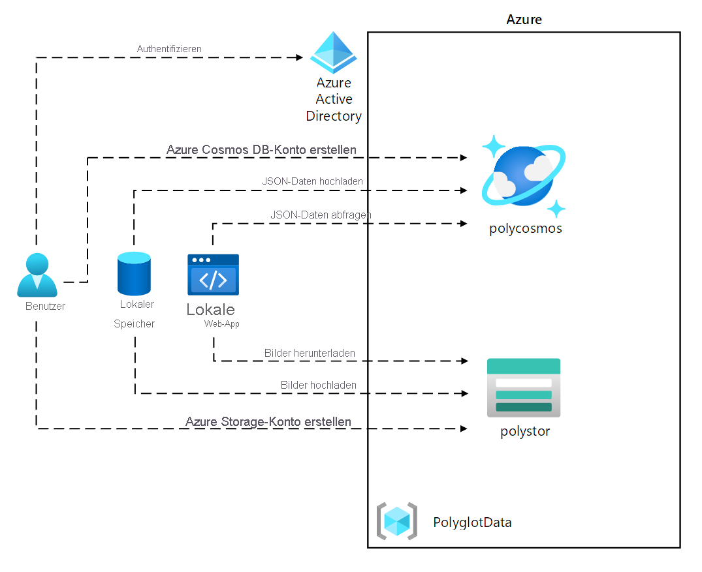
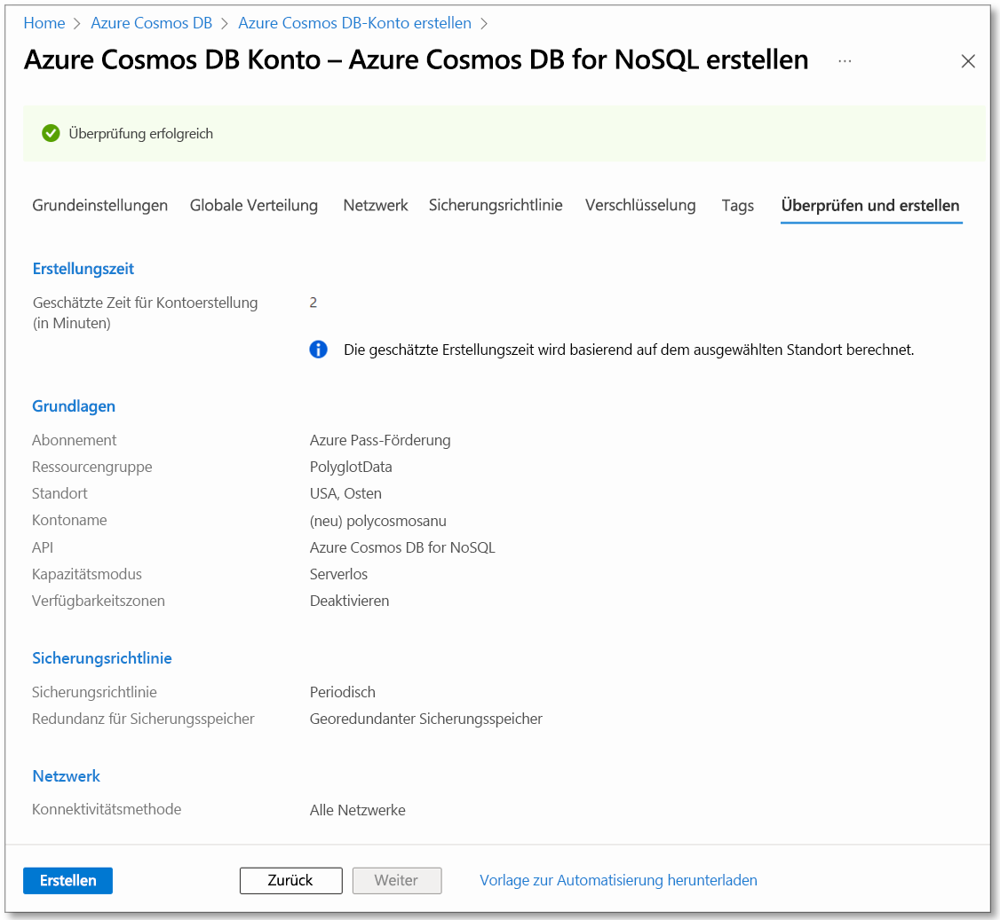
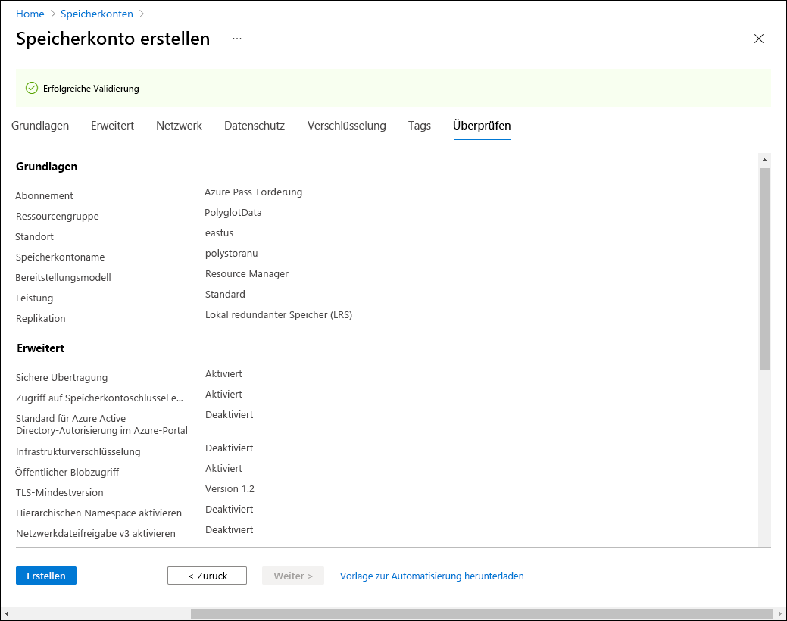

---
lab:
  az204Title: 'Lab 04: Construct a polyglot data solution'
  az204Module: 'Learning Path 04: Develop solutions that use Cosmos DB storage'
---

# Lab 04: Erstellen einer mehrsprachigen Datenlösung

## Microsoft Azure-Benutzeroberfläche

Aufgrund der dynamischen Natur der Microsoft-Cloudtools kann es vorkommen, dass sich die Azure-Benutzeroberfläche nach der Entwicklung dieses Trainingsinhalts ändert. Daher sind die Lab-Anweisungen und Lab-Schritte möglicherweise nicht mehr zutreffend.

Microsoft aktualisiert diesen Trainingskurs, wenn die Community uns über die erforderlichen Änderungen informiert. Cloudupdates kommen jedoch häufig vor, sodass möglicherweise Änderungen an der Benutzeroberfläche auftreten, bevor diese Trainingsinhalte aktualisiert werden. **Wenn dies der Fall ist, stellen Sie sich auf die Veränderungen ein, und arbeiten Sie sie bei Bedarf in den Labs durch.**

## Anweisungen

### Vorbereitung

#### Anmelden bei der Laborumgebung

Melden Sie sich mithilfe der folgenden Anmeldeinformationen bei Ihrer Windows 11-VM an:

- Benutzername: `Admin`
- Kennwort: `Pa55w.rd`

> **Hinweis**: Ihr Kursleiter stellt Anweisungen zum Herstellen einer Verbindung mit der virtuellen Laborumgebung zur Verfügung.

#### Überprüfen der installierten Anwendungen

Suchen Sie auf Ihrem Windows 11-Desktop nach der Taskleiste. Die Taskleiste enthält die Symbole für die Anwendungen, die Sie in diesem Lab verwenden, darunter:

- Microsoft Edge
- Datei-Explorer
- Visual Studio Code

## Übungsszenario

In diesem Lab erstellen Sie eine Azure Cosmos DB-Ressource und eine Speicherkontoressource. Mit C# und .NET greifen Sie auf die Cosmos DB-Ressource zu und laden Daten in sie hoch.

Da Contoso möglicherweise über eine benutzerfreundliche Oberfläche auf die Daten in Cosmos DB zugreifen möchte, implementieren Sie außerdem eine .NET-Lösung, die auf die Daten aus Cosmos DB über einen Webbrowser zugreift und diese anzeigt.

## Architekturdiagramm



### Übung 1: Erstellen von Datenspeicherressourcen in Azure

#### Aufgabe 1: Öffnen des Azure-Portals

1. Wählen Sie auf der Taskleiste das Symbol **Microsoft Edge** aus.

1. Navigieren Sie im geöffneten Browserfenster zum Azure-Portal unter `https://portal.azure.com`, und melden Sie sich dann mit dem Konto an, das Sie für dieses Lab verwenden werden.

   > **Hinweis**: Wenn Sie sich zum ersten Mal am Azure-Portal anmelden, wird Ihnen eine Tour durch das Portal angeboten. Wählen Sie **Erste Schritte** aus, um die Tour zu überspringen und mit der Verwendung des Portals zu beginnen.

#### Aufgabe 2: Erstellen einer Azure Cosmos DB-Kontoressource

1. Verwenden Sie im Azure-Portal das Textfeld **Ressourcen, Dienste und Dokumente durchsuchen**, um nach **Azure Cosmos DB** zu suchen. Wählen Sie in der Ergebnisliste dann **Azure Cosmos DB** aus.

1. Wählen Sie auf dem Blatt **Azure Cosmos DB** die Option **+ Erstellen** aus.

1. Wählen Sie auf dem Blatt **Azure Cosmos DB-Konto erstellen** im Feld **Azure Cosmos DB for NoSQL** **Erstellen** aus.

1. Konfigurieren Sie auf der Registerkarte **Grundlagen** der Seite **Azure Cosmos DB-Konto erstellen – Azure Cosmos DB for NoSQL** die folgenden Aktionen aus, und wählen Sie dann **Überprüfen + Erstellen** aus:

   | Einstellung                     | Aktion                                                                                                                   |
   | --------------------------- | ------------------------------------------------------------------------------------------------------------------------ |
   | **Abonnementliste**       | Behalten Sie die Standardwerte bei.                                                                                                          |
   | Abschnitt **Ressourcengruppe**  | Wählen Sie **Neu erstellen** aus.                                                                                                    |
   | Textfeld **Name**           | Geben Sie **Polyglotdata** ein, und wählen Sie **OK** aus.                                                                                 |
   | Textfeld **AccountName**    | Geben Sie **polycosmos** _[Ihr Name]_ ein.                                                                                         |
   | Dropdownliste **Standort** | Wählen Sie eine Azure-Region aus, die dem Standort Ihres Labcomputers am nächsten liegt und in der Sie ein Cosmos DB-Konto erstellen können. |
   | Abschnitt **Kapazitätsmodus**   | Wählen Sie **Serverlos** aus.                                                                                                    |

   Der folgende Screenshot zeigt die konfigurierten Einstellungen auf der Seite **Azure Cosmos DB-Konto erstellen - Azure Cosmos DB for NoSQL**.

   

1. Überprüfen Sie auf der Registerkarte **Überprüfen  + Erstellen** auf der Seite **Azure Cosmos DB-Konto erstellen – Azure Cosmos DB for NoSQL** die Optionen, die Sie in den vorherigen Schritten ausgewählt haben.

1. Wählen Sie **Erstellen** aus, um das Azure Cosmos DB-Konto mithilfe Ihrer angegebenen Konfiguration zu erstellen.

   > **Hinweis**: Warten Sie, bis der Erstellungstask abgeschlossen ist, bevor Sie mit diesem Lab fortfahren.

1. Wählen Sie **Zu Ressource wechseln** aus.

1. Suchen Sie auf dem Blatt **Azure Cosmos DB-Konto** nach dem Abschnitt **Einstellungen**, und wählen Sie dann den Link **Schlüssel** aus.

1. Notieren Sie sich aus dem Bereich **Schlüssel** auf der Registerkarte **Schlüssel mit Lese-/Schreibzugriff** die Werte der Textfelder **URI**, **PRIMARY KEY** und **PRIMARY CONNECTION STRING** im Editor. Sie verwenden diese Werte später in diesem Lab.

   > **Hinweis:** Um den **Primärschlüssel** und die **Primäre Verbindungszeichenfolge** in die Zwischenablage kopieren zu können, müssen Sie das Augensymbol verwenden. 

#### Aufgabe 3: Erstellen einer Azure-Speicherkontoressource

1. Verwenden Sie im Azure-Portal das Textfeld **Ressourcen, Dienste und Dokumente durchsuchen**, um nach **Speicherkonten** zu suchen, und wählen Sie in der Ergebnisliste **Speicherkonten** aus.

1. Klicken Sie auf dem Blatt **Speicherkonten** auf **+ Erstellen**.

1. Führen Sie auf der Registerkarte **Grundlagen** des Blatts **Speicherkonto erstellen** die folgenden Aktionen aus, und wählen Sie dann **Überprüfen** aus:

   | Einstellung | Aktion |
   | --- |--- |
   | **Abonnementliste** | Behalten Sie die Standardwerte bei. |
   | Abschnitt **Ressourcengruppe** | Wählen Sie **PolyglotData** aus. |
   | Textfeld **Speicherkontoname** | Geben Sie **polystor** _[Ihr Name]_ ein. |
   | Dropdownliste **Region** | Wählen Sie dieselbe Region aus, in der Sie zuvor in dieser Übung das Cosmos DB-Konto erstellt haben. |
   | **Primärer Dienst** | Keine Änderungen |
   | Abschnitt **Leistung** | Wählen Sie **Standard** aus. |
   | Dropdownliste **Redundanz** | Wählen Sie **Lokal redundanter Speicher (LRS)** aus. |

   Der folgende Screenshot zeigt die konfigurierten Einstellungen auf dem Blatt **Speicherkonto erstellen**.

   

1. Überprüfen Sie auf der Registerkarte **Überprüfen** des Blatts **Speicherkonto erstellen** die Optionen, die Sie in den vorherigen Schritten ausgewählt haben.

1. Wählen Sie **Erstellen** aus, um das Speicherkonto mithilfe Ihrer angegebenen Konfiguration zu erstellen.

   > **Hinweis**: Warten Sie, bis der Erstellungstask abgeschlossen ist, bevor Sie mit diesem Lab fortfahren.

#### Überprüfung

In dieser Übung haben Sie die Azure-Ressourcen erstellt, die Sie für die mehrsprachige Datenlösung benötigen, die Sie in diesem Lab implementieren. Die von Ihnen erstellten Azure-Ressourcen umfassen ein Azure Cosmos DB-Konto und ein Azure Storage-Konto.

### Übung 2: Überprüfen und Hochladen von Daten

#### Aufgabe 1:Hochladen von Bildern in Azure Blob Storage

1. Navigieren Sie im Navigationsbereich des Azure-Portals zurück zum Blatt **Speicherkonten**, und wählen Sie dann das Speicherkonto **polystor** _[Ihr Name]_ aus, das Sie in der vorherigen Übung dieses Labs erstellt haben.

1. Wählen Sie auf dem Blatt **polystor** _[Ihr Name]_ des Speicherkontos im Abschnitt **Datenspeicherung** den Link **Container** aus.

1. Wählen Sie im Abschnitt **Container** die Option **+ Container** aus.

1. Führen Sie im Popupfenster **Neuer Container** die folgenden Aktionen aus, und wählen Sie dann **Erstellen** aus:

   | Einstellung                                | Aktion                                   |
   | -------------------------------------- | ---------------------------------------- |
   | Textfeld **Name**                      | Geben Sie **images** ein.                         |

1. Wählen Sie im Abschnitt **Container** den neu erstellten Container **images** aus.

1. Suchen Sie nach dem Abschnitt **Einstellungen** auf dem Blatt **Container**, und wählen Sie dann den Link **Eigenschaften** aus.

1. Notieren Sie sich aus dem Bereich **Eigenschaften** den Wert im Textfeld **URL** im Editor. Sie verwenden diesen Wert später in diesem Lab.

1. Klicken Sie als Nächstes auf **Freigegebene Zugriffstoken**, und generieren Sie ein Zugriffstoken mit den Standardeinstellungen, indem Sie auf **SAS-Token und URL generieren** klicken. Notieren Sie den Wert des **Blob SAS-Tokens** im Editor. Sie benötigen ihn später.

   > **Hinweis:** Sie sollten jetzt fünf Werte im Editor haben. Die Werte für den **URI**, den **Primären Schlüssel** und die **Primäre Verbindungszeichenfolge** für Ihr Cosmos DB-Konto. Außerdem die **URL** und das **SAS-Token-** für Ihren Blob-Container.

1. Suchen Sie auf dem Blatt nach dem Link **Übersicht**, und wählen Sie diesen aus.
1. Wählen Sie auf dem Blatt **Hochladen** aus.

1. Führen Sie im Popupfenster **Blob hochladen** die folgenden Aktionen aus:

   a. Wählen Sie im Abschnitt **Dateien** die Option **Nach Dateien suchen** aus, oder verwenden Sie die Funktion zum Ziehen und Ablegen.

   b. Navigieren Sie im Fenster **Datei-Explorer** zu **Allfiles (F):\\Allfiles\\Labs\\04\\Starter\\Images**,wählen Sie alle 42 einzelnen **JPG**-Bilddateien aus, und wählen Sie dann **Öffnen** aus.

   c. Stellen Sie sicher, dass **Überschreiben, wenn Dateien bereits vorhanden sind** ausgewählt ist, und wählen Sie dann **Hochladen** aus.

   > **Hinweis**: Warten Sie, bis alle Blobs hochgeladen wurden, bevor Sie mit diesem Lab fortfahren.

#### Aufgabe 2: Überprüfen der JSON-Daten

1. Starten Sie auf dem Lab-Computer Visual Studio Code.

1. Wählen Sie im Menü **Datei** die Option **Datei öffnen** aus, navigieren Sie zu **Allfiles (F):\\Allfiles\\Labs \\04\\Starter\\AdventureWorks\\AdventureWorks.Upload**, wählen Sie **models.json** aus, und wählen Sie dann **Öffnen** aus.

1. Überprüfen Sie das Format der Datei **models.json**, und beachten Sie, dass sie ein Array von JSON-Objekten mit einem geschachtelten Array von Objekten enthält, die Teil der **Products**-Eigenschaft sind.

   > **Hinweis**: Dadurch werden die Klassen bestimmt, die Sie definieren, um den Inhalt der JSON-Datei zu deserialisieren, bevor sie in eine Cosmos DB-Sammlung hochgeladen wird.

1. Beachten Sie in der Datei **models.json** dass eine der Eigenschaften **Category** heißt.

   > **Hinweis**: Sie verwenden die **Category**-Eigenschaft, um die Partitionierung der Cosmos DB-Zielsammlung zu definieren.

1. Schließen Sie Visual Studio Code.

#### Aufgabe 3: Erstellen einer Cosmos DB-Datenbank und -Sammlung und Ausführen eines JSON-Datenuploads

1. Wählen Sie auf dem **Startbildschirm** die Kachel **Visual Studio Code** aus.

1. Wählen Sie im Menü **Datei** die Option **Ordner öffnen** aus.

1. Suchen Sie im Fenster **Datei-Explorer**, das geöffnet wird, nach **Allfiles (F):\\Allfiles\\Labs\\04\\Starter\\AdventureWorks**, und wählen Sie dann **Ordner auswählen** aus.

1. Wählen Sie im Fenster **Visual Studio Code** auf der Menüleiste **Terminal** und dann **Neues Terminal** aus.

1. Überprüfen Sie im Terminal, ob das aktuelle Verzeichnis auf **AdventureWorks** festgelegt ist (ändern Sie es in dieses Verzeichnis, falls dies nicht der Fall ist), und führen Sie dann den folgenden Befehl aus, um den Terminalkontext in den Ordner **AdventureWorks.Upload** umzuschalten:

   ```
   cd .\AdventureWorks.Upload\
   ```

   > **Hinweis**: Öffnen Sie vor dem nächsten Schritt den **Windows-Explorer**, und entfernen Sie das schreibgeschützte Attribut aus der Datei **Allfiles (F):\\Allfiles\\Labs\\04\\Starter\\AdventureWorks\\AdventureWorks.Upload\\AdventureWorks.Upload.csproj**.

1. Führen Sie an der Terminaleingabeaufforderung den folgenden Befehl aus, um dem aktuell geöffneten Projekt die .NET-Clientbibliothek von Azure Cosmos DB hinzuzufügen:

   > **Hinweis**: Bevor Sie mit dem folgenden Befehl fortfahren, stellen Sie sicher, dass Sie derzeit unter diesem Pfad positioniert sind: **(F):\\Allfiles\\Labs\\04\\Starter\\AdventureWorks\\AdventureWorks.Upload\\**

   ```
   dotnet add package Microsoft.Azure.Cosmos --version 3.28.0
   ```
   
   > **Hinweis**: Mit dem Befehl **dotnet add package** wird das Paket **Microsoft.Azure.Cosmos** aus **NuGet** hinzugefügt. Weitere Informationen finden Sie unter [Microsoft.Azure.Cosmos](https://www.nuget.org/packages/Microsoft.Azure.Cosmos).

1. Beobachten Sie die Ergebnisse des Builds, die im Terminal ausgegeben werden. Der Build sollte ohne Fehler oder Warnmeldungen erfolgreich abgeschlossen werden.

1. Erweitern Sie im Bereich **Explorer** des **Visual Studio Code**-Fensters das Projekt **AdventureWorks.Upload**.

1. Öffnen Sie die Datei **Program.cs**.

1. Überprüfen Sie in der Datei **Program.cs** die **using**-Direktiven, und beachten Sie, dass sie **Microsoft.Azure.Cosmos**, **System.IO;** , **System.Text.Json**, **System.Threading.Tasks** und **System.Collections.Generic** enthalten. Dies ermöglicht das asynchrone Hochladen von JSON-Elementen aus einer lokalen Datei auf Ihrem Lab-Computer in eine Sammlung in einer Cosmos DB-Datenbank.

1. Legen Sie in der Datei **Program.cs** in Zeile 14 den Wert für **EndpointUrl** fest, indem Sie die leere Zeichenfolge durch die zuvor in diesem Lab notierte Eigenschaft **URI** des **Cosmos DB-Kontos** ersetzen. Stellen Sie sicher, dass der Wert in doppelte Anführungszeichen eingeschlossen wird. Dies ist der **erste** Wert, den Sie im Editor aufgezeichnet haben.

1. Legen Sie in Zeile 15 den Wert von **AuthorizationKey** fest, indem Sie die leere Zeichenfolge durch die zuvor in diesem Lab notierte Eigenschaft **PRIMARY KEY** des **Cosmos DB-Kontos** ersetzen. Stellen Sie sicher, dass der Wert in doppelte Anführungszeichen eingeschlossen wird. Dies ist der **zweite** Wert, den Sie im Editor aufgezeichnet haben.

1. Legen Sie in Zeile 18 den Wert von **PartitionKey** fest, indem Sie die leere Zeichenfolge durch **"/Category"** ersetzen.

1. Legen Sie in Zeile 19 den Wert von **JsonFilePath** fest, indem Sie die leere Zeichenfolge durch **"F: \\\\ Allfiles\\\\Labs\\\\04\\\\Starter \\\\AdventureWorks\\\\AdventureWorks.Upload\\\\models.json"** ersetzen.

1. Beachten Sie im try-Block den Aufruf der **CreateDatabaseIfNotExistsAsync**-Methode der **CosmosClient**-Klasse. Dadurch wird eine Datenbank erstellt, sofern noch keine Datenbank vorhanden ist.

1. Beachten Sie den Aufruf der **DefineContainer**-Methode der **Database**-Klasse. Dadurch wird ein Container erstellt, der die JSON-Elemente hostet, sofern noch kein Container vorhanden ist.

   > **Hinweis**: Die **DefineContainer**-Methode enthält eine Option zur Kostenminimierung, mit der Sie die Standardindizierungsrichtlinie (die automatisch alle Attribute indiziert) ändern können.

1. Beachten Sie die **using**-Anweisung, die auf einem **StreamReader-Objekt** basiert, um JSON-Elemente aus einer Textdatei zu lesen und in Objekte der **Model**-Klasse zu deserialisieren, die weiter in der Datei **Program.cs** definiert wird.

1. Beachten Sie die foreach-Schleife, die die Sammlung deserialisierter Objekte durchläuft und diese asynchron in die Zielsammlung einfügt.

1. Überprüfen Sie die **Model**- **Product**-Klassen, die das Format der Objekte widerspiegeln, die in der JSON-formatierten Datei gespeichert sind, die Sie zuvor in diesem Lab überprüft haben.

1. Speichern und schließen Sie die Datei **Program.cs**.

   > **Hinweis**: Wählen Sie **Überschreiben** aus, wenn Ihnen eine Eingabeaufforderung angezeigt wird, die besagt, dass die Datei schreibgeschützt ist.

1. Führen Sie im Terminal den folgenden Befehl aus, um alle fehlenden NuGet-Pakete wiederherzustellen und das Projekt im Ordner zu erstellen:

   ```
   dotnet build
   ```

   > **Hinweis**: Mit dem Befehl **dotnet build** werden alle fehlenden NuGet-Pakete automatisch wiederhergestellt, bevor alle Projekte im Ordner erstellt werden.

1. Führen Sie an der Terminaleingabeaufforderung den folgenden Befehl aus, um die .NET Core-Konsolenanwendung auszuführen:

   ```
   dotnet run
   ```

   > **Hinweis:** Der Befehl **dotnet run** erstellt automatisch alle Änderungen am Projekt und startet dann die Webanwendung ohne einen angefügten Debugger. Der Befehl gibt die Meldungen aus, die den Fortschritt des Datenladevorgangs angeben, einschließlich der Anzahl der Elemente, die in die Zielsammlung eingefügt werden, und der Dauer des Einfügevorgangs.

1. Beobachten Sie die Ergebnisse der Ausführung des Befehls, die im Terminal ausgegeben werden. Die Ausführung sollte erfolgreich abgeschlossen und die Meldung angezeigt werden, dass 119 Elemente in die Cosmos DB-Zielsammlung eingefügt wurden.

1. Wählen Sie **Terminal beenden** (das Symbol **Papierkorb**) aus, um den Terminalbereich und alle zugehörigen Prozesse zu schließen.

#### Aufgabe 4: Überprüfen des JSON-Datenuploads

1. Wechseln Sie auf Ihrem Lab-Computer zum **Microsoft Edge**-Browserfenster, in dem das Azure-Portal angezeigt wird.

1. Wählen Sie im Azure-Portal das Textfeld **Ressourcen, Dienste und Dokumentation durchsuchen** aus, und wählen Sie in der Liste **Zuletzt verwendeten Ressourcen** das Azure Cosmos DB-Konto **polycosmos** _[IhrName]_ aus, das Sie zuvor in diesem Lab erstellt haben.

1. Suchen Sie auf dem Blatt **Azure Cosmos DB-Konto** nach dem Link **Daten-Explorer**, und wählen Sie diesen aus.

1. Erweitern Sie im Bereich **Daten-Explorer** den Datenbanknoten **Retail**.

1. Erweitern Sie den Containerknoten **Online**, und wählen Sie dann **Neue SQL Abfrage** aus.

   > **Hinweis**: Die Bezeichnung für diese Option ist möglicherweise ausgeblendet. Sie können Bezeichnungen anzeigen, indem Sie auf die Symbole im Bereich **Daten-Explorer** zeigen.

1. Geben Sie auf der Registerkarte „Abfrage“ den folgenden Text ein:

   ```sql
   SELECT * FROM models
   ```

1. Wählen Sie **Abfrage ausführen** aus, und sehen Sie sich dann die Liste der JSON-Elemente an, die von der Abfrage zurückgegeben wird.

1. Ersetzen Sie im Abfrage-Editor den vorhandenen Text durch den folgenden Text:

   ```sql
   SELECT VALUE COUNT(1) FROM models
   ```

1. Wählen Sie **Abfrage ausführen** aus, und beobachten Sie dann das Ergebnis des **COUNT**-Aggregatvorgangs. Er sollte „119“ ausgeben, was der Anzahl der eingefügten Elemente entspricht. 

1. Wechseln Sie zurück zum **Visual Studio Code**-Fenster.

#### Überprüfung

In dieser Übung haben Sie das .NET SDK für Azure Cosmos DB verwendet, um Daten in Azure Cosmos DB einzufügen. Die Webanwendung, die Sie im nächsten Schritt implementieren, verwendet diese Daten.

### Übung 3: Konfigurieren einer .NET-Webanwendung

#### Aufgabe 1: Aktualisieren von Verweisen auf Datenspeicher und Erstellen der Webanwendung

1. Erweitern Sie im Bereich **Explorer** des **Visual Studio Code**-Fensters das Projekt **AdventureWorks.Web**.

1. Öffnen Sie die Datei **appsettings.json**.

1. Suchen Sie im JSON-Objekt in Zeile 3 nach dem Pfad **ConnectionStrings.AdventureWorksCosmosContext**. Beachten Sie, dass der aktuelle Wert leer ist:

   ```json
   "ConnectionStrings": {
       "AdventureWorksCosmosContext": "",
   },
   ```

1. Aktualisieren Sie den Wert der **AdventureWorksCosmosContext**-Eigenschaft, indem Sie ihren Wert auf die **PRIMÄRE VERBINDUNGSZEICHENFOLGE** des Azure Cosmos DB-Kontos festlegen, die Sie sich zuvor in diesem Lab notiert haben. Dies ist der **dritte** Wert, den Sie im Editor aufgezeichnet haben.

1. Suchen Sie im JSON-Objekt in Zeile 6 nach der Eigenschaft **Settings.BlobContainerUrl**. Beachten Sie, dass der aktuelle Wert leer ist:

   ```json
   "Settings": {
       "BlobContainerUrl": "",
       "BlobSASToken": ""
   }
   ```

1. Aktualisieren Sie die Eigenschaften **BlobContainerUrl** und **BlobSASToken** indem Sie ihre Werte auf die Eigenschaft **URL** des Azure Storage-Blobcontainers mit dem Namen **images** und den Wert des **SAS-Tokens** des Blob festlegen, die Sie sich zuvor in diesem Lab notiert haben. Dies sind der **vierte** und **fünfte** Wert, die Sie im Editor aufgezeichnet haben.

1. Speichern Sie die Datei **appsettings.json**, und schließen Sie sie.

   > **Hinweis**: Wählen Sie **Überschreiben** aus, wenn Ihnen eine Eingabeaufforderung angezeigt wird, die besagt, dass die Datei schreibgeschützt ist.

1. Klicken Sie in **Visual Studio Code** im Explorer-Bereich mit der rechten Maustaste auf den Ordner **AdventureWorks.Context**, und wählen Sie **In integriertem Terminal öffnen** aus.

   

   > **Hinweis**: Öffnen Sie vor dem nächsten Schritt den Windows-Explorer, und entfernen Sie das schreibgeschützte Attribut aus der Datei **Allfiles (F):\Allfiles\Labs\04\Starter\AdventureWorks\AdventureWorks.Context\AdventureWorks.Context.csproj**.

1. Überprüfen Sie an der Terminaleingabeaufforderung, ob das aktuelle Verzeichnis auf **AdventureWorks.Context** festgelegt ist (ändern Sie es in dieses Verzeichnis, falls dies nicht der Fall ist), und führen Sie dann den folgenden Befehl aus, um **Microsoft.Azure.Cosmos** aus NuGet zu importieren:

   > **Hinweis**: Bevor Sie mit dem folgenden Befehl fortfahren, stellen Sie sicher, dass Sie derzeit unter diesem Pfad positioniert sind: **(F):\\Allfiles\\Labs\\04\\Starter\\AdventureWorks\\AdventureWorks.Context\\**

   ```
   dotnet add package Microsoft.Azure.Cosmos --version 3.28.0
   ```

1. Führen Sie an der Terminaleingabeaufforderung den folgenden Befehl aus, um das Projekt **AdventureWorks.Context** zu erstellen:

   ```
   dotnet build
   ```

1. Beobachten Sie die Ergebnisse des Builds, die im Terminal ausgegeben werden. Der Build sollte ohne Fehler oder Warnmeldungen erfolgreich abgeschlossen werden.

#### Aufgabe 2: Konfigurieren der Konnektivität mit Azure Cosmos DB

1. Erweitern Sie im Bereich **Explorer** des **Visual Studio Code**-Fensters das Projekt **AdventureWorks.Context**.

1. Wählen Sie im Kontextmenü des Ordnerknotens **AdventureWorks.Context** die Option **Neue Datei** aus.

1. Geben Sie an der neuen Dateieingabeaufforderung **AdventureWorksCosmosContext.cs** ein.

1. Fügen Sie auf der Registerkarte des Code-Editors für die Datei **AdventureWorksCosmosContext.cs** den folgenden Code hinzu:

   ```csharp
   using AdventureWorks.Models;
   using Microsoft.Azure.Cosmos;
   using Microsoft.Azure.Cosmos.Linq;
   using System;
   using System.Collections.Generic;
   using System.Linq;
   using System.Threading.Tasks;

   namespace AdventureWorks.Context
   {
       /* AdventureWorksCosmosContext class will implement the
       IAdventureWorksProductContext interface */
      public class AdventureWorksCosmosContext : IAdventureWorksProductContext
      {
           /* Create a new read-only Container variable named _container */
           private readonly Container _container;

         public AdventureWorksCosmosContext(string connectionString, string database = "Retail", string container = "Online")
         {
           /* Create a new instance of the CosmosClient class, and then obtain
             both a Database and Container instance from the client */
           _container = new CosmosClient(connectionString)
           .GetDatabase(database)
           .GetContainer(container);
         }

         public async Task<Model> FindModelAsync(Guid id)
         {
           /* Create a LINQ query, transform it into an iterator, iterate over the result set,
              and then return the single item in the result set */
           var iterator = _container.GetItemLinqQueryable<Model>()
           .Where(m => m.id == id).ToFeedIterator<Model>();
           List<Model> matches = new List<Model>();
           while (iterator.HasMoreResults)
           {
               var next = await iterator.ReadNextAsync();
               matches.AddRange(next);
           }

           return matches.SingleOrDefault();
         }

         public async Task<List<Model>> GetModelsAsync()
         {
           /* Run an SQL query, get the query result iterator, iterate over the result set,
               and then return the union of all results */
           string query = $@"SELECT * FROM items";
           var iterator = _container.GetItemQueryIterator<Model>(query);
           List<Model> matches = new List<Model>();
           while (iterator.HasMoreResults)
           {
               var next = await iterator.ReadNextAsync();
               matches.AddRange(next);
           }

           return matches;
         }

         public async Task<Product> FindProductAsync(Guid id)
         {
           /* Run an SQL query, get the query result iterator, iterate over the result set,
              and then return the single item in the result set */
           string query = $@"SELECT VALUE products
                       FROM models
                       JOIN products in models.Products
                       WHERE products.id = '{id}'";
           var iterator = _container.GetItemQueryIterator<Product>(query);
           List<Product> matches = new List<Product>();
           while (iterator.HasMoreResults)
           {
               var next = await iterator.ReadNextAsync();
               matches.AddRange(next);
           }

           return matches.SingleOrDefault();
         }

      }
   }
   ```

1. Speichern und schließen Sie die Datei **AdventureWorksCosmosContext.cs**.
1. Führen Sie an der Terminaleingabeaufforderung (Verzeichnis festgelegt auf **AdventureWorks.Context**) den folgenden Befehl aus, um die .NET-Webanwendung zu erstellen:

   ```
   dotnet build
   ```

   > **Hinweis**: Wenn Buildfehler auftreten, überprüfen Sie die Datei **AdventureWorksCosmosContext.cs** im Ordner **Allfiles    > (F):\\Allfiles\\Labs\\04\\Solution\\AdventureWorks\\AdventureWorks.Context**.

#### Aufgabe 3: Überprüfen der Startlogik der .NET-Anwendung

1. Erweitern Sie im Bereich **Explorer** des **Visual Studio Code**-Fensters das Projekt **AdventureWorks.Web**.

1. Öffnen Sie die Datei **Startup.cs**.

1. Beachten Sie in der **Startup**-Klasse die vorhandene **ConfigureProductService**-Methode:

   ```csharp
   public void ConfigureProductService(IServiceCollection services)
   {
       services.AddScoped<IAdventureWorksProductContext, AdventureWorksCosmosContext>(provider =>
           new AdventureWorksCosmosContext(
               _configuration.GetConnectionString(nameof(AdventureWorksCosmosContext))
           )
       );
   }
   ```

   > **Hinweis**: Der Produktdienst verwendet Cosmos DB als Datenbank.

1. Schließen Sie die Datei **Startup.cs**, ohne Änderungen vorzunehmen.

#### Aufgabe 4: Überprüfen, ob die .NET-Anwendung erfolgreich eine Verbindung mit Datenspeichern herstellt

1. Führen Sie in Visual Studio Code an der Terminaleingabeaufforderung den folgenden Befehl aus, um den Terminalkontext in den Ordner **AdventureWorks.Web** umzuschalten:

   ```
   cd ..\AdventureWorks.Web\
   ```

1. Führen Sie an der Terminaleingabeaufforderung den folgenden Befehl aus, um die ASP.NET-Webanwendung auszuführen:

   > **Hinweis**: Bevor Sie mit dem folgenden Befehl fortfahren, stellen Sie sicher, dass Sie derzeit unter diesem Pfad positioniert sind: **(F):\\Allfiles\\Labs\\04\\Starter\\AdventureWorks\\AdventureWorks.Web\\**

   ```
   dotnet run
   ```

   > **Hinweis:** Der Befehl **dotnet run** erstellt automatisch alle Änderungen am Projekt und startet dann die Webanwendung ohne einen angefügten Debugger. Der Befehl gibt die URL der ausgeführten Anwendung und alle zugewiesenen Ports aus.

1. Wählen Sie auf der Taskleiste das Symbol **Microsoft Edge** aus.

1. Navigieren Sie im geöffneten Browserfenster zur aktuell ausgeführten Webanwendung (<http://localhost:5000>).

1. Sehen Sie sich in der Webanwendung die Liste der Modelle an, die auf der Startseite angezeigt wird.

1. Suchen Sie nach dem Modell **Touring-1000**, und wählen Sie dann **Details anzeigen** aus.

1. Überprüfen Sie auf der Produktdetailseite **Touring-1000** die Liste der Optionen.

1. Schließen Sie das Browserfenster, in dem Ihre Webanwendung angezeigt wird.

1. Wechseln Sie zum **Visual Studio Code**-Fenster, und wählen Sie dann **Terminal beenden** (das Symbol **Papierkorb**) aus, um das derzeit geöffnete Terminal und alle zugehörigen Prozesse zu schließen.

#### Überprüfung

In dieser Übung haben Sie C#-Code geschrieben, um eine Azure Cosmos DB-Sammlung mithilfe des .NET SDK abzufragen.
