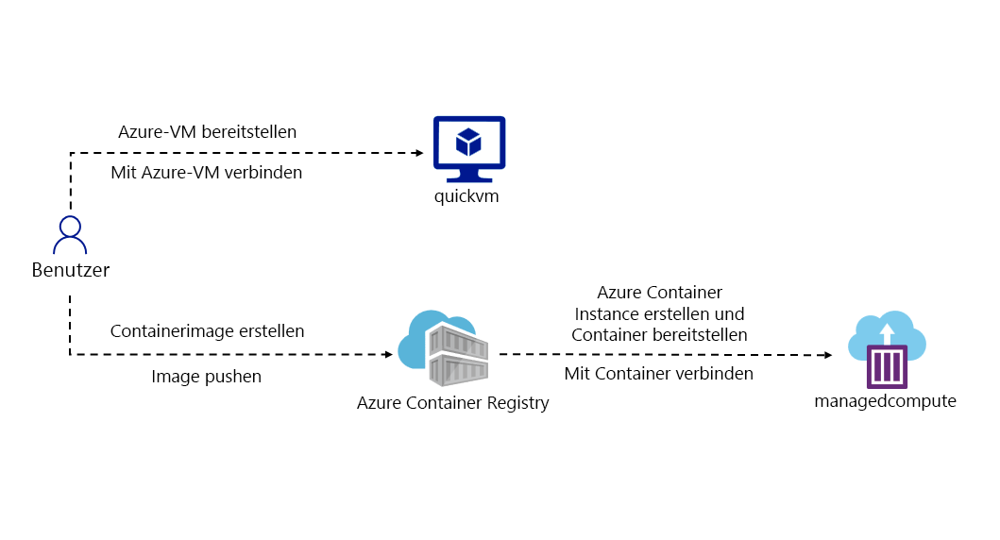
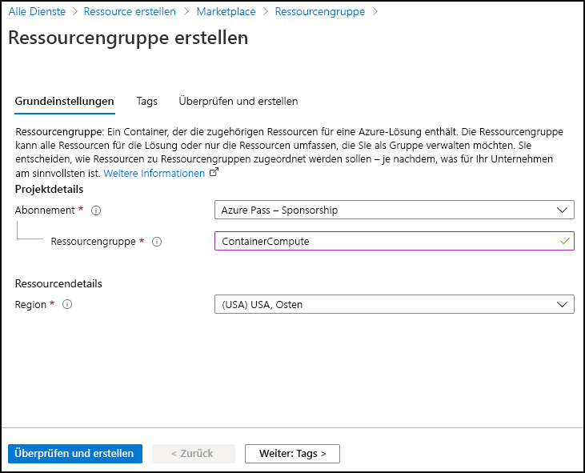
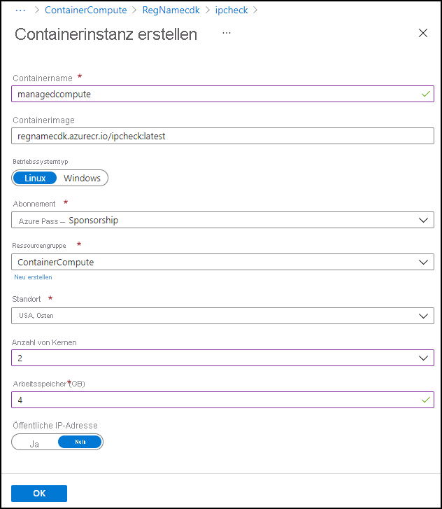
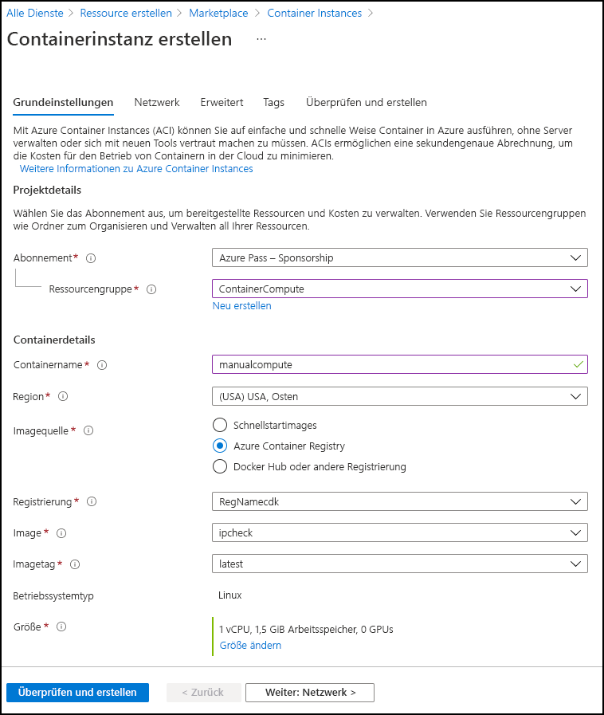

---
lab:
  az204Title: 'Lab 05: Deploy compute workloads by using images and containers'
  az204Module: 'Learning Path 05: Implement containerized solutions'
---

# Lab 05: Bereitstellen von Computeworkloads mithilfe von Images und Containern

## Microsoft Azure-Benutzeroberfläche

Aufgrund der dynamischen Natur der Microsoft-Cloudtools kann es vorkommen, dass sich die Azure-Benutzeroberfläche nach der Entwicklung dieses Trainingsinhalts ändert. Daher sind die Lab-Anweisungen und Lab-Schritte möglicherweise nicht mehr zutreffend.

Microsoft aktualisiert diesen Trainingskurs, wenn die Community uns über die erforderlichen Änderungen informiert. Cloudupdates kommen jedoch häufig vor, sodass möglicherweise Änderungen an der Benutzeroberfläche auftreten, bevor diese Trainingsinhalte aktualisiert werden. **Wenn dies der Fall ist, stellen Sie sich auf die Veränderungen ein, und arbeiten Sie sie bei Bedarf in den Labs durch.**

## Anweisungen

### Vorbereitung

#### Anmelden bei der Laborumgebung

Melden Sie sich mithilfe der folgenden Anmeldeinformationen bei Ihrer Windows 11-VM an:

- Benutzername: `Admin`
- Kennwort: `Pa55w.rd`

> **Hinweis**: Ihr Kursleiter stellt Anweisungen zum Herstellen einer Verbindung mit der virtuellen Laborumgebung zur Verfügung.

#### Überprüfen der installierten Anwendungen

Suchen Sie auf Ihrem Windows 11-Desktop nach der Taskleiste. Die Taskleiste enthält die Symbole für die Anwendungen, die Sie in diesem Lab verwenden, darunter:

-   Microsoft Edge
-   Datei-Explorer

## Übungsszenario

In diesem Lab erfahren Sie, wie Sie mithilfe einer .NET-Anwendung und Docker-Dateien Container in Azure Container Registry erstellen und bereitstellen. Stellen Sie außerdem eine Containerlösung in Azure Container Apps bereit.

## Architekturdiagramm




### Übung 1: Erstellen eines Docker-Containerimages und Bereitstellen des Images für Azure Container Registry

#### Aufgabe 1: Öffnen des Azure-Portals

1. Wählen Sie auf der Taskleiste das Symbol **Microsoft Edge** aus.

1. Navigieren Sie im geöffneten Browserfenster zum Azure-Portal unter `https://portal.azure.com`, und melden Sie sich dann mit dem Konto an, das Sie für dieses Lab verwenden werden.

   > **Hinweis**: Wenn Sie sich zum ersten Mal am Azure-Portal anmelden, wird Ihnen eine Tour durch das Portal angeboten. Wenn Sie die Tour lieber überspringen möchten, wählen Sie **Erste Schritte** aus, um mit der Verwendung des Portals zu beginnen.

#### Aufgabe 2: Erstellen einer Ressourcengruppe

1. Verwenden Sie im Navigationsbereich des Azure-Portals das Textfeld **Ressourcen, Dienste und Dokumente durchsuchen**, um nach **Ressourcengruppe** zu suchen, und wählen Sie dann in der Ergebnisliste **Ressourcengruppen** aus.

1. Wählen Sie auf dem Blatt **Ressourcengruppen** die Option **Erstellen** aus.

1. Führen Sie auf der Registerkarte **Grundlagen** des Blatts **Ressourcengruppe erstellen** die folgenden Aktionen aus, und wählen Sie dann **Überprüfen und erstellen** aus:

    | Einstellung | Aktion |
    | -- | -- |
    | Dropdownliste **Abonnement** | Übernehmen Sie den Standardwert.  |
    | Textfeld **Ressourcengruppe** | Geben Sie **ContainerCompute** ein. |
    | Dropdownliste **Region** | Wählen Sie **USA, Osten** aus. |

    Der folgende Screenshot zeigt die konfigurierten Einstellungen auf dem Blatt **Ressourcengruppe erstellen**.

    

1. Überprüfen Sie auf der Registerkarte **Überprüfen und erstellen** die Optionen, die Sie in den vorherigen Schritten ausgewählt haben.

1. Wählen Sie **Erstellen** aus, um die Ressourcengruppe mit Ihrer angegebenen Konfiguration zu erstellen.  

    > **Hinweis**: Warten Sie, bis der Erstellungstask abgeschlossen ist, bevor Sie mit diesem Lab fortfahren.


#### Aufgabe 3: Initiieren des Quellprojekts

1. Wählen Sie auf der Taskleiste das Symbol **Terminal** aus.

1. Führen Sie den folgenden Befehl aus, um vom aktuellen Verzeichnis in das Verzeichnis **Allfiles (F):\\Allfiles\\Labs\\05\\Starter** zu wechseln:

    ```powershell
    cd F:\Allfiles\Labs\05\Starter
    ```

1. Führen Sie den folgenden Befehl aus, um eine neue .NET-Konsolenanwendung mit .NET 8.0 im aktuellen Verzeichnis zu erstellen:

    ```powershell
    dotnet new console --output . --name ipcheck --framework net8.0
    ```

1. Führen Sie den folgenden Befehl aus, um eine neue Datei im aktuellen Verzeichnis namens **Dockerfile** zu erstellen:

    ```powershell
    New-Item -ItemType File Dockerfile
    ```

1. Führen Sie den folgenden Befehl aus, um das aktuelle Verzeichnis in Visual Studio Code zu öffnen:

    ```powershell
    code .
    ```

#### Aufgabe 4: Erstellen und Testen einer .NET-Anwendung

1. Öffnen Sie im **Explorer**-Bereich des **Visual Studio Code**-Fensters die Datei **Program.cs**.

1. Löschen Sie den gesamten Inhalt der Datei **Program.cs**.

1. Kopieren Sie den folgenden Code, und fügen Sie ihn in die Datei **Program.cs** ein:

    ```csharp
    // Check if network is available
    if (System.Net.NetworkInformation.NetworkInterface.GetIsNetworkAvailable())
    {
        System.Console.WriteLine("Current IP Addresses:");

        // Get host entry for current hostname
        string hostname = System.Net.Dns.GetHostName();
        System.Net.IPHostEntry host = System.Net.Dns.GetHostEntry(hostname);
        
        // Iterate over each IP address and render their values
        foreach(System.Net.IPAddress address in host.AddressList)
        {
            System.Console.WriteLine($"\t{address}");
        }
    }
    else
    {
        System.Console.WriteLine("No Network Connection");
    }
    ```

1. Speichern Sie die Datei **Program.cs**.

1. Löschen Sie die Datei **Starter.sln**.

    > **Hinweis:** Dadurch ist es nicht erforderlich, bei Verwendung von Dotnet-Befehlen explizit auf die CSPROJ-Datei zu verweisen.

1. Wechseln Sie zur Anwendung **Terminal**.

1. Führen Sie den folgenden Befehl aus, um die Anwendung auszuführen:

    ```powershell
    dotnet run
    ```

1. Überprüfen Sie die Ergebnisse. Es sollte mindestens eine IP-Adresse aufgeführt werden, die die Ihrem Computer zugewiesene IP-Adresse darstellt.

1. Wechseln Sie zurück zum Fenster **Visual Studio Code** und öffnen Sie im Bereich **Explorer** die Datei **Dockerfile**.

1. Kopieren Sie den folgenden Code, und fügen Sie ihn in die **Dockerfile**-Datei ein:

    ```
    # Start using the .NET 8.0 SDK container image
    FROM mcr.microsoft.com/dotnet/sdk:8.0 AS build

    # Change current working directory
    WORKDIR /app

    # Copy existing files from host machine
    COPY . ./

    # Publish application to the "out" folder
    RUN dotnet publish --configuration Release --output out

    # Start container by running application DLL
    ENTRYPOINT ["dotnet", "out/ipcheck.dll"]
    ```

1. Speichern Sie das **Dockerfile**.

    > **Hinweis:** Als Nächstes erstellen Sie ein Archiv mit allen Projektdateien. Dadurch wird das Hochladen der Projektdateien in Cloud Shell vereinfacht.

1. Wechseln Sie zur Anwendung **Terminal**.

1. Führen Sie den folgenden Befehl aus, um das Archiv zu erstellen:

    ```powershell
    Compress-Archive -Path .\* -DestinationPath .\lab05.zip
    ```

#### Aufgabe 5: Erstellen einer Container Registry-Ressource

1. Wechseln Sie zum Browserfenster, in dem das Azure-Portal angezeigt wird. 

1. Wählen Sie im Azure-Portal das Symbol **Cloud Shell** () aus, um Cloud Shell zu öffnen. Wenn Cloud Shell standardmäßig eine PowerShell-Sitzung verwendet, wählen Sie im Menü **Cloud Shell** die Option **Zu Bash wechseln** und dann **Bestätigen** aus.

    > **Hinweis**: Das **Cloud Shell**-Symbol wird durch ein Größer-als-Zeichen (\>) und einen Unterstrich (\_) dargestellt.

    Wenn Sie **Cloud Shell** zum ersten Mal starten, erscheint die Eingabeaufforderung **Erste Schritte**. Wählen Sie **Kein Speicherkonto erforderlich** aus und wählen Sie dann **Anwenden** aus.

1. Wählen Sie im Bereich **Cloud Shell** **Dateien verwalten** aus, und wählen Sie im Dropdownmenü **Hochladen** aus.

1. Navigieren Sie im Dialogfeld **Öffnen** zu dem leeren Verzeichnis **Allfiles (F):\\Allfiles\\Labs\\05\\Starter**, und wählen Sie **lab05.zip** und anschließend **Öffnen** aus.

    > **Hinweis:** Dadurch wird die Datei innerhalb der **Cloud Shell**-Sitzung in das Verzeichnis **/~** aufgenommen.

1. Führen Sie an der Eingabeaufforderung **Cloud Shell** im Portal den folgenden Befehl aus, um ein neues Verzeichnis namens **ipcheck** im Verzeichnis **\~** zu erstellen:

    ```bash
    mkdir ~/ipcheck
    ```

1. Führen Sie den folgenden Befehl aus, um den Inhalt des hochgeladenen Archivs in das neu erstellte Verzeichnis **\~/ipcheck** zu extrahieren:

    ```bash
    unzip ~/lab05.zip -d ~/ipcheck
    ```

1. Führen Sie den folgenden Befehl aus, um die Lese- und Ausführungsberechtigungen für den gesamten extrahierten Inhalt im Verzeichnis **\~/ipcheck** festzulegen:

    ```bash
    chmod -R +xr ~/ipcheck
    ```

1. Führen Sie den folgenden Befehl aus, um das aktuelle Verzeichnis in **\~/ipcheck** zu ändern:

    ```bash
    cd ~/ipcheck
    ```

1. Führen Sie an der **Cloud Shell**-Eingabeaufforderung im Portal den folgenden Befehl aus, um eine Variable mit einem eindeutigen Wert für die Container Registry-Ressource zu erstellen: 

    ```bash
    registryName=conregistry$RANDOM
    ```

1. Führen Sie an der **Cloud Shell**-Eingabeaufforderung im Portal den folgenden Befehl aus, um zu überprüfen, ob der im vorherigen Schritt erstellte Name verfügbar ist: 

    ```bash
    az acr check-name --name $registryName
    ```

    Wenn die Ergebnisse zeigen, dass der Name verfügbar ist, fahren Sie mit dem nächsten Schritt fort. Andernfalls führen Sie den Befehl im vorherigen Schritt erneut aus und überprüfen die Verfügbarkeit erneut.

1. Führen Sie an der **Cloud Shell**-Eingabeaufforderung im Portal den folgenden Befehl aus, um eine Container Registry-Ressource zu erstellen: 

    ```bash
    az acr create --resource-group ContainerCompute --name $registryName --sku Basic
    ```

    > **Hinweis**: Warten Sie, bis die Erstellungsaufgabe abgeschlossen ist, bevor Sie mit diesem Lab fortfahren.

#### Aufgabe 6: Speichern von Container Registry-Metadaten

1. Führen Sie an der **Cloud Shell**-Eingabeaufforderung im Portal den folgenden Befehl aus, um eine Liste aller Containerregistrierungen in Ihrem Abonnement abzurufen:

    ```
    az acr list --resource-group ContainerCompute
    ```

1. Führen Sie den folgenden Befehl aus, um sicherzustellen, dass der Name Ihrer Registry als Ausgabe angezeigt wird. Wenn Sie nur „[]“ als Ausgabe sehen, warten Sie eine Minute, und führen Sie den Befehl dann erneut aus.

    ```
    az acr list --resource-group ContainerCompute --query "max_by([], &creationDate).name" --output tsv
    ```

1. Führen Sie den folgenden Befehl aus:

    ```
    acrName=$(az acr list --resource-group ContainerCompute --query "max_by([], &creationDate).name" --output tsv)
    ```

1. Führen Sie den folgenden Befehl aus:

    ```
    echo $acrName
    ```

#### Aufgabe 7: Bereitstellen eines Docker-Containerimages für Container Registry

1. Führen Sie den folgenden Befehl aus, um das aktive Verzeichnis von **\~/** in **\~/ipcheck** zu ändern:

    ```
    cd ~/ipcheck
    ```

1. Führen Sie den folgenden Befehl aus, um den Inhalt des aktuellen Verzeichnisses abzurufen:

    ```
    dir
    ```

1. Führen Sie den folgenden Befehl aus, um den Quellcode in Ihre Containerregistrierung hochzuladen und das Containerimage als Container Registry-Task zu erstellen:

    ```
    az acr build --registry $acrName --image ipcheck:latest .
    ```

    > **Hinweis**: Warten Sie, bis der Erstellungstask abgeschlossen ist, bevor Sie mit diesem Lab fortfahren.

1. Schließen Sie den Bereich **Cloud Shell** im Portal.

#### Aufgabe 8: Überprüfen Ihres Containerimages in Container Registry

1. Wählen Sie im **Navigations**bereich des Azure-Portals den Link **Ressourcengruppen** aus.

1. Wählen Sie auf dem Blatt **Ressourcengruppen** die Ressourcengruppe **ContainerCompute** aus, die Sie zuvor in diesem Lab erstellt haben.

1. Wählen Sie auf dem Blatt **ContainerCompute** die Containerregistrierung aus, die Sie zuvor in diesem Lab erstellt haben.

1. Wählen Sie auf dem Blatt **Container Registry** im Abschnitt **Dienste** den Link **Repositorys** aus.

1. Wählen Sie im Abschnitt **Repositorys** das Containerimagerepository **ipcheck** und dann das Tag **latest** (neueste) aus.

1. Überprüfen Sie die Metadaten für die Version Ihres Containerimages mit dem Tag **latest** (neueste).

    > **Hinweis**: Sie können auch den Link **Ausführungs-ID** auswählen, um Metadaten zum Erstellungstask zu finden.

#### Überprüfung

In dieser Übung haben Sie eine .NET-Konsolenanwendung erstellt, um die aktuelle IP-Adresse eines Computers anzuzeigen. Sie haben dann die **Dockerfile**-Datei zur Anwendung hinzugefügt, damit diese in ein Docker-Containerimage konvertiert werden kann. Schließlich haben Sie das Containerimage in Container Registry bereitgestellt.

### Übung 2: Bereitstellen einer Azure-Containerinstanz

#### Aufgabe 1: Aktivieren des Administratorbenutzers in Container Registry

1. Wählen Sie auf dem Blatt **ContainerCompute** die Containerregistrierung aus, die Sie zuvor in diesem Lab erstellt haben, und wählen Sie dann das Blatt **Zugriffsschlüssel** aus.

1. Schalten Sie den Schalter im Abschnitt „Administratorbenutzer“ um, um den Administratorbenutzer für diese Containerregistrierung zu aktivieren.

#### Aufgabe 2: Automatisches Bereitstellen eines Containerimages in einer Azure-Containerinstanz

1. Wählen Sie auf dem Blatt **Container Registry** im Abschnitt **Dienste** den Link **Repositorys** aus.

1. Wählen Sie im Abschnitt **Repositorys** das Repository mit dem Containerimage **ipcheck** aus.

1. Wählen Sie auf dem Blatt „Repository“ im Abschnitt **Einstellungen** die Option **Zugriffsschlüssel** aus.

1. Aktivieren Sie auf dem Blatt **Zugriffstasten** das Kontrollkästchen **Administratorbenutzer**.

1. Wählen Sie auf dem Blatt „Repository“ im Abschnitt **Dienste** die Option **Repositorys** aus. 

1. Wählen Sie in der Liste der Repositorys **ipcheck** aus.

1. Wählen Sie im Bereich **ipcheck** das Menü mit den Auslassungszeichen aus, das dem Tageintrag **latest** (neueste) zugeordnet ist, und wählen Sie dann **Instanz ausführen** aus.

1. Führen Sie auf dem Blatt **Containerinstanz erstellen** die folgenden Aktionen aus, und wählen Sie dann **Erstellen** aus:

    | Einstellung | Aktion |
    | -- | -- |
    | Textfeld **Containername** | Geben Sie **managedcompute** ein. |
    | Textfeld **Containerimage** | Übernehmen Sie den Standardwert. |
    | Abschnitt **Betriebssystemtyp** | Wählen Sie **Linux** aus. |
    | Textfeld **Abonnement** | Übernehmen Sie den Standardwert. |
    | Dropdownliste **Ressourcengruppe** | Wählen Sie **ContainerCompute** aus. |
    | Dropdownliste **Standort** | Wählen Sie **USA, Osten** aus. |
    | Dropdownliste **Anzahl von Kernen** | Wählen Sie **2** aus. |
    | Textfeld **Arbeitsspeicher (GB)** | Geben Sie **4** ein. |
    | Abschnitt **Öffentliche IP-Adresse** | Wählen Sie **Nein** aus. |

    Der folgende Screenshot zeigt die konfigurierten Einstellungen auf dem Blatt **Containerinstanz erstellen**.

    

    > **Hinweis**: Warten Sie, bis die Containerinstanz erstellt wurde, bevor Sie mit diesem Lab fortfahren.

#### Aufgabe 3: Manuelles Bereitstellen eines Containerimages in Container Instances

1. Wählen Sie im **Navigationsbereich** des Azure-Portals den Link **Ressource erstellen** aus.

1. Geben Sie auf dem Blatt **Ressource erstellen** im Textfeld **Dienste und Marketplace durchsuchen** den Text **Container Instances** ein, und drücken Sie dann die EINGABETASTE.

1. Wählen Sie auf dem Blatt mit den **Marketplace**-Suchergebnissen das Ergebnis **Container Instances** aus.

1. Wählen Sie auf dem Blatt **Container Instances** die Option **Erstellen** aus.

1. Führen Sie auf der Registerkarte **Grundlagen** des Blatts **Containerinstanz erstellen** die folgenden Aktionen aus, und wählen Sie dann **Überprüfen und erstellen** aus:

    | Einstellung | Aktion |
    | -- | -- |
    | Dropdownliste **Abonnement** | Übernehmen Sie den Standardwert. |
    | Dropdownliste **Ressourcengruppe** | Wählen Sie **ContainerCompute** aus. |
    | Textfeld **Containername**  | Geben Sie **manualcompute** ein. |
    | Dropdownliste **Region** | Wählen Sie **USA, Osten** aus. |
    | Abschnitt **Bildquelle** | Wählen Sie **Azure Container Registry** aus. |
    | Dropdownliste **Registrierung** | Wählen Sie die **Azure Container Registry**-Ressource aus, die Sie zuvor in diesem Lab erstellt haben. |
    | Dropdownliste **Image** | Wählen Sie **ipcheck** aus. |
    | Dropdownliste **Imagetag** | Wählen Sie **latest** (neueste) aus. |
    | **Größe : Kerne**  | Geben Sie **2** ein. |
    | **Größe: Arbeitsspeicher (GiB)** | Geben Sie **4** ein. |

    Der folgende Screenshot zeigt die konfigurierten Einstellungen auf dem Blatt **Containerinstanz erstellen**.

    

1. Überprüfen Sie auf der Registerkarte **Überprüfen und erstellen** die ausgewählten Optionen.

1. Wählen Sie **Erstellen** aus, um die Containerinstanz mit Ihrer angegebenen Konfiguration zu erstellen.  

    > **Hinweis**: Warten Sie, bis die Containerinstanz erstellt wurde, bevor Sie mit diesem Lab fortfahren.


#### Aufgabe 4: Überprüfen der erfolgreichen Ausführung der Containerinstanz

1. Wählen Sie im Navigationsbereich des Azure-Portals den Link **Ressourcengruppen** aus.

1. Wählen Sie auf dem Blatt **Ressourcengruppen** die Ressourcengruppe **ContainerCompute** aus, die Sie zuvor in diesem Lab erstellt haben.

1. Wählen Sie auf dem Blatt **ContainerCompute** die Containerinstanz **manualcompute** aus, die Sie zuvor in diesem Lab erstellt haben.

1. Wählen Sie auf dem Blatt **Container Instances** im Abschnitt **Einstellungen** den Link **Container** aus.

1. Überprüfen Sie im Abschnitt **Container** die Liste der **Ereignisse**.

1. Wählen Sie die Registerkarte **Protokolle** aus, und überprüfen Sie dann die Textprotokolle aus der Containerinstanz.

> **Hinweis**: Sie können optional auch die **Ereignisse** und **Protokolle** aus der **managedcompute**-Containerinstanz abrufen.

> **Hinweis**: Es ist möglich, dass **manualcompute** und **managedcompute** zu diesem Zeitpunkt keine Ereignisse enthalten.

> **Hinweis**: Nachdem die Anwendung beendet ist, wird der Container beendet, da er seine Arbeit abgeschlossen hat. Für die manuell erstellte Containerinstanz haben Sie angegeben, dass ein erfolgreiches Beenden akzeptabel ist, also wurde der Container einmal ausgeführt. Die automatisch erstellte Instanz hat diese Option nicht angeboten und geht davon aus, dass der Container immer ausgeführt werden sollte, sodass Sie wiederholte Neustarts des Containers bemerken werden.

#### Überprüfung

In dieser Übung haben Sie mehrere Methoden verwendet, um ein Containerimage in einer Azure-Containerinstanz bereitzustellen. Mithilfe der manuellen Methode konnten Sie die Bereitstellung weiter anpassen und aufgabenbasierte Anwendungen als Teil einer Containerausführung ausführen.


### Übung 3: Erstellen einer sicheren Container Apps-Umgebung und Bereitstellen einer Container-App

#### Aufgabe 1: Vorbereiten der Umgebung

1. Melden Sie sich beim Azure-Portal an.

1. Wählen Sie das Symbol **Cloud Shell** und dann die **Bash**-Umgebung aus.

1. Führen Sie an der **Cloud Shell**-Eingabeaufforderung im Portal den folgenden Befehl aus, um die Azure Container Apps-Erweiterung für die CLI zu installieren: 

    ```bash
    az extension add --name containerapp --upgrade
    ```

1. Führen Sie den folgenden Befehl aus, um den Microsoft.App-Namespace zu registrieren: 

    ```bash
    az provider register --namespace Microsoft.App
    ```
   
   > **Hinweis:** Azure Container Apps-Ressourcen wurden vom **Microsoft.Web**-Namespace zum **Microsoft.App**-Namespace migriert.

1. Führen Sie den folgenden Befehl aus, um den **Microsoft.OperationalInsights**-Anbieter für den Azure Monitor Log Analytics-Arbeitsbereich zu registrieren, falls Sie ihn noch nicht verwendet haben: 

    ```bash
    az provider register --namespace Microsoft.OperationalInsights
    ```

    > **Hinweis:** Die Registrierung der Namespaces **Microsoft.App** und **Microsoft.OperationalInsights** kann einige Minuten in Anspruch nehmen.

1. Legen Sie die später in dieser Übung verwendeten Umgebungsvariablen fest. 
   
   ```bash
     myRG=ContainerCompute
     myAppContEnv=az204-env-$RANDOM
    ```

Wenn die CLI upgegradet wurde und Umgebungsvariablen erstellt wurden, können Sie eine Container Apps-Umgebung erstellen und Ihre Container-App bereitstellen.

#### Aufgabe 2: Erstellen einer Umgebung

Eine Umgebung in Azure Container Apps erstellt eine sichere Grenze für eine Gruppe von Container-Apps. Container-Apps, die in derselben Umgebung bereitgestellt werden, werden im gleichen virtuellen Netzwerk bereitgestellt und schreiben Protokolle in denselben Log Analytics-Arbeitsbereich.

1. Führen Sie an der **Cloud Shell** Eingabeaufforderung im Portal den folgenden Befehl aus, um mit dem `az containerapp env` create-Befehl eine Umgebung zu erstellen: 

    ```bash
    az containerapp env create \
        --name $myAppContEnv \
        --resource-group $myRG \
        --location eastus
    ```

#### Aufgabe 3: Erstellen einer Container-App

Nachdem die Bereitstellung der Container-App-Umgebung abgeschlossen ist, stellen Sie ein Containerimage für Azure Container Apps bereit.

1. Führen Sie an der **Cloud Shell**-Eingabeaufforderung im Portal den folgenden Befehl aus, um mithilfe des `az containerapp create`-Befehls ein Beispiel-App-Containerimage bereitzustellen: 

    ```bash
    az containerapp create \
        --name my-container-app \
        --resource-group $myRG \
        --environment $myAppContEnv \
        --image mcr.microsoft.com/azuredocs/containerapps-helloworld:latest \
        --target-port 80 \
        --ingress 'external' \
        --query properties.configuration.ingress.fqdn
    ```
Wenn Sie `--ingress` auf `external` festlegen, stellen Sie die Container-App für öffentliche Anforderungen zur Verfügung. Der Befehl gibt einen Link zurück, über den Sie Ihre App aufrufen können.

2. Wählen Sie den vom Befehl `az containerapp create` zurückgegebenen Link aus, um zu überprüfen, ob die Container-App ausgeführt wird.

#### Überprüfung

In dieser Übung haben Sie einen Container in einer gesicherten Container-App-Umgebung implementiert.
