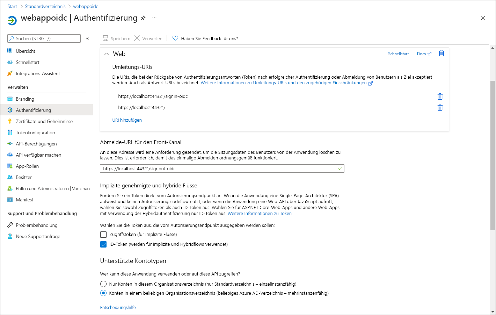

---
lab:
  az204Title: 'Lab 06: Authenticate by using OpenID Connect, MSAL, and .NET SDKs'
  az020Title: 'Lab 06: Authenticate by using OpenID Connect, MSAL, and .NET SDKs'
  az204Module: 'Module 06: Implement user authentication and authorization'
  az020Module: 'Module 06: Implement user authentication and authorization'
ms.openlocfilehash: f782f0fd1729d127304116d81bb5127146c6c4b6
ms.sourcegitcommit: 5590526b3505e9223f15033e1c90cf8007682dfd
ms.translationtype: HT
ms.contentlocale: de-DE
ms.lasthandoff: 07/01/2022
ms.locfileid: "146782576"
---
# <a name="lab-06-authenticate-by-using-openid-connect-msal-and-net-sdks"></a>Lab 06: Authentifizieren mit OpenID Connect, MSAL und .NET SDKs

## <a name="microsoft-azure-user-interface"></a>Microsoft Azure-Benutzeroberfläche

Aufgrund der dynamischen Natur der Microsoft-Cloudtools kann es vorkommen, dass sich die Azure-Benutzeroberfläche nach der Entwicklung dieses Trainingsinhalts ändert. Daher sind die Lab-Anweisungen und Lab-Schritte möglicherweise nicht mehr zutreffend.

Microsoft aktualisiert diesen Trainingskurs, wenn die Community uns über die erforderlichen Änderungen informiert. Cloudupdates kommen jedoch häufig vor, sodass möglicherweise Änderungen an der Benutzeroberfläche auftreten, bevor diese Trainingsinhalte aktualisiert werden. **Wenn dies der Fall ist, stellen Sie sich auf die Veränderungen ein, und arbeiten Sie sie bei Bedarf in den Labs durch.**

## <a name="instructions"></a>Anweisungen

### <a name="before-you-start"></a>Vorbereitung

#### <a name="sign-in-to-the-lab-environment"></a>Anmelden bei der Laborumgebung

Melden Sie sich mit den folgenden Anmeldeinformationen bei Ihrer Windows 10-VM an:
    
-   Benutzername: **Admin**

-   Kennwort: **Pa55w.rd**

> **Hinweis**: Ihr Kursleiter stellt Anweisungen zum Herstellen einer Verbindung mit der virtuellen Laborumgebung zur Verfügung.

#### <a name="review-the-installed-applications"></a>Überprüfen der installierten Anwendungen

Suchen Sie auf ihrem Windows 10-Desktop nach der Taskleiste. Die Taskleiste enthält die Symbole für die Anwendungen, die Sie in diesem Lab verwenden, darunter:

-   Microsoft Edge

-   Visual Studio Code

## <a name="ensure-that-your-lab-environment-has-its-time-set-properly-no-delay-according-to-your-timezone"></a>Sicherstellen, dass in Ihrer Laborumgebung die richtige Uhrzeit eingestellt ist (keine Verzögerung, Zeitzone beachten)

>**Hinweis:** Wenn Sie eine zeitliche Verzögerung in Ihrer Laborumgebung feststellen, passen Sie die lokale Uhrzeit mithilfe des folgenden PowerShell-Befehls an, der den Zeitwert um 15 Minuten erhöht.

```powershell
  Set-Date -Adjust (New-TimeSpan -Minutes 15)
```

## <a name="architecture-diagram"></a>Architekturdiagramm


### <a name="exercise-1-configure-a-single-tenant-azure-ad-environment"></a>Übung 1: Konfigurieren einer Azure AD-Umgebung mit einzelnem Mandanten

#### <a name="task-1-open-the-azure-portal"></a>Aufgabe 1: Öffnen des Azure-Portals

1. Wählen Sie auf der Taskleiste das Symbol **Microsoft Edge** aus.

1. Navigieren Sie im geöffneten Browserfenster zum Azure-Portal ([portal.azure.com](https://portal.azure.com)), und melden Sie sich dann mit dem Konto an, das Sie für dieses Lab verwenden werden.

    > **Hinweis**: Wenn Sie sich zum ersten Mal am Azure-Portal anmelden, wird Ihnen eine Tour durch das Portal angeboten. Wählen Sie **Erste Schritte** aus, um die Tour zu überspringen und mit der Verwendung des Portals zu beginnen.

#### <a name="task-2-register-an-application-in-azure-ad"></a>Aufgabe 2: Registrieren einer Anwendung in Azure AD

1.  Verwenden Sie im Azure-Portal das Textfeld **Ressourcen, Dienste und Dokumente durchsuchen**, um nach **Azure Active Directory** zu suchen. Wählen Sie in der Ergebnisliste **Azure Active Directory** aus.

    > **Hinweis**: Dies leitet Ihre Browsersitzung zum Blatt des Azure AD-Mandanten (Azure Active Directory) um, das Ihrem Azure-Abonnement zugeordnet ist.

1.  Wählen Sie auf dem Blatt **Azure Active Directory** die Option **App-Registrierungen** im Abschnitt **Verwaltung** aus.

1.  Wählen Sie im Abschnitt **App-Registrierungen** die Option **+ Neue Registrierung** aus.

1.  Führen Sie im Abschnitt **Registrieren einer Anwendung** die folgenden Aktionen aus, und wählen Sie dann **Registrieren** aus:

    | Einstellung | Aktion |
    | --- | --- |
    | Textfeld **Name** | Geben Sie **webappoidc** ein. |
    | Liste **Unterstützte Kontotypen** | Wählen Sie **Nur Konten in diesem Organisationsverzeichnis (nur Standardverzeichnis – einzelner Mandant)** aus. |

    Der folgende Screenshot zeigt die konfigurierten Einstellungen im Abschnitt **Registrieren einer Anwendung**.

     

#### <a name="task-3-record-unique-identifiers"></a>Aufgabe 3: Aufzeichnen eindeutiger Bezeichner

1.  Wählen Sie auf dem **webappoidc**-Anwendungsregistrierungsblatt die Option **Übersicht** aus.

1.  Suchen Sie im Abschnitt **Übersicht** den Wert des Textfelds **Anwendungs-ID (Client)** und notieren Sie ihn. Sie verwenden diesen Wert später im Lab.

1.  Suchen Sie im Abschnitt **Übersicht** den Wert des Textfelds **Verzeichnis-ID (Mandant)** und notieren Sie ihn. Sie verwenden diesen Wert später im Lab.

#### <a name="task-4-configure-the-application-authentication-settings"></a>Aufgabe 4: Konfigurieren der Einstellungen für die Anwendungsauthentifizierung

1.  Wählen Sie auf dem **webappoidc**-Anwendungsregistrierungsblatt die Option **Authentifizierung** im Abschnitt **Verwaltung** aus.

1.  Führen Sie im Abschnitt **Authentifizierung** die folgenden Aktionen aus, und wählen Sie **Konfigurieren** aus:

    | Einstellung | Aktion |
    | --- | --- |
    | Abschnitt **Plattformkonfigurationen** | Wählen Sie **+ Plattform hinzufügen** aus. |
    | Blatt **Plattformen konfigurieren**  | Wählen Sie **Web** aus. |
    | Textfeld **Umleitungs-URIs** | Geben Sie `https://localhost:44321/` ein. |
    | Textfeld **URL für Front-Channel-Abmeldung**   | Geben Sie `https://localhost:44321/signout-oidc` ein. |
        
1. Zurück im Abschnitt **Plattformkonfigurationen**, wählen Sie **URI hinzufügen** aus, und geben Sie dann `https://localhost:44321/signin-oidc` ein.

1. Wählen Sie im Abschnitt **Implizite Genehmigung und Hybridflows** die Option **ID-Token (werden für implizite und Hybridflows verwendet)** aus. 

1. Wählen Sie **Speichern** aus.

    Der folgende Screenshot veranschaulicht die konfigurierten Einstellungen auf dem Blatt **Authentifizierung**.

     
       

#### <a name="task-5-create-an-azure-ad-user"></a>Aufgabe 5: Erstellen eines Azure AD-Benutzers

1.  Wählen Sie im Azure-Portal das Symbol **Cloud Shell** () aus, um eine neue PowerShell-Sitzung zu öffnen. Wenn Cloud Shell standardmäßig auf eine Bash-Sitzung festgelegt ist, wählen Sie **Bash** und dann im Dropdownmenü **PowerShell** aus.

    > **Hinweis**: Wenn Sie **Cloud Shell** zum ersten Mal starten, wählen Sie **PowerShell** aus, wenn Sie aufgefordert werden, **Bash** oder **PowerShell** auszuwählen. Wenn die Meldung **You have no storage mounted** (Es ist kein Speicher eingebunden) angezeigt wird, wählen Sie das Abonnement aus, das Sie in diesem Lab verwenden, und wählen Sie dann **Create storage** (Speicher erstellen) aus.

1.  Führen Sie im Fenster **Cloud Shell** den folgenden Befehl aus, um sich bei dem mit Ihrem Azure-Abonnement verbundenen Azure AD-Mandanten anzumelden:

    ```powershell
    Connect-AzureAD
    ```

1.  Führen Sie den folgenden Befehl aus, um den primären DNS-Domänennamen (Domain Name System) des Azure AD-Mandanten abzurufen und anzuzeigen:

    ```powershell
    $aadDomainName = ((Get-AzureAdTenantDetail).VerifiedDomains)[0].Name
    $aadDomainName
    ```

    > **Hinweis**: Notieren Sie sich den Wert des DNS-Domänennamens. Sie verwenden diesen Wert später im Lab.

1.  Führen Sie die folgenden Befehle aus, um Azure AD-Benutzer zu erstellen, die Sie zum Testen der Azure AD-Authentifizierung verwenden werden:

    ```powershell
    $passwordProfile = New-Object -TypeName Microsoft.Open.AzureAD.Model.PasswordProfile
    $passwordProfile.Password = 'Pa55w.rd1234'
    $passwordProfile.ForceChangePasswordNextLogin = $false
    New-AzureADUser -AccountEnabled $true -DisplayName 'aad_lab_user1' -PasswordProfile $passwordProfile -MailNickName 'aad_lab_user1' -UserPrincipalName "aad_lab_user1@$aadDomainName" 
    ```

1.  Führen Sie den folgenden Befehl aus, um den Benutzerprinzipalnamen (UPN) des neu erstellten Azure AD-Benutzers zu ermitteln:

    ```powershell
    (Get-AzureADUser -Filter "MailNickName eq 'aad_lab_user1'").UserPrincipalName
    ```

    > **Hinweis**: Notieren Sie sich den UPN. Sie verwenden diesen Wert später im Lab.

    > **Hinweis:** Alternativ können Sie den Benutzerprinzipalnamen (UPN) mithilfe des Azure-Portals abrufen. Wechseln Sie dazu zu Azure Active Directory, wählen Sie das Blatt „Benutzer“ aus, und suchen Sie, indem Sie die Benutzer-ID einfügen.
    > 


    > Hier ist der UPN hervorgehoben.
    > 


1.  Schließen Sie den Cloud Shell-Bereich.

#### <a name="review"></a>Überprüfung

In dieser Übung haben Sie eine Azure AD-Anwendung mit einzelnem Mandanten registriert und ein Azure AD-Benutzerkonto erstellt.

### <a name="exercise-2-create-a-single-tenant-aspnet-core-web-app"></a>Übung 2: Erstellen einer ASP.NET Core-Web-App mit einzelnem Mandanten

#### <a name="task-1-create-an-aspnet-core-web-app-project"></a>Aufgabe 1: Erstellen eines ASP.NET Core-Web-App-Projekts

1.  Starten Sie das **Windows-Terminal** auf dem Labcomputer.

1.  Führen Sie an der Eingabeaufforderung die folgenden Befehle aus, um das Arbeitsverzeichnis zu erstellen und auf **Allfiles (F):\\Allfiles\\Labs\\06\\Starter\\OIDCClient** festzulegen:

    ```powershell
    F:
    cd "F:\Allfiles\Labs\06\Starter\OIDCClient"
    ```

1.  Führen Sie die folgenden Befehle aus, um eine neue .NET Core-Web-App auf der Grundlage der MVC-Vorlage (Model View Controller) zu erstellen (ersetzen Sie die Platzhalter `<application_ID>`, `<tenant_ID>` und `<domain_Name>` durch die entsprechenden Werte, die Sie zuvor in diesem Lab aufgezeichnet haben):

    ```powershell
    dotnet new mvc --auth SingleOrg --client-id <application_ID> --tenant-id <tenant_ID> --domain <domain_Name>
    ```

1.  Starten Sie auf dem Lab-Computer Visual Studio Code.

1.  Klicken Sie im Menü **Datei** auf **Ordner öffnen**.

1.  Wechseln Sie im Fenster **Datei-Explorer** zu **Allfiles (F):\\Allfiles\\Labs\\06\\Starter\\OIDCClient**, und wählen Sie dann **Ordner auswählen** aus.

1.  Überprüfen Sie im Visual Studio Code-**Explorer**-Bereich die automatisch generierte Ordnerstruktur, die eine MVC-Web-App darstellt.

1.  Navigieren Sie zum Ordner **Eigenschaften**, öffnen Sie die Datei **launchSettings.json**, und übernehmen Sie die folgenden Änderungen:

    
    | `Section` | Eigenschaft  | Wert |
    | --- | --- | --- |
    | **iisSettings** | **sslPort** | **44321** |
    | **OIDCClient**  | **applicationUrl** | `https://localhost:44321` |

    > **Hinweis**: Die Portnummern müssen mit dem Wert übereinstimmen, den Sie bei der Erstellung der Azure AD-App-Registrierung angegeben haben.

1.  Speichern und schließen Sie die Datei.

1.  Wählen Sie im Visual Studio Code-**Explorer**-Bereich die Datei **OIDCClient.csproj** aus.

1.  Stellen Sie sicher, dass der Wert des `<TargetFramework>`-Elements auf **netcoreapp3.1** festgelegt ist.

    > **Hinweis:** Ab Schritt 12 bis Schritt 15 ändern wir **OIDCClient.csproj** durch Hinzufügen der zusätzlichen Pakete. In Schritt 16 finden Sie den vollständigen Konfigurationsausschnitt.

1.  Legen Sie die Version der NuGet-Pakete `Microsoft.AspNetCore.Authentication.JwtBearer` und `Microsoft.AspNetCore.Authentication.OpenIdConnect` auf **3.1.18** fest. 


1.  Legen Sie die Version der NuGet-Pakete `Microsoft.Identity.Web` und `Microsoft.Identity.Web.UI` auf **0.3.1-preview** fest.

1.  Entfernen Sie den Eintrag `<WebProject_DirectoryAccessLevelKey>0</WebProject_DirectoryAccessLevelKey>`.

1.  Entfernen Sie den Eintrag `<PackageReference Include="Microsoft.AspNetCore.Authentication.AzureAD.UI" Version="3.1.7" />`.

1.  Überprüfen Sie, ob der Inhalt der Datei **OIDCClient.csproj** der folgenden Auflistung entspricht (der Wert von `UserSecretsId` wird sich unterscheiden), und speichern Sie dann die Änderungen.

    ```csharp
    <Project Sdk="Microsoft.NET.Sdk.Web">
      <PropertyGroup>
        <TargetFramework>netcoreapp3.1</TargetFramework>
        <UserSecretsId>aspnet-OIDCClient-737DEB13-25D4-4C52-93C5-F485367E3C8C</UserSecretsId>
      </PropertyGroup>
      <ItemGroup>
        <PackageReference Include="Microsoft.AspNetCore.Authentication.JwtBearer" Version="3.1.18" NoWarn="NU1605" />
        <PackageReference Include="Microsoft.AspNetCore.Authentication.OpenIdConnect" Version="3.1.18" NoWarn="NU1605" />
        <PackageReference Include="Microsoft.Identity.Web" Version="0.3.1-preview" />
        <PackageReference Include="Microsoft.Identity.Web.UI" Version="0.3.1-preview" />
      </ItemGroup>
    </Project>
    ```

1.  Schließen Sie die Datei **OIDCClient.csproj**.

1.  Navigieren Sie zum Ordner **Views\Shared**, und öffnen Sie dann die Datei **_LoginPartial.cshtml**.

1.  Ersetzen Sie `AzureAD` durch `MicrosoftIdentity` in der folgenden Zeile:

    ```csharp
    <a class="nav-link text-dark" asp-area="AzureAD" asp-controller="Account" asp-action="SignOut">Sign out</a>`
    ```

1.  Ersetzen Sie `AzureAD` durch `MicrosoftIdentity` in der folgenden Zeile:

    ```csharp
    <a class="nav-link text-dark" asp-area="AzureAD" asp-controller="Account" asp-action="SignIn">Sign in</a>
    ```

1.  Speichern und schließen Sie die Datei.

1.  Öffnen Sie die Datei **appsettings.json**, und überprüfen Sie den Inhalt des **AzureAd**-Objekts, einschließlich der folgenden Elemente:

    | Element | Wert |
    | --- | --- |
    | `Instance` | `https://login.microsoftonline.com/` |
    | `Domain` | Primäre DNS-Domäne des Azure AD-Mandanten, der Ihrem Azure-Abonnement zugeordnet ist. |
    | `TenantId` | GUID des Azure AD-Mandanten. |
    | `ClientId` | Anwendungs-ID (Client) der Anwendung, die Sie im Azure AD-Mandanten registriert haben. |
    | `CallbackPath` | `/signin-oidc` |

1.  Schließen Sie die Datei, ohne Änderungen vorzunehmen.

1.  Wählen Sie im Visual Studio Code-**Explorer**-Bereich die Datei **Startup.cs** aus.

1.  Entfernen Sie die `using Microsoft.AspNetCore.Authentication.AzureAD.UI;`-Anweisung:

1.  Fügen Sie die folgenden **using**-Anweisungen direkt nach dem Eintrag ein, den Sie im vorherigen Schritt entfernt haben:

    ```csharp
    using Microsoft.AspNetCore.Authentication.OpenIdConnect;
    using Microsoft.Identity.Web;
    using Microsoft.Identity.Web.UI;
    ```

1.  Entfernen Sie die folgenden Zeilen aus der Methode **ConfigureServices**:

    ```csharp
    services.AddAuthentication(AzureADDefaults.AuthenticationScheme)
      .AddAzureAD(options => Configuration.Bind("AzureAd", options));
    ```

1.  Ersetzen Sie die Zeilen, die Sie im letzten Schritt aus der Methode **ConfigureServices** entfernt haben, durch die folgenden Zeilen:

    ```csharp
    services.AddAuthentication(OpenIdConnectDefaults.AuthenticationScheme)
      .AddMicrosoftIdentityWebApp(Configuration.GetSection("AzureAd"));
    ```

1.  Entfernen Sie die folgende Zeile aus der Methode **ConfigureServices**:

    ```csharp
    services.AddRazorPages();
    ```

1.  Ersetzen Sie die Zeile, die Sie im letzten Schritt aus der Methode **ConfigureServices** entfernt haben, durch die folgende Zeile:

    ```csharp
    services.AddRazorPages()
      .AddMicrosoftIdentityUI();
    ```

1.  Speichern und schließen Sie die Datei.

### <a name="task-2-test-the-single-tenant-web-app-in-a-single-tenant-scenario"></a>Aufgabe 2: Testen der Web-App mit einzelnem Mandanten in einem Einzelmandantenszenario

1.  Aktivieren Sie im **Visual Studio Code**-Fenster das Kontextmenü für den **Explorer**-Bereich, und wählen Sie dann **Im integrierten Terminal öffnen** aus.

1.  Führen Sie den folgenden Befehl aus, um die .NET-Web-App zu erstellen:

    ```
    dotnet build
    ```

    > **Hinweis**: Wenn Buildfehler auftreten, überprüfen Sie die Dateien im Ordner **Allfiles (F):\\Allfiles\\Labs\\06\\Solution\\OIDCClient**.

1.  Führen Sie den folgenden Befehl aus, um ein selbstsigniertes Zertifikat zu generieren und den lokalen Computer so zu konfigurieren, dass er diesem Zertifikat vertraut:

    ```
    dotnet dev-certs https --trust
    ```

1.  Wenn Sie aufgefordert werden, das automatisch generierte Zertifikat zu installieren, wählen Sie **Ja** aus.

1.  Führen Sie an der Terminaleingabeaufforderung den folgenden Befehl aus, um die .NET-Web-App auszuführen:

    ```
    dotnet run
    ```

1.  Starten Sie den Microsoft Edge-Browser im Modus **InPrivate**, und navigieren Sie dann zur URL `https://localhost:44321`.

1.  Wenn Sie die Meldung **Ihre Verbindung ist nicht privat** erhalten, wählen Sie **Erweitert** und dann den Link **Weiter zu localhost (unsicher)** aus.

1.  Wenn Sie im geöffneten Browserfenster dazu aufgefordert werden, authentifizieren Sie sich mit dem UPN des Azure AD-Kontos **aad_lab_user1**, das Sie zuvor in diesem Lab erstellt haben, mit **Pa55w.rd1234** als Kennwort.

    > **Hinweis**: Wenn Sie im Fenster **Helfen Sie uns, Ihr Konto zu schützen.** zur Eingabe aufgefordert werden, wählen Sie **Vorerst überspringen** aus.

1.  Das Browserfenster öffnet automatisch die Webseite **Berechtigungen erforderlich**.

1.  Überprüfen Sie die angeforderten Berechtigungen, darunter **Ihr grundlegendes Profil anzeigen** und **Zugriff auf Daten beibehalten, für die Sie der App Zugriff erteilt haben**.

1.  Wählen Sie **Akzeptieren** aus.

1.  Überprüfen Sie die vom Browser angezeigte **Homepage** der Zielwebsite und stellen Sie sicher, dass der UPN des Azure AD-Kontos **aad_user1** im Browserfenster angezeigt wird.

1.  Wählen Sie auf der **Homepage** die Option **Abmelden** aus.

1.  Wenn Sie aufgefordert werden, das Konto für die Abmeldung auszuwählen, wählen Sie das Azure AD-Konto **aad_lab_user1** aus. Sie werden automatisch zur Seite **Abgemeldet** weitergeleitet.

1.  Lassen Sie den Microsoft Edge-Browser geöffnet, in dem die Seite **Abgemeldet** angezeigt wird.

#### <a name="review"></a>Überprüfung 

In dieser Übung haben Sie eine Web-App für einen einzelnen Mandanten implementiert und in einer Azure-Umgebung mit einzelnem Mandanten getestet.

### <a name="exercise-3-configure-a-multitenant-azure-ad-environment"></a>Übung 3: Konfigurieren einer mehrinstanzenfähigen Azure AD-Umgebung

#### <a name="task-1-create-an-azure-ad-tenant"></a>Aufgabe 1: Erstellen eines Azure AD-Mandanten

1.  Wechseln Sie zum Microsoft Edge-Browser, der das Azure-Portal anzeigt.

1.  Navigieren Sie im Azure-Portal zum Blatt **Azure Active Directory**.

1.  Wählen Sie auf dem Blatt **Azure Active Directory** die Option **Mandanten verwalten** und dann die Option **+ Erstellen** aus.

1.  Stellen Sie auf dem Blatt **Mandant erstellen** auf der Registerkarte **Grundlagen** sicher, dass die Option **Azure Active Directory** ausgewählt ist, und wählen Sie dann **Weiter: Konfiguration >** aus.

1.  Geben Sie auf der Registerkarte **Konfiguration** des Blatts **Mandant erstellen** die folgenden Einstellungen an:

    | Einstellung | Wert |
    | --- | --- |
    | Name der Organisation | **Contoso** |
    | Name der Anfangsdomäne | Einen beliebigen gültigen DNS-Namen, der aus Kleinbuchstaben und Ziffern besteht und mit einem Buchstaben beginnt. |
    | Land/Region | Den Namen Ihres Landes oder Ihrer Region. |

1.  Klicken Sie auf **Überprüfen und erstellen** und dann auf **Erstellen**.

1.  Wenn Sie dazu aufgefordert werden, geben Sie auf der Seite **Helfen Sie uns zu beweisen, dass Sie kein Roboter sind** den bereitgestellten Code ein, und wählen Sie dann **Senden** aus.

1.  Warten Sie, bis die Bereitstellung abgeschlossen ist, und wählen Sie dann den Link **Contoso** aus, um zum Blatt mit den Eigenschaften des Contoso Azure AD-Mandanten zu navigieren.

1.  Identifizieren Sie auf dem Blatt **Übersicht** des Azure AD-Mandanten den Wert der Eigenschaft **Mandanten-ID**, und notieren Sie ihn. Sie verwenden diesen Wert später im Lab.

#### <a name="task-2-create-an-azure-ad-user"></a>Aufgabe 2: Erstellen eines Azure AD-Benutzers

1.  Wählen Sie im Webbrowserfenster, in dem das Azure-Portal angezeigt wird, die Symbolleiste **Verzeichnisse + Abonnements** aus.

1.  Wählen Sie auf dem Blatt **Portaleinstellungen | Verzeichnisse + Abonnements** die Option **Wechseln** neben dem Eintrag aus, der den Ihrem Abonnement zugeordneten Azure AD-Mandanten darstellt.

1.  Wählen Sie im Azure-Portal das **Cloud Shell**-Symbol aus, um eine neue PowerShell-Sitzung zu öffnen. 

1.  Führen Sie im Bereich **Cloud Shell** den folgenden Befehl aus, um sich bei dem Contoso Azure AD-Mandanten anzumelden. Ersetzen Sie den Platzhalter `<tenant_Id>` durch den Wert der Mandanten-ID-Eigenschaft, die Sie in der vorherigen Aufgabe ermittelt haben:

    ```powershell
    Import-Module AzureAD.Standard.Preview
    AzureAD.Standard.Preview\Connect-AzureAD -TenantID '<tenant_ID>'
    ```

1.  Klicken Sie bei gedrückter „STRG“-Taste auf die WARNUNG, um ein Browserfenster zu öffnen, und befolgen Sie die Schritte zur Authentifizierung.  

1.  Führen Sie den folgenden Befehl aus, um den DNS-Domänennamen des Azure AD-Mandanten abzurufen:

    ```powershell
    $aadDomainName = ((Get-AzureAdTenantDetail).VerifiedDomains)[0].Name
    ```

1.  Führen Sie die folgenden Befehle aus, um Azure AD-Benutzer zu erstellen, die Sie zum Testen der Azure AD-Authentifizierung verwenden werden:

    ```powershell
    $passwordProfile = New-Object -TypeName Microsoft.Open.AzureAD.Model.PasswordProfile
    $passwordProfile.Password = 'Pa55w.rd1234'
    $passwordProfile.ForceChangePasswordNextLogin = $false
    New-AzureADUser -AccountEnabled $true -DisplayName 'aad_lab_user2' -PasswordProfile $passwordProfile -MailNickName 'aad_lab_user2' -UserPrincipalName "aad_lab_user2@$aadDomainName"
    ```

1.  Führen Sie den folgenden Befehl aus, um den Benutzerprinzipalnamen (UPN) des neu erstellten Azure AD-Benutzers zu ermitteln:

    ```powershell
    (Get-AzureADUser -Filter "MailNickName eq 'aad_lab_user2'").UserPrincipalName
    ```

    > **Hinweis**: Notieren Sie sich den UPN. Sie verwenden diesen Wert später im Lab.
 
1.  Schließen Sie den **Cloud Shell**-Bereich.

#### <a name="task-3-test-the-single-tenant-web-app-in-a-multitenant-scenario"></a>Aufgabe 3: Testen der Web-App mit einzelnem Mandanten in einem mehrinstanzenfähigen Szenario

1.  Wechseln Sie zurück zum Microsoft Edge-Browser, im Modus **InPrivate**, der die Seite **Abgemeldet** anzeigt, und wählen Sie dann **Anmelden** aus.

1.  Wenn Sie im geöffneten Browserfenster dazu aufgefordert werden, authentifizieren Sie sich mit dem UPN des Azure AD-Kontos **aad_lab_user2**, das Sie zuvor in dieser Übung erstellt haben, mit **Pa55w.rd1234** als Kennwort.

1.  Beachten Sie die Fehlermeldung, die besagt, dass das von Ihnen verwendete Benutzerkonto nicht in dem Mandanten existiert, in dem die Web-App **webappoidc** registriert ist.

    > **Hinweis**: Damit die Anmeldung in diesem Szenario funktioniert, müssen Sie dieses Konto zunächst als externen Benutzer zu dem Mandanten hinzufügen, der die Registrierung der Web-App „webappoidc“ hostet.

1.  Schließen Sie den Microsoft Edge-Browser, in dem die Fehlermeldung angezeigt wird, und wechseln Sie dann zurück zum Fenster **Visual Studio Code**.

1.  Wählen Sie im Bereich **Terminal** die Option **Terminal beenden** (das Symbol **Papierkorb**) aus, um das aktuell geöffnete Terminal und alle zugeordneten Prozesse zu schließen.

#### <a name="review"></a>Überprüfung

In dieser Übung haben Sie eine mehrinstanzenfähige Azure-Umgebung konfiguriert und sie mit einer Web-App mit einem einzelnen Mandanten getestet.

### <a name="exercise-4-configure-a-multitenant-aspnet-core-web-app"></a>Übung 4: Konfigurieren einer mehrinstanzenfähigen ASP.NET Core-Web-App

#### <a name="task-1-configure-the-application-registration-in-azure-ad"></a>Aufgabe 1: Konfigurieren der Anwendungsregistrierung in Azure AD

1.  Wechseln Sie zum Azure-Portal, und wählen Sie dann das Symbolleistensymbol für **Verzeichnisse + Abonnements** aus.

1.  Wählen Sie auf dem Blatt **Portaleinstellungen | Verzeichnisse + Abonnements** die Option **Wechseln** neben dem Eintrag aus, der den Ihrem Abonnement zugeordneten Azure AD-Mandanten darstellt.

1.  Wählen Sie auf dem Blatt **Azure Active Directory** die Option **App-Registrierungen** im Abschnitt **Verwaltung** aus.

1.  Wählen Sie in der Liste der App-Registrierungen **webappoidc** aus.

1.  Wählen Sie auf dem **webappoidc**-Anwendungsregistrierungsblatt die Option **Authentifizierung** im Abschnitt **Verwaltung** aus.

1.  Wählen Sie im Abschnitt **Unterstützte Kontotypen** die Option **Konten in einem beliebigen Organisationsverzeichnis (Beliebiges Azure AD-Verzeichnis – mehrinstanzenfähig)** aus.

1.  Wählen Sie **Speichern** aus.

    Der folgende Screenshot veranschaulicht die konfigurierten Einstellungen auf dem Blatt **App-Registrierung**.
          
     

    
#### <a name="task-2-configure-multi-tenancy-support-of-the-aspnet-core-web-app"></a>Aufgabe 2: Konfigurieren der Unterstützung der Mehrinstanzenfähigkeit der ASP.NET Core-Web-App

1.  Starten Sie auf dem Lab-Computer Visual Studio Code.

1.  Öffnen Sie die Datei **appsettings.json**.

1.  Ersetzen Sie die Zeile mit dem Element `TenantId` durch die folgende Zeile:

    ```
    "TenantId": "organizations", 
    ```

1.  Speichern und schließen Sie die Datei.

### <a name="task-3-test-the-multitenant-web-app-in-a-multitenant-scenario"></a>Aufgabe 3: Testen der mehrinstanzenfähigen Web-App in einem mehrinstanzenfähigen Szenario

1.  Aktivieren Sie im **Visual Studio Code**-Fenster das Kontextmenü für den **Explorer**-Bereich, und wählen Sie dann **Im integrierten Terminal öffnen** aus.

1.  Führen Sie an der Terminaleingabeaufforderung den folgenden Befehl aus, um die .NET-Web-App auszuführen:

    ```
    dotnet run
    ```

1.  Starten Sie den Microsoft Edge-Browser im Modus **InPrivate**, und navigieren Sie dann zur URL `https://localhost:44321`.

1.  Wenn Sie die Meldung **Ihre Verbindung ist nicht privat** erhalten, wählen Sie **Erweitert** und dann den Link **Weiter zu localhost (unsicher)** aus.

1.  Wenn Sie im geöffneten Browserfenster dazu aufgefordert werden, authentifizieren Sie sich mit dem UPN des Azure AD-Kontos **aad_lab_user1**, das Sie zuvor in diesem Lab erstellt haben, mit **Pa55w.rd1234** als Kennwort.

1.  Überprüfen Sie die vom Browser angezeigte **Homepage** der Zielwebsite und stellen Sie dann sicher, dass der UPN des Azure AD-Kontos **aad_lab_user1** im Browserfenster angezeigt wird.

1.  Wählen Sie auf der **Homepage** die Option **Abmelden** aus.

1.  Wenn Sie aufgefordert werden, das Konto für die Abmeldung auszuwählen, wählen Sie das Azure AD-Konto **aad_lab_user1** aus. Sie werden automatisch zur Seite **Abgemeldet** weitergeleitet.

1.  Wählen Sie im Microsoft Edge-Browser, der die Seite **Abgemeldet** anzeigt, die Option **Anmelden** aus.

1.  Wenn Sie im geöffneten Browserfenster dazu aufgefordert werden, authentifizieren Sie sich mit dem UPN des Azure AD-Kontos **aad_lab_user2**, das Sie zuvor in dieser Übung erstellt haben, mit **Pa55w.rd1234** als Kennwort.

1.  Das Browserfenster öffnet automatisch die Webseite **Berechtigungen erforderlich**.

1.  Überprüfen Sie die angeforderten Berechtigungen, darunter **Ihr grundlegendes Profil anzeigen** und **Zugriff auf Daten beibehalten, für die Sie der App Zugriff erteilt haben**.

1.  Wählen Sie **Akzeptieren** aus.

    > **Hinweis**: Die Anwendung wird als ungeprüft aufgeführt. Das ist zu erwarten, denn die Beispielanwendung, die Sie in diesem Lab verwenden, wurde noch nicht vom Herausgeber überprüft. Weitere Informationen finden Sie in der Microsoft-Dokumentation zur [Herausgeberüberprüfung](https://docs.microsoft.com/en-us/azure/active-directory/develop/publisher-verification-overview).

1.  Überprüfen Sie die vom Browser angezeigte **Homepage** der Zielwebsite und stellen Sie dann sicher, dass der UPN des Azure AD-Kontos **aad_lab_user2** im Browserfenster angezeigt wird.

1.  Wählen Sie auf der **Homepage** die Option **Abmelden** aus.

1.  Schließen Sie den Microsoft Edge-Browser im Modus **InPrivate**, und wechseln Sie dann zurück zum Fenster **Visual Studio Code**.

1.  Wählen Sie im Bereich **Terminal** die Option **Terminal beenden** (das Symbol **Papierkorb**) aus, um das aktuell geöffnete Terminal und alle zugeordneten Prozesse zu schließen.

#### <a name="review"></a>Überprüfung

In dieser Übung haben Sie eine mehrinstanzenfähige Web-App implementiert und in einer mehrinstanzenfähigen Azure-Umgebung getestet.

### <a name="exercise-5-clean-up-your-subscription"></a>Übung 5: Bereinigen Ihres Abonnements

#### <a name="task-1-delete-the-application-registration-in-azure-ad"></a>Aufgabe 1: Löschen der Anwendungsregistrierung in Azure AD

1.  Wechseln Sie zum Microsoft Edge-Browser, der das Azure-Portal anzeigt.

1.  Navigieren Sie im Azure-Portal zum Blatt des Contoso Azure AD-Mandanten. Daraufhin wird das Blatt **Contoso \| Übersicht** angezeigt.

1.  Wählen Sie auf dem Blatt **Azure Active Directory** die Option **Unternehmensanwendungen** im Abschnitt **Verwalten** aus.

1.  Auf dem Blatt **Unternehmensanwendungen \| Alle Anwendungen** wählen Sie **webappoidc** aus.

1.  Auf dem Blatt **webappoidc \| Übersicht** wählen Sie **Eigenschaften** aus.

1.  Auf dem Blatt **webappoidc \| Eigenschaften** wählen Sie **Löschen** und nach einer Aufforderung zur Bestätigung die Option **Ja** aus.

1.  Navigieren Sie zum Blatt **Benutzer \| Alle Benutzer (Vorschau)** des Contoso Azure AD-Mandanten.

1.  Wählen Sie in der Liste der Benutzer **aad_lab_user2** aus.

1.  Auf dem Blatt **aad_lab_user2 \| Profil** wählen Sie **Löschen** und anschließend **Ja** aus, wenn Sie eine Aufforderung zur Bestätigung erhalten.

1.  Navigieren Sie zurück zum Blatt **Contoso \| Übersicht**, und wählen Sie dann **Mandanten verwalten** aus.

1.  Aktivieren Sie in der Liste der Mandanten das Kontrollkästchen neben dem Eintrag **Contoso (Standard)** , und wählen Sie dann **Löschen** aus.

1.  Auf dem Blatt **Delete tenant 'Contoso'?** (Mandanten „Contoso“ löschen?) wählen Sie **Löschen** aus.

1.  Wählen Sie ggf. **Get permission to delete Azure resource** (Berechtigung zum Löschen von Azure-Ressource abrufen), auf dem Blatt **Eigenschaften** des Azure AD-Mandanten aus. Für **Access management for Azure resources** (Zugriffsverwaltung für Azure-Ressourcen), wählen Sie **Ja** und dann **Speichern** aus.

1.  Navigieren Sie wieder zum Blatt **Delete tenant 'Contoso'?** (Mandanten „Contoso“ löschen?), aktualisieren Sie die Browserseite, wählen Sie **Löschen** und dann **Ja** aus, um dies zu bestätigen.

1.  Navigieren Sie im Azure-Portal zurück zum Blatt des Azure AD-Mandanten, der Ihrem Azure-Abonnement zugeordnet ist.

1.  Wählen Sie auf dem Blatt **Azure Active Directory** die Option **App-Registrierungen** im Abschnitt **Verwaltung** aus.

1.  Wählen Sie im Abschnitt **Anwendungsregistrierungen** die Azure AD-Anwendungsregistrierung **webappoidc** aus, die Sie zuvor in dieser Übung erstellt haben.

1.  Führen Sie im Abschnitt **webappoidc** die folgenden Aktionen durch:

    a. Klicken Sie auf **Löschen**.

    b. Wählen Sie auf dem Blatt **App-Registrierung löschen** die Option **Mir ist bewusst, welche Auswirkungen das Löschen dieser App-Registrierung hat** und dann **Löschen** aus.

1.  Navigieren Sie zum Blatt **Benutzer \| Alle Benutzer (Vorschau)** .

1.  Wählen Sie in der Liste der Benutzer **aad_lab_user1** aus.

1.  Auf dem Blatt **aad_lab_user1 \| Profil** wählen Sie **Löschen** und anschließend **Ja** aus, wenn Sie eine Aufforderung zur Bestätigung erhalten.

#### <a name="task-2-close-the-active-applications"></a>Aufgabe 2: Schließen der aktiven Anwendungen

1.  Schließen Sie alle geöffneten Microsoft Edge-Fenster.

1.  Schließen Sie Visual Studio Code.

#### <a name="review"></a>Überprüfung

In dieser Übung haben Sie Ihr Abonnement bereinigt, indem Sie die in diesem Lab verwendete Anwendungsregistrierung entfernt haben.
