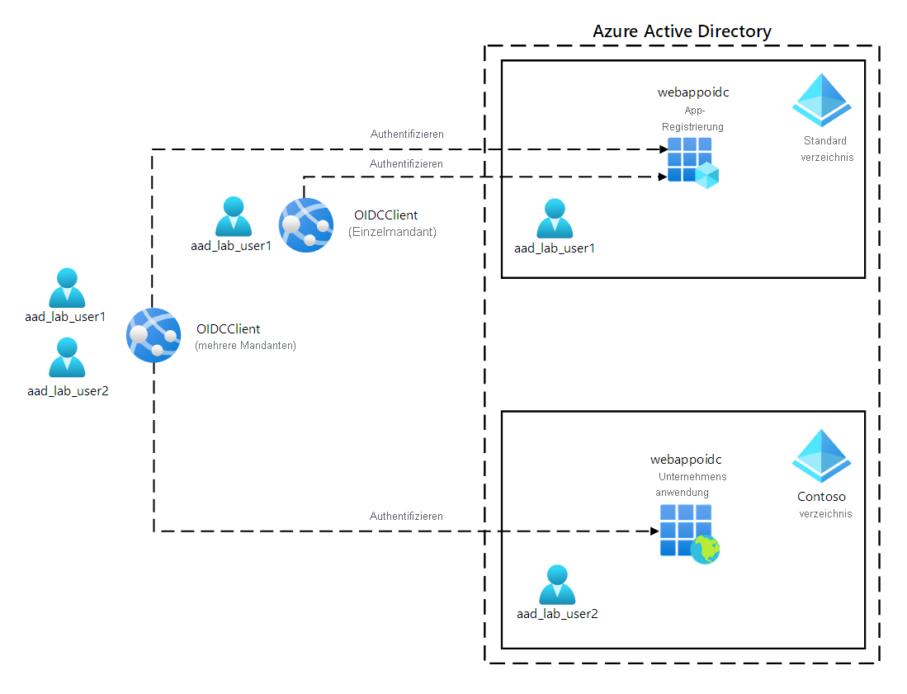
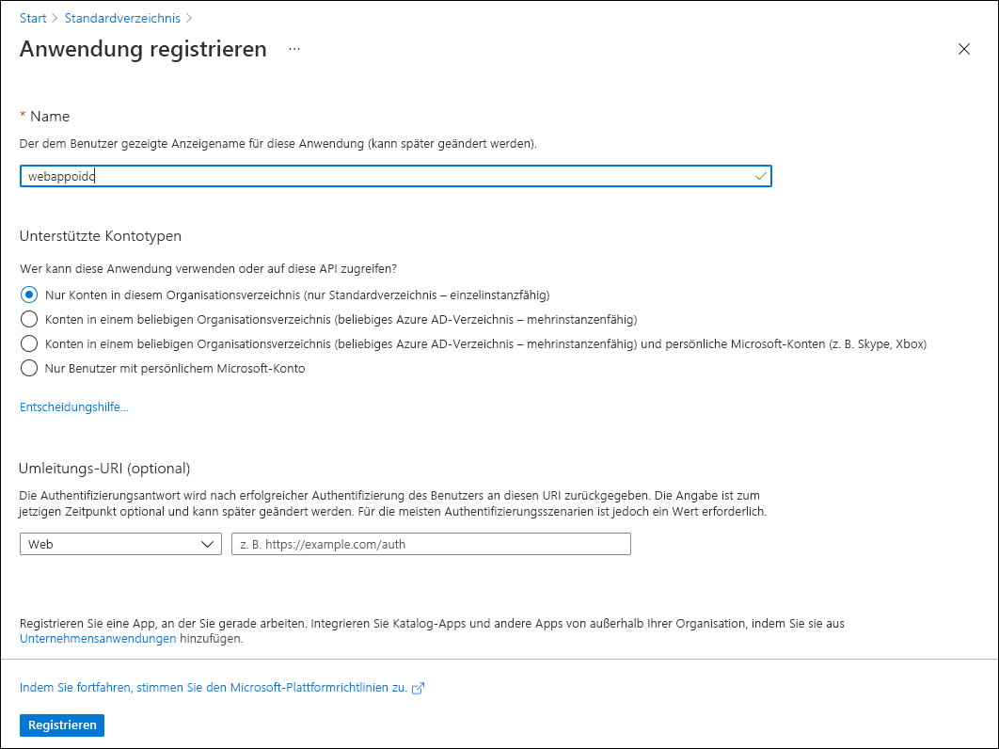
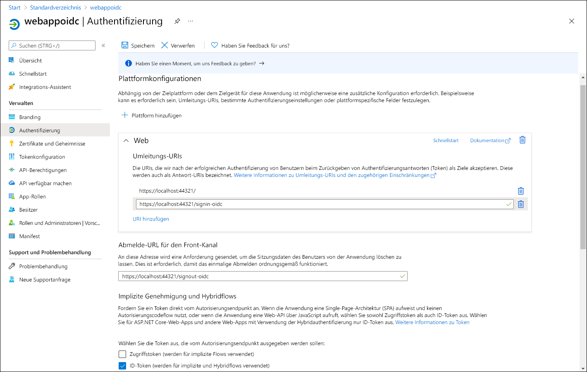

---
lab:
  az204Title: 'Lab 06: Authenticate by using OpenID Connect, MSAL, and .NET SDKs'
  az204Module: 'Learning Path 06: Implement user authentication and authorization'
---

# Lab 06: Authentifizieren mit OpenID Connect, MSAL und .NET SDKs

## Microsoft Azure-Benutzeroberfläche

Aufgrund der dynamischen Natur der Microsoft-Cloudtools kann es vorkommen, dass sich die Azure-Benutzeroberfläche nach der Entwicklung dieses Trainingsinhalts ändert. Daher sind die Lab-Anweisungen und Lab-Schritte möglicherweise nicht mehr zutreffend.

Microsoft aktualisiert diesen Trainingskurs, wenn die Community uns über die erforderlichen Änderungen informiert. Cloudupdates kommen jedoch häufig vor, sodass möglicherweise Änderungen an der Benutzeroberfläche auftreten, bevor diese Trainingsinhalte aktualisiert werden. **Wenn dies der Fall ist, stellen Sie sich auf die Veränderungen ein, und arbeiten Sie sie bei Bedarf in den Labs durch.**

## Anweisungen

### Vorbereitung

#### Anmelden bei der Laborumgebung

Melden Sie sich mithilfe der folgenden Anmeldeinformationen bei Ihrer Windows 10-VM an:

- Benutzername: `Admin`
- Kennwort: `Pa55w.rd`

> **Hinweis**: Ihr Kursleiter stellt Anweisungen zum Herstellen einer Verbindung mit der virtuellen Laborumgebung zur Verfügung.

#### Überprüfen der installierten Anwendungen

Suchen Sie auf ihrem Windows 10-Desktop nach der Taskleiste. Die Taskleiste enthält die Symbole für die Anwendungen, die Sie in diesem Lab verwenden, darunter:
    
-   Microsoft Edge
-   Visual Studio Code

## Übungsszenario

In diesem Lab registrieren Sie eine Anwendung in Microsoft Entra ID, fügen eine*n Benutzer*in hinzu und testen dann den Zugriff des Benutzers bzw. der Benutzerin auf die Anwendung, um zu überprüfen, ob Entra ID den Zugriff schützen kann. Sie verwenden auch das Graph-Tester-Tool, um Anforderungen für die Graph-API für ein Entra ID-Benutzerkonto zu erstellen und zu testen.

## Architekturdiagramm



### Übung 1: Konfigurieren einer Microsoft Entra-Umgebung mit einem Mandanten

#### Aufgabe 1: Öffnen des Azure-Portals

1. Wählen Sie auf der Taskleiste das Symbol **Microsoft Edge** aus.

1. Navigieren Sie im geöffneten Browserfenster zum Azure-Portal unter `https://portal.azure.com`, und melden Sie sich dann mit dem Konto an, das Sie für dieses Lab verwenden werden.

    > **Hinweis**: Wenn Sie sich zum ersten Mal am Azure-Portal anmelden, wird Ihnen eine Tour durch das Portal angeboten. Wählen Sie **Erste Schritte** aus, um die Tour zu überspringen und mit der Verwendung des Portals zu beginnen.

#### Aufgabe 2: Registrieren einer Anwendung im Entra ID-Verzeichnis

1. Verwenden Sie im Azure-Portal das Textfeld **Ressourcen, Dienste und Dokumente durchsuchen**, um nach **Microsoft Entra ID** zu suchen, und wählen Sie in der Ergebnisliste **Microsoft Entra ID** aus.

    > **Hinweis**: Dies leitet Ihre Browsersitzung zum Blatt des Microsoft Entra ID-Mandanten um, das Ihrem Azure-Abonnement zugeordnet ist.

1. Wählen Sie auf dem Blatt **Microsoft Entra ID** im Abschnitt **Verwalten** die Option **App-Registrierungen** aus.

1. Wählen Sie im Abschnitt **App-Registrierungen** die Option **+ Neue Registrierung** aus.

1. Führen Sie im Abschnitt **Registrieren einer Anwendung** die folgenden Aktionen aus, und wählen Sie dann **Registrieren** aus:
    
    | Einstellung | Aktion |
    | -- | -- |
    | Textfeld **Name** | Geben Sie **webappoidc** ein. |
    | Liste **Unterstützte Kontotypen** | Wählen Sie **Nur Konten in diesem Organisationsverzeichnis (nur Standardverzeichnis – einzelner Mandant)** aus. |

    > **Hinweis**: Der Name des Mandanten kann je nach Ihrem Azure-Abonnement anders lauten.
   
    Der folgende Screenshot zeigt die konfigurierten Einstellungen im Abschnitt **Registrieren einer Anwendung**.
          
     
      
    
#### Aufgabe 3: Aufzeichnen eindeutiger Bezeichner

1. Wählen Sie auf dem **webappoidc**-Anwendungsregistrierungsblatt die Option **Übersicht** aus.

1. Suchen Sie im Abschnitt **Übersicht** den Wert des Textfelds **Anwendungs-ID (Client)** und notieren Sie ihn. Sie verwenden diesen Wert später im Lab.

1. Suchen Sie im Abschnitt **Übersicht** den Wert des Textfelds **Verzeichnis-ID (Mandant)** und notieren Sie ihn. Sie verwenden diesen Wert später im Lab.

#### Aufgabe 4: Konfigurieren der Einstellungen für die Anwendungsauthentifizierung

1. Wählen Sie auf dem **webappoidc**-Anwendungsregistrierungsblatt die Option **Authentifizierung** im Abschnitt **Verwaltung** aus.

1. Führen Sie im Abschnitt **Authentifizierung** die folgenden Aktionen aus, und wählen Sie **Konfigurieren** aus:

    | Einstellung | Aktion |
    | -- | -- |
    | Abschnitt **Plattformkonfigurationen** | Wählen Sie **+ Plattform hinzufügen** aus. |
    | Blatt **Plattformen konfigurieren** | Wählen Sie **Web** aus. |
    | Textfeld **Umleitungs-URIs** | Geben Sie `https://localhost:5001/` ein. |
    | Textfeld **URL für Front-Channel-Abmeldung** | Geben Sie `https://localhost:5001/signout-oidc` ein. |
        
1. Zurück im Abschnitt **Plattformkonfigurationen**, wählen Sie **URI hinzufügen** aus, und geben Sie dann `https://localhost:5001/signin-oidc` ein.

1. Wählen Sie im Abschnitt **Implizite Genehmigung und Hybridflows** die Option **ID-Token (werden für implizite und Hybridflows verwendet)** aus. 

1. Wählen Sie **Speichern** aus.

    Der folgende Screenshot veranschaulicht die konfigurierten Einstellungen auf dem Blatt **Authentifizierung**.
          
     
       

#### Aufgabe 5: Erstellen eines Azure AD-Benutzers

1. Wählen Sie im Azure-Portal das Symbol **Cloud Shell** () aus, um eine neue PowerShell-Sitzung zu öffnen. Wenn Cloud Shell standardmäßig auf eine Bash-Sitzung festgelegt ist, wählen Sie **Bash** und dann im Dropdownmenü **PowerShell** aus.

     > **Hinweis**: Wenn Sie **Cloud Shell** zum ersten Mal starten, wählen Sie **PowerShell** aus, wenn Sie aufgefordert werden, **Bash** oder **PowerShell** auszuwählen. Wenn die Meldung **You have no storage mounted** (Es ist kein Speicher eingebunden) angezeigt wird, wählen Sie das Abonnement aus, das Sie in diesem Lab verwenden, und wählen Sie dann **Create storage** (Speicher erstellen) aus.

1. Führen Sie im Fenster **Cloud Shell** den folgenden Befehl aus, um sich bei dem mit Ihrem Azure-Abonnement verbundenen Azure AD-Mandanten anzumelden:

    ```powershell
    Connect-AzureAD
    ```

1. Führen Sie den folgenden Befehl aus, um den primären DNS-Domänennamen (Domain Name System) des Azure AD-Mandanten abzurufen und anzuzeigen:

    ```powershell
    $aadDomainName = ((Get-AzureAdTenantDetail).VerifiedDomains)[0].Name
    $aadDomainName
    ```

    > **Hinweis**: Notieren Sie sich den Wert des DNS-Domänennamens. Sie verwenden diesen Wert später im Lab.

1. Führen Sie die folgenden Befehle aus, um Azure AD-Benutzer zu erstellen, die Sie zum Testen der Azure AD-Authentifizierung verwenden werden:

    ```powershell
    $passwordProfile = New-Object -TypeName Microsoft.Open.AzureAD.Model.PasswordProfile
    $passwordProfile.Password = 'Pa55w.rd1234'
    $passwordProfile.ForceChangePasswordNextLogin = $false
    New-AzureADUser -AccountEnabled $true -DisplayName 'aad_lab_user1' -PasswordProfile $passwordProfile -MailNickName 'aad_lab_user1' -UserPrincipalName "aad_lab_user1@$aadDomainName" 
    ```

1. Führen Sie den folgenden Befehl aus, um den Benutzerprinzipalnamen (UPN) des neu erstellten Azure AD-Benutzers zu ermitteln:

    ```powershell
    (Get-AzureADUser -Filter "MailNickName eq 'aad_lab_user1'").UserPrincipalName
    ```

    > **Hinweis**: Notieren Sie sich den UPN. Sie verwenden diesen Wert später im Lab.

1. Schließen Sie den Cloud Shell-Bereich.

#### Überprüfung

In dieser Übung haben Sie eine Azure AD-Anwendung mit einzelnem Mandanten registriert und ein Azure AD-Benutzerkonto erstellt.

### Übung 2: Erstellen einer ASP.NET-Web-App mit einem einzigen Mandanten

#### Aufgabe 1: Erstellen eines ASP.NET-Web-App-Projekts

1. Starten Sie auf dem Lab-Computer die **Eingabeaufforderung**.

1. Führen Sie an der Eingabeaufforderung die folgenden Befehle aus, um das aktuelle Verzeichnis zu erstellen und auf **Allfiles (F):\\Allfiles\\Labs\\06\\Starter\\OIDCClient** festzulegen:

    ```cmd
    F:
    cd F:\Allfiles\Labs\06\Starter\OIDCClient
    ```

1. Führen Sie die folgenden Befehle aus, um eine neue .NET Core-Web-App auf der Grundlage der MVC-Vorlage (Model View Controller) zu erstellen (ersetzen Sie die Platzhalter `<application_ID>`, `<tenant_ID>` und `<domain_Name>` durch die entsprechenden Werte, die Sie zuvor in diesem Lab aufgezeichnet haben):

    ```cmd
    dotnet new mvc --auth SingleOrg --client-id <application_ID> --tenant-id <tenant_ID> --domain <domain_Name>
    rmdir .\obj /S /Q
    ```
    
    > **Hinweis**: Wenn Sie einen Fehler im Terminal erhalten haben, ist es möglich, dass Sie PowerShell verwenden. In diesem Fall entfernen Sie die `/S /Q` Flags, und führen Sie den Befehl erneut aus.

1. Führen Sie den folgenden Befehl aus, um Visual Studio Code zu starten. 

    ```cmd
    code .
    ```
    > Wenn Sie gefragt werden: **Vertrauen Sie den Autoren aller Dateien in diesem Ordner?** , wählen Sie **Ja, ich vertraue den Autoren**.


1. Überprüfen Sie im Visual Studio Code-**Explorer**-Bereich die automatisch generierte Ordnerstruktur, die eine MVC-Web-App darstellt.

1. Navigieren Sie zum Ordner **Eigenschaften**, öffnen Sie die Datei **launchSettings.json**, und übernehmen Sie die folgenden Änderungen:

    
    | `Section` | Eigenschaft | Wert |
    | -- | -- | -- |
    | **iisSettings** | **sslPort** | **44321** |
    | **OIDCClient**  | **applicationUrl** | `https://localhost:5001` |
    

    > **Hinweis**: Die Portnummern müssen mit dem Wert übereinstimmen, den Sie bei der Erstellung der Azure AD-App-Registrierung angegeben haben.

1. Speichern und schließen Sie die Datei.

1. Wählen Sie im Visual Studio Code-**Explorer**-Bereich die Datei **OIDCClient.csproj** aus.

1. Stellen Sie sicher, dass der Wert des `<TargetFramework>`-Elements auf **net6.0** festgelegt ist.

1. Stellen Sie sicher, dass die Version der NuGet-Pakete `Microsoft.AspNetCore.Authentication.JwtBearer` und `Microsoft.AspNetCore.Authentication.OpenIdConnect` auf **6.0.9** festgelegt ist.

1. Legen Sie die Version der NuGet-Pakete `Microsoft.Identity.Web` und `Microsoft.Identity.Web.UI` auf **1.25.3** fest.

1. Überprüfen Sie, ob der Inhalt der Datei **OIDCClient.csproj** der folgenden Auflistung entspricht (der Wert von `UserSecretsId` wird sich unterscheiden), und speichern Sie dann die Änderungen.

    ```csharp
    <Project Sdk="Microsoft.NET.Sdk.Web">
      <PropertyGroup>
        <TargetFramework>net6.0</TargetFramework>
        <UserSecretsId>aspnet-OIDCClient-737DEB13-25D4-4C52-93C5-F485367E3C8C</UserSecretsId>
        <ImplicitUsings>enable</ImplicitUsings>
      </PropertyGroup>

      <ItemGroup>
        <PackageReference Include="Microsoft.AspNetCore.Authentication.JwtBearer" Version="6.0.9" NoWarn="NU1605" />
        <PackageReference Include="Microsoft.AspNetCore.Authentication.OpenIdConnect" Version="6.0.9" NoWarn="NU1605" />
        <PackageReference Include="Microsoft.Identity.Web" Version="1.25.3" />
        <PackageReference Include="Microsoft.Identity.Web.UI" Version="1.25.3" />
      </ItemGroup>
    </Project>
    ```

1. Schließen Sie die Datei **OIDCClient.csproj**.

1. Navigieren Sie zum Ordner **Views\Shared**, und öffnen Sie dann die Datei **_LoginPartial.cshtml**.

1. Vergewissern Sie sich, dass das `asp-area`-Attribut in jedem span-Element auf `MicrosoftIdentity` verweist, wie in der folgenden Zeile zu sehen:

    ```csharp
    <a class="nav-link text-dark" asp-area="MicrosoftIdentity" asp-controller="Account" asp-action="SignOut">Sign out</a>
    ```

1. Schließen Sie die Datei, ohne Änderungen vorzunehmen.

1. Öffnen Sie die Datei **appsettings.json**, und überprüfen Sie den Inhalt des **AzureAd**-Objekts, einschließlich der folgenden Elemente:

    | Element | Wert |
    | -- | -- |
    | `Instance` | `https://login.microsoftonline.com/`|
    | `Domain` | Primäre DNS-Domäne des Azure AD-Mandanten, der Ihrem Azure-Abonnement zugeordnet ist |
    | `TenantId` | GUID des Azure AD-Mandanten |
    | `ClientId` | Anwendungs-ID (Client) der Anwendung, die Sie im Azure AD-Mandanten registriert haben |
    | `CallbackPath` | `/signin-oidc` |

1. Schließen Sie die Datei, ohne Änderungen vorzunehmen.

1. Wählen Sie im **Explorer**-Bereich von Visual Studio Code die Datei **Program.cs** aus.

1. Stellen Sie sicher, dass die Datei die folgenden **using**-Anweisungen enthält:

    ```csharp
    using Microsoft.AspNetCore.Authentication.OpenIdConnect;
    using Microsoft.Identity.Web;
    using Microsoft.Identity.Web.UI;
    ```

1. Stellen Sie sicher, dass die Datei die folgenden Zeilen enthält, die dem Container die relevanten Authentifizierungsdienste hinzufügen:

    ```csharp
    // Add services to the container.
    builder.Services.AddAuthentication(OpenIdConnectDefaults.AuthenticationScheme)
      .AddMicrosoftIdentityWebApp(builder.Configuration.GetSection("AzureAd"));
    ```

1. Stellen Sie sicher, dass die Datei die folgenden Zeilen enthält, die einen Controller und Razor-Seiten für die Kontenverwaltung hinzufügen:

    ```csharp
    builder.Services.AddRazorPages()
      .AddMicrosoftIdentityUI();
    ```

1. Speichern und schließen Sie die Datei.

### Aufgabe 2: Testen der Web-App mit einzelnem Mandanten in einem Einzelmandantenszenario

1. Navigieren Sie im **Visual Studio Code**-Fenster in der oberen Menüleiste zum Menü **Terminal**, und wählen Sie **Neues Terminal** aus.

1. Im Bereich **Terminal** sollte der aktuelle Pfad des aktuellen Arbeitsverzeichnisses **F:\Allfiles\Labs\06\Starter\OIDCClient** sein. Führen Sie die folgenden Befehle aus, um die .NET-Web-App zu erstellen:

    ```
    dotnet build
    ```

    > **Hinweis**: Wenn Buildfehler auftreten, überprüfen Sie die Dateien im Ordner **Allfiles (F):\\Allfiles\\Labs\\06\\Solution\\OIDCClient**. Ignorieren Sie alle Warnmeldungen.

1. Führen Sie den folgenden Befehl aus, um ein selbstsigniertes Zertifikat zu generieren und den lokalen Computer so zu konfigurieren, dass er diesem Zertifikat vertraut:

    ```
    dotnet dev-certs https --trust
    ```

1. Wenn Sie aufgefordert werden, das automatisch generierte Zertifikat zu installieren, wählen Sie **Ja** aus.

1. Führen Sie an der Terminaleingabeaufforderung den folgenden Befehl aus, um die .NET-Web-App auszuführen:

    ```
    dotnet run
    ```

1. Starten Sie den Microsoft Edge-Browser im Modus **InPrivate**, und navigieren Sie dann zur URL `https://localhost:5001`.

1. Wenn Sie die Meldung **Ihre Verbindung ist nicht privat** erhalten, wählen Sie **Erweitert** und dann den Link **Weiter zu localhost (unsicher)** aus.

1. Wenn Sie im geöffneten Browserfenster dazu aufgefordert werden, authentifizieren Sie sich mit dem UPN des Azure AD-Kontos **aad_lab_user1**, das Sie zuvor in diesem Lab erstellt haben, mit **Pa55w.rd1234** als Kennwort.

    > **Hinweis**: Wenn Sie im Fenster **Helfen Sie uns, Ihr Konto zu schützen.** zur Eingabe aufgefordert werden, wählen Sie **Vorerst überspringen** aus.

1. Das Browserfenster öffnet automatisch die Webseite **Berechtigungen erforderlich**.

1. Überprüfen Sie die angeforderten Berechtigungen, darunter **Ihr grundlegendes Profil anzeigen** und **Zugriff auf Daten beibehalten, für die Sie der App Zugriff erteilt haben**.

1. Wählen Sie **Akzeptieren** aus.

1. Überprüfen Sie die vom Browser angezeigte **Homepage** der Zielwebsite und stellen Sie sicher, dass der UPN des Azure AD-Kontos **aad_user1** im Browserfenster angezeigt wird.

1. Wählen Sie auf der **Homepage** die Option **Abmelden** aus.

1. Wenn Sie aufgefordert werden, das Konto für die Abmeldung auszuwählen, wählen Sie das Azure AD-Konto **aad_lab_user1** aus. Sie werden automatisch zur Seite **Abgemeldet** weitergeleitet.

1. Schließen Sie den Microsoft Edge-Browser.

#### Überprüfung 

In dieser Übung haben Sie eine Web-App für einen einzelnen Mandanten implementiert und in einer Azure-Umgebung mit einzelnem Mandanten getestet.
