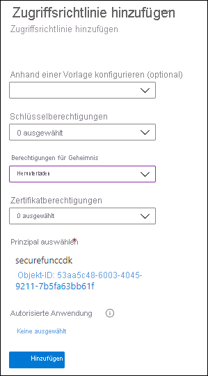

---
lab:
  az204Title: 'Lab 07: Access resource secrets more securely across services'
  az020Title: 'Lab 07: Access resource secrets more securely across services'
  az204Module: 'Module 07: Implement secure cloud solutions'
  az020Module: 'Module 07: Implement secure cloud solutions'
---

# <a name="lab-07-access-resource-secrets-more-securely-across-services"></a>Lab 07: Sichererer dienstübergreifender Zugriff auf Ressourcengeheimnisse

## <a name="microsoft-azure-user-interface"></a>Microsoft Azure-Benutzeroberfläche

Given the dynamic nature of Microsoft cloud tools, you might experience Azure UI changes that occur after this training content's development. As a result, the lab instructions and lab steps might not align correctly.

Microsoft updates this training course when the community brings needed changes to our attention. However, because cloud updates occur frequently, you might encounter UI changes before this training content updates. <bpt id="p1">**</bpt>If this occurs, adapt to the changes, and then work through them in the labs as needed.<ept id="p1">**</ept>

## <a name="instructions"></a>Anweisungen

### <a name="before-you-start"></a>Vorbereitung

#### <a name="sign-in-to-the-lab-environment"></a>Anmelden bei der Laborumgebung

Melden Sie sich mit den folgenden Anmeldeinformationen bei Ihrer Windows 10-VM an:

- Benutzername: **Admin**
- Kennwort: **Pa55w.rd**

> **Hinweis**: Ihr Kursleiter stellt Anweisungen zum Herstellen einer Verbindung mit der virtuellen Laborumgebung zur Verfügung.

#### <a name="review-the-installed-applications"></a>Überprüfen der installierten Anwendungen

Find the taskbar on your Windows 10 desktop. The taskbar contains the icons for the applications that you'll use in this lab, including:

- Microsoft Edge
- Datei-Explorer
- Windows-Terminal
- Visual Studio Code

## <a name="architecture-diagram"></a>Architekturdiagramm


### <a name="exercise-1-create-azure-resources"></a>Übung 1: Erstellen von Azure-Ressourcen

#### <a name="task-1-open-the-azure-portal"></a>Aufgabe 1: Öffnen des Azure-Portals

1. Wählen Sie auf der Taskleiste das Symbol **Microsoft Edge** aus.

1. Navigieren Sie im geöffneten Browserfenster zum Azure-Portal (<https://portal.azure.com>), und melden Sie sich dann mit dem Konto an, das Sie für dieses Lab verwenden werden.

    > Aufgrund der dynamischen Natur der Microsoft-Cloudtools kann es vorkommen, dass sich die Azure-Benutzeroberfläche nach der Entwicklung dieses Trainingsinhalts ändert.

#### <a name="task-2-create-a-storage-account"></a>Aufgabe 2: Erstellen eines Speicherkontos

1. Verwenden Sie im Azure-Portal das Textfeld **Ressourcen, Dienste und Dokumente durchsuchen**, um nach **Speicherkonten** zu suchen, und wählen Sie dann in der Ergebnisliste **Speicherkonten** aus.

1. Wählen Sie auf dem Blatt  **Speicherkonten**  die Option **+ Erstellen** aus.

1. Führen Sie auf der Registerkarte **Grundlagen** des Blatts **Speicherkonto erstellen** die folgenden Aktionen aus, und wählen Sie **Überprüfen und erstellen** aus:

   | Einstellung | Aktion |
   | -- | -- |
   | Dropdownliste **Abonnement** | Übernehmen Sie den Standardwert. |
   | Abschnitt **Ressourcengruppe** | Wählen Sie **Neu erstellen** aus, geben Sie **ConfidentialStack** ein, und wählen Sie dann **OK** aus. |
   | Textfeld **Speicherkontoname**  | Geben Sie **securestor** _[Ihr Name]_ ein. |
   | Dropdownliste **Region** | Wählen Sie **USA, Osten** aus. |
   | Abschnitt **Leistung** | Wählen Sie die Option **Standard** aus. |
   | Dropdownliste **Redundanz** | Wählen Sie **Lokal redundanter Speicher (LRS)** aus. |

   Der folgende Screenshot zeigt die konfigurierten Einstellungen auf dem Blatt **Speicherkonto erstellen**.

   

1. Überprüfen Sie auf der Registerkarte **Überprüfen und erstellen** die Optionen, die Sie in den vorherigen Schritten ausgewählt haben.

1. Wählen Sie **Erstellen** aus, um das Speicherkonto mithilfe Ihrer angegebenen Konfiguration zu erstellen.

    > **Hinweis**: Warten Sie, bis der Erstellungstask abgeschlossen ist, bevor Sie mit diesem Lab fortfahren.

1. Wählen Sie auf dem Blatt **Bereitstellungsübersicht** die Option **Zu Ressource wechseln** aus.

1. Wählen Sie auf dem Blatt **Speicherkonto** im Abschnitt **Sicherheit + Netzwerk** den Link  **Zugriffsschlüssel** aus.

1. Wählen Sie im Bereich **Zugriffsschlüssel** den Eintrag **Schlüssel anzeigen** aus.

1. Daher sind die Lab-Anweisungen und Lab-Schritte möglicherweise nicht mehr zutreffend.

    > <bpt id="p1">**</bpt>Note<ept id="p1">**</ept>: It doesn't matter which connection string you choose. They're interchangeable.

#### <a name="task-3-create-an-azure-key-vault"></a>Aufgabe 3: Erstellen einer Azure Key Vault-Instanz

1. Verwenden Sie im Azure-Portal das Textfeld **Ressourcen, Dienste und Dokumente durchsuchen**, um nach **Schlüsseltresore** zu suchen. Wählen Sie in der Ergebnisliste dann **Schlüsseltresore** aus.

1. Wählen Sie auf dem Blatt **Schlüsseltresore** die Option **Erstellen** aus.

1.  Führen Sie auf der Registerkarte **Grundlagen** des Blatts **Schlüsseltresor erstellen** die folgenden Aktionen aus, und wählen Sie dann **Überprüfen und erstellen** aus:

   | Einstellung | Aktion |
   | -- | -- |
   | Dropdownliste **Abonnement** | Übernehmen Sie den Standardwert. |
   | Dropdownliste **Ressourcengruppe** | Wählen Sie in der Liste **ConfidentialStack** aus. |
   | Textfeld **Schlüsseltresorname**  | Geben Sie **securevault** _[Ihr_Name]_ ein. |
   | Dropdownliste **Region** | Wählen Sie **USA, Osten** aus. |
   | Dropdownliste **Tarif** | Wählen Sie **Standard** aus. |

   Der folgende Screenshot veranschaulicht die konfigurierten Einstellungen auf dem Blatt **Schlüsseltresor erstellen**.

   

1. Überprüfen Sie auf der Registerkarte **Überprüfen und erstellen** die Optionen, die Sie in den vorherigen Schritten ausgewählt haben.

1. Wählen Sie **Erstellen** aus, um den Schlüsseltresor mit Ihrer angegebenen Konfiguration zu erstellen.

    > **Hinweis**: Warten Sie, bis der Erstellungstask abgeschlossen ist, bevor Sie mit diesem Lab fortfahren.

#### <a name="task-4-create-a-function-app"></a>Aufgabe 4: Erstellen einer Funktions-App

1. Verwenden Sie im Azure-Portal das Textfeld **Ressourcen, Dienste und Dokumente durchsuchen**, um nach **Funktions-App** zu suchen. Wählen Sie in der Ergebnisliste dann **Funktions-App** aus.

1. Wählen Sie auf dem Blatt **Funktions-App** die Option **Erstellen** aus.

1. Führen Sie auf dem Blatt **Funktions-App erstellen** auf der Registerkarte **Grundlagen** die folgenden Aktionen aus, und wählen Sie **Weiter: Hosting** aus:

    | Einstellung | Aktion |
    | -- | -- |
    | Dropdownliste **Abonnement** | Übernehmen Sie den Standardwert. |
    | Dropdownliste **Ressourcengruppe** | Wählen Sie **ConfidentialStack** aus. |
    | Textfeld **Name der Funktions-App**  | Geben Sie **securefunc** _[Ihr Name]_ ein. |
    | Abschnitt **Veröffentlichen** | Wählen Sie **Code** aus. |
    | Dropdownliste **Laufzeitstapel** | Wählen Sie **.NET** aus. |
    | Dropdownliste **Version** | Wählen Sie **6** aus. |
    | Dropdownliste **Region** | Wählen Sie die Region **USA, Osten** aus. |
    | Abschnitt **Betriebssystem** | Wählen Sie **Linux** aus. |
    | Dropdownliste **Plantyp** | Wählen Sie **Verbrauch (Serverlos)** aus. |

    Der folgende Screenshot veranschaulicht die konfigurierten Einstellungen auf dem Blatt **Funktions-App erstellen**.

    

1. Führen Sie auf der Registerkarte **Hosting** die folgenden Aktionen aus, und wählen Sie dann **Überprüfen + erstellen** aus:

    | Einstellung | Aktion |
    | -- | -- |
    | Dropdownliste **Speicherkonto** | Wählen Sie das Speicherkonto **securestor** _[Ihr Name]_ aus. |

1. Überprüfen Sie auf der Registerkarte **Überprüfen und erstellen** die Optionen, die Sie in den vorherigen Schritten ausgewählt haben.

1. Wählen Sie **Erstellen** aus, um die Funktions-App mit Ihrer angegebenen Konfiguration zu erstellen.

    > **Hinweis**: Warten Sie, bis der Erstellungstask abgeschlossen ist, bevor Sie mit diesem Lab fortfahren.

#### <a name="review"></a>Überprüfung

In dieser Übung haben Sie alle Ressourcen erstellt, die Sie in diesem Lab verwenden werden.

### <a name="exercise-2-configure-secrets-and-identities"></a>Übung 2: Konfigurieren von Geheimnissen und Identitäten

#### <a name="task-1-configure-a-system-assigned-managed-service-identity"></a>Aufgabe 1: Konfigurieren einer systemseitig zugewiesenen verwalteten Dienstidentität

1. Wählen Sie im Navigationsbereich des Azure-Portals den Link **Ressourcengruppen** aus.

1. Wählen Sie auf dem Blatt **Ressourcengruppen** die Ressourcengruppe **ConfidentialStack** aus.

1. Wählen Sie auf dem Blatt **ConfidentialStack** die Funktions-App **securefunc** _[Ihr Name]_ aus.

    > Microsoft aktualisiert diesen Trainingskurs, wenn die Community uns auf notwendige Änderungen aufmerksam macht.

1. Wählen Sie auf dem Blatt **Funktions-App** die Option **Identität** im Abschnitt **Einstellungen** aus.

1. Legen Sie im Bereich **Identität** auf der Registerkarte **Systemseitig zugewiesen** den **Status** auf **Ein** fest, und wählen Sie dann **Speichern** aus.

1. Wählen Sie **Ja** aus, um die Einstellung zu bestätigen.

    > **Hinweis** Warten Sie, bis die systemseitig zugewiesene verwaltete Identität erstellt wurde, bevor Sie mit diesem Lab fortfahren.

#### <a name="task-2-create-a-key-vault-secret"></a>Aufgabe 2: Erstellen eines Key Vault-Geheimnisses

1. Wählen Sie im **Navigations**bereich des Azure-Portals den Link **Ressourcengruppen** aus.

1. Wählen Sie auf dem Blatt **Ressourcengruppen** die Ressourcengruppe **ConfidentialStack** aus.

1. Wählen Sie auf dem Blatt **ConfidentialStack** den Schlüsseltresor **securevault** _[Ihr Name]_ aus.

1. Wählen Sie auf dem Blatt **Key Vault** den Link **Geheimnisse** im Abschnitt **Einstellungen** aus.

1. Wählen Sie im Bereich **Geheimnis** die Option **+ Generieren/importieren** aus.

1. Führen Sie auf dem Blatt **Geheimnis erstellen** die folgenden Aktionen aus, und wählen Sie dann **Erstellen** aus:

    | Einstellung | Aktion |
    | -- | -- |
    | Dropdownliste **Uploadoptionen** | Wählen Sie **Manuell** aus. |
    | Textfeld **Name** | Geben Sie **storagecredentials** ein. |
    | Textfeld **Wert** | Geben Sie die Verbindungszeichenfolge für das Speicherkonto ein, die Sie sich zuvor in diesem Lab notiert haben. |
    | Textfeld **Inhaltstyp** | Nicht ausfüllen |
    | Kontrollkästchen **Aktivierungsdatum festlegen** | Nicht ausgewählt |
    | Kontrollkästchen **Ablaufdatum festlegen** | Nicht ausgewählt |
    | Option **Aktiviert** | Klicken Sie auf **Ja**. |

    Der folgende Screenshot veranschaulicht die konfigurierten Einstellungen auf dem Blatt **Geheimnis erstellen**.

    

    > **Hinweis**: Warten Sie, bis das Geheimnis erstellt wurde, bevor Sie mit diesem Lab fortfahren.

1. Kehren Sie zum Bereich **Geheimnisse** zurück, und wählen Sie dann das Element **storagecredentials** in der Liste aus.

1. Wählen Sie im Bereich **Versionen** die neueste Version des Geheimnisses **storagecredentials** aus.

1. Führen Sie im Bereich **Geheimnisversion** die folgenden Aktionen aus:

    1. Wählen Sie **Geheimniswert anzeigen** aus, um den Wert des Geheimnisses zu suchen.

    1. Zeichnen Sie den Wert des Textfelds **Geheimnis-ID** auf, da Sie diesen später im Lab verwenden.

    > **Hinweis**: Sie erfassen den Wert des Textfelds **Geheimnis-ID**, nicht das Textfeld **Geheimniswert**.

#### <a name="task-3-configure-a-key-vault-access-policy"></a>Aufgabe 3: Konfigurieren einer Key Vault-Zugriffsrichtlinie

1. Wählen Sie im Navigationsbereich des Azure-Portals den Link **Ressourcengruppen** aus.

1. Wählen Sie auf dem Blatt **Ressourcengruppen** die Ressourcengruppe **ConfidentialStack** aus.

1. Wählen Sie auf dem Blatt **ConfidentialStack** den Schlüsseltresor **securevault[Ihr Name]** aus.

1. Wählen Sie auf dem Blatt **Key Vault** den Link **Zugriffsrichtlinien** im Abschnitt **Einstellungen** aus.

1. Wählen Sie im Bereich **Zugriffsrichtlinien** die Option **Zugriffsrichtlinie hinzufügen** aus.

1. Führen Sie auf dem Blatt **Zugriffsrichtlinie hinzufügen** die folgenden Aktionen aus, und wählen Sie dann **Hinzufügen** aus:

    | Einstellung | Aktion |
    | -- | -- |
    | Dropdownliste **Anhand einer Vorlage konfigurieren** | Nicht ausfüllen |
    | Dropdownliste **Schlüsselberechtigungen** | 0 ausgewählt |
    | Dropdownliste **Geheimnisberechtigungen** | Wählen Sie die **GET**-Berechtigung aus. |
    | Dropdownliste **Zertifikatberechtigungen** | 0 ausgewählt |
    | Link **Prinzipal auswählen** | Da Cloudupdates jedoch häufig vorkommen, können Änderungen an der Benutzeroberfläche möglicherweise auftreten, bevor diese Trainingsinhalte aktualisiert werden. |
    | Link **Autorisierte Anwendung** | Keine Auswahl. |

    Der folgende Screenshot veranschaulicht die konfigurierten Einstellungen auf dem Blatt **Zugriffsrichtlinie hinzufügen**.

    

1. Wählen Sie im Bereich **Zugriffsrichtlinien** die Option **Speichern** aus.

    > **Hinweis**: Warten Sie, bis Ihre Änderungen an den Zugriffsrichtlinien gespeichert sind, bevor Sie mit diesem Lab fortfahren.

#### <a name="task-4-create-a-key-vault-derived-application-setting"></a>Aufgabe 4: Erstellen einer von Key Vault abgeleiteten Anwendungseinstellung

1. Wählen Sie im Navigationsbereich des Azure-Portals den Link **Ressourcengruppen** aus.

1. Wählen Sie auf dem Blatt **Ressourcengruppen** die Ressourcengruppe **ConfidentialStack** aus.

1. Wählen Sie auf dem Blatt **ConfidentialStack** die Funktions-App **securefunc[Ihr Name]** aus.

1. Wählen Sie auf dem Blatt **Funktions-App** die Option **Konfiguration** im Abschnitt **Einstellungen** aus.

1. Wählen Sie im Bereich **Konfiguration** auf der Registerkarte **Anwendungseinstellungen** die Option **Neue Anwendungseinstellung** aus.

1. Geben Sie im Popupfenster **Anwendungseinstellung hinzufügen/bearbeiten** in das Textfeld **Name** den Wert **StorageConnectionString** ein.

1. Erstellen Sie im Textfeld **Wert** einen Wert, und verwenden Sie dabei die folgende Syntax: `@Microsoft.KeyVault(SecretUri=<Secret Identifier>)`. Dabei steht der Platzhalter `<Secret Identifier>` für den Geheimnisbezeichner, den Sie sich zuvor in dieser Übung notiert haben.

    > **Hinweis**: Wenn Ihr Geheimnisbezeichner beispielsweise `https://securevaultstudent.vault.azure.net/secrets/storagecredentials/17b41386df3e4191b92f089f5efb4cbf` lautet, ist der resultierende Wert `@Microsoft.KeyVault(SecretUri=https://securevaultstudent.vault.azure.net/secrets/storagecredentials/17b41386df3e4191b92f089f5efb4cbf)`.

1. Belassen Sie das Kontrollkästchen **Bereitstellungssloteinstellung** auf seinem Standardwert (nicht aktiviert), und wählen Sie dann **OK** aus, um das Popupfenster zu schließen und zum Abschnitt **Konfiguration** zurückzukehren.

1. Wählen Sie **Speichern** aus, um Ihre Einstellungen zu speichern, und wählen Sie dann im Popupfenster **Änderungen speichern** zur Bestätigung **Fortfahren** aus.

    > **Hinweis**: Warten Sie, bis Ihre Anwendungseinstellungen gespeichert sind, bevor Sie mit dem Lab fortfahren.

#### <a name="review"></a>Überprüfung

**Wenn dies der Fall ist, stellen Sie sich auf die Veränderungen ein, und arbeiten Sie sie bei Bedarf in den Labs durch.**

### <a name="exercise-3-build-an-azure-functions-app"></a>Übung 3: Erstellen einer Azure Functions-App

#### <a name="task-1-initialize-a-function-project"></a>Aufgabe 1: Initialisieren eines Funktionsprojekts

1. Wählen Sie auf der Taskleiste das Symbol **Windows-Terminal** aus.

1. Führen Sie den folgenden Befehl aus, um vom aktuellen Verzeichnis in das leere Verzeichnis **Allfiles (F):\\Allfiles\\Labs\\07\\Starter\\func** zu wechseln:

    ```powershell
    cd F:\Allfiles\Labs\07\Starter\func
    ```

    > **Hinweis**: Entfernen Sie in Windows-Explorer das schreibgeschützte Attribut aus der Datei „F:\Allfiles\Labs\07\Starter\func\.gitignore“.

1. Führen Sie den folgenden Befehl aus, um mithilfe der **Azure Functions Core Tools** und unter Verwendung der **dotnet**-Runtime ein neues lokales Functions-Projekt im aktuellen Verzeichnis zu erstellen:

    ```powershell
    func init --worker-runtime dotnet --force
    ```

    > **Hinweis**: Sie können die Dokumentation zum [Erstellen eines neuen Projekts][azure-functions-core-tools-new-project] mithilfe der **Azure Functions Core Tools** lesen.

1. Führen Sie den folgenden Befehl aus, um das .NET 6-Projekt zu **kompilieren**:

    ```powershell
    dotnet build
    ```

#### <a name="task-2-create-an-http-triggered-function"></a>Aufgabe 2: Erstellen einer durch HTTP ausgelösten Funktion

1. Führen Sie den folgenden Befehl aus, um die **Azure Functions Core Tools** zu verwenden, um mithilfe der **HTTP-Trigger**-Vorlage eine neue Funktion namens **FileParser** zu erstellen:

    ```powershell
    func new --template "HTTP trigger" --name "FileParser"
    ```

    > **Hinweis**: Sie können die Dokumentation zum [Erstellen einer neuen Funktion][azure-functions-core-tools-new-function] mithilfe der **Azure Functions Core Tools** lesen.

1. Schließen Sie die aktuell ausgeführte **Windows-Terminal**-Anwendung.

#### <a name="task-3-configure-and-read-an-application-setting"></a>Aufgabe 3: Konfigurieren und Lesen einer Anwendungseinstellung

1. Wählen Sie auf dem **Startbildschirm** die Kachel **Visual Studio Code** aus.

1. Klicken Sie im Menü **Datei** auf **Ordner öffnen**.

1. Suchen Sie im Fenster **Datei-Explorer**, das geöffnet wird, nach **Allfiles (F):\\Allfiles\\Labs\\07\\Starter\\func**, und wählen Sie dann **Ordner auswählen** aus.

1. Öffnen Sie im **Explorer**-Bereich des **Visual Studio Code**-Fensters die Datei **local.settings.json**.

1. Beachten Sie den aktuellen Wert des **Values**-Objekts:

    ```json
    "Values": {
        "AzureWebJobsStorage": "UseDevelopmentStorage=true",
        "FUNCTIONS_WORKER_RUNTIME": "dotnet"
    }
    ```

1. Aktualisieren Sie den Wert des **Values**-Objekts, indem Sie eine neue Einstellung namens **StorageConnectionString** hinzufügen und ihr dann den Zeichenfolgenwert **[TESTWERT]** zuweisen:

    ```json
    "Values": {
        "AzureWebJobsStorage": "UseDevelopmentStorage=true",
        "FUNCTIONS_WORKER_RUNTIME": "dotnet",
        "StorageConnectionString": "[TEST VALUE]"
    }
    ```

1. Die Datei **local.settings.json** sollte jetzt Folgendes enthalten:

    ```json
    {
        "IsEncrypted": false,
        "Values": {
            "AzureWebJobsStorage": "UseDevelopmentStorage=true",
            "FUNCTIONS_WORKER_RUNTIME": "dotnet",
            "StorageConnectionString": "[TEST VALUE]"
        }
    }
    ```

1. Wählen Sie **Speichern** aus, um Ihre Änderungen in der Datei **local.settings.json** zu speichern.

1. Öffnen Sie im **Explorer**-Bereich des **Visual Studio Code**-Fensters die Datei **FileParser.cs**.

1. Sehen Sie sich im Code-Editor die Beispielimplementierung an:

    ```csharp
    using System;
    using System.IO;
    using System.Threading.Tasks;
    using Microsoft.AspNetCore.Mvc;
    using Microsoft.Azure.WebJobs;
    using Microsoft.Azure.WebJobs.Extensions.Http;
    using Microsoft.AspNetCore.Http;
    using Microsoft.Extensions.Logging;
    using Newtonsoft.Json;
    namespace func
    {
        public static class FileParser
        {
            [FunctionName("FileParser")]
            public static async Task<IActionResult> Run(
                [HttpTrigger(AuthorizationLevel.Function, "get", "post", Route = null)] HttpRequest req,
                ILogger log)
            {
                log.LogInformation("C# HTTP trigger function processed a request.");
                string name = req.Query["name"];
                string requestBody = await new StreamReader(req.Body).ReadToEndAsync();
                dynamic data = JsonConvert.DeserializeObject(requestBody);
                name = name ?? data?.name;
                string responseMessage = string.IsNullOrEmpty(name)
                    ? "This HTTP triggered function executed successfully. Pass a name in the query string or in the request body for a personalized response."
                    : $"Hello, {name}. This HTTP triggered function executed successfully.";
                return new OkObjectResult(responseMessage);
            }
        }
    }
    ```

1. Löschen Sie den gesamten Inhalt der Datei **FileParser.cs**.

1. Fügen Sie die folgenden Codezeilen hinzu, um **using-Anweisungen** für die Namespaces **Microsoft.AspNetCore.Mvc**, **Microsoft.Azure.WebJobs**, **Microsoft.AspNetCore.Http**, **System** und **System.Threading.Tasks** hinzuzufügen:

    ```csharp
    using Microsoft.AspNetCore.Mvc;
    using Microsoft.Azure.WebJobs;
    using Microsoft.AspNetCore.Http;
    using System;
    using System.Threading.Tasks;
    ```

1. Erstellen Sie eine neue **öffentliche statische** Klasse namens **FileParser**:

    ```csharp
    public static class FileParser
    { }
    ```

1. Sehen Sie sich die Datei **FileParser.cs** erneut an, die nun Folgendes enthalten sollte:

    ```csharp
    using Microsoft.AspNetCore.Mvc;
    using Microsoft.Azure.WebJobs;
    using Microsoft.AspNetCore.Http;
    using System;
    using System.Threading.Tasks;
    public static class FileParser
    { }
    ```

1. Within the <bpt id="p1">**</bpt>FileParser<ept id="p1">**</ept> class, add the following code block to create a new <bpt id="p2">**</bpt>public static<ept id="p2">**</ept> <bpt id="p3">*</bpt>asynchronous<ept id="p3">*</ept> method named <bpt id="p4">**</bpt>Run<ept id="p4">**</ept>. This method returns a variable of type <bpt id="p1">**</bpt>Task<ph id="ph1">\&lt;IActionResult\&gt;</ph><ept id="p1">**</ept> and also takes in a variable of type <bpt id="p2">**</bpt>HttpRequest<ept id="p2">**</ept> named <bpt id="p3">*</bpt>request<ept id="p3">*</ept>:

    ```csharp
    public static async Task<IActionResult> Run(
        HttpRequest request)
    { }
    ```

1. Fügen Sie den folgenden Code hinzu, um der **Run**-Methode des Typs **FunctionNameAttribute** ein Attribut hinzuzufügen, dessen **name**-Parameter auf den Wert **FileParser** festgelegt ist:

    ```csharp
    [FunctionName("FileParser")]
    public static async Task<IActionResult> Run(
        HttpRequest request)
    { }
    ```

1. Fügen Sie den folgenden Code hinzu, um dem **request**-Parameter des Typs **HttpTriggerAttribute** ein Attribut hinzuzufügen, dessen **methods**-Parameterarray auf den einzelnen Wert **GET** festgelegt ist:

    ```csharp
    [FunctionName("FileParser")]
    public static async Task<IActionResult> Run(
        [HttpTrigger("GET")] HttpRequest request)
    { }
    ```

1. Überprüfen Sie erneut den Inhalt der Datei **FileParser.cs**, die jetzt Folgendes enthalten sollte:

    ```csharp
    using Microsoft.AspNetCore.Mvc;
    using Microsoft.Azure.WebJobs;
    using Microsoft.AspNetCore.Http;
    using System;
    using System.Threading.Tasks;
    public static class FileParser
    {
        [FunctionName("FileParser")]
        public static async Task<IActionResult> Run(
            [HttpTrigger("GET")] HttpRequest request)
        { }
    }
    ```

1. Geben Sie in der **Run**-Methode die folgende Codezeile ein, um den Wert der Anwendungseinstellung **StorageConnectionString** mithilfe der **Environment.GetEnvironmentVariable**-Methode abzurufen und das Ergebnis in einer **string**-Variablen namens **connectionString** zu speichern:

    ```csharp
    string connectionString = Environment.GetEnvironmentVariable("StorageConnectionString");
    ```

1. Geben Sie die folgende Codezeile ein, um den Wert der **connectionString**-Variablen als HTTP-Antwort zurückzugeben:

    ```csharp
    return new OkObjectResult(connectionString);
    ```

1. Überprüfen Sie erneut den Inhalt der Datei **FileParser.cs**, die jetzt Folgendes enthalten sollte:

    ```csharp
    using Microsoft.AspNetCore.Mvc;
    using Microsoft.Azure.WebJobs;
    using Microsoft.AspNetCore.Http;
    using System;
    using System.Threading.Tasks;
    public static class FileParser
    {
        [FunctionName("FileParser")]
        public static async Task<IActionResult> Run(
            [HttpTrigger("GET")] HttpRequest request)
        {
            string connectionString = Environment.GetEnvironmentVariable("StorageConnectionString");
            return new OkObjectResult(connectionString);
        }
    }
    ```

1. Wählen Sie **Speichern** aus, um Ihre Änderungen in der Datei **FileParser.cs** zu speichern.

#### <a name="task-4-validate-the-local-function"></a>Aufgabe 4: Überprüfen der lokalen Funktion

1. Wählen Sie auf der Taskleiste das Symbol **Windows-Terminal** aus.

1. Führen Sie den folgenden Befehl aus, um vom aktuellen Verzeichnis in das leere Verzeichnis **Allfiles (F):\\Allfiles\\Labs\\07\\Starter\\func** zu wechseln:

    ```powershell
    cd F:\Allfiles\Labs\07\Starter\func
    ```

1. Führen Sie den folgenden Befehl aus, um das Funktions-App-Projekt auszuführen:

    ```powershell
    func start --build
    ```

    > **Hinweis**: Sie können die Dokumentation zum [lokalen Starten des Funktions-App-Projekts][azure-functions-core-tools-start-function] mithilfe der **Azure Functions Core Tools** lesen.

1. On the taskbar, select the <bpt id="p1">**</bpt>Windows Terminal<ept id="p1">**</ept> icon again to open a new instance of the <bpt id="p2">**</bpt>Windows Terminal<ept id="p2">**</ept> application. Run the following command to change the current directory to the <bpt id="p1">**</bpt>Allfiles (F):<ph id="ph1">\\</ph>Allfiles<ph id="ph2">\\</ph>Labs<ph id="ph3">\\</ph>07<ph id="ph4">\\</ph>Starter<ph id="ph5">\\</ph>func<ept id="p1">**</ept> empty directory:

    ```powershell
    cd F:\Allfiles\Labs\07\Starter\func
    ```
    
1. Wenn Ihnen die geöffnete Eingabeaufforderung angezeigt wird, führen Sie den folgenden Befehl aus, um das **httprepl**-Tool zu starten, wobei Sie den Basis-URI (Uniform Resource Identifier) auf ``http://localhost:7071`` festlegen:

    ```powershell
    httprepl http://localhost:7071
    ```

    > <bpt id="p1">**</bpt>Note<ept id="p1">**</ept>: An error message is displayed by the <bpt id="p2">**</bpt>httprepl<ept id="p2">**</ept> tool. This message occurs because the tool is searching for a Swagger definition file to use to traverse the API. Because your function project doesn't produce a Swagger definition file, you'll need to traverse the API manually.
1. Wenn die Eingabeaufforderung des Tools angezeigt wird, führen Sie den folgenden Befehl aus, um zum relativen **api**-Verzeichnis zu wechseln:

    ```powershell
    cd api
    ```

1. Führen Sie den folgenden Befehl aus, um zum relativen **fileparser**-Verzeichnis zu wechseln:

    ```powershell
    cd fileparser
    ```

1. Führen Sie den folgenden Befehl aus, um den **get**-Befehl auszuführen:

    ```powershell
    get
    ```

1. Beobachten Sie den **[TESTWERT]** -Wert von **StorageConnectionString**, der als Ergebnis der HTTP-Anforderung zurückgegeben wird:

    ```powershell
    HTTP/1.1 200 OK
    Content-Type: text/plain; charset=utf-8
    Date: Tue, 01 Sep 2020 23:35:39 GMT
    Server: Kestrel
    Transfer-Encoding: chunked
    [TEST VALUE]
    ```

1. Führen Sie den folgenden Befehl aus, um das **httprepl**-Tool zu beenden:

    ```powershell
    exit
    ```

1. Schließen Sie alle aktuell ausgeführten Instanzen der **Windows-Terminal**-Anwendung.

#### <a name="task-5-deploy-the-function-using-the-azure-functions-core-tools"></a>Aufgabe 5: Bereitstellen der Funktion mithilfe der Azure Functions Core Tools

1. Wählen Sie auf der Taskleiste das Symbol **Windows-Terminal** aus.

1. Führen Sie den folgenden Befehl aus, um vom aktuellen Verzeichnis in das leere Verzeichnis **Allfiles (F):\\Allfiles\\Labs\\07\\Starter\\func** zu wechseln:

    ```powershell
    cd F:\Allfiles\Labs\07\Starter\func
    ```

1. Führen Sie den folgenden Befehl aus, um sich bei der Azure-Befehlszeilenschnittstelle (CLI) anzumelden:

    ```powershell
    az login
    ```

1. Geben Sie im **Microsoft Edge**-Browserfenster die E-Mail-Adresse und das Kennwort für Ihr Microsoft-Konto ein, und wählen Sie dann **Anmelden** aus.

1. Return to the currently open <bpt id="p1">**</bpt>Windows Terminal<ept id="p1">**</ept> window. Wait for the sign-in process to finish.

1. Führen Sie den folgenden Befehl aus, um das Funktions-App-Projekt zu veröffentlichen (ersetzen Sie den Platzhalter `<function-app-name>` durch den Namen der Funktions-App, die Sie zuvor in diesem Lab erstellt haben):

    ```powershell
    func azure functionapp publish <function-app-name>
    ```

    > <bpt id="p1">**</bpt>Note<ept id="p1">**</ept>: As an example, if your <bpt id="p2">**</bpt>Function App name<ept id="p2">**</ept> is <bpt id="p3">**</bpt>securefuncstudent<ept id="p3">**</ept>, your command would be <ph id="ph1">``func azure functionapp publish securefuncstudent``</ph>. You can review the documentation to [publish the local function app project][azure-functions-core-tools-publish-azure] using the <bpt id="p1">**</bpt>Azure Functions Core Tools<ept id="p1">**</ept>.

1. Warten Sie, bis die Bereitstellung fertig gestellt ist, bevor Sie mit dem Lab fortfahren.

1. Schließen Sie die aktuell ausgeführte **Windows-Terminal**-Anwendung.

#### <a name="task-6-test-the-key-vault-derived-application-setting"></a>Aufgabe 6: Testen der von Key Vault abgeleiteten Anwendungseinstellung

1. Wählen Sie auf der Taskleiste das Symbol **Microsoft Edge** aus, und wählen Sie dann die Registerkarte aus, die das Azure-Portal (<https://portal.azure.com>) enthält.

1. Wählen Sie im Navigationsbereich des Azure-Portals den Link **Ressourcengruppen** aus.

1. Wählen Sie auf dem Blatt **Ressourcengruppen** die Ressourcengruppe **ConfidentialStack** aus.

1. Wählen Sie auf dem Blatt **ConfidentialStack** die Funktions-App **securefunc[Ihr Name]** aus.

1. Wählen Sie auf dem Blatt **Funktions-App** im Abschnitt **Funktionen** die Option **Funktionen** aus.

1. Wählen Sie im Bereich **Funktionen** die vorhandene **FileParser**-Funktion aus.

1. Wählen Sie auf dem Blatt **Funktion** im Abschnitt **Entwickler** die Option **Programmieren und testen** aus.

1. Wählen Sie im Funktionen-Editor **Testen/Ausführen** aus.

1. Wählen Sie im automatisch angezeigten Bereich in der Liste **HTTP-Methode** die Option **GET** aus.

1. Wählen Sie **Ausführen** aus, um die Funktion zu testen.

1. Review the results of the test run. The result should be your Azure Storage connection string.

#### <a name="review"></a>Überprüfung

In dieser Übung haben Sie eine Dienstidentität verwendet, um den Wert eines in Key Vault gespeicherten Geheimnisses zu lesen und diesen Wert als Ergebnis einer Funktions-App zurückzugeben.

### <a name="exercise-4-access-azure-blob-storage-data"></a>Übung 4: Zugreifen auf Azure Blob Storage-Daten

#### <a name="task-1-upload-a-sample-storage-blob"></a>Aufgabe 1: Hochladen eines Beispielspeicherblobs

1. Wählen Sie im Navigationsbereich des Azure-Portals den Link **Ressourcengruppen** aus.

1. Wählen Sie auf dem Blatt **Ressourcengruppen** die Ressourcengruppe **ConfidentialStack** aus.

1. Wählen Sie auf dem Blatt **ConfidentialStack** das Speicherkonto **securestor** _[Ihr Name]_ aus.

1. Wählen Sie auf dem Blatt **Speicherkonto** den Link **Container** im Abschnitt **Datenspeicher** aus.

1. Wählen Sie im Abschnitt **Container** die Option **+ Container** aus.

1. Führen Sie im Popupfenster **Neuer Container** die folgenden Aktionen aus, und wählen Sie dann **Erstellen** aus:

    | Einstellung | Aktion |
    | -- | -- |
    | Textfeld **Name** | Geben Sie **drop** ein. |
    | Dropdownliste **Öffentliche Zugriffsebene** | Wählen Sie **Blob (anonymer Lesezugriff nur für Blobs)** aus. |

1. Kehren Sie zum Abschnitt **Container** zurück, und wählen Sie dann den neu erstellten Container **drop** aus.

1. Wählen Sie auf dem Blatt **Container** die Option **Hochladen** aus.

1. Führen Sie im Fenster **Blob hochladen** die folgenden Aktionen aus, und wählen Sie dann **Hochladen** aus:

    | Einstellung | Aktion |
    | -- | -- |
    | Abschnitt **Dateien** | Wählen Sie das Symbol **Ordner** aus. |
    | Fenster **Datei-Explorer**  | Wechseln Sie zu **Allfiles (F):\\Allfiles\\Labs\\07\\Starter**, und wählen Sie zuerst die Datei **records.json** und dann **Öffnen** aus. |
    | Kontrollkästchen **Überschreiben, falls Dateien bereits vorhanden sind** | Stellen Sie sicher, dass dieses Kontrollkästchen aktiviert ist. |

    > **Hinweis**: Warten Sie, bis das Blob hochgeladen wurde, bevor Sie mit diesem Lab fortfahren.

1. Kehren Sie zum Blatt **Container** zurück, und wählen Sie dann das Blob **records.json** in der Liste der Blobs aus.

1. Suchen Sie auf dem Blatt **Blob** nach den Blobmetadaten, und kopieren Sie dann die URL für das Blob.

1. Aktivieren Sie auf der Taskleiste das Kontextmenü für das **Microsoft Edge**-Symbol, und wählen Sie dann **Neues Fenster** aus.

1. Verweisen Sie in dem neuen Browserfenster auf die URL, die Sie für das Blob kopiert haben.

1. The JavaScript Object Notation (JSON) contents of the blob should now display. Close the browser window with the JSON contents.

1. Kehren Sie zum Browserfenster mit dem Azure-Portal zurück, und schließen Sie dann das Blatt **Blob**.

1. Kehren Sie zum Blatt **Container** zurück, und wählen Sie dann **Zugriffsebene ändern** aus.

1. Führen Sie im Popupfenster **Zugriffsebene ändern** die folgenden Aktionen aus:

    1. Wählen Sie in der Dropdownliste **Öffentliche Zugriffsebene** die Option **Privat (kein anonymer Zugriff)** aus.
    1. Klicken Sie auf **OK**.

1. Aktivieren Sie auf der Taskleiste das Kontextmenü für das **Microsoft Edge**-Symbol, und wählen Sie dann **Neues Fenster** aus.

1. Verweisen Sie in dem neuen Browserfenster auf die URL, die Sie für das Blob kopiert haben.

1. Es sollte nun eine Fehlermeldung angezeigt werden, die angibt, dass die Ressource nicht gefunden wurde.

    > <bpt id="p1">**</bpt>Note<ept id="p1">**</ept>: If the error message doesn't display, your browser might have cached the file. Select Ctrl+F5 to refresh the page until the error message displays.

#### <a name="task-2-pull-and-configure-the-azure-sdk-for-net"></a>Aufgabe 2: Pullen und Konfigurieren des Azure SDK für .NET

1. Wählen Sie auf der Taskleiste das Symbol **Windows-Terminal** aus.

1. Führen Sie den folgenden Befehl aus, um vom aktuellen Verzeichnis in das leere Verzeichnis **Allfiles (F):\\Allfiles\\Labs\\07\\Starter\\func** zu wechseln:

    ```powershell
    cd F:\Allfiles\Labs\07\Starter\func
    ```

1. Führen Sie den folgenden Befehl aus, um Version **12.12.0** des **Azure.Storage.Blobs**-Pakets aus NuGet hinzuzufügen:

    ```powershell
    dotnet add package Azure.Storage.Blobs --version 12.12.0
    ```

    > **Hinweis**: Das NuGet-Paket [Azure.Storage.Blobs](https://www.nuget.org/packages/Azure.Storage.Blobs) verweist auf die Teilmenge des Azure SDK für .NET, die zum Schreiben von Code für Azure Blob Storage erforderlich ist.

1. Schließen Sie die aktuell ausgeführte **Windows-Terminal**-Anwendung.

1. Wählen Sie auf dem **Startbildschirm** die Kachel **Visual Studio Code** aus.

1. Klicken Sie im Menü **Datei** auf **Ordner öffnen**.

1. Suchen Sie im Fenster **Datei-Explorer**, das geöffnet wird, nach **Allfiles (F):\\Allfiles\\Labs\\07\\Starter\\func**, und wählen Sie dann **Ordner auswählen** aus.

1. Öffnen Sie im **Explorer**-Bereich des **Visual Studio Code**-Fensters die Datei **FileParser.cs**.

1. Fügen Sie eine **using-Anweisung** für den **Azure.Storage.Blobs**-Namespace hinzu:

    ```csharp
    using Azure.Storage.Blobs;
    ```

1. Überprüfen Sie den Inhalt der Datei **FileParser.cs**, die jetzt Folgendes enthalten sollte:

    ```csharp
    using Azure.Storage.Blobs;
    using Microsoft.AspNetCore.Mvc;
    using Microsoft.Azure.WebJobs;
    using Microsoft.AspNetCore.Http;
    using System;
    using System.Threading.Tasks;   
    public static class FileParser
    {
        [FunctionName("FileParser")]
        public static async Task<IActionResult> Run(
            [HttpTrigger("GET")] HttpRequest request)
        {
            string connectionString = Environment.GetEnvironmentVariable("StorageConnectionString");
            return new OkObjectResult(connectionString);
        }
    }
    ```

#### <a name="task-3-write-azure-blob-storage-code-using-the-azure-sdk-for-net"></a>Aufgabe 3: Schreiben von Azure Blob Storage-Code mit dem Azure SDK für .NET

1. Löschen Sie innerhalb der **Run**-Methode der **FileParser**-Klasse die folgende Codezeile:

    ```csharp
    return new OkObjectResult(connectionString);
    ```

1. Fügen Sie noch innerhalb der **Run**-Methode den folgenden Codeblock hinzu, um eine neue Instanz der **BlobClient**-Klasse zu erstellen, indem Sie Ihre *connectionString*-Variable, einen ``"drop"``-Zeichenfolgenwert und einen ``"records.json"``-Zeichenfolgenwert an den Konstruktor übergeben:

    ```csharp
    BlobClient blob = new BlobClient(connectionString, "drop", "records.json");
    ```

1. Fügen Sie noch innerhalb der **Run**-Methode den folgenden Codeblock hinzu, um die **BlobClient.DownloadAsync**-Methode zu verwenden, um den Inhalt des referenzierten Blobs asynchron herunterzuladen und das Ergebnis in einer Variablen namens *response* zu speichern:

    ```csharp
    var response = await blob.DownloadAsync();
    ```

1. Fügen Sie noch innerhalb der **Run**-Methode den folgenden Codeblock hinzu, um den Wert der verschiedenen in der *content*-Variablen gespeicherten Inhalte zurückzugeben, indem Sie den Konstruktor der **FileStreamResult**-Klasse verwenden:

    ```csharp
    return new FileStreamResult(response?.Value?.Content, response?.Value?.ContentType);
    ```

1. Überprüfen Sie erneut den Inhalt der Datei **FileParser.cs**, die jetzt Folgendes enthalten sollte:

    ```csharp
    using Azure.Storage.Blobs;
    using Microsoft.AspNetCore.Mvc;
    using Microsoft.Azure.WebJobs;
    using Microsoft.AspNetCore.Http;
    using System;
    using System.Threading.Tasks;
    public static class FileParser
    {
        [FunctionName("FileParser")]
        public static async Task<IActionResult> Run(
            [HttpTrigger("GET")] HttpRequest request)
        {
            string connectionString = Environment.GetEnvironmentVariable("StorageConnectionString");
            BlobClient blob = new BlobClient(connectionString, "drop", "records.json");
            var response = await blob.DownloadAsync();
            return new FileStreamResult(response?.Value?.Content, response?.Value?.ContentType);
        }
    }
    ```

1. Wählen Sie **Speichern** aus, um Ihre Änderungen in der Datei **FileParser.cs** zu speichern.

#### <a name="task-4-deploy-and-validate-the-azure-functions-app"></a>Aufgabe 4: Bereitstellen und Überprüfen der Azure Functions-App

1. Wählen Sie auf der Taskleiste das Symbol **Windows-Terminal** aus.

1. Führen Sie den folgenden Befehl aus, um vom aktuellen Verzeichnis in das leere Verzeichnis **Allfiles (F):\\Allfiles\\Labs\\07\\Starter\\func** zu wechseln:

    ```powershell
    cd F:\Allfiles\Labs\07\Starter\func
    ```

1. Führen Sie den folgenden Befehl aus, um sich bei der Azure CLI anzumelden:

    ```powershell
    az login
    ```

1. Geben Sie im **Microsoft Edge**-Browserfenster die E-Mail-Adresse und das Kennwort für Ihr Microsoft-Konto ein, und wählen Sie dann **Anmelden** aus.

1. Return to the currently open <bpt id="p1">**</bpt>Windows Terminal<ept id="p1">**</ept> window. Wait for the sign-in process to finish.

1. Führen Sie den folgenden Befehl aus, um das Funktions-App-Projekt erneut zu veröffentlichen (ersetzen Sie den Platzhalter `<function-app-name>` durch den Namen der Funktions-App, die Sie zuvor in diesem Lab verwendet haben):

    ```powershell
    func azure functionapp publish <function-app-name>
    ```

    > Suchen Sie auf ihrem Windows 10-Desktop nach der Taskleiste.

1. Warten Sie, bis die Bereitstellung fertig gestellt ist, bevor Sie mit dem Lab fortfahren.

1. Schließen Sie die aktuell ausgeführte **Windows-Terminal**-Anwendung.

1. Wählen Sie auf der Taskleiste das Symbol **Microsoft Edge** aus, und rufen Sie dann das Azure-Portal (<https://portal.azure.com>) auf.

1. Wählen Sie im Navigationsbereich des Azure-Portals den Link **Ressourcengruppen** aus.

1. Wählen Sie auf dem Blatt **Ressourcengruppen** die Ressourcengruppe **ConfidentialStack** aus.

1. Wählen Sie auf dem Blatt **ConfidentialStack** die Funktions-App **securefunc[Ihr Name]** aus.

1. Wählen Sie auf dem Blatt **App Service** im Abschnitt **Funktionen** die Option **Funktionen** aus.

1. Wählen Sie im Bereich **Funktionen** die vorhandene **FileParser**-Funktion aus.

1. Wählen Sie auf dem Blatt **Funktion** im Abschnitt **Entwickler** die Option **Programmieren und testen** aus.

1. Wählen Sie im Funktionen-Editor **Testen/Ausführen** aus.

1. Wählen Sie im automatisch angezeigten Bereich in der Liste **HTTP-Methode** die Option **GET** aus.

1. Wählen Sie **Ausführen** aus, um die Funktion zu testen.

1. Die Taskleiste enthält die Symbole für die Anwendungen, die Sie in diesem Lab verwenden, darunter:

#### <a name="review"></a>Überprüfung

In dieser Übung haben Sie C\#-Code verwendet, um auf ein Speicherkonto zuzugreifen, und dann den Inhalt eines Blob heruntergeladen.

### <a name="exercise-5-clean-up-your-subscription"></a>Übung 5: Bereinigen Ihres Abonnements

#### <a name="task-1-open-azure-cloud-shell"></a>Aufgabe 1: Öffnen von Azure Cloud Shell

1. In the Azure portal, select the <bpt id="p1">**</bpt>Cloud Shell<ept id="p1">**</ept> icon <ph id="ph1"></ph> to open a new Bash session. If Cloud Shell defaults to a PowerShell session, select <bpt id="p1">**</bpt>PowerShell<ept id="p1">**</ept>, and in the drop-down menu, select <bpt id="p2">**</bpt>Bash<ept id="p2">**</ept>.

    > <bpt id="p1">**</bpt>Note<ept id="p1">**</ept>: If this is the first time you're starting <bpt id="p2">**</bpt>Cloud Shell<ept id="p2">**</ept>, when prompted to select either <bpt id="p3">**</bpt>Bash<ept id="p3">**</ept> or <bpt id="p4">**</bpt>PowerShell<ept id="p4">**</ept>, select <bpt id="p5">**</bpt>PowerShell<ept id="p5">**</ept>. When you're presented with the <bpt id="p1">**</bpt>You have no storage mounted<ept id="p1">**</ept> message, select the subscription you're using in this lab, and then select <bpt id="p2">**</bpt>Create storage<ept id="p2">**</ept>.

#### <a name="task-2-delete-a-resource-group"></a>Aufgabe 2: Löschen einer Ressourcengruppe

1. Führen Sie im Bereich **Cloud Shell** den folgenden Befehl aus, um die Ressourcengruppe **ConfidentialStack** zu löschen:

    ```bash
    az group delete --name ConfidentialStack --no-wait --yes
    ```

     > **Hinweis**: Der Befehl wird (dem *--nowait*-Parameter entsprechend) asynchron ausgeführt. Dies bedeutet, dass Sie zwar einen weiteren Azure CLI-Befehl in derselben Bash-Sitzung direkt im Anschluss ausführen können, es jedoch einige Minuten dauert, bis die Ressourcengruppen tatsächlich entfernt wurden.

1. Schließen Sie den Bereich **Cloud Shell** im Portal.

#### <a name="task-3-close-the-active-application"></a>Aufgabe 3: Schließen der aktiven Anwendung

- Schließen Sie die aktuell ausgeführte Microsoft Edge-Anwendung.

#### <a name="review"></a>Überprüfung

In dieser Übung haben Sie Ihr Abonnement bereinigt, indem Sie die in diesem Lab verwendeten Ressourcengruppen entfernt haben.
