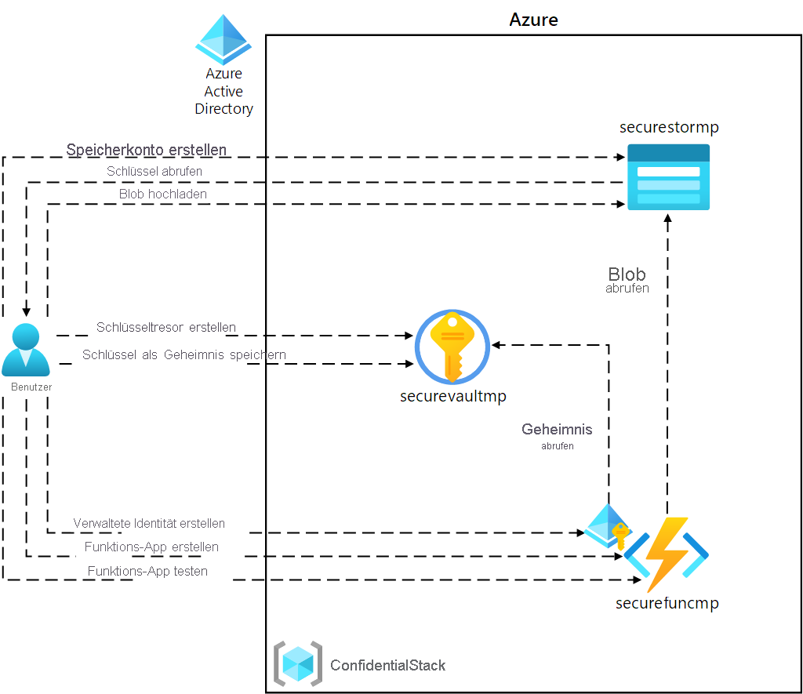
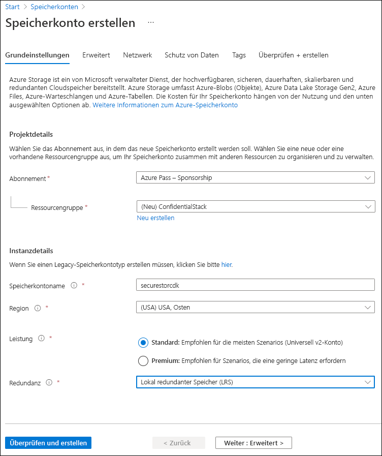
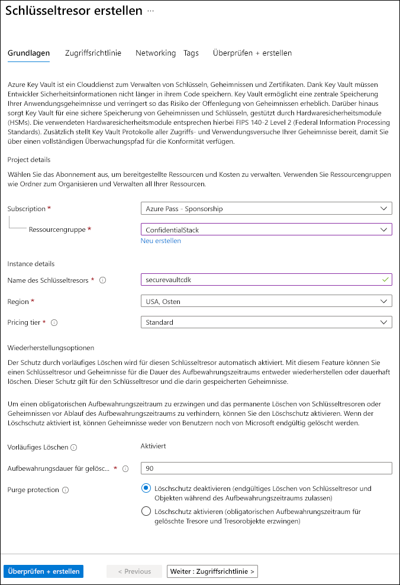
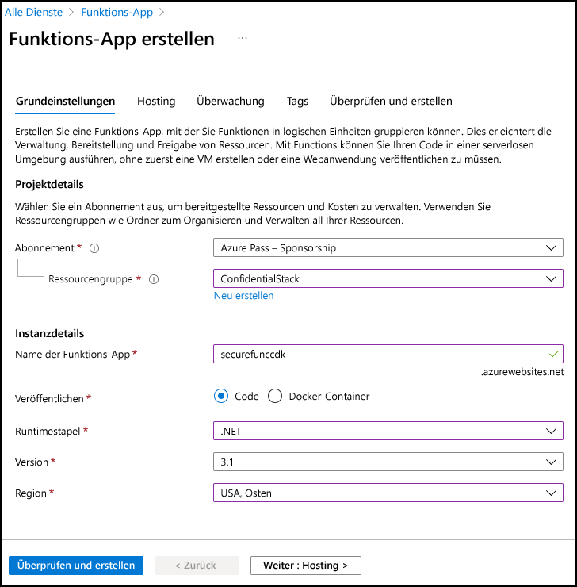
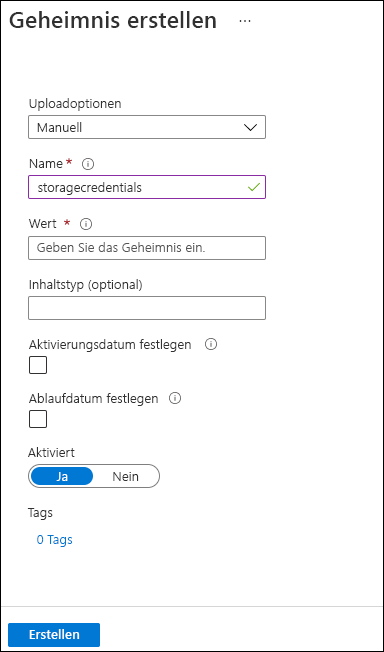

---
lab:
  az204Title: 'Lab 07: Access resource secrets more securely across services'
  az204Module: 'Learning Path 07: Implement secure Azure solutions'
---

# Lab 07: Sichererer dienstübergreifender Zugriff auf Ressourcengeheimnisse

## Microsoft Azure-Benutzeroberfläche

Aufgrund der dynamischen Natur der Microsoft-Cloudtools kann es vorkommen, dass sich die Azure-Benutzeroberfläche nach der Entwicklung dieses Trainingsinhalts ändert. Daher sind die Lab-Anweisungen und Lab-Schritte möglicherweise nicht mehr zutreffend.

Microsoft aktualisiert diesen Trainingskurs, wenn die Community uns auf notwendige Änderungen aufmerksam macht. Da Cloudupdates jedoch häufig vorkommen, können Änderungen an der Benutzeroberfläche möglicherweise auftreten, bevor diese Trainingsinhalte aktualisiert werden. **Wenn dies der Fall ist, stellen Sie sich auf die Veränderungen ein, und arbeiten Sie sie bei Bedarf in den Labs durch.**

## Anweisungen

### Vorbereitung

#### Anmelden bei der Laborumgebung

Melden Sie sich mithilfe der folgenden Anmeldeinformationen bei Ihrer Windows 11-VM an:

- Benutzername: `Admin`
- Kennwort: `Pa55w.rd`

> **Hinweis**: Ihr Kursleiter stellt Anweisungen zum Herstellen einer Verbindung mit der virtuellen Laborumgebung zur Verfügung.

#### Überprüfen der installierten Anwendungen

Suchen Sie auf Ihrem Windows 11-Desktop nach der Taskleiste. Die Taskleiste enthält die Symbole für die Anwendungen, die Sie in diesem Lab verwenden, darunter:

- Microsoft Edge
- Datei-Explorer
- Terminal
- Visual Studio Code

## Übungsszenario

In diesem Lab erstellen Sie ein Speicherkonto und eine Azure Functions-App, die auf das Speicherkonto zugreift. Um die sichere Speicherung von Verbindungszeichenfolgeninformationen zu veranschaulichen, stellen Sie eine Key Vault-Ressource bereit und verwalten die entsprechenden Geheimnisse, um die Verbindungszeichenfolgeninformationen zu speichern. Außerdem verwalten Sie die Dienstidentität, um sicheren Zugriff auf die Verbindungszeichenfolgeninformationen für das Speicherkonto zu erhalten.

## Architekturdiagramm



### Übung 1: Erstellen von Azure-Ressourcen

#### Aufgabe 1: Öffnen des Azure-Portals

1. Wählen Sie auf der Taskleiste das Symbol **Microsoft Edge** aus.

1. Wechseln Sie im geöffneten Browserfenster zum Azure-Portal unter `https://portal.azure.com`, und melden Sie sich dann mit dem Konto an, das Sie für dieses Lab verwenden werden.

   > **Hinweis**: Wenn Sie sich zum ersten Mal am Azure-Portal anmelden, wird Ihnen eine Tour durch das Portal angeboten. Wählen Sie **Erste Schritte** aus, um die Tour zu überspringen und mit der Verwendung des Portals zu beginnen.

#### Aufgabe 2: Erstellen eines Speicherkontos

1. Verwenden Sie im Azure-Portal das Textfeld **Ressourcen, Dienste und Dokumente durchsuchen**, um nach **Speicherkonten** zu suchen, und wählen Sie dann in der Ergebnisliste **Speicherkonten** aus.

1. Wählen Sie auf dem Blatt  **Speicherkonten**  die Option **+ Erstellen** aus.

1. Führen Sie auf der Registerkarte **Grundlagen** des Blatts **Speicherkonto erstellen** die folgenden Aktionen aus, und wählen Sie **Überprüfen** aus:

    | Einstellung | Aktion |
    |--|--|
    | Dropdownliste **Abonnement** | Übernehmen Sie den Standardwert. |
    | Abschnitt **Ressourcengruppe** | Wählen Sie **Neu erstellen** aus, geben Sie **ConfidentialStack** ein, und wählen Sie dann **OK** aus. |
    | Textfeld **Speicherkontoname**  | Geben Sie **securestor** _[Ihr Name]_ ein. |
    | Dropdownliste **Region** | Wählen Sie **USA, Osten** aus. |
    | **Primärer Dienst** | Keine Änderungen |
    | Abschnitt **Leistung** | Wählen Sie die Option **Standard** aus. |
    | Dropdownliste **Redundanz** | Wählen Sie **Lokal redundanter Speicher (LRS)** aus. |

   Der folgende Screenshot zeigt die konfigurierten Einstellungen auf dem Blatt **Speicherkonto erstellen**.

   

1. Überprüfen Sie auf der Registerkarte **Überprüfen** die Optionen, die Sie in den vorherigen Schritten ausgewählt haben.

1. Wählen Sie **Erstellen** aus, um das Speicherkonto mithilfe Ihrer angegebenen Konfiguration zu erstellen.

   > **Hinweis**: Warten Sie, bis der Erstellungstask abgeschlossen ist, bevor Sie mit diesem Lab fortfahren.

1. Wählen Sie auf dem Blatt **Bereitstellungsübersicht** die Option **Zu Ressource wechseln** aus.

1. Wählen Sie auf dem Blatt **Speicherkonto** im Abschnitt **Sicherheit + Netzwerk** den Link  **Zugriffsschlüssel** aus.

1. Wählen Sie im Bereich **Zugriffsschlüssel** den Eintrag **Schlüssel anzeigen** aus.

1. Überprüfen Sie auf dem Blatt **Zugriffsschlüssel**  eine der **Verbindungszeichenfolgen** (mithilfe der Schaltfläche **Anzeigen**), und notieren Sie dann den Wert einer der **Verbindungszeichenfolgen**  im Editor. Die **Schlüssel** sind plattformverwaltete Verschlüsselungsschlüssel und werden für dieses Lab **nicht** verwendet.

   > **Hinweis**: Es spielt keine Rolle, welche Verbindungszeichenfolge Sie auswählen. Sie können synonym verwendet werden.

#### Aufgabe 3: Erstellen einer Azure Key Vault-Instanz

1. Verwenden Sie im Azure-Portal das Textfeld **Ressourcen, Dienste und Dokumente durchsuchen**, um nach **Schlüsseltresore** zu suchen. Wählen Sie in der Ergebnisliste dann **Schlüsseltresore** aus.

1. Wählen Sie auf dem Blatt **Schlüsseltresore** die Option **Erstellen** aus.

1. Führen Sie auf der Registerkarte **Grundlagen** des Blatts **Schlüsseltresor erstellen** die folgenden Aktionen aus, und wählen Sie dann **Weiter** aus, um zur Registerkarte **Zugriffskonfiguration** zu gelangen:

   | Einstellung                           | Aktion                                   |
   | --------------------------------- | ---------------------------------------- |
   | Dropdownliste **Abonnement**   | Übernehmen Sie den Standardwert.                 |
   | Dropdownliste **Ressourcengruppe** | Wählen Sie in der Liste **ConfidentialStack** aus. |
   | Textfeld **Schlüsseltresorname**        | Geben Sie **securevault** _[Ihr_Name]_ ein.        |
   | Dropdownliste **Region**         | Wählen Sie **USA, Osten** aus.                       |
   | Dropdownliste **Tarif**   | Wählen Sie **Standard** aus.                      |

   Der folgende Screenshot veranschaulicht die konfigurierten Einstellungen auf dem Blatt **Schlüsseltresor erstellen**.

   

1. Ändern Sie auf der Registerkarte **Zugriffskonfiguration** das Berechtigungsmodells in **Tresorzugriffsrichtlinie** und wählen Sie dann **Überprüfen + Erstellen**.

1. Überprüfen Sie auf der Registerkarte **Überprüfen und erstellen** die Optionen, die Sie in den vorherigen Schritten ausgewählt haben.

1. Wählen Sie **Erstellen** aus, um den Schlüsseltresor mit Ihrer angegebenen Konfiguration zu erstellen.

   > **Hinweis**: Warten Sie, bis der Erstellungstask abgeschlossen ist, bevor Sie mit diesem Lab fortfahren.

#### Aufgabe 4: Erstellen einer Funktions-App

1. Verwenden Sie im Azure-Portal das Textfeld **Ressourcen, Dienste und Dokumente durchsuchen**, um nach **Funktions-App** zu suchen. Wählen Sie in der Ergebnisliste dann **Funktions-App** aus.

1. Wählen Sie auf dem Blatt **Funktions-App** die Option **Erstellen** aus.

1. Stellen Sie auf der Seite **Hostingoption auswählen** sicher, dass **Verbrauch** ausgewählt ist, und klicken Sie dann auf **Auswählen**.

1. Führen Sie auf dem Blatt **Funktions-App erstellen (Verbrauch)** auf der Registerkarte **Grundlagen** die folgenden Aktionen aus und wählen Sie **Weiter: Speicher** aus:

   | Einstellung                           | Aktion                              |
   | --------------------------------- | ----------------------------------- |
   | Dropdownliste **Abonnement**   | Übernehmen Sie den Standardwert.            |
   | Dropdownliste **Ressourcengruppe** | Wählen Sie **ConfidentialStack** aus.        |
   | Textfeld **Name der Funktions-App**     | Geben Sie **securefunc** _[Ihr Name]_ ein.    |
   | Dropdownliste **Laufzeitstapel**  | Wählen Sie **.NET** aus.                     |
   | Dropdownliste **Version**        | Wählen Sie das **isolierte Workermodell 8 (LTS)** aus.                        |
   | Dropdownliste **Region**         | Wählen Sie die Region **USA, Osten** aus.       |
   | Abschnitt **Betriebssystem**      | Wählen Sie **Linux** aus.                    |

   Der folgende Screenshot veranschaulicht die konfigurierten Einstellungen auf dem Blatt **Funktions-App erstellen**.

   

1. Führen Sie auf der Registerkarte **Speicher** die folgenden Aktionen aus, und wählen Sie dann **Überprüfen + erstellen** aus:

    | Einstellung | Aktion |
    |--|--|
    | Dropdownliste **Speicherkonto** | Wählen Sie das Speicherkonto **securestor** _[Ihr Name]_ aus. |

1. Überprüfen Sie auf der Registerkarte **Überprüfen und erstellen** die Optionen, die Sie in den vorherigen Schritten ausgewählt haben.

1. Wählen Sie **Erstellen** aus, um die Funktions-App mit Ihrer angegebenen Konfiguration zu erstellen.

   > **Hinweis**: Warten Sie, bis der Erstellungstask abgeschlossen ist, bevor Sie mit diesem Lab fortfahren.

#### Überprüfung

In dieser Übung haben Sie alle Ressourcen erstellt, die Sie in diesem Lab verwenden werden.

### Übung 2: Konfigurieren von Geheimnissen und Identitäten

#### Aufgabe 1: Konfigurieren einer systemseitig zugewiesenen verwalteten Dienstidentität

1. Wählen Sie im Navigationsbereich des Azure-Portals den Link **Ressourcengruppen** aus.

1. Wählen Sie auf dem Blatt **Ressourcengruppen** die Ressourcengruppe **ConfidentialStack** aus.

1. Wählen Sie auf dem Blatt **ConfidentialStack** die Funktions-App **securefunc** _[Ihr Name]_ aus.

   > **Hinweis**: Es gibt zwei Ressourcen, eine Funktions-App und eine Application Insights-Ressource mit dem gleichen Namen. Stellen Sie sicher, dass Sie die Funktions-App-Ressource auswählen.

1. Wählen Sie auf dem Blatt **Funktions-App** die Option **Identität** im Abschnitt **Einstellungen** aus.

1. Legen Sie im Bereich **Identität** auf der Registerkarte **Systemseitig zugewiesen** den **Status** auf **Ein** fest, und wählen Sie dann **Speichern** aus.

1. Wählen Sie **Ja** aus, um die Einstellung zu bestätigen.

   > **Hinweis** Warten Sie, bis die systemseitig zugewiesene verwaltete Identität erstellt wurde, bevor Sie mit diesem Lab fortfahren.

#### Aufgabe 2: Erstellen eines Key Vault-Geheimnisses

1. Wählen Sie im **Navigations**bereich des Azure-Portals den Link **Ressourcengruppen** aus.

1. Wählen Sie auf dem Blatt **Ressourcengruppen** die Ressourcengruppe **ConfidentialStack** aus.

1. Wählen Sie auf dem Blatt **ConfidentialStack** den Schlüsseltresor **securevault** _[Ihr Name]_ aus.

1. Wählen Sie auf dem Blatt **Key Vault** den Link **Geheimnisse** im Abschnitt **Objekte** aus.

1. Wählen Sie im Bereich **Geheimnis** die Option **+ Generieren/importieren** aus.

1. Führen Sie auf dem Blatt **Geheimnis erstellen** die folgenden Aktionen aus, und wählen Sie dann **Erstellen** aus:

    | Einstellung | Aktion |
    |--|--|
    | Dropdownliste **Uploadoptionen** | Wählen Sie **Manuell** aus. |
    | Textfeld **Name** | Geben Sie **storagecredentials** ein. |
    | Textfeld **Geheimer Wert** | Geben Sie die Verbindungszeichenfolge für das Speicherkonto ein, die Sie sich zuvor in diesem Lab notiert haben. |
    | Textfeld **Inhaltstyp** | Nicht ausfüllen |
    | Kontrollkästchen **Aktivierungsdatum festlegen** | Nicht ausgewählt |
    | Kontrollkästchen **Ablaufdatum festlegen** | Nicht ausgewählt |
    | Option **Aktiviert** | Klicken Sie auf **Ja**. |

   Der folgende Screenshot veranschaulicht die konfigurierten Einstellungen auf dem Blatt **Geheimnis erstellen**.

   

   > **Hinweis**: Warten Sie, bis das Geheimnis erstellt wurde, bevor Sie mit diesem Lab fortfahren.

1. Kehren Sie zum Bereich **Geheimnisse** zurück, und wählen Sie dann das Element **storagecredentials** in der Liste aus.

1. Wählen Sie im Bereich **Versionen** die neueste Version des Geheimnisses **storagecredentials** aus.

1. Führen Sie im Bereich **Geheimnisversion** die folgenden Aktionen aus:

   1. Wählen Sie **Geheimniswert anzeigen** aus, um den Wert des Geheimnisses zu suchen.

   1. Zeichnen Sie den Wert des Textfelds **Geheimnis-ID** auf, da Sie diesen später im Lab verwenden.

   > **Hinweis**: Sie erfassen den Wert des Textfelds **Geheimnis-ID**, nicht das Textfeld **Geheimniswert**.

#### Aufgabe 3: Konfigurieren einer Key Vault-Zugriffsrichtlinie

1. Wählen Sie im Navigationsbereich des Azure-Portals den Link **Ressourcengruppen** aus.

1. Wählen Sie auf dem Blatt **Ressourcengruppen** die Ressourcengruppe **ConfidentialStack** aus.

1. Wählen Sie auf dem Blatt **ConfidentialStack** den Schlüsseltresor **securevault[Ihr Name]** aus.

1. Wählen Sie auf dem Blatt **Key Vault** den Link **Zugriffsrichtlinien** im Abschnitt **Übersicht** aus.

1. Wählen Sie im Bereich **Zugriffsrichtlinien** die Option **+ Erstellen** aus.

1. Wählen Sie auf dem Blatt **Zugriffsrichtlinie erstellen** im Abschnitt **Berechtigungen** die folgenden Optionen aus:

    | Einstellung | Aktion |
    |--|--|
    | Dropdownliste **Konfigurieren aus einer Vorlage** | Nicht ausfüllen |
    | Kontrollkästchen **Schlüsselberechtigungen** | 0 ausgewählt |
    | Kontrollkästchen **Geheimnisberechtigungen** | Wählen Sie die **GET**-Berechtigung aus. |
    | Kontrollkästchen **Zertifikatberechtigungen** | 0 ausgewählt |

1. Wählen Sie den Abschnitt **Prinzipal** und anschließend die folgenden Optionen aus:

    | Einstellung | Aktion |
    |--|--|
    | Link **Prinzipal auswählen** | Suchen Sie den Dienstprinzipal **securefunc** _[Ihr Name]_ , und wählen Sie ihn aus. Die systemseitig zugewiesene verwaltete Identität, die Sie zuvor in diesem Lab erstellt haben, hat den gleichen Namen wie die Azure Functions-Ressource. |

1. Wählen Sie **Überprüfen + erstellen** und anschließend **Erstellen** aus.

   > **Hinweis**: Warten Sie, bis Ihre Änderungen an den Zugriffsrichtlinien gespeichert sind, bevor Sie mit diesem Lab fortfahren.

#### Aufgabe 4: Erstellen einer von Key Vault abgeleiteten Anwendungseinstellung

1. Wählen Sie im Navigationsbereich des Azure-Portals den Link **Ressourcengruppen** aus.

1. Wählen Sie auf dem Blatt **Ressourcengruppen** die Ressourcengruppe **ConfidentialStack** aus.

1. Wählen Sie auf dem Blatt **ConfidentialStack** die Funktions-App **securefunc[Ihr Name]** aus.

1. Wählen Sie auf dem Blatt **Funktions-App** im Abschnitt **Einstellungen** den Link **Umgebungsvariablen** aus.

1. Wählen Sie auf der Registerkarte **App-Einstellungen** **+ Hinzufügen** aus. Geben Sie die folgenden Informationen in das Popupdialogfeld **Einstellung für Hinzufügen/Bearbeiten der Anwendung** ein:

    | Einstellung | Aktion |
    |--|--|
    | Textfeld **Name** | Geben Sie **StorageConnectionString** ein |
    | Textfeld **Wert** | Erstellen Sie einen Wert mithilfe der folgenden Syntax: `@Microsoft.KeyVault(SecretUri=<Secret Identifier>)`, wobei der `<Secret Identifier>`-Platzhalter den geheimen Bezeichner darstellt, den Sie weiter oben in dieser Übung aufgezeichnet haben. |
    | Kontrollkästchen **Bereitstellungssloteinstellung** | Übernehmen Sie den Standardwert. |

    >**Hinweis**: Wenn Ihr Geheimnisbezeichner beispielsweise `https://securevaultstudent.vault.azure.net/secrets/storagecredentials/17b41386df3e4191b92f089f5efb4cbf` lautet, ist der resultierende Wert `@Microsoft.KeyVault(SecretUri=https://securevaultstudent.vault.azure.net/secrets/storagecredentials/17b41386df3e4191b92f089f5efb4cbf)`.

1. Wählen Sie **Übernehmen** aus, um das Popupdialogfeld zu schließen und zum Abschnitt **App-Einstellungen** zurückzukehren.

1. Wählen Sie unten im Abschnitt **App-Einstellungen** **Übernehmen** aus.

    >**Hinweis:** Möglicherweise erhalten Sie eine Warnung, dass Ihre App beim Aktualisieren der App-Einstellungen neu gestartet werden kann. Klicken Sie auf **Bestätigen**. Warten Sie, bis Ihre Anwendungseinstellungen gespeichert sind, bevor Sie mit dem Lab fortfahren.

#### Überprüfung

In dieser Übung haben Sie eine systemseitig zugewiesene verwaltete Dienstidentität für Ihre Funktions-App erstellt und dieser Identität dann die entsprechenden Berechtigungen erteilt, um den Wert eines Geheimnisses in Ihrem Schlüsseltresor abzurufen. Schließlich haben Sie ein Geheimnis erstellt, auf das Sie in den Konfigurationseinstellungen Ihrer Funktions-App verweisen.

### Übung 3: Erstellen einer Azure Functions-App

#### Aufgabe 1: Initialisieren eines Funktionsprojekts

1. Wählen Sie auf der Taskleiste das Symbol **Terminal** aus.

1. Führen Sie den folgenden Befehl aus, um vom aktuellen Verzeichnis in das leere Verzeichnis **Allfiles (F):\\Allfiles\\Labs\\07\\Starter\\func** zu wechseln:

   ```powershell
   cd F:\Allfiles\Labs\07\Starter\func
   ```

   > **Hinweis**: Entfernen Sie in Windows-Explorer das schreibgeschützte Attribut aus der Datei „F:\Allfiles\Labs\07\Starter\func\.gitignore“.

1. Führen Sie den folgenden Befehl aus, um mithilfe der **Azure Functions Core Tools** und unter Verwendung der **dotnet**-Runtime ein neues lokales Functions-Projekt im aktuellen Verzeichnis zu erstellen:

   ```powershell
   func init --worker-runtime dotnet-isolated --target-framework net8.0 --force
   ```

   > **Hinweis**: Sie können die Dokumentation zum [Erstellen eines neuen Projekts][azure-functions-core-tools-new-project] mithilfe der **Azure Functions Core Tools** lesen.

1. Führen Sie den folgenden Befehl aus, um das .NET 8-Projekt zu **erstellen**:

   ```powershell
   dotnet build
   ```

#### Aufgabe 2: Erstellen einer durch HTTP ausgelösten Funktion

1. Führen Sie den folgenden Befehl aus, um die **Azure Functions Core Tools** zu verwenden, um mithilfe der **HTTP-Trigger**-Vorlage eine neue Funktion namens **FileParser** zu erstellen:

   ```powershell
   func new --template "HTTP trigger" --name "FileParser"
   ```

   > **Hinweis**: Sie können die Dokumentation zum [Erstellen einer neuen Funktion][azure-functions-core-tools-new-function] mithilfe der **Azure Functions Core Tools** lesen.

1. Schließen Sie die aktuell ausgeführte **Terminalanwendung**.

#### Aufgabe 3: Konfigurieren und Lesen einer Anwendungseinstellung

1. Wählen Sie auf dem **Startbildschirm** die Kachel **Visual Studio Code** aus.

1. Klicken Sie im Menü **Datei** auf **Ordner öffnen**.

1. Suchen Sie im Fenster **Datei-Explorer**, das geöffnet wird, nach **Allfiles (F):\\Allfiles\\Labs\\07\\Starter\\func**, und wählen Sie dann **Ordner auswählen** aus.

1. Öffnen Sie im **Explorer**-Bereich des **Visual Studio Code**-Fensters die Datei **local.settings.json**.

1. Beachten Sie den aktuellen Wert des **Values**-Objekts:

   ```json
   "Values": {
       "AzureWebJobsStorage": "UseDevelopmentStorage=true",
       "FUNCTIONS_WORKER_RUNTIME": "dotnet-isolated"
   }
   ```

1. Aktualisieren Sie den Wert des **Values**-Objekts, indem Sie eine neue Einstellung namens **StorageConnectionString** hinzufügen und ihr dann den Zeichenfolgenwert **[TESTWERT]** zuweisen:

   ```json
   "Values": {
       "AzureWebJobsStorage": "UseDevelopmentStorage=true",
       "FUNCTIONS_WORKER_RUNTIME": "dotnet-isolated",
       "StorageConnectionString": "[TEST VALUE]"
   }
   ```

1. Die Datei **local.settings.json** sollte jetzt Folgendes enthalten:

   ```json
   {
     "IsEncrypted": false,
     "Values": {
       "AzureWebJobsStorage": "UseDevelopmentStorage=true",
       "FUNCTIONS_WORKER_RUNTIME": "dotnet-isolated",
       "StorageConnectionString": "[TEST VALUE]"
     }
   }
   ```

1. Wählen Sie **Speichern** aus, um Ihre Änderungen in der Datei **local.settings.json** zu speichern.

1. Öffnen Sie im **Explorer**-Bereich des **Visual Studio Code**-Fensters die Datei **FileParser.cs**.

1. Ersetzen Sie im Code-Editor den Inhalt des automatisch generierten Codes der Funktion **FileParser** ab Zeile 18 durch den folgenden Code:

    ```csharp
           [Function("FileParser")]
            public HttpResponseData Run([HttpTrigger(AuthorizationLevel.Function, "get", "post")] HttpRequestData req)
            {
                _logger.LogInformation("C# HTTP trigger function processed a request.");

                var response = req.CreateResponse(HttpStatusCode.OK);
                response.Headers.Add("Content-Type", "text/plain; charset=utf-8");

                string connectionString = Environment.GetEnvironmentVariable("StorageConnectionString");
                response.WriteString(connectionString);

                return response;
            }
    ``` 

1. Ignorieren Sie die Warnungen bezüglich NULL-Werten. 

1. Der resultierende Code gibt den Wert der Umgebungsvariablen StorageConnectionString zurück. Überprüfen Sie diesen Code, der aus dem folgenden Inhalt bestehen sollte:

   ```csharp
   using System.Net;
   using Microsoft.Azure.Functions.Worker;
   using Microsoft.Azure.Functions.Worker.Http;
   using Microsoft.Extensions.Logging;

   namespace func
   {
       public class FileParser
       {
           private readonly ILogger _logger;

           public FileParser(ILoggerFactory loggerFactory)
           {
               _logger = loggerFactory.CreateLogger<FileParser>();
           }

           [Function("FileParser")]
           public HttpResponseData Run([HttpTrigger(AuthorizationLevel.Function, "get", "post")] HttpRequestData req)
           {
               _logger.LogInformation("C# HTTP trigger function processed a request.");

               var response = req.CreateResponse(HttpStatusCode.OK);
               response.Headers.Add("Content-Type", "text/plain; charset=utf-8");

               string connectionString = Environment.GetEnvironmentVariable("StorageConnectionString");
               response.WriteString(connectionString);

               return response;
           }
       }
   }
   ```

1. Wählen Sie **Speichern** aus, um Ihre Änderungen in der Datei **FileParser.cs** zu speichern.

#### Aufgabe 4: Überprüfen der lokalen Funktion

1. Wählen Sie auf der Taskleiste das Symbol **Terminal** aus.

1. Führen Sie den folgenden Befehl aus, um vom aktuellen Verzeichnis in das leere Verzeichnis **Allfiles (F):\\Allfiles\\Labs\\07\\Starter\\func** zu wechseln:

   ```powershell
   cd F:\Allfiles\Labs\07\Starter\func
   ```

1. Führen Sie den folgenden Befehl aus, um das Funktions-App-Projekt auszuführen:

   ```powershell
   func start --build
   ```

   > **Hinweis**: Sie können die Dokumentation zum [lokalen Starten des Funktions-App-Projekts][azure-functions-core-tools-start-function] mithilfe der **Azure Functions Core Tools** lesen.

1. Starten Sie auf dem Lab-Computer die **Eingabeaufforderung**.

1. Führen Sie den folgenden Befehl aus, um den **GET**-Aufruf der REST-API für `http://localhost:7071/api/FileParser` zu testen:

   ```cmd
   curl -X GET -i http://localhost:7071/api/FileParser
   ```

1. Beobachten Sie den **[TESTWERT]** -Wert von **StorageConnectionString**, der als Ergebnis der HTTP-Anforderung zurückgegeben wird:

   ```cmd
   HTTP/1.1 200 OK
   Content-Type: text/plain; charset=utf-8
   Date: Tue, 01 Sep 2020 23:35:39 GMT
   Server: Kestrel
   Transfer-Encoding: chunked

   [TEST VALUE]
   ```

1. Schließen Sie alle aktuell ausgeführten Instanzen der **Terminalanwendung** und der **Eingabeaufforderung**.

#### Aufgabe 5: Bereitstellen der Funktion mithilfe der Azure Functions Core Tools

1. Wählen Sie auf der Taskleiste das Symbol **Terminal** aus.

1. Führen Sie den folgenden Befehl aus, um vom aktuellen Verzeichnis in das leere Verzeichnis **Allfiles (F):\\Allfiles\\Labs\\07\\Starter\\func** zu wechseln:

   ```powershell
   cd F:\Allfiles\Labs\07\Starter\func
   ```

1. Führen Sie den folgenden Befehl aus, um sich bei der Azure-Befehlszeilenschnittstelle (CLI) anzumelden:

   ```powershell
   az login
   ```

1. Geben Sie im Browserfenster von **Microsoft Edge** die Anmeldeinformationen des Kontos ein, das Sie für den Zugriff auf Ihr Azure-Abonnement verwenden, und wählen Sie anschließend **Anmelden** aus.

1. Kehren Sie zum derzeit geöffneten **Terminal**-Fenster zurück. Warten Sie, bis der Anmeldevorgang abgeschlossen ist.

1. Führen Sie den folgenden Befehl aus, um das Funktions-App-Projekt zu veröffentlichen (ersetzen Sie den Platzhalter `<function-app-name>` durch den Namen der Funktions-App, die Sie zuvor in diesem Lab erstellt haben):

   ```powershell
   func azure functionapp publish <function-app-name> --dotnet-version 8.0
   ```

   > **Hinweis**: Wenn Ihr **Funktions-App-Name** beispielsweise **securefuncstudent** lautet, wäre Ihr Befehl `func azure functionapp publish securefuncstudent --force`. Sie können die Dokumentation zum [Veröffentlichen des lokalen Funktions-App-Projekts][azure-functions-core-tools-publish-azure] mithilfe der **Azure Functions Core Tools** lesen.

1. Warten Sie, bis die Bereitstellung fertig gestellt ist, bevor Sie mit dem Lab fortfahren.

1. Schließen Sie die aktuell ausgeführte **Terminalanwendung**.

#### Aufgabe 6: Testen der von Key Vault abgeleiteten Anwendungseinstellung

1. Wählen Sie auf der Taskleiste das Symbol für **Microsoft Edge** aus, und wählen Sie dann die Registerkarte aus, die das Azure-Portal enthält.

1. Wählen Sie im Navigationsbereich des Azure-Portals den Link **Ressourcengruppen** aus.

1. Wählen Sie auf dem Blatt **Ressourcengruppen** die Ressourcengruppe **ConfidentialStack** aus.

1. Wählen Sie auf dem Blatt **ConfidentialStack** die Funktions-App **securefunc[Ihr Name]** aus.

1. Wählen Sie auf dem Blatt **Funktions-App** die Option **Übersicht** aus.

1. Wählen Sie auf der Registerkarte **Funktionen** unten auf der Seite „Übersicht“ die vorhandene **FileParser**-Funktion aus.

1. Wählen Sie auf dem Blatt **Funktion** im Abschnitt **Entwickler** die Option **Programmieren und testen** aus.

1. Wählen Sie im Funktionen-Editor **Testen/Ausführen** aus.

1. Wählen Sie im automatisch angezeigten Bereich in der Liste **HTTP-Methode** die Option **GET** aus.

1. Wählen Sie **Ausführen** aus, um die Funktion zu testen.

1. Sehen Sie sich die Ergebnisse der Testausführung an. Das Ergebnis sollte Ihre Azure Storage-Verbindungszeichenfolge sein.

#### Überprüfung

In dieser Übung haben Sie eine Dienstidentität verwendet, um den Wert eines in Key Vault gespeicherten Geheimnisses zu lesen und diesen Wert als Ergebnis einer Funktions-App zurückzugeben.

### Übung 4: Zugreifen auf Azure Blob Storage-Daten

#### Aufgabe 1: Hochladen eines Beispielspeicherblobs

1. Wählen Sie im Navigationsbereich des Azure-Portals den Link **Ressourcengruppen** aus.

1. Wählen Sie auf dem Blatt **Ressourcengruppen** die Ressourcengruppe **ConfidentialStack** aus.

1. Wählen Sie auf dem Blatt **ConfidentialStack** das Speicherkonto **securestor** _[Ihr Name]_ aus.

1. Wählen Sie auf dem Blatt **Speicherkonto** den Link **Container** im Abschnitt **Datenspeicher** aus.

1. Wählen Sie im Abschnitt **Container** die Option **+ Container** aus.

1. Führen Sie im Popupfenster **Neuer Container** die folgenden Aktionen aus, und wählen Sie dann **Erstellen** aus:

    | Einstellung | Aktion |
    |--|--|
    | Textfeld **Name** | Geben Sie **drop** ein. |

1. Kehren Sie zum Abschnitt **Container** zurück, und wählen Sie dann den neu erstellten Container **drop** aus.

1. Wählen Sie auf dem Blatt **Container** die Option **Hochladen** aus.

1. Führen Sie im Fenster **Blob hochladen** die folgenden Aktionen aus, und wählen Sie dann **Hochladen** aus:

    | Einstellung | Aktion |
    |--|--|
    | Abschnitt **Dateien** | Wählen Sie **Nach Dateien durchsuchen** aus, oder verwenden Sie das Feature zum Ziehen und Ablegen. |
    | Fenster **Datei-Explorer** | Wechseln Sie zu **Allfiles (F):\\Allfiles\\Labs\\07\\Starter**, und wählen Sie zuerst die Datei **records.json** und dann **Öffnen** aus. |
    | Kontrollkästchen **Überschreiben, falls Dateien bereits vorhanden sind** | Stellen Sie sicher, dass dieses Kontrollkästchen aktiviert ist. |

    > **Hinweis**: Warten Sie, bis das Blob hochgeladen wurde, bevor Sie mit diesem Lab fortfahren.

1. Kehren Sie zum Blatt **Container** zurück, und wählen Sie dann das Blob **records.json** in der Liste der Blobs aus.

1. Suchen Sie auf dem Blatt **Blob** nach den Blobmetadaten, und kopieren Sie dann die URL für das Blob.

1. Aktivieren Sie auf der Taskleiste das Kontextmenü für das **Microsoft Edge**-Symbol, und wählen Sie dann **Neues Fenster** aus.

1. Verweisen Sie in dem neuen Browserfenster auf die URL, die Sie für das Blob kopiert haben.

1. Eine Fehlermeldung, die angibt, dass der öffentliche Zugriff nicht zulässig ist, sollte jetzt angezeigt werden.

   > **Hinweis:** Dieses Verhalten ist zu erwarten, da der anonyme Zugriff für unsere Blobs nicht aktiviert ist.

#### Aufgabe 2: Pullen und Konfigurieren des Azure SDK für .NET

1. Wählen Sie auf der Taskleiste das Symbol **Terminal** aus.

1. Führen Sie den folgenden Befehl aus, um vom aktuellen Verzeichnis in das leere Verzeichnis **Allfiles (F):\\Allfiles\\Labs\\07\\Starter\\func** zu wechseln:

   ```powershell
   cd F:\Allfiles\Labs\07\Starter\func
   ```

1. Führen Sie den folgenden Befehl aus, um die Version **12.18.0** des Pakets **Azure.Storage.Blobs** aus NuGet hinzuzufügen:

   ```powershell
   dotnet add package Azure.Storage.Blobs --version 12.18.0
   ```

   > **Hinweis**: Das NuGet-Paket [Azure.Storage.Blobs](https://www.nuget.org/packages/Azure.Storage.Blobs) verweist auf die Teilmenge des Azure SDK für .NET, die zum Schreiben von Code für Azure Blob Storage erforderlich ist.

1. Schließen Sie die aktuell ausgeführte **Terminalanwendung**.

1. Wählen Sie auf dem **Startbildschirm** die Kachel **Visual Studio Code** aus.

1. Klicken Sie im Menü **Datei** auf **Ordner öffnen**.

1. Suchen Sie im Fenster **Datei-Explorer**, das geöffnet wird, nach **Allfiles (F):\\Allfiles\\Labs\\07\\Starter\\func**, und wählen Sie dann **Ordner auswählen** aus.

1. Öffnen Sie im **Explorer**-Bereich des **Visual Studio Code**-Fensters die Datei **FileParser.cs**.

1. Fügen Sie Folgendes **mithilfe von Anweisungen** für die Namespaces **Azure.Storage.Blobs** und **Azure.Storage.Blobs.Models** hinzu:

   ```csharp
   using Azure.Storage.Blobs;
   using Azure.Storage.Blobs.Models;
   ```

1. Ersetzen Sie den Inhalt der aktuellen Methode **FileParser** ab Zeile 19 durch den folgenden Code:

    ```csharp
            [Function("FileParser")]
            public HttpResponseData Run([HttpTrigger(AuthorizationLevel.Function, "get", "post")] HttpRequestData req)
            {
                _logger.LogInformation("C# HTTP trigger function processed a request.");

                var response = req.CreateResponse(HttpStatusCode.OK);

                string connectionString = Environment.GetEnvironmentVariable("StorageConnectionString");

                /* Create a new instance of the BlobClient class by passing in your
                   connectionString variable, a  "drop" string value, and a
                   "records.json" string value to the constructor */
                BlobClient blob = new BlobClient(connectionString, "drop", "records.json");

                // Download the content of the referenced blob 
                BlobDownloadResult downloadResult = blob.DownloadContent();

                 // Retrieve the value of the downloaded blob and convert it to string
                response.WriteString(downloadResult.Content.ToString());
            
                //return the response
                return response;
            }
    ``` 

1. Ignorieren Sie die Warnung bezüglich NULL-Werten.

1. Der resultierende Code gibt den Inhalt des Blobs zurück, der aus dem Speicherkonto heruntergeladen wurde, das von der Umgebungsvariablen StorageConnectionString festgelegt wurde. Überprüfen Sie diesen Code, der aus dem folgenden Inhalt bestehen sollte:

   ```csharp
   namespace func
   {
       public class FileParser
       {
           private readonly ILogger _logger;

           public FileParser(ILoggerFactory loggerFactory)
           {
               _logger = loggerFactory.CreateLogger<FileParser>();
           }

           [Function("FileParser")]
           public HttpResponseData Run([HttpTrigger(AuthorizationLevel.Function, "get", "post")] HttpRequestData req)
           {
               _logger.LogInformation("C# HTTP trigger function processed a request.");

               var response = req.CreateResponse(HttpStatusCode.OK);

               string connectionString = Environment.GetEnvironmentVariable("StorageConnectionString");

               /* Create a new instance of the BlobClient class by passing in your
                  connectionString variable, a  "drop" string value, and a
                  "records.json" string value to the constructor */
               BlobClient blob = new BlobClient(connectionString, "drop", "records.json");

               // Download the content of the referenced blob 
               BlobDownloadResult downloadResult = blob.DownloadContent();

                // Retrieve the value of the downloaded blob and convert it to string
               response.WriteString(downloadResult.Content.ToString());
            
               //return the response
               return response;
           }
       }
   }
   ```

1. Wählen Sie **Speichern** aus, um Ihre Änderungen in der Datei **FileParser.cs** zu speichern.

#### Aufgabe 3: Bereitstellen und Überprüfen der Azure Functions-App

1. Wählen Sie auf der Taskleiste das Symbol **Terminal** aus.

1. Führen Sie den folgenden Befehl aus, um vom aktuellen Verzeichnis in das leere Verzeichnis **Allfiles (F):\\Allfiles\\Labs\\07\\Starter\\func** zu wechseln:

   ```powershell
   cd F:\Allfiles\Labs\07\Starter\func
   ```

1. Führen Sie den folgenden Befehl aus, um sich bei der Azure CLI anzumelden:

   ```powershell
   az login
   ```

1. Geben Sie im **Microsoft Edge**-Browserfenster die E-Mail-Adresse und das Kennwort für Ihr Microsoft-Konto ein, und wählen Sie dann **Anmelden** aus.

1. Kehren Sie zum derzeit geöffneten **Terminal**-Fenster zurück. Warten Sie, bis der Anmeldevorgang abgeschlossen ist.

1. Führen Sie den folgenden Befehl aus, um das Funktions-App-Projekt erneut zu veröffentlichen (ersetzen Sie den Platzhalter `<function-app-name>` durch den Namen der Funktions-App, die Sie zuvor in diesem Lab verwendet haben):

   ```powershell
   func azure functionapp publish <function-app-name> --dotnet-version 8.0
   ```

   > **Hinweis**: Wenn Ihr **Funktions-App-Name** beispielsweise **securefuncstudent** lautet, wäre Ihr Befehl `func azure functionapp publish securefuncstudent`. Sie können die Dokumentation zum [Veröffentlichen des lokalen Funktions-App-Projekts][azure-functions-core-tools-publish-azure] mithilfe der **Azure Functions Core Tools** lesen.

1. Warten Sie, bis die Bereitstellung fertig gestellt ist, bevor Sie mit dem Lab fortfahren.

1. Schließen Sie die aktuell ausgeführte **Terminalanwendung**.

1. Wählen Sie auf der Taskleiste das Symbol für **Microsoft Edge** aus, und rufen Sie dann das Azure-Portal auf.

1. Wählen Sie im Navigationsbereich des Azure-Portals den Link **Ressourcengruppen** aus.

1. Wählen Sie auf dem Blatt **Ressourcengruppen** die Ressourcengruppe **ConfidentialStack** aus.

1. Wählen Sie auf dem Blatt **ConfidentialStack** die Funktions-App **securefunc[Ihr Name]** aus.

1. Wählen Sie auf dem Blatt **Funktions-App** die Option **Übersicht** aus.

1. Wählen Sie auf der Seite „Übersicht“ auf der Registerkarte **Funktionen** die vorhandene **FileParser**-Funktion aus.

1. Wählen Sie auf dem Blatt **Funktion** im Abschnitt **Entwickler** die Option **Programmieren und testen** aus.

1. Wählen Sie im Funktionen-Editor **Testen/Ausführen** aus.

1. Wählen Sie im automatisch angezeigten Bereich in der Liste **HTTP-Methode** die Option **GET** aus.

1. Wählen Sie **Ausführen** aus, um die Funktion zu testen.

1. Sehen Sie sich die Ergebnisse der Testausführung an. Die Ausgabe enthält den Inhalt des Blobs **$/drop/records.json**, der in Ihrem Azure Storage-Konto gespeichert ist.

#### Überprüfung

In dieser Übung haben Sie C\#-Code verwendet, um auf ein Speicherkonto zuzugreifen, und dann den Inhalt eines Blob heruntergeladen.
