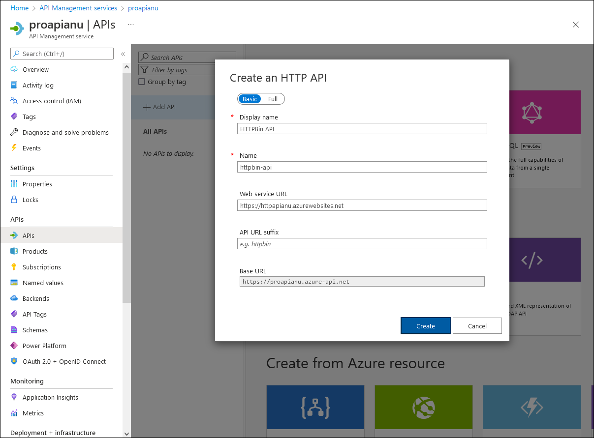
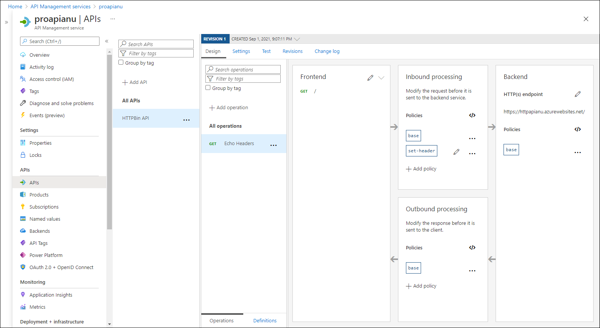

---
lab:
  az204Title: 'Lab 08: Create a multi-tier solution by using Azure services'
  az020Title: 'Lab 08: Create a multi-tier solution by using Azure services'
  az204Module: 'Module 08: Implement API Management'
  az020Module: 'Module 08: Implement API Management'
---

# <a name="lab-08-create-a-multi-tier-solution-by-using-azure-services"></a>Lab 08: Erstellen einer Lösung mit mehreren Ebenen mithilfe von Azure-Diensten

## <a name="microsoft-azure-user-interface"></a>Microsoft Azure-Benutzeroberfläche

Given the dynamic nature of Microsoft cloud tools, you might experience Azure UI changes that occur after the development of this training content. As a result, the lab instructions and lab steps might not align correctly.

Microsoft updates this training course when the community alerts us to needed changes. However, cloud updates occur frequently, so you might encounter UI changes before this training content updates. <bpt id="p1">**</bpt>If this occurs, adapt to the changes, and then work through them in the labs as needed.<ept id="p1">**</ept>


## <a name="instructions"></a>Anweisungen

### <a name="before-you-start"></a>Vorbereitung

#### <a name="sign-in-to-the-lab-environment"></a>Anmelden bei der Laborumgebung

Melden Sie sich mit den folgenden Anmeldeinformationen bei Ihrer Windows 10-VM an:
    
-   Benutzername: **Admin**

-   Kennwort: **Pa55w.rd**

> **Hinweis**: Ihr Kursleiter stellt Anweisungen zum Herstellen einer Verbindung mit der virtuellen Laborumgebung zur Verfügung.

#### <a name="review-the-installed-applications"></a>Überprüfen der installierten Anwendungen

Find the taskbar on your Windows 10 desktop. The taskbar contains the icons for the applications that you'll use in this lab:
    
-   Microsoft Edge

## <a name="architecture-diagram"></a>Architekturdiagramm


### <a name="exercise-1-create-an-azure-app-service-resource-by-using-a-docker-container-image"></a>Übung 1: Erstellen einer Azure App Service-Ressource mithilfe eines Docker-Containerimages

#### <a name="task-1-open-the-azure-portal"></a>Aufgabe 1: Öffnen des Azure-Portals

1.  Wählen Sie auf der Taskleiste das Symbol **Microsoft Edge** aus.

1.  Navigieren Sie im sich öffnenden Browserfenster zum Azure-Portal ([portal.azure.com](https://portal.azure.com)), und melden Sie sich dann mit dem Konto an, das Sie für dieses Lab verwenden werden.

    > Aufgrund der dynamischen Natur der Microsoft-Cloudtools kann es vorkommen, dass sich die Azure-Benutzeroberfläche nach der Entwicklung dieses Trainingsinhalts ändert.

#### <a name="task-2-create-a-web-app-by-using-azure-app-service-resource-by-using-an-httpbin-container-image"></a>Aufgabe 2: Erstellen einer Web-App mit einer Azure App Service-Ressource mithilfe eines httpbin-Containerimages

1.  Verwenden Sie im Azure-Portal das Textfeld **Ressourcen, Dienste und Dokumente durchsuchen**, um nach **App Services** zu suchen. Wählen Sie in der Ergebnisliste dann **App Services** aus.

1.  Wählen Sie auf dem Blatt **App Services** die Option **+ Erstellen** aus.

1.  Führen Sie auf dem Blatt **Web-App erstellen** auf der Registerkarte **Grundlagen** die folgenden Aktionen aus:
    
    | Einstellung | Aktion |
    | -- | -- |
    | Dropdownliste **Abonnement** | Übernehmen Sie den Standardwert. |
    | Abschnitt **Ressourcengruppe** | Wählen Sie **Neu erstellen** aus, geben Sie **ApiService** ein, und wählen Sie dann **OK** aus. |
    | Textfeld **Name** | Geben Sie **httpapi** *[Ihr Name]* ein. |
    | Abschnitt **Veröffentlichen** | Wählen Sie **Docker-Container** aus. |
    | Abschnitt **Betriebssystem** | Wählen Sie **Linux** aus. |
    | Dropdownliste **Region** | Wählen Sie eine beliebige Azure-Region aus, in der Sie eine Azure-Web-App bereitstellen können. |
    | Abschnitt **App Service-Plan** | Wählen Sie **Neu erstellen** aus, geben Sie den Wert **ApiPlan** in das Textfeld **Name** ein, und wählen Sie dann **OK** aus. |
    | Abschnitt **SKU und Größe** | Wählen Sie **Größe ändern** und auf dem Blatt **Spezifikationsauswahl** die Option **Alle Optionen anzeigen** aus. Wählen Sie anschließend **S1** und dann **Anwenden** aus. |

1.  Wählen Sie **Weiter: Docker >** aus.

1.  Führen Sie auf der Registerkarte **Docker** die folgenden Aktionen aus, und wählen Sie dann **Überprüfen + erstellen** aus:

    | Einstellung | Aktion |
    | -- | -- |
    | Dropdownliste **Optionen** | Wählen Sie **Einzelner Container** aus. |
    | Dropdownliste **Imagequelle** | Wählen Sie **Docker Hub**. |
    | Dropdownliste **Zugriffstyp** | Wählen Sie **Öffentlich (10.0.0.0/24)** . |
    | Textfeld **Image und Tag** | Geben Sie **kennethreitz/httpbin:latest** ein. |

1.  Überprüfen Sie auf der Registerkarte **Überprüfen und erstellen** die Optionen, die Sie in den vorherigen Schritten ausgewählt haben.

1.  Wählen Sie **Erstellen** aus, um die Web-App mit Ihrer angegebenen Konfiguration zu erstellen.

    > **Hinweis**: Warten Sie, bis die Erstellungsaufgabe abgeschlossen ist, bevor Sie mit diesem Lab fortfahren.

#### <a name="task-3-test-the-httpbin-web-application"></a>Aufgabe 3: Testen der httpbin-Webanwendung

1.  Verwenden Sie im Azure-Portal das Textfeld **Ressourcen, Dienste und Dokumente durchsuchen**, um nach **App Services** zu suchen. Wählen Sie in der Ergebnisliste dann **App Services** aus.

1.  Wählen Sie auf dem Blatt **App Services** die neu erstellte Web-App aus.

1.  Wählen Sie auf dem Blatt, auf dem die Eigenschaften der neu erstellten App angezeigt werden, **Durchsuchen** aus.

1.  Führen Sie innerhalb der Webanwendung die folgenden Aktionen durch:

    Daher sind die Lab-Anweisungen und Lab-Schritte möglicherweise nicht mehr zutreffend.

    b.  Select <bpt id="p1">**</bpt>GET /html<ept id="p1">**</ept>.

    Microsoft aktualisiert diesen Trainingskurs, wenn die Community uns über die erforderlichen Änderungen informiert.

    Der folgende Screenshot zeigt den Bereich **Ausprobieren** der Webanwendung.

    

    Cloudupdates kommen jedoch häufig vor, sodass möglicherweise Änderungen an der Benutzeroberfläche auftreten, bevor diese Trainingsinhalte aktualisiert werden.

    **Wenn dies der Fall ist, stellen Sie sich auf die Veränderungen ein, und arbeiten Sie sie bei Bedarf in den Labs durch.**

    f.  Review the value of the <bpt id="p1">**</bpt>Request URL<ept id="p1">**</ept> text box.

1.  Führen Sie innerhalb der Webanwendung die folgenden Aktionen durch:

    a.  Select <bpt id="p1">**</bpt>Dynamic data<ept id="p1">**</ept>.

    b.  Select <bpt id="p1">**</bpt>GET /bytes/{n}<ept id="p1">**</ept>.

    c.  Select <bpt id="p1">**</bpt>Try it out<ept id="p1">**</ept>.

    d.  In the <bpt id="p1">**</bpt>n<ept id="p1">**</ept> text box, enter <bpt id="p2">**</bpt>25<ept id="p2">**</ept>.

    e.  Select <bpt id="p1">**</bpt>Execute<ept id="p1">**</ept>.

    f.  Review the value of the <bpt id="p1">**</bpt>Response body<ept id="p1">**</ept> and <bpt id="p2">**</bpt>Response headers<ept id="p2">**</ept> text boxes.

    g.  Select <bpt id="p1">**</bpt>Download file<ept id="p1">**</ept>, and after the file downloads, open it in Notepad, review its content, and then close it.

    > **Hinweis**: Die Datei enthält eine Sequenz von zufällig generierten Bytes.

    Der folgende Screenshot zeigt den Bereich der dynamischen Daten in der Webanwendung.
  
    

1.  Führen Sie innerhalb der Webanwendung die folgenden Aktionen durch:

    a.  Select <bpt id="p1">**</bpt>Status codes<ept id="p1">**</ept>.

    Suchen Sie auf Ihrem Windows 10-Desktop nach der Taskleiste.

    Die Taskleiste enthält die Symbole für die Anwendungen, die Sie in diesem Lab verwenden:

    d.  In the <bpt id="p1">**</bpt>codes<ept id="p1">**</ept> text box, enter <bpt id="p2">**</bpt>404<ept id="p2">**</ept>.

    e.  Select <bpt id="p1">**</bpt>Execute<ept id="p1">**</ept>.

    f.  Review the <bpt id="p1">**</bpt>Server response<ept id="p1">**</ept> and note that it includes <bpt id="p2">**</bpt>Error: NOT FOUND<ept id="p2">**</ept> entry.
     
1.  Schließen Sie das Browserfenster, in dem die Webanwendung angezeigt wird.

1.  Wechseln Sie zurück zu dem Browserfenster, in dem die Web-App **httpapi** _[Ihr Name]_ angezeigt wird.

1.  Wählen Sie im Abschnitt **Einstellungen** den **Eigenschaften**-Link aus.

1.  In the <bpt id="p1">**</bpt>Properties<ept id="p1">**</ept> section, record the value of the <bpt id="p2">**</bpt>URL<ept id="p2">**</ept> link. You'll use this value later in the lab to send requests to the corresponding API.

#### <a name="review"></a>Überprüfung

In dieser Übung haben Sie eine neue Azure-Web-App mithilfe eines Containerimages erstellt, das aus Docker Hub stammt.

### <a name="exercise-2-build-an-api-proxy-tier-by-using-azure-api-management"></a>Übung 2: Erstellen einer API-Proxyebene mithilfe von Azure API Management

#### <a name="task-1-create-an-api-management-resource"></a>Aufgabe 1: Erstellen einer API Management-Ressource

1.  Verwenden Sie im Azure-Portal das Textfeld **Ressourcen, Dienste und Dokumente durchsuchen**, um nach **API Management-Dienste** zu suchen. Wählen Sie in der Ergebnisliste dann **API Management-Dienste** aus.

1.  Wählen Sie auf dem Blatt **API Management-Dienste** die Option **+ Erstellen** aus.

1.  Führen Sie auf dem Blatt **API Management-Gateway installieren** die folgenden Aktionen aus, und wählen Sie dann **Überprüfen und erstellen** aus:

    
    | Einstellung | Aktion |
    | -- | -- |
    | Dropdownliste **Abonnement** | Übernehmen Sie den Standardwert. |
    | Abschnitt **Ressourcengruppe** | Wählen Sie die Gruppe **ApiService** aus, die Sie zuvor im Lab erstellt haben. |
    | Liste **Region** | Wählen Sie dieselbe Region aus, die Sie in der vorherigen Übung ausgewählt haben. |
    | Textfeld **Ressourcenname** | Geben Sie **proapi** *[Ihr Name]* ein. |
    | Textfeld **Organisationsname** | Geben Sie **Contoso** ein. |
    | Textfeld **Administrator-E-Mail** | Geben Sie `admin@contoso.com` ein. |
    | Dropdownliste **Tarif** | **Verbrauch (99,95 % SLA)** |

    Der folgende Screenshot zeigt die konfigurierten Einstellungen des Blatts **API Management erstellen** der Webanwendung.
    
    

1.  Überprüfen Sie auf der Registerkarte **Überprüfen und erstellen** die Option, die Sie im vorherigen Schritt angegeben haben, und wählen Sie dann **Erstellen** aus.

    > **Hinweis**: Warten Sie, bis die Erstellungsaufgabe abgeschlossen ist, bevor Sie mit diesem Lab fortfahren.

1. Wählen Sie auf dem Blatt **Bereitstellungsübersicht** die Option **Zu Ressource wechseln** aus.

#### <a name="task-2-define-a-new-api"></a>Aufgabe 2: Definieren einer neuen API

1.  Wählen Sie auf dem Blatt **API Management-Dienste** im Abschnitt **APIs** die Option **APIs** aus.

1.  Wählen Sie im Abschnitt **Define a new API** (Definieren einer neuen API) die Option **HTTP** aus.

1.  Führen Sie im Fenster **HTTP-API erstellen** die folgenden Aktionen aus, und wählen Sie dann **Erstellen** aus:
    
    | Einstellung | Aktion |
    | -- | -- |
    | Textfeld **Anzeigename** | Geben Sie **HTTPBin-API** ein. |
    | Textfeld **Name** | Geben Sie **httpbin-api** ein. |
    | Textfeld **Webdienst-URL** | Enter the URL for the web app that you copied earlier in this lab. <bpt id="p1">**</bpt>Note<ept id="p1">**</ept>: Make sure that the URL starts with the https:// prefix |
    | Textfeld **API-URL-Suffix** | Lassen Sie es leer. |
 
    Der folgende Screenshot zeigt die konfigurierten Einstellungen des Fensters **Leere API erstellen** der Webanwendung.

    

    > **Hinweis**: Warten Sie, bis die Erstellung der neuen API abgeschlossen ist.

1.  Wählen Sie auf der Registerkarte **Entwurf** die Option **+ Vorgang hinzufügen** aus.

1.  Führen Sie im Abschnitt **Vorgang hinzufügen** die folgenden Aktionen aus, und wählen Sie dann **Speichern** aus:


    | Einstellung | Aktion |
    | -- | -- |
    | Textfeld **Anzeigename** | Geben Sie **Echo Headers** ein. |
    | Textfeld **Name** | Überprüfen Sie, ob der Wert auf **echo-headers** festgelegt ist. |
    | Liste **URL** | Wählen Sie **GET** aus. |
    | Textfeld **URL** | Eingeben von **/** |

    Der folgende Screenshot zeigt die konfigurierten Einstellungen des Abschnitts **Vorgang hinzufügen**.
    
    

    
1.  Zurück auf der Registerkarte **Entwurf**, wählen Sie in der Liste der Vorgänge die Option **Echo Headers** aus.

1.  Wählen Sie im Abschnitt **Entwurf** auf der Kachel **Eingehende Verarbeitung** die Option **+ Richtlinie hinzufügen** aus.

1.  Wählen Sie im Abschnitt **Eingehende Richtlinie hinzufügen** die Kachel **Header festlegen** aus.

1.  Führen Sie im Abschnitt **Header festlegen** die folgenden Aktionen aus, und wählen Sie dann **Speichern** aus:
    
    | Einstellung | Aktion |
    | -- | -- |
    | Textfeld **Name**    | Geben Sie **source** (Quelle) ein. |
    | Textfeld **Wert** | Wählen Sie die Liste und dann **Wert hinzufügen** aus, und geben Sie dann **azure-api-mgmt** ein. |
    | Liste **Aktion** | Wählen Sie **Anfügen** aus. |

    Der folgende Screenshot zeigt die konfigurierten Einstellungen des Abschnitts **Entwurf**.

    

1.  Zurück auf der Registerkarte **Entwurf**, wählen Sie in der Liste der Vorgänge die Option **Echo Headers** aus.

1.  Wählen Sie im Abschnitt **Entwurf** für **Echo Headers** auf der Kachel **Back-End** das Stiftsymbol aus.

1.  Führen Sie im Abschnitt **Back-End** die folgenden Aktionen aus, und wählen Sie dann **Speichern** aus:

    | Einstellung | Aktion |
    | -- | -- |
    | Abschnitt **Dienst-URL** | Aktivieren Sie das Kontrollkästchen **Außerkraftsetzung**. |
    | Textfeld **Dienst-URL** | Append the value <bpt id="p1">**</bpt>/headers<ept id="p1">**</ept> to its current value. <bpt id="p1">**</bpt>Note<ept id="p1">**</ept>: For example, if the current value is <ph id="ph1">`http://httpapi[yourname].azurewebsites.net`</ph>, the new value will be <ph id="ph2">`http://httpapi[yourname].azurewebsites.net/headers`</ph> |
    
1.  Zurück auf der Registerkarte **Entwurf** wählen Sie in der Liste der Vorgänge die Option **Echo Headers** und dann die Registerkarte **Test** aus.

1.  Wählen Sie im Abschnitt **Echo Headers** die Option **Senden** aus.

    Der folgende Screenshot zeigt die konfigurierten Einstellungen des Abschnitts **Echo Headers**.

    
    
1.  Überprüfen Sie die Ergebnisse der API-Anforderung.

    > <bpt id="p1">**</bpt>Note<ept id="p1">**</ept>: Verify that there are many headers sent as part of your request that are echoed in the response. They should include the new <bpt id="p1">**</bpt>Source<ept id="p1">**</ept> header that you created as part of this task.
     
    Der folgende Screenshot zeigt die Antwort auf die **Echo Headers**-Anforderung.

    
     
1.  Wählen Sie die Registerkarte **Entwurf** aus, um zur Liste der Vorgänge zurückzukehren.

#### <a name="task-3-manipulate-an-api-response"></a>Aufgabe 3: Bearbeiten einer API-Antwort

1.  Wählen Sie auf der Registerkarte **Entwurf** die Option **+ Vorgang hinzufügen** aus.

1.  Führen Sie im Abschnitt **Vorgang hinzufügen** die folgenden Aktionen aus, und wählen Sie dann **Speichern** aus:

    | Einstellung | Aktion |
    | -- | -- |
    | Textfeld **Anzeigename** | Geben Sie **Get Legacy Data** (Legacydaten abrufen) ein. |
    | Textfeld **Name** | Stellen Sie sicher, dass der Wert auf **get-legacy-data** festgelegt ist. |
    | Liste **URL** | Stellen Sie sicher, dass der Wert auf **GET** festgelegt ist. |
    | Textfeld **URL** | Geben Sie **/xml** ein. |

1.  Zurück auf der Registerkarte **Entwurf**, wählen Sie in der Liste der Vorgänge die Option **Get Legacy Data** (Legacydaten abrufen) aus.

1.  Wählen Sie die Registerkarte **Test** und dann **Senden** aus.

1.  Überprüfen Sie die Ergebnisse der API-Anforderung.

    > **Hinweis**: Zu diesem Zeitpunkt sollten die Ergebnisse im XML-Format vorliegen.

    Der folgende Screenshot zeigt die Ergebnisse der API-Anforderung.
    
    

    
1.  Wählen Sie die Registerkarte **Entwurf** und dann die Option **Get Legacy Data** (Legacydaten abrufen) aus.

1.  Wählen Sie im Bereich **Entwurf** im Abschnitt **Ausgehende Verarbeitung** die Option **Richtlinie hinzufügen** aus.
    
    Der folgende Screenshot zeigt den Abschnitt **Ausgehende Verarbeitung**.
    
    
    
1.  Wählen Sie im Abschnitt **Ausgehende Richtlinie hinzufügen** die Kachel **Sonstige Richtlinien** aus.

1.  Suchen Sie im Richtliniencode-Editor den folgenden Block mit XML-Inhalt:

    ```
    <outbound>
        <base />
    </outbound>
    ```

1.  Ersetzen Sie diesen XML-Block durch den folgenden XML-Block:

    ```
    <outbound>
        <base />
        <xml-to-json kind="direct" apply="always" consider-accept-header="false" />
    </outbound>
    ```

1.  Wählen Sie im Richtliniencode-Editor die Option **Speichern** aus.

1.  Zurück auf der Registerkarte **Entwurf**, wählen Sie in der Liste der Vorgänge die Option **Get Legacy Data** (Legacydaten abrufen) und dann **Test** aus.

1.  Wählen Sie im Abschnitt **Get Legacy Data** (Legacydaten abrufen) die Option **Senden** aus.

1.  Überprüfen Sie die Ergebnisse der API-Anforderung.

    > **Hinweis**: Die neuen Ergebnisse liegen im Format JavaScript Object Notation (JSON) vor.

1.  Führen Sie innerhalb des Abschnitts **HTTP-Antwort** die folgenden Aktionen aus:

    1.  Wählen Sie **Ablaufverfolgung** aus.

    1.  Überprüfen Sie den Inhalt der Textfelder **Back-End** und **Ausgehend** und beachten Sie, dass sie Details zu den entsprechenden API-Vorgängen mit den entsprechenden Zeitangaben enthalten.

#### <a name="task-4-manipulate-an-api-request"></a>Aufgabe 4: Bearbeiten einer API-Anforderung

1.  Wählen Sie auf der Registerkarte **Entwurf** die Option **+ Vorgang hinzufügen** aus.

1.  Führen Sie im Abschnitt **Vorgang hinzufügen** die folgenden Aktionen aus, und wählen Sie dann **Speichern** aus:

    | Einstellung  | Aktion |
    | -- | -- |
    | Textfeld **Anzeigename** | Geben Sie **Modify Status Code** (Statuscode ändern) ein. |
    | Textfeld **Name** | Stellen Sie sicher, dass der Wert auf **modify-status-code** festgelegt ist. |
    | Liste **URL** | Wählen Sie **GET** aus. |
    | Textfeld **URL** | Geben Sie **/status/404** ein. |

1.  Zurück auf der Registerkarte **Entwurf**, wählen Sie in der Liste der Vorgänge die Option **Modify Status Code** (Statuscode ändern) aus.

1.  Wählen Sie im Abschnitt **Entwurf** auf der Kachel **Eingehende Verarbeitung** die Option **+ Richtlinie hinzufügen** aus.

1.  Wählen Sie im Abschnitt **Eingehende Richtlinie hinzufügen** die Kachel **URL umschreiben** aus.

1.  Führen Sie im Abschnitt **URL umschreiben** die folgenden Aktionen aus:
       
    a.  In the <bpt id="p1">**</bpt>Backend<ept id="p1">**</ept> text box, enter <bpt id="p2">**</bpt>/status/200<ept id="p2">**</ept>.
    
    **Hinweis**: Wenn Sie sich zum ersten Mal am Azure-Portal anmelden, wird Ihnen eine Tour durch das Portal angeboten.

1.  Zurück auf der Registerkarte **Entwurf** wählen Sie in der Liste der Vorgänge die Option **Modify Status Code** (Statuscode ändern) und dann die Registerkarte **Test** aus.
    
1.  Wählen Sie im Abschnitt **Modify Status Code** (Statuscode ändern) die Option **Senden** aus.

1.  Überprüfen Sie die Ergebnisse der API-Anforderung.

    > **Hinweis**: Überprüfen Sie, ob die Anforderung die Antwort **HTTP/1.1 200 OK** zurückgegeben hat.
   
#### <a name="review"></a>Überprüfung

In dieser Übung haben Sie eine Proxyebene zwischen Ihrer App Service-Ressource und allen Entwicklern erstellt, die deren API abfragen möchten.

### <a name="exercise-3-clean-up-your-subscription"></a>Übung 3: Bereinigen Ihres Abonnements

#### <a name="task-1-open-azure-cloud-shell"></a>Aufgabe 1: Öffnen von Azure Cloud Shell

1.  Wählen Sie **Erste Schritte** aus, um die Tour zu überspringen und mit der Verwendung des Portals zu beginnen.

      > <bpt id="p1">**</bpt>Note<ept id="p1">**</ept>: If this is the first time you're starting <bpt id="p2">**</bpt>Cloud Shell<ept id="p2">**</ept>, when prompted to select either <bpt id="p3">**</bpt>Bash<ept id="p3">**</ept> or <bpt id="p4">**</bpt>PowerShell<ept id="p4">**</ept>, select <bpt id="p5">**</bpt>PowerShell<ept id="p5">**</ept>. When you're presented with the <bpt id="p1">**</bpt>You have no storage mounted<ept id="p1">**</ept> message, select the subscription you're using in this lab, and then select <bpt id="p2">**</bpt>Create storage<ept id="p2">**</ept>.

#### <a name="task-2-delete-resource-groups"></a>Aufgabe 2: Löschen von Ressourcengruppen

1.  Führen Sie im Bereich **Cloud Shell** den folgenden Befehl aus, um die Ressourcengruppe **ApiService** zu löschen:

    ```
    az group delete --name ApiService --no-wait --yes
    ```
    
     > **Hinweis**: Der Befehl wird (dem *--no-wait*-Parameter entsprechend) asynchron ausgeführt. Dies bedeutet, dass Sie zwar einen weiteren Azure CLI-Befehl in derselben Bash-Sitzung direkt im Anschluss ausführen können, es jedoch einige Minuten dauert, bis die Ressourcengruppen tatsächlich entfernt wurden.
  
1.  Schließen Sie den Bereich **Cloud Shell** im Portal.

#### <a name="task-3-close-the-active-applications"></a>Aufgabe 3: Schließen der aktiven Anwendungen

1.  Schließen Sie die aktuell ausgeführte Microsoft Edge-Anwendung.

#### <a name="review"></a>Überprüfung

In dieser Übung haben Sie Ihr Abonnement bereinigt, indem Sie die in diesem Lab verwendeten Ressourcengruppen entfernt haben.
