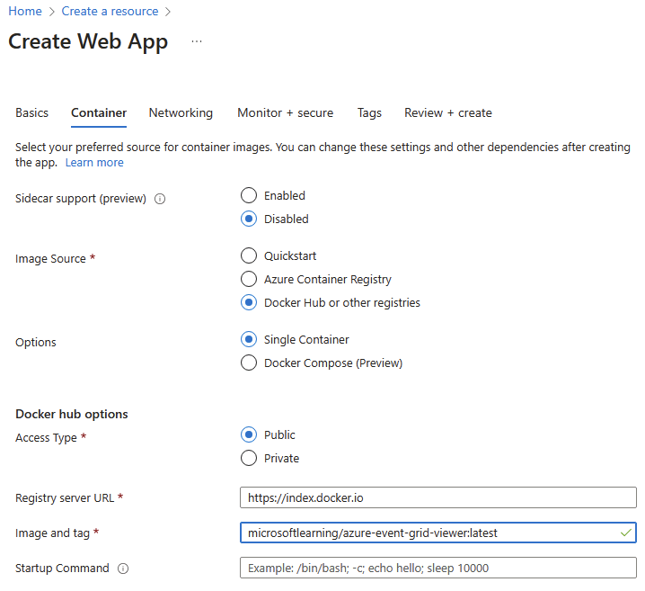

---
lab:
  az204Title: 'Lab 09: Publish and subscribe to Event Grid events'
  az020Title: 'Lab 09: Publish and subscribe to Event Grid events'
  az204Module: 'Module 09: Develop event-based solutions'
  az020Module: 'Module 09: Develop event-based solutions'
---

# <a name="lab-09-publish-and-subscribe-to-event-grid-events"></a>Lab 09: Veröffentlichen und Abonnieren von Event Grid-Ereignissen

## <a name="microsoft-azure-user-interface"></a>Microsoft Azure-Benutzeroberfläche

Given the dynamic nature of Microsoft cloud tools, you might experience Azure UI changes that occur after the development of this training content. As a result, the lab instructions and lab steps might not align correctly.

Microsoft updates this training course when the community alerts us to needed changes. However, cloud updates occur frequently, so you might encounter UI changes before this training content updates. <bpt id="p1">**</bpt>If this occurs, adapt to the changes, and then work through them in the labs as needed.<ept id="p1">**</ept>

## <a name="instructions"></a>Anweisungen

### <a name="before-you-start"></a>Vorbereitung

#### <a name="sign-in-to-the-lab-environment"></a>Anmelden bei der Laborumgebung

Melden Sie sich mithilfe der folgenden Anmeldeinformationen bei Ihrer Windows 10-VM an:

- Benutzername: **Admin**

- Kennwort: **Pa55w.rd**

> **Hinweis**: Ihr Kursleiter stellt Anweisungen zum Herstellen einer Verbindung mit der virtuellen Laborumgebung zur Verfügung.

#### <a name="review-the-installed-applications"></a>Überprüfen der installierten Anwendungen

Find the taskbar on your Windows 10 desktop. The taskbar contains the icons for the applications that you'll use in this lab, including:

- Microsoft Edge

- Microsoft Visual Studio Code

## <a name="architecture-diagram"></a>Architekturdiagramm


### <a name="exercise-1-create-azure-resources"></a>Übung 1: Erstellen von Azure-Ressourcen

#### <a name="task-1-open-the-azure-portal"></a>Aufgabe 1: Öffnen des Azure-Portals

1. Wählen Sie auf der Taskleiste das Symbol **Microsoft Edge** aus.

1. Navigieren Sie im geöffneten Browserfenster zum Azure-Portal (<https://portal.azure.com>), und melden Sie sich dann mit dem Konto an, das Sie für dieses Lab verwenden werden.

    > Aufgrund der dynamischen Natur der Microsoft-Cloudtools kann es vorkommen, dass sich die Azure-Benutzeroberfläche nach der Entwicklung dieses Trainingsinhalts ändert.

#### <a name="task-2-open-azure-cloud-shell"></a>Aufgabe 2: Öffnen von Azure Cloud Shell

1. Daher sind die Lab-Anweisungen und Lab-Schritte möglicherweise nicht mehr zutreffend.

    > <bpt id="p1">**</bpt>Note<ept id="p1">**</ept>: If this is the first time you are starting <bpt id="p2">**</bpt>Cloud Shell<ept id="p2">**</ept>, when prompted to select either <bpt id="p3">**</bpt>Bash<ept id="p3">**</ept> or <bpt id="p4">**</bpt>PowerShell<ept id="p4">**</ept>, select <bpt id="p5">**</bpt>Bash<ept id="p5">**</ept>. When you are presented with the <bpt id="p1">**</bpt>You have no storage mounted<ept id="p1">**</ept> message, select the subscription you are using in this lab, and then select <bpt id="p2">**</bpt>Create storage<ept id="p2">**</ept>.

1. Führen Sie im Azure-Portal an der **Cloud Shell**-Eingabeaufforderung den folgenden Befehl aus, um die Version des Azure CLI-Tools (Azure-Befehlszeilenschnittstelle) abzurufen:

    ```bash
    az --version
    ```

#### <a name="task-3-review-the-microsofteventgrid-provider-registration"></a>Aufgabe 3: Überprüfen der Microsoft.EventGrid-Anbieterregistrierung

1. Führen Sie im Bereich **Cloud Shell** den folgenden Befehl aus, um eine Liste von Untergruppen und Befehlen auf Stammebene der Azure CLI abzurufen:

    ```bash
    az --help
    ```

1. Führen Sie im Bereich **Cloud Shell** den folgenden Befehl aus, um eine Liste der Befehle abzurufen, die für Ressourcenanbieter verfügbar sind:

    ```bash
    az provider --help
    ```

1. Führen Sie im Bereich **Cloud Shell** den folgenden Befehl aus, um alle derzeit registrierten Anbieter aufzulisten:

    ```bash
    az provider list
    ```

1. Führen Sie im Bereich **Cloud Shell** den folgenden Befehl aus, um nur die Namespaces der derzeit registrierten Anbieter aufzulisten:

    ```bash
    az provider list --query "[].namespace"
    ```

1. Microsoft aktualisiert diesen Trainingskurs, wenn die Community uns über die erforderlichen Änderungen informiert.

1. Schließen Sie den **Cloud Shell**-Bereich.

#### <a name="task-4-create-a-custom-event-grid-topic"></a>Aufgabe 4: Erstellen eines benutzerdefinierten Event Grid-Themas

1. Wählen Sie im Navigationsbereich des Azure-Portals die Option **Ressource erstellen** aus.

1. Geben Sie auf dem Blatt **Ressource erstellen** im Textfeld **Dienste und Marketplace durchsuchen** den Text **Event Grid-Thema** ein, und drücken Sie dann die EINGABETASTE.

1. Wählen Sie auf dem Blatt mit den **Marketplace**-Suchergebnissen das **Event Grid-Thema**-Ergebnis und dann **Erstellen** aus.

1. Führen Sie auf dem Blatt **Thema erstellen** auf der Registerkarte **Grundlagen** die folgenden Aktionen aus, und wählen Sie die Registerkarte **Erweitert** aus:

    | Einstellung | Aktion |
    | -- | -- |
    | Dropdownliste **Abonnement**  | Übernehmen Sie den Standardwert. |
    | Dropdownliste **Ressourcengruppe** | Wählen Sie **Neu erstellen** aus, geben Sie **PubSubEvents** ein, und wählen Sie dann **OK** aus. |
    | Textfeld **Name** | Geben Sie **hrtopic** _[Ihr_Name]_ ein. |
    | Dropdownliste **Region** | Wählen Sie **USA, Osten** aus. |

   Der folgende Screenshot veranschaulicht die konfigurierten Einstellungen auf der Registerkarte **Grundlagen**.

   

1. Wählen Sie auf der Registerkarte **Erweitert** in der Dropdownliste **Ereignisschema** die Option **Event Grid-Schema** und dann die Option **Überprüfen und erstellen** aus.

1. Überprüfen Sie auf der Registerkarte **Überprüfen und erstellen** die Optionen, die Sie in den vorherigen Schritten ausgewählt haben.

1. Wählen Sie **Erstellen** aus, um das Event Grid-Thema mithilfe Ihrer angegebenen Konfiguration zu erstellen.
  
    > Cloudupdates kommen jedoch häufig vor, sodass möglicherweise Änderungen an der Benutzeroberfläche auftreten, bevor diese Trainingsinhalte aktualisiert werden.

#### <a name="task-5-deploy-the-azure-event-grid-viewer-to-a-web-app"></a>Aufgabe 5: Bereitstellen von Azure Event Grid Viewer für eine Web-App

1. Wählen Sie im Navigationsbereich des Azure-Portals die Option **Ressource erstellen** aus.

1. Geben Sie auf dem Blatt **Ressource erstellen** im Textfeld **Dienste und Marketplace durchsuchen** den Text **Web App** ein, und drücken Sie dann die EINGABETASTE.

1. Wählen Sie auf dem Blatt mit den **Marketplace**-Suchergebnissen das **Web-App**-Ergebnis und dann **Erstellen** aus.

1. Führen Sie auf dem Blatt **Web-App erstellen** auf der Registerkarte **Grundlagen** die folgenden Aktionen aus, und wählen Sie **Weiter: Docker** aus:

   | Einstellung | Aktion |
   | -- | -- |
   | Dropdownliste **Abonnement** | Übernehmen Sie den Standardwert. |
   | Dropdownliste **Ressourcengruppe** | Wählen Sie **PubSubEvents** in der Liste aus. |
   | Textfeld **Name**  | Geben Sie **eventviewer** _[Ihr_Name]_ ein. |
   | Abschnitt **Veröffentlichen** | Wählen Sie **Docker-Container** aus. |
   | Abschnitt **Betriebssystem** | Wählen Sie **Linux** aus. |
   | Dropdownliste **Region** | Wählen Sie **USA, Osten** aus. |
   | Abschnitt **Linux-Plan (USA, Osten)** | Wählen Sie **Neu erstellen** aus, geben Sie im Textfeld **Name** den Namen **EventPlan** ein, und wählen Sie dann **OK** aus. |
   | Abschnitt **SKU und Größe** | Übernehmen Sie den Standardwert. |

   Der folgende Screenshot veranschaulicht die konfigurierten Einstellungen auf dem Blatt **Web-App erstellen**.

   

1. Führen Sie auf der Registerkarte **Docker** die folgenden Aktionen aus, und wählen Sie **Überprüfen und erstellen** aus:

    | Einstellung | Aktion |
    | -- | -- |
    | Dropdownliste **Optionen** | Wählen Sie **Einzelner Container** aus. |
    | Dropdownliste **Imagequelle** | Wählen Sie **Docker Hub**. |
    | Dropdownliste **Zugriffstyp** | Wählen Sie **Öffentlich (10.0.0.0/24)** . |
    | Textfeld **Image und Tag** | Geben Sie **microsoftlearning/azure-event-grid-viewer:latest** ein. |

   Der folgende Screenshot veranschaulicht die konfigurierten Einstellungen auf der Registerkarte **Docker**.

   

1. Überprüfen Sie auf der Registerkarte **Überprüfen und erstellen** die Optionen, die Sie in den vorherigen Schritten ausgewählt haben.

1. Wählen Sie **Erstellen** aus, um die Web-App mit Ihrer angegebenen Konfiguration zu erstellen.
  
    > **Wenn dies der Fall ist, stellen Sie sich auf die Veränderungen ein, und arbeiten Sie sie bei Bedarf in den Labs durch.**

#### <a name="review"></a>Überprüfung

In dieser Übung haben Sie das Event Grid-Thema und eine Web-App erstellt, die Sie im weiteren Verlauf des Labs verwenden werden.

### <a name="exercise-2-create-an-event-grid-subscription"></a>Übung 2: Erstellen eines Event Grid-Abonnements

#### <a name="task-1-access-the-event-grid-viewer-web-application"></a>Aufgabe 1: Zugreifen auf die Event Grid Viewer-Webanwendung

1. Wählen Sie im Navigationsbereich des Azure-Portals die Option **Ressourcengruppe** aus.

1. Wählen Sie auf dem Blatt **Ressourcengruppen** die Ressourcengruppe **PubSubEvents** aus.

1. Wählen Sie auf dem Blatt **PubSubEvents** die Web-App **eventviewer** _[Ihr Name]_ aus.

1. Wählen Sie auf dem Blatt **App Service** in der Kategorie **Einstellungen** den Link **Eigenschaften** aus.

1. In the <bpt id="p1">**</bpt>Properties<ept id="p1">**</ept> section, record the value of the <bpt id="p2">**</bpt>URL<ept id="p2">**</ept> link. You'll use this value later in the lab.

1. Wählen Sie **Übersicht** und dann **Durchsuchen** aus.

1. Observe the currently running <bpt id="p1">**</bpt>Azure Event Grid Viewer<ept id="p1">**</ept> web application. Leave this web application running for the remainder of the lab.

    > <bpt id="p1">**</bpt>Note<ept id="p1">**</ept>: This web application will update in real time as events are sent to its endpoint. You'll use this application to monitor events throughout the lab.

1. Kehren Sie zum derzeit geöffneten Browserfenster zurück, in dem das Azure-Portal angezeigt wird.

#### <a name="task-2-create-a-new-subscription"></a>Aufgabe 2: Erstellen eines neuen Abonnements

1. Wählen Sie im Navigationsbereich des Azure-Portals die Option **Ressourcengruppe** aus.

1. Wählen Sie auf dem Blatt **Ressourcengruppen** die Ressourcengruppe **PubSubEvents** aus, die Sie zuvor in diesem Lab erstellt haben.

1. Wählen Sie auf dem Blatt **PubSubEvents** das Event Grid-Thema **hrtopic** _[Ihr Name]_ aus, das Sie zuvor in diesem Lab erstellt haben.

1. Wählen Sie auf dem Blatt **Event Grid-Thema** die Option **+ Ereignisabonnement** aus.

1. Führen Sie auf dem Blatt **Ereignisabonnement erstellen** die folgenden Aktionen aus, und wählen Sie dann **Erstellen** aus:

    | Einstellung | Aktion |
    | -- | -- |
    | Textfeld **Name**  | Geben Sie **basicsub** ein. |
    | Dropdownliste **Ereignisschema** | Wählen Sie **Event Grid-Schema** aus. |
    | Dropdownliste **Endpunkttyp** | Wählen Sie **Webhook** aus. |
    | **Endpunkt** | Select <bpt id="p1">**</bpt>Select an endpoint<ept id="p1">**</ept>. In the <bpt id="p1">**</bpt>Subscriber Endpoint<ept id="p1">**</ept> text box, enter the <bpt id="p2">**</bpt>Web App URL<ept id="p2">**</ept> value that you recorded previously, ensure that it uses an <bpt id="p3">**</bpt>https://<ept id="p3">**</ept> prefix, add the suffix <bpt id="p4">**</bpt>/api/updates<ept id="p4">**</ept>, and then select <bpt id="p5">**</bpt>Confirm Selection<ept id="p5">**</ept>. For example, if your <bpt id="p1">**</bpt>Web App URL<ept id="p1">**</ept> value is <ph id="ph1">``http://eventviewerstudent.azurewebsites.net/``</ph>, then your <bpt id="p2">**</bpt>Subscriber Endpoint<ept id="p2">**</ept> would be <ph id="ph2">``https://eventviewerstudent.azurewebsites.net/api/updates``</ph> |

   Der folgende Screenshot zeigt die konfigurierten Einstellungen auf dem Blatt **Ereignisabonnement erstellen**.

   

    > <bpt id="p1">**</bpt>Note<ept id="p1">**</ept>: Wait for Azure to finish creating the subscription before you continue with the lab. You'll receive a notification when the subscription is created.

#### <a name="task-3-observe-the-subscription-validation-event"></a>Aufgabe 3: Beobachten des Ereignisses für die Abonnementüberprüfung

1. Kehren Sie zum Browserfenster zurück, in dem die **Azure Event Grid Viewer**-Webanwendung angezeigt wird.

1. Überprüfen Sie das **Microsoft.EventGrid.SubscriptionValidationEvent**-Ereignis, das im Rahmen der Abonnementerstellung erstellt wurde.

1. Wählen Sie das Ereignis aus, und überprüfen Sie dessen JSON-Inhalt.

1. Kehren Sie zum derzeit geöffneten Browserfenster zurück, in dem das Azure-Portal angezeigt wird.

#### <a name="task-4-record-subscription-credentials"></a>Aufgabe 4: Aufzeichnen von Abonnementanmeldeinformationen

1. Wählen Sie im Navigationsbereich des Azure-Portals die Option **Ressourcengruppe** aus.

1. Wählen Sie auf dem Blatt **Ressourcengruppen** die Ressourcengruppe **PubSubEvents** aus, die Sie zuvor in diesem Lab erstellt haben.

1. Wählen Sie auf dem Blatt **PubSubEvents** das Event Grid-Thema **hrtopic** _[Ihr Name]_ aus, das Sie zuvor in diesem Lab erstellt haben.

1. On the <bpt id="p1">**</bpt>Event Grid Topic<ept id="p1">**</ept> blade, record the value of the <bpt id="p2">**</bpt>Topic Endpoint<ept id="p2">**</ept> field. You'll use this value later in the lab.

1. Wählen Sie in der Kategorie **Einstellungen** den **Zugriffsschlüssel**-Link aus.

1. In the <bpt id="p1">**</bpt>Access keys<ept id="p1">**</ept> section, record the value of the <bpt id="p2">**</bpt>Key 1<ept id="p2">**</ept> text box. You'll use this value later in the lab.

#### <a name="review"></a>Überprüfung

In dieser Übung haben Sie ein neues Abonnement erstellt, seine Registrierung bestätigt und dann die Anmeldeinformationen erfasst, die erforderlich sind, um ein neues Ereignis für das Thema zu veröffentlichen.

### <a name="exercise-3-publish-event-grid-events-from-net"></a>Übung 3: Veröffentlichen von Event Grid-Ereignissen aus .NET

#### <a name="task-1-create-a-net-project"></a>Aufgabe 1: Erstellen eines .NET-Projekts

1. Wählen Sie auf dem **Startbildschirm** die Kachel **Visual Studio Code** aus.

1. Klicken Sie im Menü **Datei** auf **Ordner öffnen**.

1. Suchen Sie im Fenster **Datei-Explorer**, das geöffnet wird, nach **Allfiles (F):\\Allfiles\\Labs\\09\\Starter\\EventPublisher**, und wählen Sie dann **Ordner auswählen** aus.

1. Aktivieren Sie im **Visual Studio Code**-Fenster das Kontextmenü für den **Explorer**-Bereich, und wählen Sie dann **Im integrierten Terminal öffnen** aus.

1. Führen Sie den folgenden Befehl aus, um ein neues .NET-Projekt mit dem Namen **EventPublisher** im aktuellen Ordner zu erstellen:

    ```powershell
    dotnet new console --framework net6.0 --name EventPublisher --output . 
    ```

    > **Hinweis**: Der Befehl **dotnet new** erstellt ein neues **Konsolen**projekt in einem Ordner mit demselben Namen wie das Projekt.

1. Führen Sie den folgenden Befehl aus, um Version 4.10.0 von **Azure.Messaging.EventGrid** aus NuGet zu importieren:

    ```powershell
    dotnet add package Azure.Messaging.EventGrid --version 4.10.0
    ```

    > <bpt id="p1">**</bpt>Note<ept id="p1">**</ept>: The <bpt id="p2">**</bpt>dotnet add package<ept id="p2">**</ept> command will add the <bpt id="p3">**</bpt>Microsoft.Azure.EventGrid<ept id="p3">**</ept> package from NuGet. For more information, go to <bpt id="p1">[</bpt>Azure.Messaging.EventGrid<ept id="p1">](https://www.nuget.org/packages/Azure.Messaging.EventGrid/4.10.0)</ept>.

1. Führen Sie den folgenden Befehl aus, um die .NET-Webanwendung zu erstellen:

    ```powershell
    dotnet build
    ```

1. Wählen Sie **Terminal beenden** oder das **Papierkorb**-Symbol aus, um das aktuell geöffnete Terminal und alle zugehörigen Prozesse zu schließen.

#### <a name="task-2-modify-the-program-class-to-connect-to-event-grid"></a>Aufgabe 2: Ändern der Program-Klasse zum Herstellen einer Verbindung mit Event Grid

1. Öffnen Sie im Bereich **Explorer** des **Visual Studio Code**-Fensters die Datei **Program.cs**.

1. Löschen Sie auf der Registerkarte „Code-Editor“ für die Datei **Program.cs** den gesamten Code in der vorhandenen Datei.

1. Fügen Sie die folgende Codezeile hinzu, um die Namespaces **Azure** und **Azure.Messaging.EventGrid** aus dem **Azure.Messaging.EventGrid**-Paket zu importieren, das aus NuGet importiert wurde:

    ```csharp
    using Azure;
    using Azure.Messaging.EventGrid;
    ```

1. Fügen Sie die folgenden Codezeilen hinzu, um **using**-Anweisungen für die integrierten Namespaces hinzuzufügen, die in dieser Datei verwendet werden:

    ```csharp
    using System;
    using System.Threading.Tasks;
    ```

1. Verwenden Sie den folgenden Code, um eine neue **Program**-Klasse zu erstellen:

    ```csharp
    public class Program
    {
    }
    ```

1. Geben Sie in der **Program**-Klasse die folgende Codezeile ein, um eine neue Zeichenfolgenkonstante namens **topicEndpoint** zu erstellen:

    ```csharp
    private const string topicEndpoint = "";
    ```

1. Aktualisieren Sie die Zeichenfolgenkonstante **topicEndpoint**, indem Sie ihren Wert auf den **Themenendpunkt** des Event Grid-Themas festlegen, den Sie sich zuvor in diesem Lab notiert haben.

1. Geben Sie in der **Program**-Klasse die folgende Codezeile ein, um eine neue Zeichenfolgenkonstante namens **topicKey** zu erstellen:

    ```csharp
    private const string topicKey = "";
    ```

1. Aktualisieren Sie die Zeichenfolgenkonstante **topicKey**, indem Sie ihren Wert auf den **Schlüssel** des Event Grid-Themas festlegen, den Sie sich zuvor in diesem Lab notiert haben.

1. Geben Sie in der **Program**-Klasse den folgenden Code ein, um eine neue asynchrone **Main**-Methode zu erstellen:

    ```csharp
    public static async Task Main(string[] args)
    {
    }
    ```

1. Beobachten Sie die Datei **Program.cs**, die nun die folgenden Codezeilen enthalten sollte:

    ```csharp
    using Azure;
    using Azure.Messaging.EventGrid;
    using System;
    using System.Threading.Tasks;    
    public class Program
    {
        private const string topicEndpoint = "<topic-endpoint>";
        private const string topicKey = "<topic-key>";        
        public static async Task Main(string[] args)
        {
        }
    }
    ```

#### <a name="task-3-publish-new-events"></a>Aufgabe 3: Veröffentlichen neuer Ereignisse

1. Führen Sie in der **Main**-Methode die folgenden Aktionen aus, um eine Liste von Ereignissen für Ihren Themenendpunkt zu veröffentlichen:

    a. Add the following line of code to create a new variable named <bpt id="p1">**</bpt>endpoint<ept id="p1">**</ept> of type <bpt id="p2">**</bpt>Uri<ept id="p2">**</ept>, using the <bpt id="p3">**</bpt>topicEndpoint<ept id="p3">**</ept> string constant as a constructor parameter:

    ```csharp
    Uri endpoint = new Uri(topicEndpoint); 
    ```

    Suchen Sie auf ihrem Windows 10-Desktop nach der Taskleiste.

    ```csharp
    AzureKeyCredential credential = new AzureKeyCredential(topicKey);
    ```

    Die Taskleiste enthält die Symbole für die Anwendungen, die Sie in diesem Lab verwenden, darunter:

    ```csharp
    EventGridPublisherClient client = new EventGridPublisherClient(endpoint, credential);
    ```

    d. Add the following block of code to create a new variable named <bpt id="p1">**</bpt>firstEvent<ept id="p1">**</ept> of type <bpt id="p2">**</bpt><bpt id="p3">[</bpt>EventGridEvent<ept id="p3">](https://docs.microsoft.com/dotnet/api/azure.messaging.eventgrid.eventgridevent)</ept><ept id="p2">**</ept> and populate that variable with sample data:

    ```csharp
    EventGridEvent firstEvent = new EventGridEvent(
        subject: $"New Employee: Alba Sutton",
        eventType: "Employees.Registration.New",
        dataVersion: "1.0",
        data: new
        {
            FullName = "Alba Sutton",
            Address = "4567 Pine Avenue, Edison, WA 97202"
         }
     );
     ```

    e. Add the following block of code to create a new variable named <bpt id="p1">**</bpt>secondEvent<ept id="p1">**</ept> of type <bpt id="p2">**</bpt><bpt id="p3">[</bpt>EventGridEvent<ept id="p3">](https://docs.microsoft.com/dotnet/api/azure.messaging.eventgrid.eventgridevent)</ept><ept id="p2">**</ept> and populate that variable with sample data:

     ```csharp
        EventGridEvent secondEvent = new EventGridEvent(
            subject: $"New Employee: Alexandre Doyon",
            eventType: "Employees.Registration.New",
            dataVersion: "1.0",
            data: new
            {
                FullName = "Alexandre Doyon",
                Address = "456 College Street, Bow, WA 98107"
            }
        );
     ```

    f. Add the following line of code to asynchronously invoke the <bpt id="p1">**</bpt><bpt id="p2">[</bpt>EventGridPublisherClient.SendEventAsync<ept id="p2">](https://docs.microsoft.com/dotnet/api/azure.messaging.eventgrid.eventgridpublisherclient.sendeventasync)</ept><ept id="p1">**</ept> method using the <bpt id="p3">**</bpt>firstEvent<ept id="p3">**</ept> variable as a parameter:

     ```csharp
     await client.SendEventAsync(firstEvent);
     ```

    g. Add the following line of code to render the <bpt id="p1">**</bpt>"First event published"<ept id="p1">**</ept> message to the console:

     ```csharp
     Console.WriteLine("First event published");
     ```

    h. Add the following line of code to asynchronously invoke the <bpt id="p1">**</bpt><bpt id="p2">[</bpt>EventGridPublisherClient.SendEventAsync<ept id="p2">](https://docs.microsoft.com/dotnet/api/azure.messaging.eventgrid.eventgridpublisherclient.sendeventasync)</ept><ept id="p1">**</ept> method using the <bpt id="p3">**</bpt>secondEvent<ept id="p3">**</ept> variable as a parameter:

     ```csharp
     await client.SendEventAsync(secondEvent);
     ```

    i. Add the following line of code to render the <bpt id="p1">**</bpt>"Second event published"<ept id="p1">**</ept> message to the console:

     ```csharp
     Console.WriteLine("Second event published");
     ```

1. Überprüfen Sie die **Main**-Methode, die nun Folgendes enthalten sollte:

    ```csharp
    public static async Task Main(string[] args)
    {
        Uri endpoint = new Uri(topicEndpoint);
        AzureKeyCredential credential = new AzureKeyCredential(topicKey);
        EventGridPublisherClient client = new EventGridPublisherClient(endpoint, credential);        
        EventGridEvent firstEvent = new EventGridEvent(
            subject: $"New Employee: Alba Sutton",
            eventType: "Employees.Registration.New",
            dataVersion: "1.0",
            data: new
            {
                FullName = "Alba Sutton",
                Address = "4567 Pine Avenue, Edison, WA 97202"
            }
        );
        EventGridEvent secondEvent = new EventGridEvent(
            subject: $"New Employee: Alexandre Doyon",
            eventType: "Employees.Registration.New",
            dataVersion: "1.0",
            data: new
            {
                FullName = "Alexandre Doyon",
                Address = "456 College Street, Bow, WA 98107"
            }
        );
        await client.SendEventAsync(firstEvent);
        Console.WriteLine("First event published");
        await client.SendEventAsync(secondEvent);
        Console.WriteLine("Second event published");
    }
    ```

1. Speichern Sie die Datei  **Program.cs** .

1. Aktivieren Sie im **Visual Studio Code**-Fenster das Kontextmenü für den **Explorer**-Bereich, und wählen Sie dann **Im integrierten Terminal öffnen** aus.

1. Führen Sie den folgenden Befehl aus, um die .NET-Webanwendung auszuführen:

    ```powershell
    dotnet run
    ```

    > **Hinweis**: Wenn Buildfehler auftreten, überprüfen Sie die Datei **Program.cs** im Ordner **Allfiles (F):\\Allfiles\\Labs\\09\\Solution\\EventPublisher**.

1. Beobachten Sie die Ausgabe der Erfolgsmeldung der derzeit ausgeführten Konsolenanwendung.

1. Wählen Sie **Terminal beenden** oder das **Papierkorb**-Symbol aus, um das aktuell geöffnete Terminal und alle zugehörigen Prozesse zu schließen.

#### <a name="task-4-observe-published-events"></a>Aufgabe 4: Beobachten veröffentlichter Ereignisse

1. Kehren Sie zum Browserfenster zurück, in dem die **Azure Event Grid Viewer**-Webanwendung angezeigt wird.

1. Überprüfen Sie die **Employees.Registration.New**-Ereignisse, die von Ihrer Konsolenanwendung erstellt wurden.

1. Wählen Sie eines der Ereignisse aus, und überprüfen Sie dessen JSON-Inhalt.

1. Kehren Sie zum Azure-Portal zurück.

#### <a name="review"></a>Überprüfung

In dieser Übung haben Sie neue Ereignisse in Ihrem Event Grid-Thema mithilfe einer .NET-Konsolenanwendung veröffentlicht.

### <a name="exercise-4-clean-up-your-subscription"></a>Übung 4: Bereinigen Ihres Abonnements

#### <a name="task-1-open-azure-cloud-shell"></a>Aufgabe 1: Öffnen von Azure Cloud Shell

1. In the Azure portal, select the <bpt id="p1">**</bpt>Cloud Shell<ept id="p1">**</ept> icon <ph id="ph1"></ph> to open a new Bash session. If Cloud Shell defaults to a PowerShell session, select <bpt id="p1">**</bpt>PowerShell<ept id="p1">**</ept> and, in the drop-down menu, select <bpt id="p2">**</bpt>Bash<ept id="p2">**</ept>.

    > <bpt id="p1">**</bpt>Note<ept id="p1">**</ept>: If this is the first time you are starting <bpt id="p2">**</bpt>Cloud Shell<ept id="p2">**</ept>, when prompted to select either <bpt id="p3">**</bpt>Bash<ept id="p3">**</ept> or <bpt id="p4">**</bpt>PowerShell<ept id="p4">**</ept>, select <bpt id="p5">**</bpt>PowerShell<ept id="p5">**</ept>. When you are presented with the <bpt id="p1">**</bpt>You have no storage mounted<ept id="p1">**</ept> message, select the subscription you are using in this lab, and select <bpt id="p2">**</bpt>Create storage<ept id="p2">**</ept>.

#### <a name="task-2-delete-a-resource-group"></a>Aufgabe 2: Löschen einer Ressourcengruppe

1. Führen Sie im Bereich **Cloud Shell** den folgenden Befehl aus, um die Ressourcengruppe **PubSubEvents** zu löschen:

    ```bash
    az group delete --name PubSubEvents --no-wait --yes
    ```

     > **Hinweis**: Der Befehl wird (dem *--nowait*-Parameter entsprechend) asynchron ausgeführt. Dies bedeutet, dass Sie zwar einen weiteren Azure CLI-Befehl in derselben Bash-Sitzung direkt im Anschluss ausführen können, es jedoch einige Minuten dauert, bis die Ressourcengruppen tatsächlich entfernt wurden.

1. Schließen Sie den Bereich **Cloud Shell** im Portal.

#### <a name="task-3-close-the-active-applications"></a>Aufgabe 3: Schließen der aktiven Anwendungen

1. Schließen Sie die aktuell ausgeführte Microsoft Edge-Anwendung.

1. Schließen Sie die aktuell ausgeführte Visual Studio Code-Anwendung.

#### <a name="review"></a>Überprüfung

In dieser Übung haben Sie Ihr Abonnement bereinigt, indem Sie die in diesem Lab verwendeten Ressourcengruppen entfernt haben.
