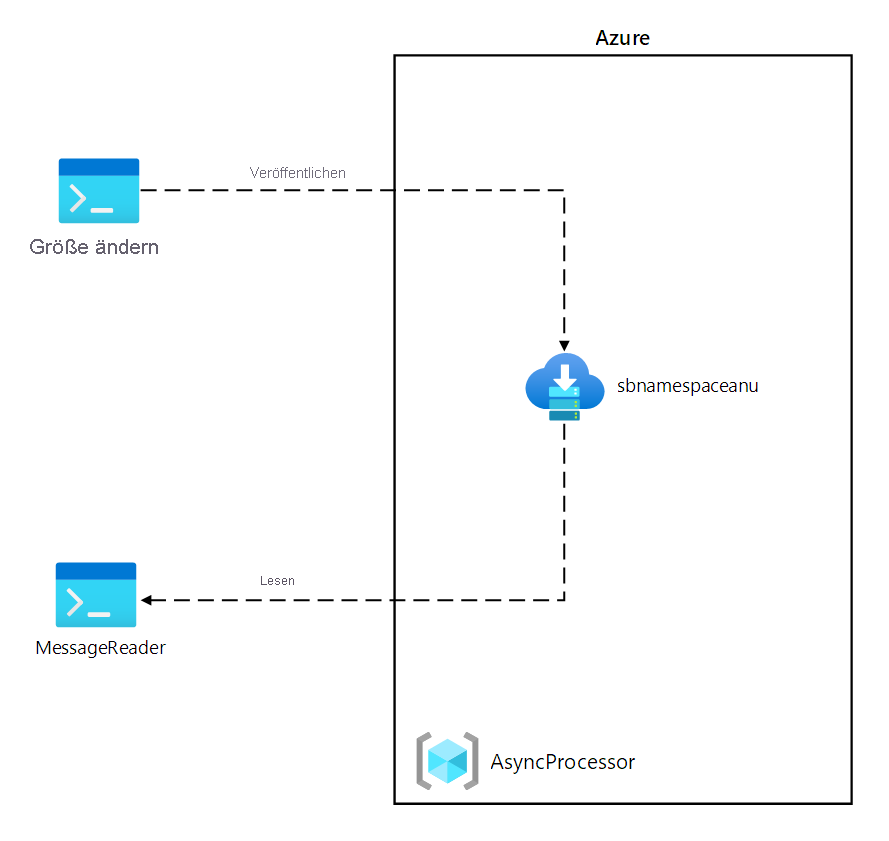
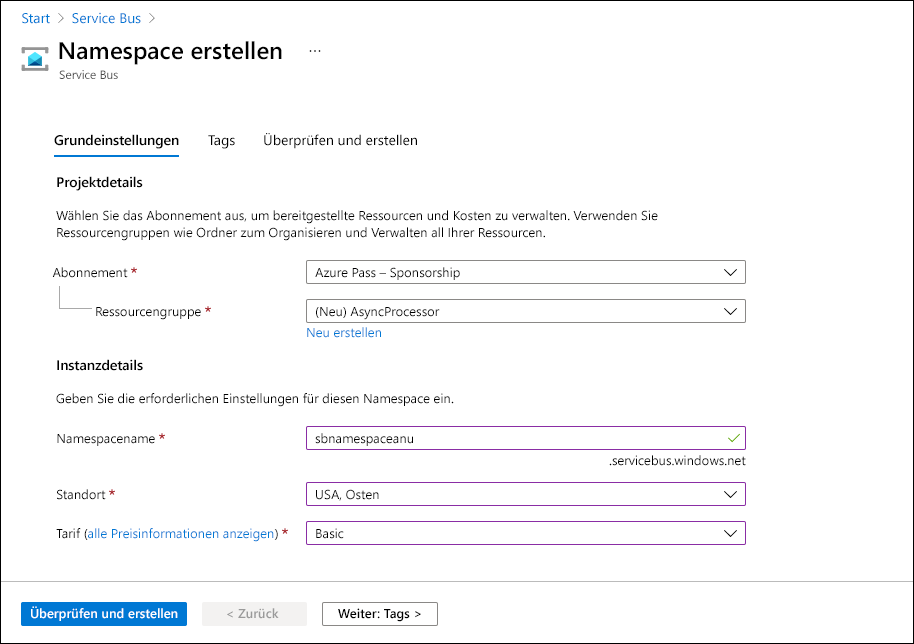
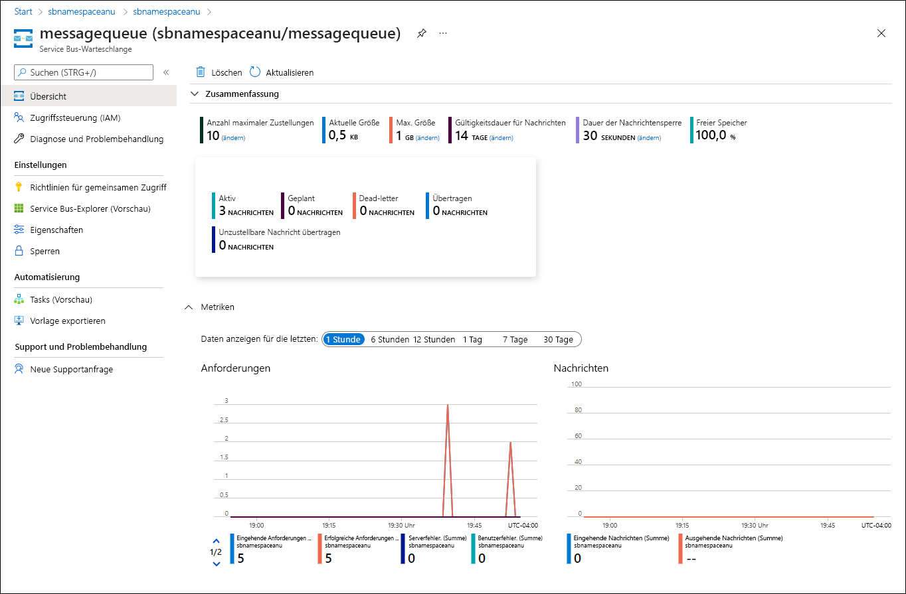
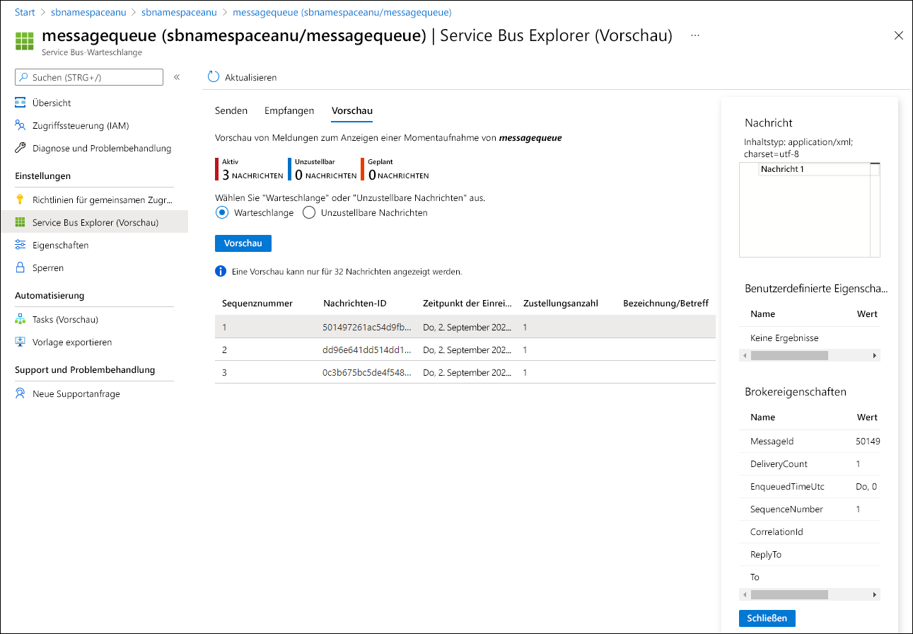

---
lab:
  az204Title: 'Lab 10: Asynchronously process messages by using Azure Service Bus Queues'
  az020Title: 'Lab 10: Asynchronously process messages by using Azure Service Bus Queues'
  az204Module: 'Module 10: Develop message-based solutions'
  az020Module: 'Module 10: Develop message-based solutions'
---

# <a name="lab-10-asynchronously-process-messages-by-using-azure-service-bus-queues"></a>Lab 10: Asynchrone Verarbeitung von Nachrichten mithilfe von Azure Service Bus-Warteschlangen

## <a name="microsoft-azure-user-interface"></a>Microsoft Azure-Benutzeroberfläche

Aufgrund der dynamischen Natur der Microsoft-Cloudtools kann es vorkommen, dass sich die Azure-Benutzeroberfläche nach der Entwicklung dieses Trainingsinhalts ändert. Daher sind die Lab-Anweisungen und Lab-Schritte möglicherweise nicht mehr zutreffend.

Microsoft aktualisiert diesen Trainingskurs, wenn die Community uns über die erforderlichen Änderungen informiert. Cloudupdates kommen jedoch häufig vor, sodass möglicherweise Änderungen an der Benutzeroberfläche auftreten, bevor diese Trainingsinhalte aktualisiert werden. **Wenn dies der Fall ist, stellen Sie sich auf die Veränderungen ein, und arbeiten Sie sie bei Bedarf in den Labs durch.**

## <a name="instructions"></a>Anweisungen

### <a name="before-you-start"></a>Vorbereitung

#### <a name="sign-in-to-the-lab-environment"></a>Anmelden bei der Laborumgebung

Melden Sie sich mithilfe der folgenden Anmeldeinformationen bei Ihrer Windows 10-VM an:
    
-   Benutzername: **Admin**

-   Kennwort: **Pa55w.rd**

> **Hinweis**: Ihr Kursleiter stellt Anweisungen zum Herstellen einer Verbindung mit der virtuellen Laborumgebung zur Verfügung.

#### <a name="review-the-installed-applications"></a>Überprüfen der installierten Anwendungen

Suchen Sie auf ihrem Windows 10-Desktop nach der Taskleiste. Die Taskleiste enthält die Symbole für die Anwendungen, die Sie in diesem Lab verwenden, darunter:
    
-   Microsoft Edge

-   Visual Studio Code

## <a name="architecture-diagram"></a>Architekturdiagramm



### <a name="exercise-1-create-azure-resources"></a>Übung 1: Erstellen von Azure-Ressourcen

#### <a name="task-1-open-the-azure-portal"></a>Aufgabe 1: Öffnen des Azure-Portals

1.  Wählen Sie auf der Taskleiste das Symbol **Microsoft Edge** aus.

1.  Navigieren Sie im Browserfenster zum Azure-Portal ([portal.azure.com](https://portal.azure.com)), und melden Sie sich mit dem Konto an, das Sie für dieses Lab verwenden werden.

    > **Hinweis**: Wenn Sie sich zum ersten Mal am Azure-Portal anmelden, wird Ihnen eine Tour durch das Portal angeboten. Wählen Sie **Erste Schritte** aus, um die Tour zu überspringen und mit der Verwendung des Portals zu beginnen.

#### <a name="task-2-create-an-azure-service-bus-queue"></a>Aufgabe 2: Erstellen einer Azure Service Bus-Warteschlange

1.  Verwenden Sie im Azure-Portal das Textfeld **Ressourcen, Dienste und Dokumente durchsuchen**, um nach **Service Bus** zu suchen. Wählen Sie in der Ergebnisliste dann **Service Bus** aus.

1.  Klicken Sie auf dem Blatt **Service Bus** auf **+ Erstellen**.

1.  Führen Sie im Blatt **Namespace erstellen** auf der Registerkarte **Grundlagen** die folgenden Aktionen aus, und wählen Sie **Überprüfen und erstellen** aus:
        
    | Einstellung | Aktion |
    | -- | -- |
    | Dropdownliste **Abonnement** |Übernehmen Sie den Standardwert. |
    | Abschnitt **Ressourcengruppe**  | Wählen Sie **Neu erstellen** aus, geben Sie **AsyncProcessor** ein, und wählen Sie dann **OK** aus. |
    | Textfeld **Namespacename**  | Geben Sie **sbnamespace** _[Ihr_Name]_ ein. |
    | Dropdownliste **Region**  | Wählen Sie eine beliebige Azure-Region aus, in der Sie eine Azure Service Bus-Instanz bereitstellen können. |
    | Dropdownliste **Tarif**  | Wählen Sie **Basic** aus. |

    Der folgende Screenshot zeigt die konfigurierten Einstellungen auf der Registerkarte **Grundlagen** im Blatt **Namespace erstellen**.
    
       
     
1.  Überprüfen Sie auf der Registerkarte **Überprüfen und erstellen** die Optionen, die Sie in den vorherigen Schritten ausgewählt haben.

1.  Wählen Sie **Erstellen** aus, um den **Service Bus**-Namespace mit Ihrer angegebenen Konfiguration zu erstellen.

    > **Hinweis**: Warten Sie, bis der Erstellungstask abgeschlossen ist, bevor Sie mit diesem Lab fortfahren.

1.  Wählen Sie im Blatt **Bereitstellung** die Schaltfläche **Gehe zu Ressource** aus, um zum Blatt des neu erstellten **Service Bus**-Namespace zu navigieren.

1.  Wählen Sie auf dem Blatt mit dem **Service Bus**-Namespace im Abschnitt **Einstellungen** die Option **Richtlinien für gemeinsamen Zugriff** aus.

1.  Wählen Sie in der Liste der Richtlinien **RootManageSharedAccessKey** aus.

1.  Wählen Sie im Bereich **SAS-Richtlinie: RootManageSharedAccessKey** neben dem Eintrag **Primäre Verbindungszeichenfolge** die Schaltfläche **In Zwischenablage kopieren** aus, und zeichnen Sie den kopierten Wert auf. Sie werden ihn später in diesem Lab brauchen.

    > **Hinweis**: Es spielt keine Rolle, welchen der beiden verfügbaren Schlüssel Sie auswählen. Sie können synonym verwendet werden.

1.  Wählen Sie auf dem Blatt mit dem **Service Bus**-Namespace im Abschnitt **Entitäten** die Option **Warteschlangen** und dann **+ Warteschlange** aus.

1.  Überprüfen Sie im Blatt **Warteschlange erstellen** die verfügbaren Einstellungen, geben Sie im Textfeld **Name** den Namen **messagequeue**ein, und wählen Sie dann **Erstellen** aus.

1.  Wählen Sie **messagequeue** aus, um die Eigenschaften der **Service Bus**-Warteschlange anzuzeigen.

1.  Lassen Sie das Browserfenster geöffnet. Sie werden es später in diesem Lab wieder brauchen.

#### <a name="review"></a>Überprüfung

In dieser Übung haben Sie einen Azure **Service Bus**-Namespace und eine **Service Bus**-Warteschlange erstellt, die Sie im weiteren Verlauf des Labs verwenden werden.

### <a name="exercise-2-create-a-net-core-project-to-publish-messages-to-a-service-bus-queue"></a>Übung 2: Erstellen eines .NET Core-Projekts zum Veröffentlichen von Nachrichten in einer Service Bus-Warteschlange

#### <a name="task-1-create-a-net-core-project"></a>Aufgabe 1: Erstellen eines .NET Core-Projekts

1.  Starten Sie auf dem Lab-Computer Visual Studio Code.

1.  Wählen Sie in Visual Studio Code im Menü **Datei** die Option **Ordner öffnen** aus.

1.  Navigieren Sie im Fenster **Ordner öffnen** zu **Allfiles (F):\\Allfiles\\Labs\\10\\Starter\\MessagePublisher**, und wählen Sie dann **Ordner auswählen** aus.

1.  Aktivieren Sie in **Visual Studio Code** das Kontextmenü, und wählen Sie dann **Im integrierten Terminal öffnen** aus.

1.  Führen Sie an der Terminaleingabeaufforderung den folgenden Befehl aus, um ein neues .NET-Projekt mit dem Namen **MessagePublisher** im aktuellen Ordner zu erstellen:

    ```
    dotnet new console --framework net6.0 --name MessagePublisher --output .
    ```

    > **Hinweis:** Der Befehl **dotnet new** erstellt ein neues **Konsolenprojekt** in einem Ordner mit dem gleichen Namen wie das Projekt.

1.  Führen Sie den folgenden Befehl aus, um Version 7.8.1 des Pakets **Azure.Messaging.ServiceBus** aus NuGet zu importieren:

    ```
    dotnet add package Azure.Messaging.ServiceBus --version 7.8.1
    ```

    > **Hinweis**: Mit dem Befehl **dotnet add package** wird das Paket **Azure.Messaging.ServiceBus** aus NuGet hinzugefügt. Weitere Informationen finden Sie unter [Azure.Messaging.ServiceBus](https://www.nuget.org/packages/Azure.Messaging.ServiceBus/).

1.  Führen Sie an der Terminaleingabeaufforderung den folgenden Befehl aus, um die .NET Core-Konsolenanwendung zu erstellen:

    ```
    dotnet build
    ```

1.  Wählen Sie **Terminal beenden** (das Symbol **Papierkorb**) aus, um den Terminal-Bereich und alle zugehörigen Prozesse zu schließen.

#### <a name="task-2-publish-messages-to-an-azure-service-bus-queue"></a>Aufgabe 2: Veröffentlichen von Nachrichten in einer Azure Service Bus-Warteschlange

1.  Öffnen Sie im Bereich **Explorer** des **Visual Studio Code**-Fensters die Datei **Program.cs**.

1.  Löschen Sie auf der Registerkarte „Code-Editor“ für die Datei **Program.cs** den gesamten Code in der vorhandenen Datei.

1.  Fügen Sie die folgenden Codezeilen hinzu, um die Verwendung der integrierten Namespaces zu ermöglichen, auf die in dieser Datei verwiesen wird:

    ```csharp
    using System;
    using System.Threading.Tasks;
    ```

1.  Fügen Sie den folgenden Code hinzu, um den **Azure.Messaging.ServiceBus**-Namespace zu importieren, der im Paket **Azure.Storage.Queues** enthalten ist, das aus NuGet importiert wurde:

    ```csharp
    using Azure.Messaging.ServiceBus;
    ```
    
1.  Geben Sie den folgenden Code ein, um eine neue **Program**-Klasse im MessagePublisher-Namespace zu erstellen:

    ```csharp
    namespace MessagePublisher
    {
       public class Program
       {
       }
    }
    ```

1.  Geben Sie in der **Program**-Klasse den folgenden Code ein, um eine Zeichenfolgenkonstante namens **storageConnectionString** zu erstellen:

    ```csharp
    private const string storageConnectionString = "";
    ```

1.  Aktualisieren Sie die Zeichenfolgenkonstante **storageConnectionString**, indem Sie den Wert auf die **primäre Verbindungszeichenfolge** des Service Bus-Namespace festlegen, die Sie zuvor in diesem Lab aufgezeichnet haben.

1.  Geben Sie den folgenden Code ein, um eine Zeichenfolgenkonstante namens **queueName** mit dem Wert **messagequeue** zu erstellen, die dem Namen der Service Bus-Warteschlange entspricht, die Sie zuvor in dieser Übung erstellt haben.

    ```csharp
    private const string queueName = "messagequeue";
    ```

1.  Geben Sie den folgenden Code ein, um eine ganzzahlige Konstante zu erstellen, die die Anzahl der Nachrichten speichert, die an die Zielwarteschlange gesendet werden sollen:

    ```csharp
    private const int numOfMessages = 3;
    ```

1.  Geben Sie den folgenden Code ein, um einen Service Bus-Client zu erstellen, der Besitzer der Verbindung zur Zielwarteschlange wird:

    ```csharp
    static ServiceBusClient client;
    ```

1.  Geben Sie den folgenden Code ein, um einen Service Bus-Sender zu erstellen, der zum Veröffentlichen von Nachrichten in der Zielwarteschlange verwendet wird:

    ```csharp
    static ServiceBusSender sender;
    ```

1.  Geben Sie den folgenden Code ein, um eine asynchrone **Main**-Methode zu erstellen:

    ```csharp
    public static async Task Main(string[] args)
    {
    }
    ```

1.  Überprüfen Sie die Datei **Program.cs**, die nun den folgenden Code enthalten sollte. Beachten Sie, dass der Platzhalter `<storage-connection-string>` die Verbindungszeichenfolge für den Azure Service Bus-Zielnamespace darstellt:

    ```csharp
    using System;
    using System.Threading.Tasks;
    using Azure.Messaging.ServiceBus;
    namespace MessagePublisher
    {
        public class Program
        {
            private const string storageConnectionString = "<storage-connection-string>";
            private const string queueName = "messagequeue";
            private const int numOfMessages = 3;
            static ServiceBusClient client = default!;
            static ServiceBusSender sender = default!;
            public static async Task Main(string[] args)
            {
            }
        }
    }
    ```

1.  Fügen Sie in der **Main**-Methode den folgenden Code hinzu, um *client* als **ServiceBusClient**, der die Konnektivität mit dem Service Bus-Namespace ermöglicht, und **sender** zu initialisieren, der für das Senden von Nachrichten verantwortlich ist:

    ```csharp
    client = new ServiceBusClient(storageConnectionString);
    sender = client.CreateSender(queueName);  
    ```

    > **Hinweis**: Der Service Bus-Client kann für die Lebensdauer der Anwendung problemlos zwischengespeichert und als Singleton verwendet werden. Dies gilt als eine der bewährten Methoden beim Veröffentlichen und Lesen von Nachrichten in regelmäßigen Abständen.

1.  Fügen Sie in der **Main**-Methode den folgenden Code hinzu, um ein **ServiceBusMessageBatch**-Objekt zu erstellen, mit dem Sie mehrere Nachrichten mithilfe der **TryAddMessage**-Methode in einem Batch zusammenfassen können:

    ```csharp
    using ServiceBusMessageBatch messageBatch = await sender.CreateMessageBatchAsync();
    ```

1.  Fügen Sie in der **Main**-Methode die folgenden Codezeilen hinzu, um Nachrichten zu einem Batch hinzuzufügen, und eine Ausnahme auszulösen, wenn die Größe einer Nachrichten den vom Batch unterstützten Maximalwert überschreitet:

    ```csharp
    for (int i = 1; i <= numOfMessages; i++)
    {
        if (!messageBatch.TryAddMessage(new ServiceBusMessage($"Message {i}")))
        {
            throw new Exception($"The message {i} is too large to fit in the batch.");
        }
    }
    ```

1.  Fügen Sie in der **Main**-Methode die folgenden Codezeilen hinzu, um einen try-Block zu erstellen, wobei **sender** Nachrichten im Batch asynchron in der Zielwarteschlange veröffentlicht:

    ```csharp
    try
    {
        await sender.SendMessagesAsync(messageBatch);
        Console.WriteLine($"A batch of {numOfMessages} messages has been published to the queue.");
    }
    ```

1.  Fügen Sie in der **Main**-Methode die folgenden Codezeilen hinzu, um einen „finally“-Block zu erstellen, der die **Absender**- und **Client**-Objekte asynchron beseitigt und alle Netzwerk- und nicht verwalteten Ressourcen freigibt:

    ```csharp
    finally
    {
        await sender.DisposeAsync();
        await client.DisposeAsync();
    }
    ```

1.  Überprüfen Sie die **Main**-Methode, die nun den folgenden Code umfassen sollte: 

    ```csharp
    public static async Task Main(string[] args)
    {
        client = new ServiceBusClient(storageConnectionString);
        sender = client.CreateSender(queueName);
        using ServiceBusMessageBatch messageBatch = await sender.CreateMessageBatchAsync();
        for (int i = 1; i <= numOfMessages; i++)
        {
            if (!messageBatch.TryAddMessage(new ServiceBusMessage($"Message {i}")))
            {
                throw new Exception($"The message {i} is too large to fit in the batch.");
            }
        }
        try
        {
            await sender.SendMessagesAsync(messageBatch);
            Console.WriteLine($"A batch of {numOfMessages} messages has been published to the queue.");
        }
        finally
        {
            await sender.DisposeAsync();
            await client.DisposeAsync();
        }
    }
    ```

1.  Speichern Sie die Datei  **Program.cs** .

1.  Aktivieren Sie in **Visual Studio Code** das Kontextmenü, und wählen Sie dann **Im integrierten Terminal öffnen** aus.

1.  Führen Sie an der Terminaleingabeaufforderung den folgenden Befehl aus, um die .NET Core-Konsolenanwendung zu starten:

    ```
    dotnet run
    ```

    > **Hinweis**: Überprüfen Sie die Datei **Program.cs** im Ordner **Allfiles (F):\\Allfiles\\Labs\\10\\Solution\\MessagePublisher**, wenn Fehler auftreten.

1.  Vergewissern Sie sich, dass in der Konsolenmeldung, die an der Eingabeaufforderung im Terminal angezeigt wird, gesagt wird, dass ein Batch von drei Nachrichten in der Warteschlange veröffentlicht wurde.

1.  Wählen Sie **Terminal beenden** (das Symbol **Papierkorb**) aus, um den Terminal-Bereich und alle zugehörigen Prozesse zu schließen.

1.  Wechseln Sie zum Microsoft Edge-Browser, in dem die Service Bus-Warteschlange **messagequeue** im Azure-Portal angezeigt wird.

1.  Überprüfen Sie den Bereich **Zusammenfassung**. Sie sehen, dass die Warteschlange drei aktive Nachrichten enthält.

    Die Service Bus-Warteschlangenmetriken und die Nachrichtenanzahl sind im folgenden Screenshot dargestellt.
     
       
     
1.  Wählen Sie das Blatt **Service Bus Explorer (Vorschau)** aus.

1.  Wählen Sie die Registerkartenüberschrift **Vorschaumodus** und dann auf der Registerkarte **Warteschlange** die Schaltfläche **Vorschau ab Start** aus.

1.  Überprüfen Sie, ob die Warteschlange drei Nachrichten enthält.

1.  Wählen Sie die erste Nachricht aus, und überprüfen Sie deren Inhalt im Bereich **Nachricht**.

    Der Inhalt der ersten Nachricht ist im folgenden Screenshot dargestellt.
         
       

1.  Schließen Sie den Bereich **Nachricht**.

#### <a name="review"></a>Überprüfung

In dieser Übung haben Sie Ihr .NET-Projekt konfiguriert, das Nachrichten in einer Azure Service Bus-Warteschlange veröffentlicht.

### <a name="exercise-3-create-a-net-core-project-to-read-messages-from-a-service-bus-queue"></a>Übung 3: Erstellen eines .NET Core-Projekts zum Lesen von Nachrichten aus einer Service Bus-Warteschlange

#### <a name="task-1-create-a-net-project"></a>Aufgabe 1: Erstellen eines .NET-Projekts

1.  Starten Sie auf dem Lab-Computer Visual Studio Code.

1.  Wählen Sie in Visual Studio Code im Menü **Datei** die Option **Ordner öffnen** aus.

1.  Navigieren Sie im Fenster **Ordner öffnen** zu **Allfiles (F):\\Allfiles\\Labs\\10\\Starter\\MessageReader**, und wählen Sie dann **Ordner auswählen** aus.

1.  Aktivieren Sie in **Visual Studio Code** das Kontextmenü, und wählen Sie dann **Im integrierten Terminal öffnen** aus.

1.  Führen Sie an der Terminaleingabeaufforderung den folgenden Befehl aus, um ein neues .NET-Projekt mit dem Namen **MessageReader** im aktuellen Ordner zu erstellen:

    ```
    dotnet new console --framework net6.0 --name MessageReader --output .
    ```

1.  Führen Sie den folgenden Befehl aus, um Version 7.8.1 des Pakets **Azure.Messaging.ServiceBus** aus NuGet zu importieren:

    ```
    dotnet add package Azure.Messaging.ServiceBus --version 7.8.1
    ```

1.  Führen Sie an der Terminaleingabeaufforderung den folgenden Befehl aus, um die .NET Core-Konsolenanwendung zu erstellen:

    ```
    dotnet build
    ```

1.  Wählen Sie **Terminal beenden** (das Symbol **Papierkorb**) aus, um den Terminal-Bereich und alle zugehörigen Prozesse zu schließen.

#### <a name="task-2-read-messages-from-an-azure-service-bus-queue"></a>Aufgabe 2: Lesen von Nachrichten aus einer Azure Service Bus-Warteschlange

1.  Öffnen Sie im Bereich **Explorer** des **Visual Studio Code**-Fensters die Datei **Program.cs**.

1.  Löschen Sie auf der Registerkarte „Code-Editor“ für die Datei **Program.cs** den gesamten Code in der vorhandenen Datei.

1.  Fügen Sie den gleichen Code hinzu, der in der Datei „Program.cs“ enthalten war, um eine Interaktion mit Azure Service Bus-Warteschlangen zu ermöglichen, legen Sie den Namespace aber auf **MessageReader** fest:

    ```csharp
    using System;
    using System.Threading.Tasks;
    using Azure.Messaging.ServiceBus;  
    namespace MessageReader
    {
       public class Program
       {
          private const string storageConnectionString = "";
          static string queueName = "messagequeue";
          static ServiceBusClient client = default!;
       }
    }
    ```

1.  Aktualisieren Sie wie zuvor die Zeichenfolgenkonstante **storageConnectionString**, indem Sie den Wert auf die **primäre Verbindungszeichenfolge** des **Service Bus**-Namespace festlegen, die Sie zuvor in diesem Lab aufgezeichnet haben.

1.  Geben Sie den folgenden Code ein, um einen ServiceBusProcessor zu erstellen, der zum Verarbeiten von Nachrichten aus der Warteschlange verwendet wird:

    ```csharp
    static ServiceBusProcessor processor = default!;
    ```

1.  Geben Sie den folgenden Code ein, um eine statische asynchrone **MessageHandler**-Task zu erstellen, die den Text von Nachrichten in der Warteschlange anzeigt, während sie verarbeitet werden, und die Nachrichten löscht, nachdem die Verarbeitung beendet wurde:

    ```csharp
    static async Task MessageHandler(ProcessMessageEventArgs args)
    {
        string body = args.Message.Body.ToString();
        Console.WriteLine($"Received: {body}");
        await args.CompleteMessageAsync(args.Message);
    }
    ```

1.  Geben Sie den folgenden Code ein, um eine statische asynchrone **ErrorHandler**-Aufgabe zu erstellen, die alle Ausnahmen verwaltet, die während der Nachrichtenverarbeitung auftreten:

    ```csharp
    static Task ErrorHandler(ProcessErrorEventArgs args)
    {
        Console.WriteLine(args.Exception.ToString());
        return Task.CompletedTask;
    }
    ```

1.  Geben Sie den folgenden Code ein, um eine asynchrone **Main**-Methode zu erstellen:

    ```csharp
    static async Task Main(string[] args)
    {
    }
    ```

1.  Überprüfen Sie die Datei **Program.cs**, die nun den folgenden Code enthalten sollte. Der Platzhalter `<storage-connection-string>` stellt die Verbindungszeichenfolge für den Azure Service Bus-Zielnamespace dar:

    ```csharp
    using System;
    using System.Threading.Tasks;
    using Azure.Messaging.ServiceBus;
    namespace MessageReader
    {
        class Program
        {
            static string storageConnectionString = "<storage-connection-string>`";
            static string queueName = "messagequeue";
            static ServiceBusClient client;
            static ServiceBusProcessor processor;
            static async Task MessageHandler(ProcessMessageEventArgs args)
            {
                string body = args.Message.Body.ToString();
                Console.WriteLine($"Received: {body}");
                await args.CompleteMessageAsync(args.Message);
            }
            static Task ErrorHandler(ProcessErrorEventArgs args)
            {
                Console.WriteLine(args.Exception.ToString());
                return Task.CompletedTask;
            }
            static async Task Main()
            {
            }
        }
    }
    ```

1.  Fügen Sie in der **Main**-Methode den folgenden Code hinzu, um *client* als **ServiceBusClient**, der die Konnektivität mit dem Service Bus-Namespace ermöglicht, und **processor** zu initialisieren, der für die Verarbeitung von Nachrichten verantwortlich ist:

    ```csharp
    client = new ServiceBusClient(storageConnectionString);
    processor = client.CreateProcessor(queueName, new ServiceBusProcessorOptions());
    ```

    > **Hinweis**: Der Service Bus-Client kann wie bereits erwähnt für die Lebensdauer der Anwendung problemlos zwischengespeichert und als Singleton verwendet werden. Dies gilt als eine der bewährten Methoden beim Veröffentlichen und Lesen von Nachrichten in regelmäßigen Abständen.

1.  Fügen Sie in der **Main**-Methode die folgenden Codezeilen hinzu, um einen try-Block zu erstellen, der zunächst einen Handler für die Nachrichten- und Fehlerverarbeitung implementiert, dann die Nachrichtenverarbeitung initiiert und schließlich die Verarbeitung nach einer Benutzereingabe beendet:

    ```csharp
    try
    {
        processor.ProcessMessageAsync += MessageHandler;
        processor.ProcessErrorAsync += ErrorHandler;
        await processor.StartProcessingAsync();
        Console.WriteLine("Wait for a minute and then press any key to end the processing");
        Console.ReadKey();
        Console.WriteLine("\nStopping the receiver...");
        await processor.StopProcessingAsync();
        Console.WriteLine("Stopped receiving messages");
    }
    ```

1.  Fügen Sie in der **Main**-Methode die folgenden Codezeilen hinzu, um einen „finally“-Block zu erstellen, der die **Prozessor**- und **Client**-Objekte asynchron entfernt und alle Netzwerk- und nicht verwalteten Ressourcen freigibt:

    ```csharp
    finally
    {
        await processor.DisposeAsync();
        await client.DisposeAsync();
    }
    ```

1.  Überprüfen Sie die **Main**-Methode, die nun den folgenden Code umfassen sollte:

    ```csharp
    static async Task Main()
    {
        client = new ServiceBusClient(storageConnectionString);
        processor = client.CreateProcessor(queueName, new ServiceBusProcessorOptions());
        try
        {
            processor.ProcessMessageAsync += MessageHandler;
            processor.ProcessErrorAsync += ErrorHandler;

            await processor.StartProcessingAsync();
            Console.WriteLine("Wait for a minute and then press any key to end the processing");
            Console.ReadKey();

            Console.WriteLine("\nStopping the receiver...");
            await processor.StopProcessingAsync();
            Console.WriteLine("Stopped receiving messages");
        }
        finally
        {
            await processor.DisposeAsync();
            await client.DisposeAsync();
        }
    }
    ```

1.  Speichern Sie die Datei  **Program.cs** .

1.  Aktivieren Sie in **Visual Studio Code** das Kontextmenü, und wählen Sie dann **Im integrierten Terminal öffnen** aus.

1.  Führen Sie an der Terminaleingabeaufforderung den folgenden Befehl aus, um die .NET Core-Konsolenanwendung zu starten:

    ```
    dotnet run
    ```

    > **Hinweis**: Überprüfen Sie die Datei **Program.cs** im Ordner **Allfiles (F):\\Allfiles\\Labs\\10\\Solution\\MessageReader**, wenn Fehler auftreten.

1.  Vergewissern Sie sich, dass in der Konsolenmeldung, die an der Eingabeaufforderung im Terminal angezeigt wird, gesagt wird, dass alle drei Nachrichten in der Warteschlange empfangen wurden.

1.  Drücken Sie an der Terminaleingabeaufforderung eine beliebige Taste, um den Empfänger anzuhalten und die Ausführung der App zu beenden.

1.  Wählen Sie **Terminal beenden** (das Symbol **Papierkorb**) aus, um den Terminal-Bereich und alle zugehörigen Prozesse zu schließen.

1.  Wechseln Sie wieder zurück zum Microsoft Edge-Browser, in dem die Service Bus-Warteschlange **messagequeue** im Azure-Portal angezeigt wird.

1.  Wählen Sie auf dem Blatt **Service Bus Explorer (Vorschau)** die Option **Vorschau ab Start** aus. Sie sehen, dass sich die Anzahl der aktiven Nachrichten in der Warteschlange zu **0** geändert hat.

#### <a name="review"></a>Überprüfung

In dieser Übung haben Sie mithilfe der .NET-Bibliothek Nachrichten aus der Azure Service Bus-Warteschlange gelesen und gelöscht.

### <a name="exercise-4-clean-up-your-subscription"></a>Übung 4: Bereinigen Ihres Abonnements

#### <a name="task-1-open-azure-cloud-shell"></a>Aufgabe 1: Öffnen von Azure Cloud Shell

1.  Wählen Sie im Azure-Portal das Symbol **Cloud Shell** () aus, um eine neue Bash-Sitzung zu öffnen. Wenn Cloud Shell standardmäßig auf eine PowerShell-Sitzung festgelegt ist, wählen Sie **PowerShell** und dann im Dropdownmenü **Bash** aus.

    > **Hinweis**: Wenn Sie **Cloud Shell** zum ersten Mal starten, wählen Sie **PowerShell** aus, wenn Sie aufgefordert werden, **Bash** oder **PowerShell** auszuwählen. Wenn die Meldung **Für Sie wurde kein Speicher bereitgestellt** angezeigt wird, wählen Sie das Abonnement aus, das Sie in diesem Lab verwenden, und wählen Sie **Speicher erstellen** aus.

#### <a name="task-2-delete-resource-groups"></a>Aufgabe 2: Löschen der Ressourcengruppen

1.  Führen Sie im Bereich **Cloud Shell** den folgenden Befehl aus, um die **AsyncProcessor**-Ressourcengruppe zu löschen:

    ```
    az group delete --name AsyncProcessor --no-wait --yes
    ```
    
     > **Hinweis**: Der Befehl wird (dem *--nowait*-Parameter entsprechend) asynchron ausgeführt. Dies bedeutet, dass Sie zwar einen weiteren Azure CLI-Befehl in derselben Bash-Sitzung direkt im Anschluss ausführen können, es jedoch einige Minuten dauert, bis die Ressourcengruppen tatsächlich entfernt wurden.
  
1.  Schließen Sie den Bereich **Cloud Shell** im Portal.

#### <a name="task-3-close-the-active-applications"></a>Aufgabe 3: Schließen der aktiven Anwendungen

1.  Schließen Sie die aktuell ausgeführte Microsoft Edge-Anwendung.

1.  Schließen Sie die aktuell ausgeführte Visual Studio Code-Anwendung.

#### <a name="review"></a>Überprüfung

In dieser Übung haben Sie Ihr Abonnement bereinigt, indem Sie die in diesem Lab verwendeten Ressourcengruppen entfernt haben.
