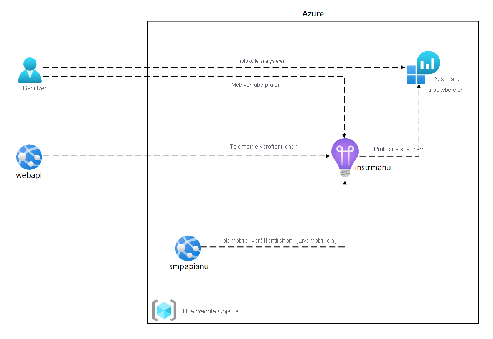
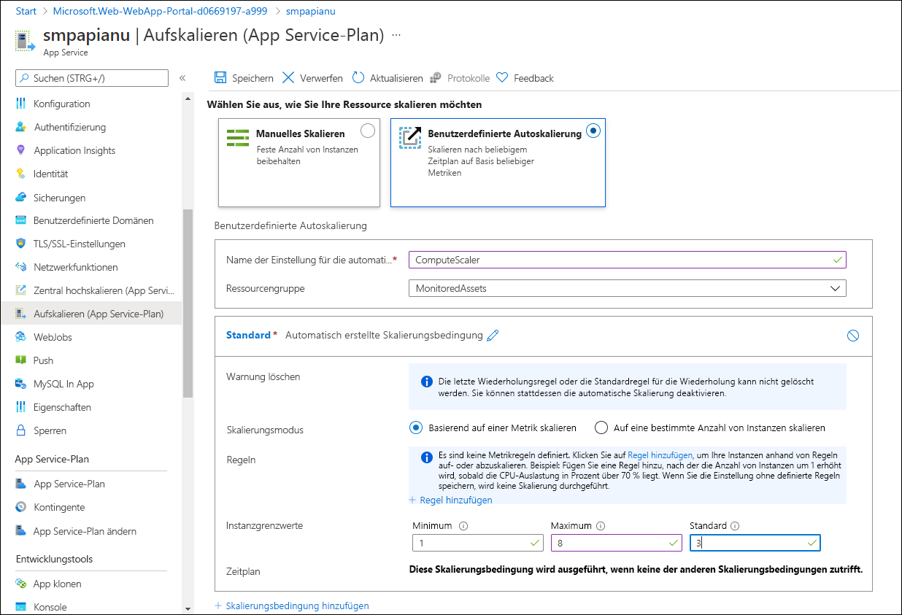
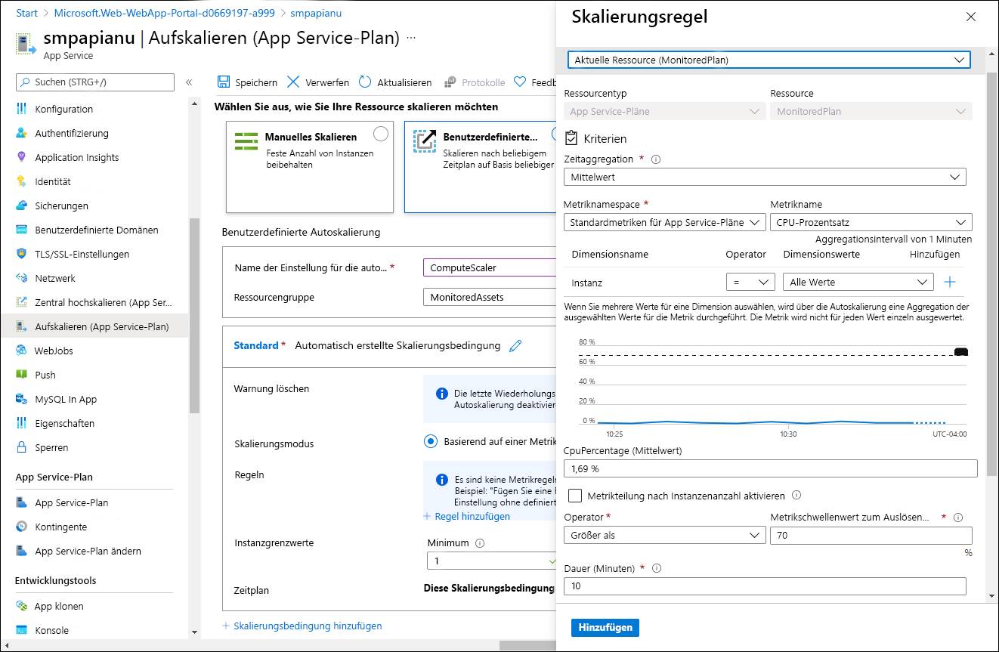
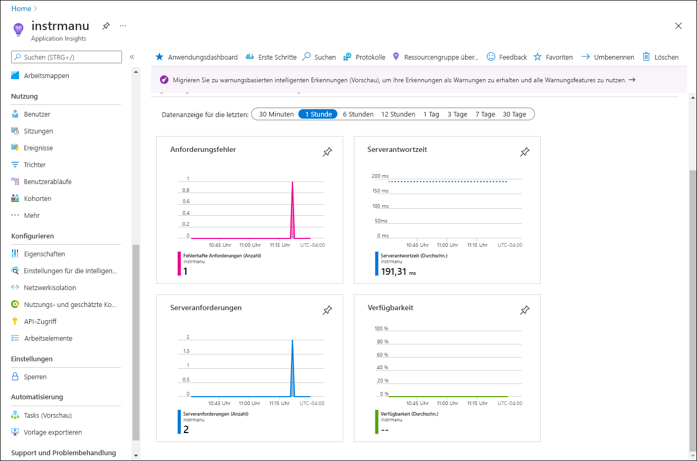
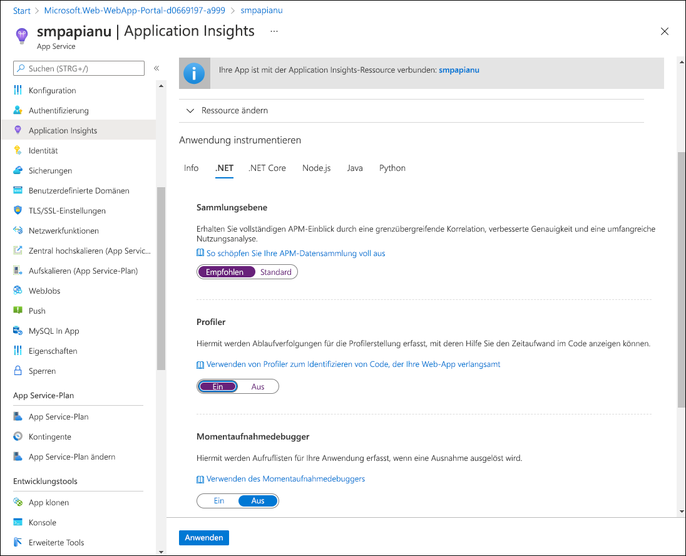
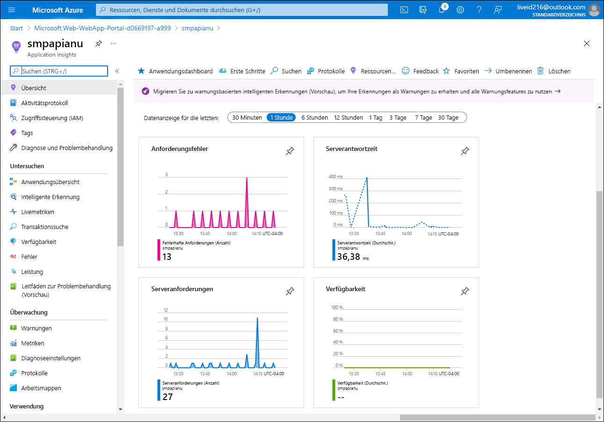
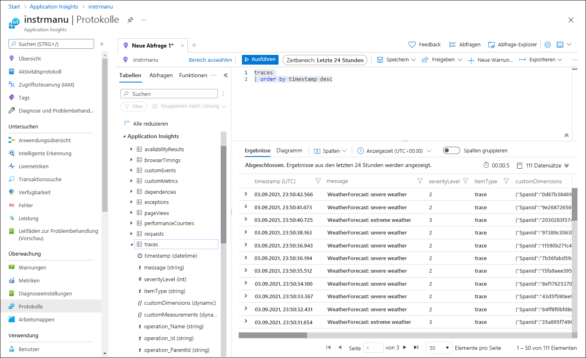

---
lab:
  az204Title: 'Lab 11: Monitor services that are deployed to Azure'
  az020Title: 'Lab 11: Monitor services that are deployed to Azure'
  az204Module: 'Module 11: Monitor and optimize Azure solutions'
  az020Module: 'Module 11: Monitor and optimize Azure solutions'
ms.openlocfilehash: 9e67ee08cf92c3aafb608c76257199fd9602ba92
ms.sourcegitcommit: 71681d2734c5590e91fdac8529669b3606953a3f
ms.translationtype: HT
ms.contentlocale: de-DE
ms.lasthandoff: 03/01/2022
ms.locfileid: "139251592"
---
# <a name="lab-11-monitor-services-that-are-deployed-to-azure"></a>Lab 11: Überwachen von Diensten, die in Azure bereitgestellt werden

## <a name="microsoft-azure-user-interface"></a>Microsoft Azure-Benutzeroberfläche

Aufgrund der dynamischen Natur der Microsoft-Cloudtools kann es vorkommen, dass sich die Azure-Benutzeroberfläche nach der Entwicklung dieses Trainingsinhalts ändert. Daher sind die Lab-Anweisungen und Lab-Schritte möglicherweise nicht mehr zutreffend.

Microsoft aktualisiert diesen Trainingskurs, wenn die Community uns über die erforderlichen Änderungen informiert. Cloudupdates kommen jedoch häufig vor, sodass möglicherweise Änderungen an der Benutzeroberfläche auftreten, bevor diese Trainingsinhalte aktualisiert werden. **Wenn dies der Fall ist, stellen Sie sich auf die Veränderungen ein, und arbeiten Sie sie bei Bedarf in den Labs durch.**

## <a name="instructions"></a>Anweisungen

### <a name="before-you-start"></a>Vorbereitung

#### <a name="sign-in-to-the-lab-environment"></a>Anmelden bei der Laborumgebung

Melden Sie sich mithilfe der folgenden Anmeldeinformationen bei Ihrer Windows 10-VM an:
    
-   Benutzername: **Admin**

-   Kennwort: **Pa55w.rd**

> **Hinweis**: Ihr Kursleiter stellt Anweisungen zum Herstellen einer Verbindung mit der virtuellen Laborumgebung zur Verfügung.

#### <a name="review-the-installed-applications"></a>Überprüfen der installierten Anwendungen

Suchen Sie auf Ihrem Windows 10-Desktop nach der Taskleiste. Die Taskleiste enthält die Symbole für die Anwendungen, die Sie in diesem Lab verwenden, darunter:
    
-   Microsoft Edge

-   Datei-Explorer

-   Visual Studio Code

-   Azure PowerShell

## <a name="architecture-diagram"></a>Architekturdiagramm



### <a name="exercise-1-create-and-configure-azure-resources"></a>Übung 1: Erstellen und Konfigurieren von Azure-Ressourcen

#### <a name="task-1-open-the-azure-portal"></a>Aufgabe 1: Öffnen des Azure-Portals

1.  Wählen Sie auf der Taskleiste das Symbol **Microsoft Edge** aus.

1.  Navigieren Sie im Browserfenster zum Azure-Portal ([portal.azure.com](https://portal.azure.com)), und melden Sie sich dann mit dem Konto an, das Sie für dieses Lab verwenden werden.

    > **Hinweis**: Wenn Sie sich zum ersten Mal am Azure-Portal anmelden, wird Ihnen eine Tour durch das Portal angeboten. Wählen Sie **Erste Schritte** aus, um die Tour zu überspringen und mit der Verwendung des Portals zu beginnen.

#### <a name="task-2-create-an-application-insights-resource"></a>Aufgabe 2: Erstellen einer Application Insights-Ressource

1.  Verwenden Sie im Azure-Portal das Textfeld **Ressourcen, Dienste und Dokumente durchsuchen** oben auf der Seite, um nach **Application Insights** zu suchen. Wählen Sie in der Ergebnisliste dann **Application Insights** aus.

1.  Klicken Sie im Blatt **Application Insights** auf **+ Erstellen**.

1.  Führen Sie im Blatt **Application Insights** auf der Registerkarte **Grundlagen** die folgenden Aktionen aus, und wählen Sie **Überprüfen und erstellen** aus:
    
    | Einstellung                         | Aktion                                                       |
    | ------------------------------- | ------------------------------------------------------------ |
    | Dropdownliste **Abonnement** | Übernehmen Sie den Standardwert.                                    |
    | Abschnitt **Ressourcengruppe**      | Klicken Sie auf **Neu erstellen**, geben Sie **MonitoredAssets** ein, und klicken Sie dann auf **OK**. |
    | Textfeld **Name**     | **instrm** _[Ihr_Name]_ .                           |
    | Dropdownliste **Region**       | Wählen Sie eine beliebige Azure-Region aus, in der Sie eine Azure Service Bus-Instanz bereitstellen können. |
    | Abschnitt **Ressourcenmodus** | Wählen Sie die Option **Arbeitsbereichsbasiert** aus.|
    | Abschnitt **ARBEITSBEREICHSDETAILS** | Übernehmen Sie die Standardwerte für die Dropdownlisten **Abonnement** und **Log Analytics-Arbeitsbereich**.|
    
    Der folgende Screenshot veranschaulicht die konfigurierten Einstellungen im Blatt **Application Insights**.

       
     
1.  Überprüfen Sie auf der Registerkarte **Überprüfen und erstellen** die Optionen, die Sie in den vorherigen Schritten ausgewählt haben.

1.  Wählen Sie **Erstellen** aus, um die **Application Insights**-Instanz mit Ihrer angegebenen Konfiguration zu erstellen.

    > **Hinweis**: Warten Sie, bis der Erstellungstask abgeschlossen ist, bevor Sie mit diesem Lab fortfahren.

1.  Wählen Sie im Blatt **Microsoft.AppInsights \| Übersicht** die Schaltfläche **Gehe zu Ressource** aus, um zum Blatt der neu erstellten **Application Insights**-Ressource zu navigieren.

1.  Wählen Sie im Blatt **Application Insights** im Abschnitt **Konfigurieren** den Link **Eigenschaften** aus.

1.  Wählen Sie im Blatt **Eigenschaften** neben dem Eintrag **Instrumentierungsschlüssel** die Schaltfläche **In Zwischenablage kopieren** aus, und zeichnen Sie dann den kopierten Wert auf. Sie werden ihn später in diesem Lab brauchen.

    > **Hinweis**: Der Schlüssel wird von Clientanwendungen verwendet, um eine Verbindung mit einer bestimmten **Application Insights**-Ressource herzustellen.

### <a name="task-3-create-an-azure-web-api-resource"></a>Aufgabe 3: Erstellen einer Azure-Web-API-Ressource

1.  Verwenden Sie im Azure-Portal das Textfeld **Ressourcen, Dienste und Dokumente durchsuchen** oben auf der Seite, um nach **App Services** zu suchen. Wählen Sie in der Ergebnisliste dann **App Services** aus.

1.  Wählen Sie im Blatt **App Services** die Option **+ Erstellen** aus.
    
1.  Führen Sie im Blatt **Web-App erstellen** auf der Registerkarte **Grundlagen** die folgenden Aktionen aus, und wählen Sie **Weiter: Bereitstellung** aus:

    | Einstellung                         | Aktion                                                       |
    | ------------------------------- | ------------------------------------------------------------ |
    | Dropdownliste **Abonnement** | Übernehmen Sie den Standardwert.                                    |
    | Dropdownliste **Ressourcengruppe**      |Wählen Sie **MonitoredAssets** aus. |
    | Textfeld **Name**     | Geben Sie **smpapi** _[Ihr_Name]_ ein.                           |
    | Abschnitt **Veröffentlichen**       | Wählen Sie **Code** aus. |
    | Dropdownliste **Laufzeitstapel** | Wählen Sie **.NET Core 3.1 (LTS)** aus.|
    | Abschnitt **Betriebssystem** |  Wählen Sie **Windows** aus.|
    | Dropdownliste **Region** |  Wählen Sie dieselbe Region aus, die Sie als Standort der **Anwendungsinstanz**-Ressource ausgewählt haben. |
    | Abschnitt **App Service-Plan** |  Wählen Sie **Neu erstellen**. |
    | Textfeld **Name** |  Geben Sie **MonitoredPlan** ein, und wählen Sie dann **OK** aus.|
    |  Abschnitt **SKU und Größe** |  Übernehmen Sie den Standardwert. |
    
1.  Wählen Sie auf der Registerkarte **Bereitstellung** die Option **Weiter: Überwachung** aus.

1.  Führen Sie auf der Registerkarte **Überwachung** die folgenden Aktionen aus, und wählen Sie dann **Überprüfen + erstellen** aus:
    
    | Einstellung                         | Aktion                                                       |
    | ------------------------------- | ------------------------------------------------------------ |
    | Abschnitt **Application Insights aktivieren** | Vergewissern Sie sich, dass **Ja** ausgewählt ist.                                    |
    | Dropdownliste **Application Insights**     | Wählen Sie die Application Insights-Ressource **instrm** _[Ihr_Name]_ aus, die Sie zuvor in diesem Lab erstellt haben.|
    
1.  Überprüfen Sie auf der Registerkarte **Überprüfen und erstellen** die Optionen, die Sie in den vorherigen Schritten ausgewählt haben.

1.  Wählen Sie **Erstellen** aus, um die Web-API mit Ihrer angegebenen Konfiguration zu erstellen.

    > **Hinweis**: Warten Sie, bis der Erstellungstask abgeschlossen ist, bevor Sie mit diesem Lab fortfahren.

1.  Wählen Sie im Blatt **Übersicht** für die Bereitstellung die Schaltfläche **Gehe zu Ressource** aus, um zum Blatt der neu erstellten Azure-Web-API zu navigieren.

1.  Wählen Sie im Blatt **App Service** im Abschnitt **Einstellungen** den Link **Konfiguration** aus.

1.  Führen Sie im Abschnitt **Konfiguration** die folgenden Aktionen aus:
    
    a.  Wählen Sie auf der Registerkarte **Anwendungseinstellungen** die Option **Werte anzeigen** aus, um die Geheimnisse für Ihre Web-API anzuzeigen.

    b.  Notieren Sie den Wert, der den **APPINSIGHTS\_INSTRUMENTATION_KEY**-Schlüssel darstellt. Dieser Wert wurde beim Erstellen der Web-API-Ressource automatisch festgelegt.

1.  Wählen Sie im Blatt **App Service** im Abschnitt **Einstellungen** den Link **Eigenschaften** aus.

1.  Zeichnen Sie den Wert des **URL**-Links im Abschnitt **Eigenschaften** auf. Sie verwenden diesen Wert später im Lab, um Anforderungen an die Web-API zu übermitteln.

#### <a name="task-4-configure-web-api-autoscale-options"></a>Aufgabe 4: Konfigurieren von Optionen für die automatische Skalierung der Web-API

1.  Wählen Sie im Blatt **App Service** im Abschnitt **Einstellungen** den Link **Horizontal hochskalieren (App Service-Plan)** aus.

1.  Führen Sie im Abschnitt **Horizontal hochskalieren** die folgenden Aktionen aus, und wählen Sie dann **Speichern** aus:
    
    | Einstellung                         | Aktion                                                       |
    | ------------------------------- | ------------------------------------------------------------ |
    | Abschnitt **Horizontal hochskalieren** | Klicken Sie auf **Benutzerdefinierte Autoskalierung**.|
    | Textfeld **Name der Einstellung für die Autoskalierung**     | Geben Sie **ComputeScaler** ein.|
    | Dropdownliste **Ressourcengruppe**     |Wählen Sie **MonitoredAssets** aus. |
    | Abschnitt **Skalierungsmodus**      | Wählen Sie **Basierend auf einer Metrik skalieren** aus. |
    | Textfeld **Minimum** im Abschnitt **Instanzgrenzwerte** | Geben Sie **2** ein.|
    | Textfeld **Maximum** im Abschnitt **Instanzgrenzwerte** | Geben Sie **8** ein.|
    | Textfeld **Standard** im Abschnitt **Instanzgrenzwerte** | Geben Sie **3** ein. |
   
    Im folgenden Screenshot sind die konfigurierten Einstellungen im Abschnitt **Horizontal hochskalieren** im Blatt **App Service** dargestellt.
    
       

    | Einstellung                         | Aktion                                                       |
    | ------------------------------- | ------------------------------------------------------------ |
    | Abschnitt **Regeln** |  Wählen Sie **Regel hinzufügen** aus.|
    | Blatt **Skalierungsregel** | Übernehmen Sie die Standardwerte für alle anderen Einstellungen, und wählen Sie dann **Hinzufügen** aus.|

    Im folgenden Screenshot sind die zusätzlichen Einstellungen im Abschnitt **Horizontal hochskalieren** im Blatt **App Service** dargestellt.

       

    > **Hinweis**: Warten Sie, bis der Speichervorgang abgeschlossen ist, bevor Sie mit diesem Lab fortfahren.

#### <a name="review"></a>Überprüfung

In dieser Übung haben Sie die Azure-Ressourcen erstellt, die Sie für den Rest des Labs verwenden.

### <a name="exercise-2-monitor-a-local-web-api-by-using-application-insights"></a>Übung 2: Überwachen einer lokalen Web-API mithilfe von Application Insights

#### <a name="task-1-build-a-net-web-api-project"></a>Aufgabe 1: Erstellen eines .NET-Web-API-Projekts

1.  Starten Sie auf dem Lab-Computer **Visual Studio Code**.

1.  Wählen Sie in Visual Studio Code im Menü **Datei** die Option **Ordner öffnen** aus.

1.  Navigieren Sie im Fenster **Ordner öffnen** zu **Allfiles (F):\\Allfiles\\Labs\\11\\Starter\\Api**, und wählen Sie dann **Ordner auswählen** aus.

1.  Aktivieren Sie in **Visual Studio Code** das Kontextmenü, und wählen Sie dann **Im integrierten Terminal öffnen** aus.

1.  Führen Sie an der Terminaleingabeaufforderung den folgenden Befehl aus, um eine neue .NET-Web-API-Anwendung mit dem Namen **SimpleApi** im aktuellen Verzeichnis zu erstellen:

    ```
    dotnet new webapi --output . --name SimpleApi
    ```

1.  Führen Sie den folgenden Befehl aus, um Version 2.18.0 von **Microsoft.ApplicationInsights** aus NuGet in das aktuelle Projekt zu importieren:

    ```
    dotnet add package Microsoft.ApplicationInsights --version 2.18.0
    ```

    > **Hinweis**: Mit dem Befehl **dotnet add package** wird das Paket **Microsoft.ApplicationInsights** aus NuGet hinzugefügt. Weitere Informationen finden Sie unter [Microsoft.ApplicationInsights](https://www.nuget.org/packages/Microsoft.ApplicationInsights/).

1.  Führen Sie den folgenden Befehl aus, um Version 2.18.0 von **Microsoft.ApplicationInsights.AspNetCore** aus NuGet zu importieren:

    ```
    dotnet add package Microsoft.ApplicationInsights.AspNetCore --version 2.18.0
    ```

    > **Hinweis**: Mit dem Befehl **dotnet add package** wird das Paket **Microsoft.ApplicationInsights.AspNetCore** aus NuGet hinzugefügt. Weitere Informationen finden Sie unter [Microsoft.ApplicationInsights.AspNetCore](https://www.nuget.org/packages/Microsoft.ApplicationInsights.AspNetCore).

1.  Führen Sie an der Terminaleingabeaufforderung den folgenden Befehl aus, um Version 2.18.0 von **Microsoft.ApplicationInsights.PerfCounterCollector** aus NuGet in das aktuelle Projekt zu importieren:

    ```
    dotnet add package Microsoft.ApplicationInsights.PerfCounterCollector --version 2.18.0
    ```

    > **Hinweis**: Mit dem Befehl **dotnet add package** wird das Paket **Microsoft.ApplicationInsights.PerfCounterCollector** aus NuGet hinzugefügt. Weitere Informationen finden Sie unter [Microsoft.ApplicationInsights.PerfCounterCollector](https://www.nuget.org/packages/Microsoft.ApplicationInsights.PerfCounterCollector/).

1.  Führen Sie an der Terminaleingabeaufforderung den folgenden Befehl aus, um die .NET-Web-API zu erstellen:

    ```
    dotnet build
    ```
    
#### <a name="task-2-update-app-code-to-disable-https-and-use-application-insights"></a>Aufgabe 2: Aktualisieren des App-Codes zum Deaktivieren von HTTPS und Verwenden von Insights

1.  Wählen Sie im **Visual Studio Code**-Fenster im **Explorer**-Bereich die Datei **Startup.cs** aus, um die Datei im **Editor**-Bereich zu öffnen.

1.  Suchen und löschen Sie im **Editor**-Bereich in der **Startup**-Klasse den folgenden Code in Zeile 39:

    ```csharp
    app.UseHttpsRedirection();
    ```

    > **Hinweis**: Diese Codezeile zwingt die Web-API, HTTPS zu verwenden. Für dieses Lab ist dies unnötig.

1.  Fügen Sie am Anfang der Definition der **Startup**-Klasse eine neue statische Zeichenfolgenkonstante namens **INSTRUMENTATION_KEY** hinzu, und legen Sie deren Wert auf den Application Insights-Ressourceninstrumentierungsschlüssel festgelegt ist, den Sie zuvor in diesem Lab aufgezeichnet haben:

    ```csharp
    private const string INSTRUMENTATION_KEY = "instrumentation_key";
    ```

    > **Hinweis**: Bim Instrumentierungsschlüssel `d2bb0eed-1342-4394-9b0c-8a56d21aaa43` wäre diese Codezeile beispielsweise `private const string INSTRUMENTATION_KEY = "d2bb0eed-1342-4394-9b0c-8a56d21aaa43";`.

1.  Suchen Sie die **ConfigureServices**-Methode in der **Startup**-Klasse:

    ```csharp
    public void ConfigureServices(IServiceCollection services)
    {
        services.AddControllers();
    }
    ```

1.  Fügen Sie in einer neuen Zeile den folgenden Code am Ende der **ConfigureServices**-Methode hinzu, um Application Insights mit dem bereitgestellten Instrumentierungsschlüssel zu konfigurieren:

    ```csharp
    services.AddApplicationInsightsTelemetry(INSTRUMENTATION_KEY);
    ```

1.  Überprüfen Sie die **ConfigureServices**-Methode, die nun den folgenden Code enthalten sollte:

    ```csharp
    public void ConfigureServices(IServiceCollection services)
    {
        services.AddControllers();
        services.AddApplicationInsightsTelemetry(INSTRUMENTATION_KEY);        
    }
    ```

1.  Speichern Sie die Datei **Startup.cs**.

1.  Führen Sie an der Terminaleingabeaufforderung den folgenden Befehl aus, um die .NET-Web-API zu erstellen.

    ```
    dotnet build
    ```

#### <a name="task-3-test-an-api-application-locally"></a>Aufgabe 3: Lokales Testen einer API-Anwendung

1.  Führen Sie an der Terminalaufforderung den folgenden Befehl aus, und drücken Sie dann die **EINGABETASTE**, um ein Zertifikat zu erstellen. Wählen Sie in der angezeigten Option **JA** aus.

    ```
    dotnet dev-certs https --trust
    ```

1.  Führen Sie an der Terminaleingabeaufforderung den folgenden Befehl aus, um die .NET-Web-API zu starten.

    ```
    dotnet run
    ```

1.  Blenden Sie in der Taskleiste das Kontextmenü für das **Microsoft Edge**-Symbol ein, und öffnen Sie dann ein neues Browserfenster.

1.  Navigieren Sie im geöffneten Browserfenster zu der Seite, auf der die URL den relativen Pfad **/weatherforecast** Ihrer Web-API enthält und jetzt auf **localhost** an Port **5000** gehostet wird.
    
    > **Hinweis**: Die vollständige URL lautet `http://localhost:5000/weatherforecast`.

    > **Hinweis**: Die Seite sollte eine Ausgabe im folgenden Format enthalten:

    ```
    [{"date":"2021-09-04T10:15:04.0969996-07:00","temperatureC":54,"temperatureF":129,"summary":"Sweltering"},{"date":"2021-09-05T10:15:04.0972401-07:00","temperatureC":44,"temperatureF":111,"summary":"Balmy"},{"date":"2021-09-06T10:15:04.0976549-07:00","temperatureC":41,"temperatureF":105,"summary":"Scorching"},{"date":"2021-09-07T10:15:04.0976613-07:00","temperatureC":-4,"temperatureF":25,"summary":"Freezing"},{"date":"2021-09-08T10:15:04.0976618-07:00","temperatureC":33,"temperatureF":91,"summary":"Balmy"}]
    ```

1.  Schließen Sie das Browserfenster, in dem die von `http://localhost:5000/weatherforecast` generierte Seite angezeigt wird.

1.  Wählen Sie in Visual Studio Code **Terminal beenden** (das Symbol **Papierkorb**) aus, um den **Terminal**-Bereich und alle zugehörigen Prozesse zu schließen.

#### <a name="task-4-review-metrics-in-application-insights"></a>Aufgabe 4: Überprüfen von Metriken in Application Insights

1.  Wechseln Sie auf Ihrem Lab-Computer zum **Microsoft Edge**-Browserfenster, in dem das Azure-Portal angezeigt wird.

1.  Navigieren Sie im Azure-Portal zurück zum Blatt der Application Insights-Ressource **instrm** _[Ihr_Name]_ , die Sie zuvor in diesem Lab erstellt haben.

1.  Betrachten Sie im Blatt **Application Insights** die in den Kacheln in der Mitte des Blatts angezeigten Metriken. Beachten Sie insbesondere die Anzahl der aufgetretenen Serveranforderungen und die durchschnittliche Serverantwortzeit.

    Der folgende Screenshot veranschaulicht die **Application Insights**-Metriken der lokalen Web-App.

       

    > **Hinweis**: Es kann bis zu fünf Minuten dauern, bis Anforderungen in den Application Insights-Metrikdiagrammen angezeigt werden.

#### <a name="review"></a>Überprüfung

In dieser Übung haben Sie mithilfe von ASP.NET eine API-App erstellt und für das Streamen von Anwendungsmetriken an Application Insights konfiguriert. Anschließend haben Sie das Application Insights-Dashboard verwendet, um Leistungsdetails Ihrer API zu überprüfen.

### <a name="exercise-3-monitor-a-web-api-using-application-insights"></a>Übung 3: Überwachen einer Web-API mithilfe von Application Insights

#### <a name="task-1-deploy-an-application-to-the-web-api"></a>Aufgabe 1: Bereitstellen einer Anwendung für die Web-API

1.  Wechseln Sie auf dem Lab-Computer zu Visual Studio Code.

1.  Navigieren Sie im **Visual Studio Code**-Fenster im **Explorer**-Bereich zum Verzeichnis **bin\Debug\netcoreapp3.1**.

    > **Hinweis**: Um zu überprüfen, ob Sie sich im Verzeichnis **bin\Debug\netcoreapp3.1** befinden, wählen Sie in Visual Studio Code im Menü „Datei“ die Option „Ordner öffnen“ aus, und navigieren Sie zu **Allfiles (F):\\Allfiles\\Labs\\11\\Starter\\Api\\bin\\Debuggen\\netcoreapp3.1**, und wählen Sie dann **Ordner auswählen** aus.

1.  Fügen Sie im Verzeichnis eine Datei mit dem Namen **web.config** hinzu.

1.  Öffnen Sie die Datei **web.config**, und fügen Sie den folgenden Inhalt hinzu:

    ```
    <?xml version="1.0" encoding="utf-8"?>
    <configuration>
      <location path="." inheritInChildApplications="false">
        <system.webServer>
          <handlers>
            <add name="aspNetCore" path="*" verb="*" modules="AspNetCoreModuleV2" resourceType="Unspecified" />
          </handlers>
          <aspNetCore processPath="dotnet" arguments=".\SimpleApi.dll" stdoutLogEnabled="false" stdoutLogFile=".\logs\stdout" hostingModel="inprocess" />
        </system.webServer>
      </location>
    </configuration>
    ```

1.  Speichern und schließen Sie die Datei.

1.  Aktivieren Sie in **Visual Studio Code** das Kontextmenü, und wählen Sie dann **Im integrierten Terminal öffnen** aus.

1.  Führen Sie an der Terminaleingabeaufforderung den folgenden Befehl aus, um sicherzustellen, dass das aktuelle Verzeichnis auf **Allfiles (F):\\Allfiles\\Labs\\11\\Starter\\Api\\bin\\Debug\\netcoreapp3.1**, in dem sich die Bereitstellungsdateien befinden, festgelegt ist:

    ```
    cd F:\Allfiles\Labs\11\Starter\Api\bin\Debug\netcoreapp3.1
    ```

1.  Führen Sie den folgenden Befehl aus, um eine ZIP-Datei mit dem Starter-Projekt zu erstellen, das Sie neben der Azure-Web-API bereitstellen:

    ```powershell
    Compress-Archive -Path * -DestinationPath api.zip
    ```

1.  Führen Sie an der Terminaleingabeaufforderung den folgenden Befehl aus, um sich über Azure PowerShell bei Ihrem Azure-Abonnement anzumelden:

    ```powershell
    Connect-AzAccount
    ```

1.  Befolgen Sie die Anweisungen, die an der Terminaleingabeaufforderung angezeigt werden. Wechseln Sie zum Microsoft Edge-Browser, in dem das Azure-Portal angezeigt wird, öffnen Sie eine weitere Registerkarte im Browserfenster, navigieren Sie zu `https://microsoft.com/devicelogin`, geben Sie den bereitgestellten Code ein, wenn Sie dazu aufgefordert werden, und melden sich dann mit dem Konto an, das Sie für dieses Lab verwenden.

    > **Hinweis**: Warten Sie, bis der Anmeldevorgang abgeschlossen ist.

1.  Schließen Sie die neu geöffnete Browserregisterkarte, und wechseln Sie zurück zur Terminaleingabeaufforderung im Visual Studio Code Fenster.

1.  Führen Sie den folgenden Befehl aus, um die Liste aller Web-Apps in der **MonitoredAssets**-Ressourcengruppe anzuzeigen:

    ```powershell
    Get-AzWebApp -ResourceGroupName MonitoredAssets
    ```

1.  Führen Sie den folgenden Befehl aus, um die Liste aller Web-Apps in der **MonitoredAssets**-Ressourcengruppe anzuzeigen, deren Namen mit **smpapi\*** beginnen:

    ```powershell
    Get-AzWebApp -ResourceGroupName MonitoredAssets | Where-Object {$_.Name -like 'smpapi*'}
    ```

1.  Führen Sie die folgenden Befehle aus, um den Namen der ersten im vorherigen Schritt ermittelten Web-App anzuzeigen und in einer Variablen namens **$webAppName** zu speichern:

    ```powershell
    Get-AzWebApp -ResourceGroupName MonitoredAssets | Where-Object {$_.Name -like 'smpapi*'} | Select-Object -ExpandProperty Name
    $webAppName = (Get-AzWebApp -ResourceGroupName MonitoredAssets | Where-Object {$_.Name -like 'smpapi*'})[0] | Select-Object -ExpandProperty Name
    ```

1.  Führen Sie den folgenden Befehl aus, um die zuvor in dieser Aufgabe erstellte **api.zip**-Datei für die Web-API bereitzustellen, deren Name Sie im vorherigen Schritt ermittelt haben:

    ```powershell
    az webapp deployment source config-zip --resource-group MonitoredAssets --src api.zip --name $webAppName
    ```
    > **Hinweis**: Führen Sie `az login` aus, wenn Sie zur Authentifizierung aufgefordert werden, und befolgen Sie die Anweisungen, um den Anmeldevorgang durchzuführen.

    > **Hinweis**: Warten Sie, bis die Bereitstellung abgeschlossen ist, bevor Sie mit diesem Lab fortfahren.

    > **Hinweis**: Überprüfen Sie die Ausgabe des Befehls, und vergewissern Sie sich, dass `provisioningState` auf `Succeeded` festgelegt ist. Die Ausgabe des Befehls sollte das folgende Format aufweisen:

    ```
    Getting scm site credentials for zip deployment
    Starting zip deployment. This operation can take a while to complete ...
    Deployment endpoint responded with status code 202
    {
      "active": true,
      "author": "N/A",
      "author_email": "N/A",
      "complete": true,
      "deployer": "ZipDeploy",
      "end_time": "2021-09-03T17:02:18.124062Z",
      "id": "f5fb8ef6a11d4f8387f09dc47628007e",
      "is_readonly": true,
      "is_temp": false,
      "last_success_end_time": "2021-09-03T17:02:18.124062Z",
      "log_url": "https://smpapianu.scm.azurewebsites.net/api/deployments/latest/log",
      "message": "Created via a push deployment",
      "progress": "",
      "provisioningState": "Succeeded",
      "received_time": "2021-09-03T17:02:11.942626Z",
      "site_name": "smpapianu",
      "start_time": "2021-09-03T17:02:12.1613438Z",
      "status": 4,
      "status_text": "",
      "url": "https://smpapianu.scm.azurewebsites.net/api/deployments/latest"
    }
    ```

1.  Öffnen Sie auf dem Lab-Computer ein weiteres Microsoft Edge-Browserfenster.

1.  Navigieren Sie im Browserfenster zu der Azure-Web-API-App, in der Sie die API-App zuvor in dieser Aufgabe bereitgestellt haben, indem Sie an die URL (die Sie zuvor in diesem Lab aufgezeichnet haben) das Suffix **/weatherforecast** anfügen.

    > **Hinweis**: Bei der URL `https://smpapianu.azurewebsites.net` lautet die neue URL beispielsweise `https://smpapianu.azurewebsites.net/weatherforecast`.

1.  Vergewissern Sie sich, dass die Ausgabe der Ausgabe ähnelt, die bei der lokalen Ausführung der API-App erzeugt wurde.

    > **Hinweis**: Die Ausgabe enthält andere Werte, sollte jedoch das gleiche Format aufweisen.

    > **Hinweis**: Wenn Sie eine Ausnahme erhalten, stellen Sie sicher, dass der Inhalt der **web.config**-Datei mit dem zuvor in dieser Aufgabe gezeigten Beispiel übereinstimmt. Wenn er nicht übereinstimmt, nehmen Sie alle erforderlichen Änderungen vor, generieren Sie die **api.zip**-Datei neu, und stellen Sie sie erneut bereit.

#### <a name="task-2-configure-in-depth-metric-collection-for-web-apps"></a>Aufgabe 2: Konfigurieren einer ausführlichen Metriksammlung für Web-Apps

1.  Wechseln Sie auf Ihrem Lab-Computer zum **Microsoft Edge**-Browserfenster, in dem das Azure-Portal angezeigt wird.

1.  Navigieren Sie im Azure-Portal zurück zum Blatt der Web-App-Ressource **smpapi** _[Ihr_Name]_ , die Sie zuvor in diesem Lab erstellt haben.

1.  Wählen Sie auf dem Blatt **App Service** die Option **Application Insights** aus.

1.  Führen Sie im Blatt **Application Insights** die folgenden Aktionen aus. Wählen Sie dann **Übernehmen** und anschließend im Bestätigungsdialogfeld **Ja** aus:

    | Einstellung                         | Aktion                                                       |
    | ------------------------------- | ------------------------------------------------------------ |
    | Schieberegler **Application Insights** | Dieser muss auf **Aktivieren** festgelegt sein.|
    | Abschnitt **Instrumentieren Ihrer Anwendung**    | Wählen Sie die Registerkarte **.NET Core** aus.|
    | Abschnitt **Sammlungsebene**    | Wählen Sie **Empfohlen** aus. |
    | Abschnitt **Profiler**      | Wählen Sie **Ein** aus.|
    | Abschnitt **Debugger für Momentaufnahmen** | Wählen Sie **Off** (Aus) aus.|
    | Abschnitt **SQL-Befehle** | Wählen Sie **Off** (Aus) aus.|

    
    Der folgende Screenshot veranschaulicht die **Application Insights**-Einstellungen der Azure-Web-API.
    
       

1.  Wechseln Sie zur Browserregisterkarte, die Sie in der vorherigen Aufgabe geöffnet haben, um die Ergebnisse der Bereitstellung Ihrer API-App für die Azure-API-Ziel-App anzuzeigen (mit dem relativen Pfad **/weatherforecast** in der Ziel-URL), und aktualisieren Sie die Browserseite mehrmals.

1.  Überprüfen Sie die von der API generierte Ausgabe im JSON-Format.

1.  Zeichnen Sie die URL auf, die Sie für den Zugriff auf die Ausgabe im JSON-Format verwendet haben.

    > **Hinweis**: Die URL sollte das Format `https://smpapianu.azurewebsites.net/weatherforecast` aufweisen, wenn **smpapianu** der zuvor erstellte Websitename war.

#### <a name="task-3-get-updated-metrics-in-application-insights"></a>Aufgabe 3: Abrufen aktualisierter Metriken in Application Insights

1.  Kehren Sie zum Browserfenster zurück, in dem die Azure-Web-App im Azure-Portal angezeigt wird.

1.  Wählen Sie im Blatt **Application Insights** der Web-App den Link **Application Insights-Daten anzeigen** aus.

1.  Überprüfen Sie im Blatt **Application Insights** die gesammelten Metriken in den Kacheln in der Mitte des Blatts, u. a. die Anzahl der aufgetretenen Serveranforderungen und die durchschnittliche Serverantwortzeit.
 
    Der folgende Screenshot veranschaulicht die **Application Insights**-Metriken der Azure-Web-App im Azure-Portal.
     
       

    > **Hinweis**: Es kann bis zu fünf Minuten dauern, bis in den Application Insights-Metrikdiagrammen aktualisierte Metriken angezeigt werden.

#### <a name="task-4-view-real-time-metrics-in-application-insights"></a>Aufgabe 4: Anzeigen von Echtzeitmetriken in Application Insights

1.  Wählen Sie im Blatt **Application Insights** im Abschnitt **Untersuchen** die Option **Livemetriken** aus.

1.  Wechseln Sie zurück zum Browserfenster, in dem die API-Ziel-App angezeigt wird, die in der Azure-Ziel-Web-App ausgeführt wird (mit dem relativen Pfad **/weatherforecast** in der Ziel-URL), und aktualisieren Sie dann die Browserseite mehrmals.

1.  Wechseln Sie zum Browserfenster, in dem das Blatt **Livemetriken** angezeigt wird, und überprüfen Sie dessen Inhalt.

    > **Hinweis**: Der Abschnitt **Eingehende Anforderungen** sollte innerhalb weniger Sekunden aktualisiert werden und die Anforderungen anzeigen, die Sie an die Web-API gerichtet haben.

### <a name="exercise-4-application-insights-logging-with-net-core"></a>Übung 4: Application Insights-Protokollierung mit .NET Core

#### <a name="task-1-configure-logging-for-a-net-core-api-app"></a>Aufgabe 1: Konfigurieren der Protokollierung für eine .NET Core-API-App

1.  Wechseln Sie zum **Visual Studio Code**-Fenster.

1.  Führen Sie an der Terminaleingabeaufforderung den folgenden Befehl aus, um das aktuelle Verzeichnis auf **Allfiles (F):\\Allfiles\\Labs\\11\\Starter\\Api** festzulegen, in dem sich die Bereitstellungsdateien befinden:

    ```
    cd F:\Allfiles\Labs\11\Starter\Api
    ```

1.  Führen Sie den folgenden Befehl aus, um Version 2.18.0 von **Microsoft.Extensions.Logging.ApplicationInsights** aus NuGet in das aktuelle Projekt zu importieren:

    ```
    dotnet add package Microsoft.Extensions.Logging.ApplicationInsights --version 2.18.0
    ```

    > **Hinweis**: Mit dem Befehl **dotnet add package** wird das Paket **Microsoft.ApplicationInsights** aus NuGet hinzugefügt. Weitere Informationen finden Sie unter [Microsoft.Extensions.Logging.ApplicationInsights](https://www.nuget.org/packages/Microsoft.Extensions.Logging.ApplicationInsights).

1.  Navigieren Sie im **Visual Studio Code**-Fenster im **Explorer**-Bereich zum Verzeichnis **Controllers**, und öffnen Sie dann die Datei **WeatherForecastController.cs**.

1.  Überprüfen Sie den Inhalt der Datei, und beachten Sie, dass sie die `using Microsoft.Extensions.Logging`-Direktive und eine Konstruktorinjektion für die generische ILogger<WeatherForecastController>-Schnittstelle enthält.

    ```csharp
    using System;
    using System.Collections.Generic;
    using System.Linq;
    using System.Threading.Tasks;
    using Microsoft.AspNetCore.Mvc;
    using Microsoft.Extensions.Logging;

    namespace SimpleApi.Controllers
    {
        [ApiController]
        [Route("[controller]")]
        public class WeatherForecastController : ControllerBase
        {
            private static readonly string[] Summaries = new[]
            {
                "Freezing", "Bracing", "Chilly", "Cool", "Mild", "Warm", "Balmy", "Hot", "Sweltering", "Scorching"
            };

            private readonly ILogger<WeatherForecastController> _logger;

            public WeatherForecastController(ILogger<WeatherForecastController> logger)
            {
                _logger = logger;
            }

            [HttpGet]
            public IEnumerable<WeatherForecast> Get()
            {
                var rng = new Random();
                return Enumerable.Range(1, 5).Select(index => new WeatherForecast
                {
                    Date = DateTime.Now.AddDays(index),
                    TemperatureC = rng.Next(-20, 55),
                    Summary = Summaries[rng.Next(Summaries.Length)]
                })
                .ToArray();
            }
        }
    }
    ```

    > **Hinweis**: Sie nutzen diese Konfiguration, um eine benutzerdefinierte Protokollierung zu implementieren. Derzeit zeigt der Konstruktor eine Gruppe von fünf willkürlich generierten Wettervorhersagen an. Sie ändern den Controller so, dass jeweils eine Vorhersage angezeigt wird. Für jede Vorhersage wird ein Informations-, Warn- oder Fehlerprotokolleintrag generiert, der den Typ des Wetters angibt (mildes Wetter, Unwetter und Extremwetter). Nachdem diese Protokolleinträge von Application Insights im entsprechenden Log Analytics-Arbeitsbereich aufgezeichnet wurden, wird jedem Eintrag automatisch der Schweregrad 1, 2 oder 3 zugewiesen. 

1.  Suchen Sie die `var rng = new Random();`-Zeile in der `public IEnumerable<WeatherForecast> Get()`-Methode in der Datei **WeatherForecastController.cs**, und fügen Sie dann ab der darauffolgenden Zeile den folgenden Code hinzu:

    ```csharp
            int temperatureC = rng.Next(-20, 55);
            var summaryId = rng.Next(Summaries.Length);

            switch (summaryId)
            {
                case 0: case 9:
                _logger.LogError("WeatherForecast: extreme weather");
                break;
                case 1: case 2: case 7: case 8:
                _logger.LogWarning("WeatherForecast: severe weather");
                break;
                default:
                _logger.LogInformation("WeatherForecast: mild weather");
                break;
            }
    ```

1.  Ändern Sie die `return`-Anweisung so, dass sie den folgenden Inhalt aufweist:

    ```csharp
            return Enumerable.Range(1, 1).Select(index => new WeatherForecast
            {
                Date = DateTime.Now.AddDays(index),
                TemperatureC = temperatureC,
                Summary = Summaries[summaryId]
            })
            .ToArray();
    ```

1.   Speichern und schließen Sie die Datei.

1.  Führen Sie an der Terminaleingabeaufforderung den folgenden Befehl aus, um die .NET-Web-API zu erstellen:

    ```
    dotnet build
    ```

#### <a name="task-2-test-logging-of-a-net-core-api-app"></a>Aufgabe 2: Testen der Protokollierung einer .NET Core-API-App

1.  Führen Sie den folgenden Befehl aus, um die .NET-Web-API zu starten.

    ```
    dotnet run
    ```

    > **Hinweis**: Beenden Sie die Web-API nicht, und überwachen Sie die Ausgabe des **Terminal**-Bereichs von Visual Studio Code, während Sie die nächsten Schritte in dieser Aufgabe ausführen.

1.  Blenden Sie auf Ihrem Lab-Computer in der Taskleiste das Kontextmenü für das **Microsoft Edge**-Symbol ein, und öffnen Sie dann ein neues Browserfenster.

    > **Hinweis**: Positionieren Sie das Browserfenster so, dass es den **Terminal**-Bereich von Visual Studio Code nicht verdeckt.

1.  Navigieren Sie im geöffneten Browserfenster zu `http://localhost:5000/weatherforecast`, und aktualisieren Sie die Seite dann mehrmals.
    
    > **Hinweis**: Bei jeder Aktualisierung der Seite sollte eine andere Wettervorhersage im folgenden Format angezeigt werden.

    ```
    [{"date":"2021-09-04T14:35:29.0789168-07:00","temperatureC":2,"temperatureF":35,"summary":"Sweltering"}]
    ```

    > **Hinweis**: Bei jeder Aktualisierung der Seite sollte in der Terminaleingabeaufforderung eine Informations-, Warn- oder Fehlermeldung im folgenden Format angezeigt werden:

    ```
    warn: SimpleApi.Controllers.WeatherForecastController[0]
      WeatherForecast: severe weather
    ```

    > **Hinweis**: Aktualisieren Sie die Seite mehrmals, um sicherzustellen, dass mindestens eine Nachricht der einzelnen Typen (**info**, **warn** und **fail**) generiert wurde.

1.  Beenden Sie die API-App nicht.

#### <a name="task-3-review-the-application-insights-logging"></a>Aufgabe 3: Überprüfen der Application Insights-Protokollierung

1.  Wechseln Sie auf Ihrem Lab-Computer zum **Microsoft Edge**-Browserfenster, in dem das Azure-Portal angezeigt wird.

1.  Navigieren Sie im Azure-Portal zurück zum Blatt der Application Insights-Ressource **instrm** _[Ihr_Name]_ , die Sie zuvor in diesem Lab erstellt haben.

1.  Wählen Sie im Blatt **Application Insights** im Abschnitt **Überwachung** die Option **Protokolle** aus.

1.  Schließen Sie bei Bedarf den Bereich **Willkommen bei Log Analytics** und den Bereich **Abfragen**.

1.  Geben Sie im Bereich **Neue Abfrage** die folgende Abfrage ein, und wählen Sie **Ausführen** aus:

    ```
    traces
    | order by timestamp desc
    ```

1.  Überprüfen Sie die Ergebnisse der Abfrage.

    > **Hinweis**: Die Ergebnisse sollten Protokolleinträge enthalten, die den von der .NET Core-API-App generierten Warnungen und Fehlermeldungen mit den jeweiligen Schweregraden (2 und 3) entsprechen.

    > **Hinweis**: Es kann bis zu fünf Minuten dauern, bis Anforderungen in den Application Insights-Metrikdiagrammen angezeigt werden.

    Der folgende Screenshot veranschaulicht die Protokollabfrageergebnisse im Blatt **Application Insights-Protokolle**.

       

    > **Hinweis**: Sie können die aktualisierte API-App in einer Azure-Web-App bereitstellen, um deren Protokolle mit Application Insights genauso zu erfassen.

    > **Hinweis**: Sie können den Application Insights-Protokolliergrad erweitern, sodass informative Ereignisse berücksichtigt werden, indem Sie die Datei **appsettings.Development.json** (oder **appsettings.json**) wie im folgenden Codelisting dargestellt ändern. Sie müssen jedoch beachten, dass dadurch das Protokollvolumen erheblich erhöht wird, was potenzielle Auswirkungen auf die Netzwerkleistung und die Preise hat:

    ```
    {
      "Logging": {
        "LogLevel": {
          "Default": "Information",
          "Microsoft": "Warning",
          "Microsoft.Hosting.Lifetime": "Information"
        },
        "ApplicationInsights": {
          "LogLevel": {
            "Microsoft": "Information"
          }
        }
      }
    }
    ```

1.  Schließen Sie das Browserfenster, in dem die Ausgabe Ihrer API-App angezeigt wird.

1.  Wechseln Sie zum **Visual Studio Code**-Fenster, und wählen Sie dann **Terminal beenden** (das Symbol **Papierkorb**) aus, um den **Terminal**-Bereich und alle zugehörigen Prozesse zu schließen.

#### <a name="review"></a>Überprüfung

In dieser Übung haben Sie die Application Insights-Protokollierung Ihrer Web-API-App konfiguriert und getestet.

### <a name="exercise-5-clean-up-your-subscription"></a>Übung 5: Bereinigen Ihres Abonnements

#### <a name="task-1-open-azure-cloud-shell"></a>Aufgabe 1: Öffnen von Azure Cloud Shell

1.  Wählen Sie im Azure-Portal das Symbol **Cloud Shell** () aus, um eine neue PowerShell-Sitzung zu öffnen. Wenn Cloud Shell standardmäßig auf eine PowerShell-Sitzung festgelegt ist, wählen Sie **PowerShell** und dann im Dropdownmenü **Bash** aus.

    > **Hinweis**: Wenn Sie **Cloud Shell** zum ersten Mal starten, wählen Sie **Bash** aus, wenn Sie aufgefordert werden, **Bash** oder **PowerShell** auszuwählen. Wenn die Meldung **Für Sie wurde kein Speicher bereitgestellt** angezeigt wird, wählen Sie das Abonnement aus, das Sie in diesem Lab verwenden, und wählen Sie **Speicher erstellen** aus.

#### <a name="task-2-delete-resource-groups"></a>Aufgabe 2: Löschen der Ressourcengruppen

1.  Führen Sie im Bereich **Cloud Shell** den folgenden Befehl aus, um die **MonitoredAssets**-Ressourcengruppe zu löschen:

    ```
    az group delete --name MonitoredAssets --no-wait --yes
    ```

     > **Hinweis**: Der Befehl wird (dem *--nowait*-Parameter entsprechend) asynchron ausgeführt. Dies bedeutet, dass Sie zwar einen weiteren Azure CLI-Befehl in derselben Bash-Sitzung direkt im Anschluss ausführen können, es jedoch einige Minuten dauert, bis die Ressourcengruppen tatsächlich entfernt wurden.

1.  Schließen Sie den Bereich **Cloud Shell** im Portal.

#### <a name="task-3-close-the-active-applications"></a>Aufgabe 3: Schließen der aktiven Anwendungen

1.  Schließen Sie die aktuell ausgeführte Microsoft Edge-Anwendung.

1.  Schließen Sie die aktuell ausgeführte Visual Studio Code-Anwendung.

#### <a name="review"></a>Überprüfung

In dieser Übung haben Sie Ihr Abonnement bereinigt, indem Sie die in diesem Lab verwendeten Ressourcengruppen entfernt haben.
