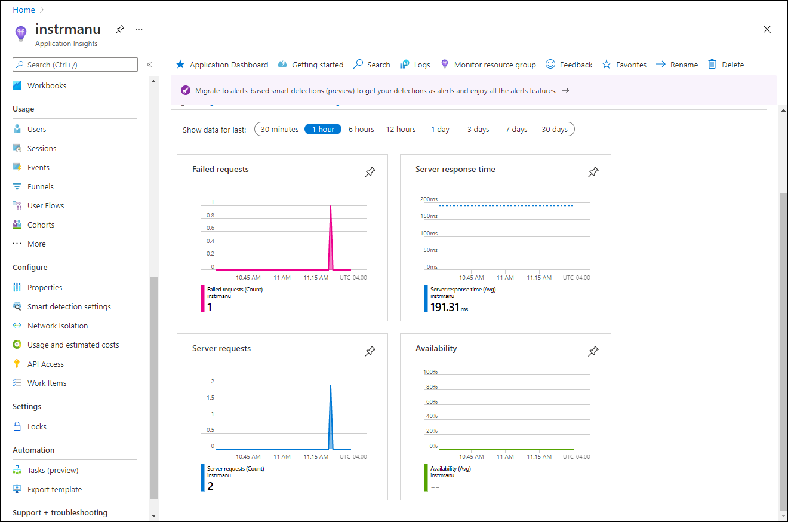

---
lab:
  az204Title: 'Lab 11: Monitor services that are deployed to Azure'
  az204Module: 'Learning Path 11: Troubleshoot solutions by using Application Insights'
---

# Lab 11: Überwachen von Diensten, die in Azure bereitgestellt werden

## Microsoft Azure-Benutzeroberfläche

Aufgrund der dynamischen Natur der Microsoft-Cloudtools kann es vorkommen, dass sich die Azure-Benutzeroberfläche nach der Entwicklung dieses Trainingsinhalts ändert. Daher sind die Lab-Anweisungen und Lab-Schritte möglicherweise nicht mehr zutreffend.

Microsoft aktualisiert diesen Trainingskurs, wenn die Community uns über die erforderlichen Änderungen informiert. Cloudupdates kommen jedoch häufig vor, sodass möglicherweise Änderungen an der Benutzeroberfläche auftreten, bevor diese Trainingsinhalte aktualisiert werden. **Wenn dies der Fall ist, stellen Sie sich auf die Veränderungen ein, und arbeiten Sie sie bei Bedarf in den Labs durch.**

## Anweisungen

### Vorbereitung

#### Anmelden bei der Laborumgebung

Melden Sie sich mithilfe der folgenden Anmeldeinformationen bei Ihrer Windows 11-VM an:

- Benutzername: `Admin`
- Kennwort: `Pa55w.rd`

> **Hinweis**: Ihr Kursleiter stellt Anweisungen zum Herstellen einer Verbindung mit der virtuellen Laborumgebung zur Verfügung.

#### Überprüfen der installierten Anwendungen

Suchen Sie auf Ihrem Windows 11-Desktop nach der Taskleiste. Die Taskleiste enthält die Symbole für die Anwendungen, die Sie in diesem Lab verwenden, darunter:
    
-   Microsoft Edge
-   Datei-Explorer
-   Visual Studio Code
-   Azure PowerShell

## Übungsszenario

In diesem Lab erstellen Sie eine Application Insights-Ressource in Azure, die zum Überwachen und Protokollieren von Application Insight-Daten zur späteren Überprüfung verwendet wird. Die API wird so festgelegt, dass sie automatisch skaliert wird, wenn die Nachfrage auf einen bestimmten Schwellenwert steigt, und die Protokollierung der Daten hilft, zu bestimmen, wie der Dienst verwendet wird.

## Architekturdiagramm


### Übung 1: Erstellen und Konfigurieren von Azure-Ressourcen

#### Aufgabe 1: Öffnen des Azure-Portals

1. Wählen Sie auf der Taskleiste das Symbol **Microsoft Edge** aus.

1. Wechseln Sie im Browserfenster zum Azure-Portal unter `https://portal.azure.com`, und melden Sie sich dann mit dem Konto an, das Sie für dieses Lab verwenden werden.

    > **Hinweis**: Wenn Sie sich zum ersten Mal am Azure-Portal anmelden, wird Ihnen eine Tour durch das Portal angeboten. Wählen Sie **Erste Schritte** aus, um die Tour zu überspringen und mit der Verwendung des Portals zu beginnen.

#### Aufgabe 2: Erstellen einer Application Insights-Ressource

1. Verwenden Sie im Azure-Portal das Textfeld **Ressourcen, Dienste und Dokumente durchsuchen** oben auf der Seite, um nach **Application Insights** zu suchen. Wählen Sie in der Ergebnisliste dann **Application Insights** aus.

1. Klicken Sie im Blatt **Application Insights** auf **+ Erstellen**.

1. Führen Sie im Blatt **Application Insights** auf der Registerkarte **Grundlagen** die folgenden Aktionen aus, und wählen Sie **Überprüfen + Erstellen** aus:
    
    | Einstellung | Aktion |
    | -- | -- |
    | Dropdownliste **Abonnement** | Übernehmen Sie den Standardwert. |
    | Abschnitt **Ressourcengruppe** | Wählen Sie **Neu erstellen** aus, geben Sie **MonitoredAssets** ein, und wählen Sie **OK** aus. |
    | Textfeld **Name**  | **instrm** _[Ihr_Name]_ |
    | Dropdownliste **Region** | Wählen Sie eine beliebige Azure-Region aus, in der Sie eine Application Insights-Ressource bereitstellen können. |
    | Abschnitt **Ressourcenmodus** | Wählen Sie die Option **Arbeitsbereichsbasiert** aus. |
    | Abschnitt **ARBEITSBEREICHSDETAILS** | Übernehmen Sie die Standardwerte für die Dropdownlisten **Abonnement** und **Log Analytics-Arbeitsbereich**. |
    
    Der folgende Screenshot veranschaulicht die konfigurierten Einstellungen im Blatt **Application Insights**.

    
     
1. Überprüfen Sie auf der Registerkarte **Überprüfen und erstellen** die Optionen, die Sie in den vorherigen Schritten ausgewählt haben.

1. Wählen Sie **Erstellen** aus, um die **Application Insights**-Instanz mit Ihrer angegebenen Konfiguration zu erstellen.

    > **Hinweis**: Warten Sie, bis der Erstellungstask abgeschlossen ist, bevor Sie mit diesem Lab fortfahren.

1. Wählen Sie im Blatt **Microsoft.AppInsights \| Übersicht** die Schaltfläche **Gehe zu Ressource** aus, um zum Blatt der neu erstellten **Application Insights**-Ressource zu navigieren.

1. Wählen Sie im Blatt **Application Insights** im Abschnitt **Konfigurieren** den Link **Eigenschaften** aus.

1. Wählen Sie im Blatt **Eigenschaften** neben dem Eintrag **Instrumentierungsschlüssel** die Schaltfläche **In Zwischenablage kopieren** aus, und zeichnen Sie dann den kopierten Wert auf. Sie werden ihn später in diesem Lab brauchen.

    > **Hinweis**: Der Schlüssel wird von Clientanwendungen verwendet, um eine Verbindung mit einer bestimmten **Application Insights**-Ressource herzustellen.

### Aufgabe 3: Erstellen einer Azure-Web-API-Ressource

1. Verwenden Sie im Azure-Portal das Textfeld **Ressourcen, Dienste und Dokumente durchsuchen** oben auf der Seite, um nach **App Services** zu suchen. Wählen Sie in der Ergebnisliste dann **App Services** aus.

1. Wählen Sie auf dem Blatt **App Services** **+ Erstellen** und dann **+ Web-App** aus.
    
1. Führen Sie auf dem Blatt **Web-App erstellen** auf der Registerkarte **Grundlagen** die folgenden Aktionen aus, und wählen Sie dann die Registerkarte **Überwachen + sichern** aus:

    | Einstellung | Aktion |
    | -- | -- |
    | Dropdownliste **Abonnement** | Übernehmen Sie den Standardwert. |
    | Dropdownliste **Ressourcengruppe** |Wählen Sie **MonitoredAssets** aus. |
    | Textfeld **Name**  | Geben Sie **smpapi** _[Ihr_Name]_ ein. |
    | Abschnitt **Veröffentlichen** | Wählen Sie **Code** aus. |
    | Dropdownliste **Laufzeitstapel** | Wählen Sie **.NET 8 (LTS)** aus. |
    | Abschnitt **Betriebssystem** |  Wählen Sie **Windows** aus. |
    | Dropdownliste **Region**  |  Wählen Sie dieselbe Region aus, die Sie als Speicherort der **Application Insights**-Ressource ausgewählt haben. |
    | Abschnitt **Windows-Plan (USA, Osten)** | Wählen Sie **Neu erstellen** aus, geben Sie im Textfeld **Name** den Namen **MonitoredPlan** ein, und wählen Sie dann **OK** aus. |
    | Abschnitt **Tarif** |  Übernehmen Sie den Standardwert. |

1. Führen Sie auf der Registerkarte **Überwachung + sichern** die folgenden Aktionen aus, und wählen Sie dann **Überprüfen + Erstellen** aus:
    
    | Einstellung | Aktion |
    | -- | -- |
    | Abschnitt **Application Insights aktivieren** | Vergewissern Sie sich, dass **Ja** ausgewählt ist. |
    | Dropdownliste **Application Insights** | Wählen Sie die Application Insights-Ressource **instrm** _[Ihr_Name]_ aus, die Sie zuvor in diesem Lab erstellt haben. |
    
1. Überprüfen Sie auf der Registerkarte **Web-App erstellen** die Optionen, die Sie in den vorherigen Schritten ausgewählt haben.

1. Wählen Sie **Erstellen** aus, um die Web-API mit Ihrer angegebenen Konfiguration zu erstellen.

    > **Hinweis**: Warten Sie, bis der Erstellungstask abgeschlossen ist, bevor Sie mit diesem Lab fortfahren.

1. Wählen Sie im Blatt **Übersicht** für die Bereitstellung die Schaltfläche **Gehe zu Ressource** aus, um zum Blatt der neu erstellten Azure-Web-API zu navigieren.

1. Wählen Sie auf dem Blatt **App Service** im Abschnitt **Einstellungen** den Link **Umgebungsvariablen** aus.

1. Führen Sie im Abschnitt **Umgebungsvariablen** die folgenden Aktionen aus:
    
    a.  Wählen Sie auf der Registerkarte **Anwendungseinstellungen** die Option **Werte anzeigen** aus, um die Geheimnisse für Ihre Web-API anzuzeigen.

    b.  Notieren Sie den Wert, der den **APPLICATIONINSIGHTS_CONNECTION_STRING**-Schlüssel darstellt. Dieser Wert wurde beim Erstellen der Web-API-Ressource automatisch festgelegt.

1. Wählen Sie auf dem Blatt **App-Service** die Option **Übersicht** am oberen Rand des Dienstmenüs aus.

1. Notieren Sie sich den Wert des Links **Standarddomäne** auf dem Blatt **App-Service** im Abschnitt **Essentials**. Sie verwenden diesen Wert später im Lab, um Anforderungen an die Web-API zu übermitteln.

#### Aufgabe 4: Konfigurieren von Optionen für die automatische Skalierung der Web-API

1. Wählen Sie im Blatt **App Service** im Abschnitt **Einstellungen** den Link **Horizontal hochskalieren (App Service-Plan)** aus.

1. Scrollen Sie nach unten, bis die **Scaleout-Methode** angezeigt wird. Wählen Sie die Option **Regelnbasiert** und dann **Konfigurieren** aus.


1. Führen Sie im Abschnitt **Horizontal hochskalieren** die folgenden Aktionen aus, und wählen Sie dann **Speichern** aus:
    
    | Einstellung | Aktion |
    | -- | -- |
    | Abschnitt **Horizontal hochskalieren** | Wählen Sie **Benutzerdefinierte Autoskalierung** aus. |
    | Textfeld **Name der Einstellung für die Autoskalierung** | Geben Sie **ComputeScaler** ein. |
    | Dropdownliste **Ressourcengruppe** |Wählen Sie **MonitoredAssets** aus. |
    | Abschnitt **Skalierungsmodus** | Wählen Sie **Basierend auf einer Metrik skalieren** aus. |
    | Textfeld **Minimum** im Abschnitt **Instanzgrenzwerte** | **1** eingeben |
    | Textfeld **Maximum** im Abschnitt **Instanzgrenzwerte** | Geben Sie **8** ein. |
    | Textfeld **Standard** im Abschnitt **Instanzgrenzwerte** | Geben Sie **3** ein. |
   
    Im folgenden Screenshot sind die konfigurierten Einstellungen im Abschnitt **Horizontal hochskalieren** im Blatt **App Service** dargestellt.
    
    

    | Einstellung | Aktion |
    | -- | -- |
    | Abschnitt **Regeln** | Wählen Sie **Regel hinzufügen** aus. |
    | Blatt **Skalierungsregel** | Übernehmen Sie die Standardwerte für alle Einstellungen, und wählen Sie dann **Hinzufügen** aus. |

    Im folgenden Screenshot sind die zusätzlichen Einstellungen im Abschnitt **Horizontal hochskalieren** im Blatt **App Service** dargestellt.

   

    > **Hinweis**: Warten Sie, bis der Speichervorgang abgeschlossen ist, bevor Sie mit diesem Lab fortfahren.

#### Überprüfung

In dieser Übung haben Sie die Azure-Ressourcen erstellt, die Sie für den Rest des Labs verwenden.

### Übung 2: Überwachen einer lokalen Web-API mithilfe von Application Insights

#### Aufgabe 1: Erstellen eines .NET-Web-API-Projekts

1. Starten Sie auf dem Lab-Computer **Visual Studio Code**.

1. Wählen Sie in Visual Studio Code im Menü **Datei** die Option **Ordner öffnen** aus.

1. Navigieren Sie im Fenster **Ordner öffnen** zu **Allfiles (F):\\Allfiles\\Labs\\11\\Starter\\Api**, und wählen Sie dann **Ordner auswählen** aus.

1. Wählen Sie im Fenster **Visual Studio Code** auf der Menüleiste **Terminal** und dann **Neues Terminal*** aus.

1. Führen Sie an der Terminaleingabeaufforderung den folgenden Befehl aus, um eine neue .NET-Web-API-Anwendung mit dem Namen **SimpleApi** im aktuellen Verzeichnis zu erstellen:

    ```
    dotnet new webapi --output . --name SimpleApi --framework net8.0
    ```

1. Führen Sie den folgenden Befehl aus, um Version 2.21.0 von **Microsoft.ApplicationInsights** aus NuGet in das aktuelle Projekt zu importieren:

    ```
    dotnet add package Microsoft.ApplicationInsights --version 2.21.0
    ```

    > **Hinweis**: Mit dem Befehl **dotnet add package** wird das Paket **Microsoft.ApplicationInsights** aus NuGet hinzugefügt. Weitere Informationen finden Sie unter [Microsoft.ApplicationInsights](https://www.nuget.org/packages/Microsoft.ApplicationInsights/).

1. Führen Sie den folgenden Befehl aus, um Version 2.21.0 von **Microsoft.ApplicationInsights.AspNetCore** aus NuGet zu importieren:

    ```
    dotnet add package Microsoft.ApplicationInsights.AspNetCore --version 2.21.0
    ```

    > **Hinweis**: Mit dem Befehl **dotnet add package** wird das Paket **Microsoft.ApplicationInsights.AspNetCore** aus NuGet hinzugefügt. Weitere Informationen finden Sie unter [Microsoft.ApplicationInsights.AspNetCore](https://www.nuget.org/packages/Microsoft.ApplicationInsights.AspNetCore).

1. Führen Sie an der Terminaleingabeaufforderung den folgenden Befehl aus, um Version 2.21.0 von **Microsoft.ApplicationInsights.PerfCounterCollector** aus NuGet in das aktuelle Projekt zu importieren:

    ```
    dotnet add package Microsoft.ApplicationInsights.PerfCounterCollector --version 2.21.0
    ```

    > **Hinweis**: Mit dem Befehl **dotnet add package** wird das Paket **Microsoft.ApplicationInsights.PerfCounterCollector** aus NuGet hinzugefügt. Weitere Informationen finden Sie unter [Microsoft.ApplicationInsights.PerfCounterCollector](https://www.nuget.org/packages/Microsoft.ApplicationInsights.PerfCounterCollector/).

1. Führen Sie an der Terminaleingabeaufforderung den folgenden Befehl aus, um Version 2.4.0 von **Microsoft.ApplicationInsights.Profiler.AspNetCore** aus NuGet in das aktuelle Projekt zu importieren:

    ```
    dotnet add package Microsoft.ApplicationInsights.Profiler.AspNetCore --version 2.4.0
    ```

    > **Hinweis**: Mit dem Befehl **dotnet add package** wird das Paket **Microsoft.ApplicationInsights.Profiler.AspNetCore** aus NuGet hinzugefügt. Weitere Informationen finden Sie unter [Microsoft.ApplicationInsights.Profiler.AspNetCore](https://www.nuget.org/packages/Microsoft.ApplicationInsights.Profiler.AspNetCore/).

1. Führen Sie an der Terminaleingabeaufforderung den folgenden Befehl aus, um die .NET-Web-API zu erstellen:

    ```
    dotnet build
    ```
    
#### Aufgabe 2: Aktualisieren des App-Codes zum Deaktivieren von HTTPS und Verwenden von Insights

1. Wählen Sie im **Visual Studio Code**-Fenster im **Explorer**-Bereich die Datei **Program.cs** aus, um sie im **Editor**-Bereich zu öffnen.

1. Suchen Sie im **Editor**-Bereich den folgenden Code in Zeile 17, und löschen Sie ihn:

    ```csharp
    app.UseHttpsRedirection();
    ```

    > **Hinweis**: Diese Codezeile zwingt die Web-API, HTTPS zu verwenden. Für dieses Lab ist dies unnötig.

1. Fügen Sie in der Datei **Program.cs** ab Zeile 7 die folgenden beiden Zeilen ein, um das Profiler-Tool zu aktivieren, indem es zusammen mit Application Insights in der Dienstsammlung registriert wird:

    ```csharp
    builder.Services.AddApplicationInsightsTelemetry();
    builder.Services.AddServiceProfiler();
    ```

1. Speichern Sie die Änderungen, und schließen Sie die Datei **Program.cs**.

1. Wählen Sie im **Visual Studio Code**-Fenster im **Explorer**-Bereich die Datei **appsettings.json** aus, um sie im **Editor**-Bereich zu öffnen.

1. Fügen Sie der Datei **appsettings.json** direkt nach dem Element **Protokollierung** das folgende Element hinzu. Ersetzen Sie dabei den Platzhalter `instrumentation-key` durch den Wert des Application Insights-Ressourceninstrumentierungsschlüssels, den Sie sich zuvor in diesem Lab notiert haben:

    ```json
       "ApplicationInsights":
       {
          "InstrumentationKey": "instrumentation-key"
       },
    ```

    > **Hinweis**: Wenn es sich bei dem Abschnitt, den Sie hinzufügen, um das letzte Element der Datei handelt, entfernen Sie das nachstehende Komma.

1. Ihre Datei appsettings.json sollte nun eine Struktur haben, die etwa wie folgt aussieht:

    ```json
    {
        "Logging":{
            "LogLevel": {
                "Default": "Information",
                "Microsoft.AspNetCore": "Warning"
            }
        },
       "ApplicationInsights":
       {
          "InstrumentationKey": "instrumentation-key"
       },
       "AllowedHosts": "*"
    }
    ```

    > **Beachten Sie,** dass Sie den Platzhalter durch Ihren eigenen Instrumentierungsschlüssel ersetzt haben, den Sie zuvor aufgezeichnet haben.

1. Speichern Sie die Änderungen an der Datei **appsettings.json**, und schließen Sie sie.

1. Führen Sie an der Terminaleingabeaufforderung den folgenden Befehl aus, um die .NET-Web-API zu erstellen.

    ```
    dotnet publish -c Release -r win-x86 --self-contained -p:PublishReadyToRun=true .\SimpleApi.csproj
    ```

#### Aufgabe 3: Lokales Testen einer API-Anwendung

1. Führen Sie an der Terminaleingabeaufforderung den folgenden Befehl aus, um die .NET-Web-API zu starten.

    ```
    dotnet run
    ```

1. Sehen Sie sich die Ausgabe des Befehls an und notieren Sie sich die HTTPS-URL, an der die Website lauscht.

1. Blenden Sie in der Taskleiste das Kontextmenü für das **Microsoft Edge**-Symbol ein, und öffnen Sie dann ein neues Browserfenster.

1. Navigieren Sie in dem geöffneten Browserfenster zur URL `http://localhost`, und fügen Sie den relativen Pfad **/weatherforecast** Ihrer Web-API hinzu.
    
    > **Hinweis**: Die vollständige URL lautet `http://localhost:[port-number]/weatherforecast`. Dabei gibt der Platzhalter `[port-number]` die Nummer des Ports an, an dem die Web-App über das HTTPS-Protokoll erreichbar ist.

    > **Hinweis**: Die Seite sollte eine Ausgabe im folgenden Format enthalten: Die tatsächlichen Werte **sind** unterschiedlich. 

    ```json
    [
        {
            "date": "2023-10-29",
            "temperatureC": -8,
            "summary": "Sweltering",
            "temperatureF": 18
        },
        {
            "date": "2023-10-30",
            "temperatureC": -12,
            "summary": "Hot",
            "temperatureF": 11
        },
        {
            "date": "2023-10-31",
            "temperatureC": 50,
            "summary": "Chilly",
            "temperatureF": 121
        },
        {
            "date": "2023-11-01",
            "temperatureC": 51,
            "summary": "Chilly",
            "temperatureF": 123
        },
        {
            "date": "2023-11-02",
            "temperatureC": 29,
            "summary": "Balmy",
            "temperatureF": 84
        }
    ]
    ```

1. Aktualisieren Sie die Browserseite mehrmals, um einige Antworten zu simulieren.

1. Schließen Sie das Browserfenster, in dem die von `http://localhost:[port-number]/weatherforecast` generierte Seite angezeigt wird.

1. Wählen Sie in Visual Studio Code **Terminal beenden** (das Symbol **Papierkorb**) aus, um den **Terminal**-Bereich und alle zugehörigen Prozesse zu schließen.

#### Aufgabe 4: Überprüfen von Metriken in Application Insights

1. Wechseln Sie auf Ihrem Lab-Computer zum **Microsoft Edge**-Browserfenster, in dem das Azure-Portal angezeigt wird.

1. Navigieren Sie im Azure-Portal zurück zum Blatt der Application Insights-Ressource **instrm** _[Ihr_Name]_ , die Sie zuvor in diesem Lab erstellt haben.

1. Betrachten Sie im Blatt **Application Insights** die in den Kacheln in der Mitte des Blatts angezeigten Metriken. Beachten Sie insbesondere die Anzahl der aufgetretenen Serveranforderungen und die durchschnittliche Serverantwortzeit.

    Der folgende Screenshot veranschaulicht die **Application Insights**-Metriken der lokalen Web-App.

    

    > **Hinweis**: Es kann bis zu fünf Minuten dauern, bis Anforderungen in den Application Insights-Metrikdiagrammen angezeigt werden.

#### Überprüfung

In dieser Übung haben Sie mithilfe von ASP.NET eine API-App erstellt und für das Streamen von Anwendungsmetriken an Application Insights konfiguriert. Anschließend haben Sie das Application Insights-Dashboard verwendet, um Leistungsdetails Ihrer API zu überprüfen.

### Übung 3: Überwachen einer Web-API mithilfe von Application Insights

#### Aufgabe 1: Bereitstellen einer Anwendung für die Web-API

1. Wechseln Sie auf dem Lab-Computer zu Visual Studio Code.

1. Wählen Sie im Fenster **Visual Studio Code** auf der Menüleiste **Terminal** und dann **Neues Terminal** aus.

1. Führen Sie an der Terminaleingabeaufforderung den folgenden Befehl aus, um sicherzustellen, dass das aktuelle Verzeichnis, auf **Allfiles (F):\\Allfiles\\Labs\\11\\Starter\\Api\\bin\\Debug\\net8.0\\net8.0\\win-x86\\publish** festgelegt ist, in dem sich die Bereitstellungsdateien befinden:

    ```
    cd F:\Allfiles\Labs\11\Starter\Api\bin\Release\net8.0\win-x86\publish\
    ```

1. Führen Sie den folgenden Befehl aus, um eine ZIP-Datei mit dem Starter-Projekt zu erstellen, das Sie neben der Azure-Web-API bereitstellen:

    ```powershell
    Compress-Archive -Path * -DestinationPath api.zip
    ```

1. Führen Sie an der Terminaleingabeaufforderung den folgenden Befehl aus, um sich über Azure PowerShell bei Ihrem Azure-Abonnement anzumelden:

    ```powershell
    Connect-AzAccount
    ```

1. Wenn Sie dazu aufgefordert werden, authentifizieren Sie sich, indem Sie die Anmeldeinformationen für den Zugriff auf das Azure-Abonnement angeben, das Sie für dieses Lab verwenden.

    > **Hinweis**: Warten Sie, bis der Anmeldevorgang abgeschlossen ist.

1. Führen Sie den folgenden Befehl aus, um die Liste aller Web-Apps in der **MonitoredAssets**-Ressourcengruppe anzuzeigen:

    ```powershell
    Get-AzWebApp -ResourceGroupName MonitoredAssets
    ```

1. Führen Sie den folgenden Befehl aus, um die Liste aller Web-Apps in der **MonitoredAssets**-Ressourcengruppe anzuzeigen, deren Namen mit **smpapi\*** beginnen:

    ```powershell
    Get-AzWebApp -ResourceGroupName MonitoredAssets | Where-Object {$_.Name -like 'smpapi*'}
    ```

1. Führen Sie die folgenden Befehle aus, um den Namen der ersten im vorherigen Schritt ermittelten Web-App anzuzeigen und in einer Variablen namens **$webAppName** zu speichern:

    ```powershell
    Get-AzWebApp -ResourceGroupName MonitoredAssets | Where-Object {$_.Name -like 'smpapi*'} | Select-Object -ExpandProperty Name
    $webAppName = (Get-AzWebApp -ResourceGroupName MonitoredAssets | Where-Object {$_.Name -like 'smpapi*'})[0] | Select-Object -ExpandProperty Name
    ```

1. Führen Sie den folgenden Befehl aus, um die zuvor in dieser Aufgabe erstellte **api.zip**-Datei für die Web-API bereitzustellen, deren Name Sie im vorherigen Schritt ermittelt haben:

    ```powershell
    Publish-AzWebApp -ResourceGroupName MonitoredAssets -Name $webAppName -ArchivePath "F:\Allfiles\Labs\11\Starter\Api\bin\Release\net8.0\win-x86\publish\api.zip" -force
    ```

    > **Hinweis**: Warten Sie, bis die Bereitstellung abgeschlossen ist, bevor Sie mit diesem Lab fortfahren.

1. Öffnen Sie auf dem Lab-Computer ein weiteres Microsoft Edge-Browserfenster.

1. Navigieren Sie im Browserfenster zu der Azure-Web-API-App, in der Sie die API-App zuvor in dieser Aufgabe bereitgestellt haben, indem Sie an die URL (die Sie zuvor in diesem Lab aufgezeichnet haben) das Suffix **/weatherforecast** anfügen.

    > **Hinweis**: Bei der URL `https://smpapianu.azurewebsites.net` lautet die neue URL beispielsweise `https://smpapianu.azurewebsites.net/weatherforecast`.

1. Vergewissern Sie sich, dass die Ausgabe der Ausgabe ähnelt, die bei der lokalen Ausführung der API-App erzeugt wurde.

    > **Hinweis**: Die Ausgabe enthält andere Werte, sollte jedoch das gleiche Format aufweisen.

#### Aufgabe 2: Konfigurieren einer ausführlichen Metriksammlung für Web-Apps

1. Wechseln Sie auf Ihrem Lab-Computer zum **Microsoft Edge**-Browserfenster, in dem das Azure-Portal angezeigt wird.

1. Navigieren Sie im Azure-Portal zurück zum Blatt der Web-App-Ressource **smpapi** _[Ihr_Name]_ , die Sie zuvor in diesem Lab erstellt haben.

1. Wählen Sie auf dem Blatt **App Service** die Option **Application Insights** aus.

1. Führen Sie im Blatt **Application Insights** die folgenden Aktionen aus. Wählen Sie dann **Übernehmen** und anschließend im Bestätigungsdialogfeld **Ja** aus:

    | Einstellung | Aktion |
    | -- | -- |
    | Schieberegler **Application Insights** | Dieser muss auf **Aktivieren** festgelegt sein. |
    | Abschnitt **Instrumentieren Ihrer Anwendung** | Wählen Sie die Registerkarte **.NET** aus. |
    | Abschnitt **Sammlungsebene** | Wählen Sie **Empfohlen** aus. |
    | Abschnitt **Profiler** | Wählen Sie **Ein** aus. |
    | Abschnitt **Debugger für Momentaufnahmen** | Wählen Sie **Aus** aus. |
    | Abschnitt **SQL-Befehle** | Wählen Sie **Aus** aus. |

    
    Der folgende Screenshot veranschaulicht die **Application Insights**-Einstellungen der Azure-Web-API.
    
    

1. Wechseln Sie zur Browserregisterkarte, die Sie in der vorherigen Aufgabe geöffnet haben, um die Ergebnisse der Bereitstellung Ihrer API-App für die Azure-API-Ziel-App anzuzeigen (mit dem relativen Pfad **/weatherforecast** in der Ziel-URL), und aktualisieren Sie die Browserseite mehrmals.

1. Überprüfen Sie die von der API generierte Ausgabe im JSON-Format.

1. Zeichnen Sie die URL auf, die Sie für den Zugriff auf die Ausgabe im JSON-Format verwendet haben.

    > **Hinweis**: Die URL sollte das Format `https://smpapianu.azurewebsites.net/weatherforecast` aufweisen, wenn **smpapianu** der zuvor erstellte Websitename war.

#### Aufgabe 3: Abrufen aktualisierter Metriken in Application Insights

1. Kehren Sie zum Browserfenster zurück, in dem die Azure-Web-App im Azure-Portal angezeigt wird.

1. Wählen Sie im Blatt **Application Insights** der Web-App den Link **Application Insights-Daten anzeigen** aus.

1. Überprüfen Sie im Blatt **Application Insights** die gesammelten Metriken in den Kacheln in der Mitte des Blatts, u. a. die Anzahl der aufgetretenen Serveranforderungen und die durchschnittliche Serverantwortzeit.
 
    Der folgende Screenshot veranschaulicht die **Application Insights**-Metriken der Azure-Web-App im Azure-Portal.
     
    

    > **Hinweis**: Es kann bis zu fünf Minuten dauern, bis in den Application Insights-Metrikdiagrammen aktualisierte Metriken angezeigt werden.

#### Aufgabe 4: Anzeigen von Echtzeitmetriken in Application Insights

1. Wählen Sie im Blatt **Application Insights** im Abschnitt **Untersuchen** die Option **Livemetriken** aus.

1. Wechseln Sie zurück zum Browserfenster, in dem die API-Ziel-App angezeigt wird, die in der Azure-Ziel-Web-App ausgeführt wird (mit dem relativen Pfad **/weatherforecast** in der Ziel-URL), und aktualisieren Sie dann die Browserseite mehrmals.

1. Wechseln Sie zum Browserfenster, in dem das Blatt **Livemetriken** angezeigt wird, und überprüfen Sie dessen Inhalt.

    > **Hinweis**: Der Abschnitt **Eingehende Anforderungen** sollte innerhalb weniger Sekunden aktualisiert werden und die Anforderungen anzeigen, die Sie an die Web-API gerichtet haben.

#### Überprüfung

In dieser Übung haben Sie die Application Insights-Protokollierung Ihrer Web-API-App konfiguriert und getestet und sich Live-Informationen über die getätigten Anfragen angesehen.
