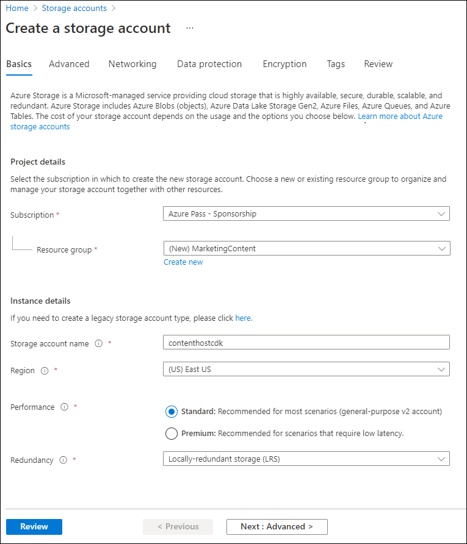

---
lab:
  az204Title: 'Lab 12: Enhance a web application by using the Azure Content Delivery Network'
  az204Module: 'Learning Path 12: Implement caching for solutions'
---

# Lab 12: Verbessern einer Webanwendung mit Azure Content Delivery Network

## Microsoft Azure-Benutzeroberfläche

Aufgrund der dynamischen Natur der Microsoft-Cloudtools kann es vorkommen, dass sich die Azure-Benutzeroberfläche nach der Entwicklung dieses Trainingsinhalts ändert. Daher sind die Lab-Anweisungen und Lab-Schritte möglicherweise nicht mehr zutreffend.

Microsoft aktualisiert diesen Trainingskurs, wenn die Community uns über die erforderlichen Änderungen informiert. Cloudupdates kommen jedoch häufig vor, sodass möglicherweise Änderungen an der Benutzeroberfläche auftreten, bevor diese Trainingsinhalte aktualisiert werden. **Wenn dies der Fall ist, stellen Sie sich auf die Veränderungen ein, und arbeiten Sie sie bei Bedarf in den Labs durch.**

## Anweisungen

### Vorbereitung

#### Anmelden bei der Laborumgebung

Melden Sie sich mithilfe der folgenden Anmeldeinformationen bei Ihrer Windows 10-VM an:

- Benutzername: `Admin`
- Kennwort: `Pa55w.rd`

> **Hinweis**: Ihr Kursleiter stellt Anweisungen zum Herstellen einer Verbindung mit der virtuellen Laborumgebung zur Verfügung.

#### Überprüfen der installierten Anwendungen

Suchen Sie auf ihrem Windows 10-Desktop nach der Taskleiste. Die Taskleiste enthält die Symbole für die Anwendungen, die Sie in diesem Lab verwenden:

- Microsoft Edge

## Übungsszenario

In diesem Lab implementieren Sie die Azure Content Delivery Network-Funktionen, um eine Zwischenspeicherungslösung basierend auf Kundenstandorten bereitzustellen. In diesem Lab wird ein Speicherkonto für Bild- und Videodateien konfiguriert, die am meisten von den Latenzproblemen betroffen sind. Sie verwenden den Azure Content Delivery Network-Dienst, um die Zwischenspeicherungslösung zu implementieren und dadurch die Latenz für diese Bild- und Videodateien zu verringern.

## Architekturdiagramm


### Übung 1: Erstellen von Azure-Ressourcen

#### Aufgabe 1: Öffnen des Azure-Portals

1. Wählen Sie auf der Taskleiste das Symbol **Microsoft Edge** aus.

1. Wechseln Sie im geöffneten Browserfenster zum Azure-Portal unter `https://portal.azure.com`, und melden Sie sich dann mit dem Konto an, das Sie für dieses Lab verwenden werden.

   > **Hinweis**: Wenn Sie sich zum ersten Mal am Azure-Portal anmelden, wird Ihnen eine Tour durch das Portal angeboten. Wählen Sie **Erste Schritte** aus, um die Tour zu überspringen und mit der Verwendung des Portals zu beginnen.

#### Aufgabe 2: Erstellen eines Speicherkontos

1. Verwenden Sie im Azure-Portal das Textfeld **Ressourcen, Dienste und Dokumente durchsuchen**, um nach einem **Speicherkonto** zu suchen, und wählen Sie in der Ergebnisliste den Eintrag **Speicherkonto** aus.

1. Klicken Sie auf dem Blatt **Speicherkonten** auf **+ Erstellen**.

1. Führen Sie auf der Registerkarte **Grundlagen** des Blatts **Speicherkonto erstellen** die folgenden Aktionen aus.

   | Einstellung | Aktion |
   | -- | -- |
   | Dropdownliste **Abonnement** | Übernehmen Sie den Standardwert. |
   | Abschnitt **Ressourcengruppe** | Wählen Sie **Neu erstellen** aus, geben Sie **MarketingContent** ein, und wählen Sie dann **OK** aus. |
   | Textfeld **Speicherkontoname** | Geben Sie **contenthost** _[Ihr_Name]_ ein. |
   | Dropdownliste **Region** | Wählen Sie **USA, Osten** aus. |
   | Abschnitt **Leistung** | Wählen Sie die Option **Standard** aus. |
   | Dropdownliste **Redundanz** | Wählen Sie **Lokal redundanter Speicher (LRS)** aus. |

    Der folgende Screenshot zeigt die konfigurierten Einstellungen im Blatt **Speicherkonto erstellen**.

    

1. Stellen Sie auf der Registerkarte **Erweitert** sicher, dass **Aktivieren des öffentlichen Zugriffs für einzelne Container erlauben** aktiviert ist. Aktivieren Sie das Kontrollkästchen, wenn es nicht aktiviert ist.

1. Überprüfen Sie auf der Registerkarte **Überprüfen** die Optionen, die Sie in den vorherigen Schritten ausgewählt haben.

1. Wählen Sie **Erstellen** aus, um das Speicherkonto mithilfe Ihrer angegebenen Konfiguration zu erstellen.

    > **Hinweis**: Warten Sie, bis der Erstellungstask abgeschlossen ist, bevor Sie mit diesem Lab fortfahren.

#### Aufgabe 3: Erstellen einer Web-App mit Azure App Service

1. Wählen im Navigationsbereich des Azure-Portals die Option **Ressource erstellen** aus.

1. Geben Sie im Blatt **Ressource erstellen** im Textfeld **Dienste und Marketplace durchsuchen** den Text **Web App** ein, und drücken Sie dann die EINGABETASTE.

1. Wählen Sie im Blatt mit den Suchergebnissen das **Web-App**-Ergebnis und dann **Erstellen** aus.

1. Führen Sie im Blatt **Web-App erstellen** auf der Registerkarte **Grundlagen** die folgenden Aktionen aus, und wählen Sie **Weiter: Docker** aus:

   | Einstellung | Aktion |
   | -- | -- |
   | Dropdownliste **Abonnement** | Übernehmen Sie den Standardwert. |
   | Dropdownliste **Ressourcengruppe** | Wählen Sie **MarketingContent** in der Liste aus. |
   | Textfeld **Name** | Geben Sie **landingpage** _[Ihr_Name]_ ein. |
   | Abschnitt **Veröffentlichen** | Wählen Sie **Docker-Container** aus. |
   | Abschnitt **Betriebssystem** | Wählen Sie **Linux** aus. |
   | Dropdownliste **Region** | Wählen Sie **USA, Osten** aus. |
   | Abschnitt **Linux-Plan (USA, Osten)** | Wählen Sie **Neu erstellen**. Geben Sie im Textfeld **Name** den Namen **MarketingPlan** ein, und wählen Sie dann **OK** aus. |
   | Abschnitt **Tarif** | Übernehmen Sie den Standardwert. |

   Der folgende Screenshot veranschaulicht die konfigurierten Einstellungen auf dem Blatt **Web-App erstellen**.

   

1. Führen Sie auf der Registerkarte **Docker** die folgenden Aktionen aus, und wählen Sie dann **Überprüfen + erstellen** aus:

   | Einstellung | Aktion |
   | -- | -- |
   | Dropdownliste **Optionen** | Wählen Sie **Einzelner Container** aus. |
   | Dropdownliste **Imagequelle** | Wählen Sie **Docker Hub**. |
   | Dropdownliste **Zugriffstyp** | Wählen Sie **Öffentlich (10.0.0.0/24)**. |
   | Textfeld **Image und Tag** | Geben Sie **microsoftlearning/edx-html-landing-page:latest** ein. |

   Der folgende Screenshot veranschaulicht die konfigurierten Einstellungen auf der Registerkarte **Docker**.

   

1. Überprüfen Sie auf der Registerkarte **Überprüfen und erstellen** die Optionen, die Sie in den vorherigen Schritten ausgewählt haben.

1. Wählen Sie **Erstellen** aus, um die Web-App mit Ihrer angegebenen Konfiguration zu erstellen.

    > **Hinweis**: Warten Sie, bis der Erstellungstask abgeschlossen ist, bevor Sie mit diesem Lab fortfahren.

1. Klicken Sie auf dem Blatt **Bereitstellung** auf **Zu Ressource wechseln**.

1. Notieren Sie sich den Wert des Links **URL** auf dem Blatt **App Service: Übersicht** im Abschnitt **Grundlagen**. Sie verwenden diesen Wert später im Lab.

#### Überprüfung

In dieser Übung haben Sie ein Azure-Speicherkonto und eine Azure-Web-App erstellt, die Sie später in diesem Lab verwenden werden.

### Übung 2: Konfigurieren von Content Delivery Network und Endpunkten

#### Aufgabe 1: Öffnen von Azure Cloud Shell

1. Wählen Sie im Azure-Portal das Symbol **Cloud Shell** () aus, um eine neue Bash-Sitzung zu öffnen. Wenn Cloud Shell standardmäßig auf eine PowerShell-Sitzung festgelegt ist, wählen Sie **PowerShell** und dann im Dropdownmenü **Bash** aus.

    > **Hinweis**: Wenn Sie **Cloud Shell** zum ersten Mal starten, wählen Sie **Bash** aus, wenn Sie aufgefordert werden, **Bash** oder **PowerShell** auszuwählen. Wenn die Meldung **Für Sie wurde kein Speicher bereitgestellt** angezeigt wird, wählen Sie das Abonnement aus, das Sie in diesem Lab verwenden, und wählen Sie **Speicher erstellen** aus.

1. Führen Sie im Azure-Portal an der **Cloud Shell**-Eingabeaufforderung den folgenden Befehl aus, um die Version des Azure CLI-Tools (Azure Command-Line Interface) abzurufen:

    ```bash
    az --version
    ```

#### Aufgabe 2: Registrieren des Microsoft.CDN-Anbieters

1. Führen Sie an der **Cloud Shell**-Eingabeaufforderung im Portal die folgenden Aktionen aus:

    a.  Geben Sie den folgenden Befehl ein, um zu überprüfen, ob Microsoft.CDN registriert wurde. Fahren Sie mit Schritt 2 fort. Falls Microsoft.CDN bereits registriert wurde:

    ```bash
    az provider show --namespace Microsoft.CDN --query "registrationState"
    ```

    b.  Falls Microsoft.CDN nicht registriert wurde: Geben Sie den folgenden Befehl ein, und drücken Sie dann die EINGABETASTE, um den **Microsoft.CDN**-Namespace bei Ihrem aktuellen Abonnement zu registrieren:

    ```bash
    az provider register --namespace Microsoft.CDN
    ```

1. Schließen Sie den Bereich **Cloud Shell** im Portal.

#### Aufgabe 3: Erstellen eines Content Delivery Network-Profils

1. Wählen im Navigationsbereich des Azure-Portals die Option **Ressource erstellen** aus.

1. Geben Sie im Blatt **Ressource erstellen** im Textfeld **Dienste und Marketplace durchsuchen** den Text **CDN** ein, und drücken Sie dann die EINGABETASTE.

1. Wählen Sie auf dem Blatt mit den Suchergebnissen für **Marketplace** das Ergebnis **Front Door- und CDN-Profile** und dann **Erstellen** aus.

1. Wählen Sie auf der Seite **Angebote vergleichen** die Option **Weitere Angebote erkunden** aus. Wählen Sie dann **Azure CDN Standard von Microsoft (klassisch)** und danach **Weiter** aus.

1. Führen Sie im Blatt **CDN-Profil** auf der Registerkarte **Grundlagen** die folgenden Aktionen aus, und wählen Sie dann **Überprüfen und erstellen** aus:

   | Einstellung | Aktion |
   | -- | -- |
   | Dropdownliste **Abonnement** | Übernehmen Sie den Standardwert. |
   | Dropdownliste **Ressourcengruppe** | Wählen Sie **MarketingContent** in der Liste aus. |
   | Textfeld **Name** | Geben Sie **contentdeliverynetwork** ein. |
   | Textfeld **Region** | Übernehmen Sie den Standardwert (Global). |
   | Dropdownliste **Tarif** | Wählen Sie **Microsoft CDN (klassisch)** aus. |
   | Kontrollkästchen **Neuen CDN-Endpunkt erstellen** | Nicht ausgewählt |

   Der folgende Screenshot veranschaulicht die konfigurierten Einstellungen im Blatt **CDN-Profil**.

   

1. Überprüfen Sie auf der Registerkarte **Überprüfen und erstellen** die Optionen, die Sie in den vorherigen Schritten ausgewählt haben.

1. Wählen Sie **Erstellen** aus, um das CDN-Profil mit Ihrer angegebenen Konfiguration zu erstellen.
  
    > **Hinweis**: Warten Sie, bis Azure die Erstellung des CDN Profils abgeschlossen hat, bevor Sie mit dem Lab fortfahren. Sie erhalten eine Benachrichtigung, wenn die App erstellt wurde.

#### Aufgabe 4: Konfigurieren von Speichercontainern

1. Wählen im Navigationsbereich des Azure-Portals die Option **Ressourcengruppe** aus.

1. Wählen Sie im Blatt **Ressourcengruppen** die Ressourcengruppe **MarketingContent** aus, die Sie zuvor in diesem Lab erstellt haben.

1. Wählen Sie im Blatt **MarketingContent** das Speicherkonto **contenthost** _[Ihr_Name]_ aus, das Sie zuvor in diesem Lab erstellt haben.

1. Wählen Sie im Blatt **Speicherkonto** den **Container**-Link im Abschnitt **Datenspeicher** aus.

1. Wählen Sie im Abschnitt **Container** die Option **+ Container** aus.

1. Führen Sie im Popupfenster **Neuer Container** die folgenden Aktionen aus, und wählen Sie dann **Erstellen** aus:

   | Einstellung | Aktion |
   | -- | -- |
   | Textfeld **Name** | Geben Sie **media** ein. |
   | Dropdownliste **Öffentliche Zugriffsebene** | Wählen Sie **Blob (anonymer Lesezugriff nur für Blobs)** aus. |

1. Wählen Sie im Abschnitt **Container** erneut die Option **+ Container** aus.

1. Führen Sie im Popupfenster **Neuer Container** die folgenden Aktionen aus, und wählen Sie dann **Erstellen** aus:

   | Einstellung | Aktion |
   | -- | -- |
   | Textfeld **Name** | Geben Sie **video** ein. |
   | Dropdownliste **Öffentliche Zugriffsebene** | Wählen Sie **Blob (anonymer Lesezugriff nur für Blobs)** aus. |

1. Sehen Sie sich die aktualisierte Liste der Container an, und vergewissern Sie sich, dass sowohl der **media**- als auch der **video**-Container aufgeführt sind.

#### Aufgabe 5: Erstellen der Content Delivery Network-Endpunkte

1. Wählen im Navigationsbereich des Azure-Portals den Link **Ressourcengruppe** aus.

1. Wählen Sie im Blatt **Ressourcengruppen** die Ressourcengruppe **MarketingContent** aus, die Sie zuvor in diesem Lab erstellt haben.

1. Wählen Sie im Blatt **MarketingContent** das CDN-Profil **contentdeliverynetwork** aus, das Sie zuvor in diesem Lab erstellt haben.

1. Wählen Sie im Blatt **CDN-Profil** die Option **+ Endpunkt** aus.

1. Führen Sie im Popupdialogfeld **Endpunkt hinzufügen** die folgenden Aktionen aus, und wählen Sie dann **Hinzufügen** aus:

   | Einstellung | Aktion |
   | -- | -- |
   | Textfeld **Name** | Geben Sie **cdnmedia** _[Ihr_Name]_ ein. |
   | Dropdownliste **Ursprungstyp** | Wählen Sie **Storage** aus. |
   | Dropdownliste **Hostname des Ursprungs** | Wählen Sie für das Speicherkonto, das Sie zuvor in diesem Lab erstellt haben, die Option **contenthost *[Ihr_Name]* .blob.core.windows.net** aus. |
   | Textfeld **Ursprungspfad** | Geben Sie **/media** ein. |
   | Textfeld **Header des Ursprungshosts** | Übernehmen Sie den Standardwert. |
   | Abschnitte **Protokoll** und **Ursprungsport** | Übernehmen Sie die Standardwerte. |
   | Dropdownliste **Optimiert für** | Wählen Sie **Allgemeine Webbereitstellung** aus. |

   Der folgende Screenshot veranschaulicht die konfigurierten Einstellungen im Dialogfeld **Endpunkt hinzufügen**.

   

1. Wählen Sie im Blatt **CDN-Profil** erneut die Option **+ Endpunkt** aus.

1. Führen Sie im Popupdialogfeld **Endpunkt hinzufügen** die folgenden Aktionen aus, und wählen Sie dann **Hinzufügen** aus:

   | Einstellung | Aktion |
   | -- | -- |
   | Textfeld **Name** | Geben Sie **cdnvideo** _[Ihr_Name]_ ein. |
   | Dropdownliste **Ursprungstyp** | Wählen Sie **Storage** aus. |
   | Dropdownliste **Hostname des Ursprungs** | Wählen Sie für das Speicherkonto, das Sie zuvor in diesem Lab erstellt haben, die Option **contenthost *[Ihr_Name]* .blob.core.windows.net** aus. |
   | Textfeld **Ursprungspfad** | Geben Sie **/video** ein. |
   | Textfeld **Header des Ursprungshosts** | Übernehmen Sie den Standardwert. |
   | Abschnitte **Protokoll** und **Ursprungsport** | Übernehmen Sie die Standardwerte. |
   | Dropdownliste **Optimiert für** | Wählen Sie **Allgemeine Webbereitstellung** aus. |

   Der folgende Screenshot veranschaulicht die konfigurierten Einstellungen im Dialogfeld **Endpunkt hinzufügen**.

   

1. Wählen Sie im Blatt **CDN-Profil** erneut die Option **+ Endpunkt** aus.

1. Führen Sie im Popupdialogfeld **Endpunkt hinzufügen** die folgenden Aktionen aus, und wählen Sie dann **Hinzufügen** aus:

   | Einstellung | Aktion |
   | -- | -- |
   | Textfeld **Name** | Geben Sie **cdnweb** _[Ihr_Name]_ ein. |
   | Dropdownliste **Ursprungstyp** | Wählen Sie **Web-App** aus. |
   | Dropdownliste **Hostname des Ursprungs** | Wählen Sie die Option **landingpage *[Ihr_Name]* .azurewebsites.net** für die Web-App aus, die Sie zuvor in diesem Lab erstellt haben. |
   | Textfeld **Ursprungspfad** | Übernehmen Sie den Standardwert. |
   | Textfeld **Header des Ursprungshosts** | Übernehmen Sie den Standardwert. |
   | Abschnitte **Protokoll** und **Ursprungsport** | Übernehmen Sie die Standardwerte. |
   | Dropdownliste **Optimiert für** | Wählen Sie **Allgemeine Webbereitstellung** aus. |

   Der folgende Screenshot veranschaulicht die konfigurierten Einstellungen im Dialogfeld **Endpunkt hinzufügen**.

   

#### Überprüfung

In dieser Übung haben Sie den Ressourcenanbieter für Content Delivery Network (CDN) registriert und dann den Anbieter verwendet, um sowohl ein CDN-Profil als auch Endpunktressourcen zu erstellen.

### Übung 3: Hochladen und Konfigurieren statischer Webinhalte

#### Aufgabe 1: Betrachten der Landing Page

1. Wählen im Navigationsbereich des Azure-Portals die Option **Ressourcengruppe** aus.

1. Wählen Sie im Blatt **Ressourcengruppen** die Ressourcengruppe **MarketingContent** aus, die Sie zuvor in diesem Lab erstellt haben.

1. Wählen Sie im Blatt **MarketingContent** die Web-App **landingpage** _[Ihr_Name]_ aus, die Sie zuvor in diesem Lab erstellt haben.

1. Wählen Sie im Blatt **App Service** die Option **Durchsuchen** aus. Eine neue Browserregisterkarte wird geöffnet, in der die aktuelle Website angezeigt wird. Beachten Sie die Fehlermeldung, die auf dem Bildschirm angezeigt wird. Die Website funktioniert erst, wenn Sie die angegebenen Einstellungen so konfigurieren, dass auf Multimediainhalte verwiesen wird.

1. Kehren Sie zum derzeit geöffneten Browserfenster zurück, in dem das Azure-Portal angezeigt wird.

#### Aufgabe 2: Hochladen von Speicher-Blobs

1. Wählen im Navigationsbereich des Azure-Portals die Option **Ressourcengruppe** aus.

1. Wählen Sie im Blatt **Ressourcengruppen** die Ressourcengruppe **MarketingContent** aus, die Sie zuvor in diesem Lab erstellt haben.

1. Wählen Sie im Blatt **MarketingContent** das Speicherkonto **contenthost** _[Ihr_Name]_ aus, das Sie zuvor in diesem Lab erstellt haben.

1. Wählen Sie im Blatt **Speicherkonto** den **Container**-Link im Abschnitt **Datenspeicher** aus.

1. Wählen Sie im Abschnitt **Container** den **media**-Container und dann **Hochladen** aus.

1. Führen Sie im Popupfenster **Blob hochladen** die folgenden Aktionen aus:

    a.  Wählen Sie im Abschnitt **Dateien** die Option **Nach Dateien suchen** aus, oder verwenden Sie die Funktion zum Ziehen und Ablegen.

    b.  Navigieren Sie im Fenster **Datei-Explorer** zu **Allfiles (F):\\Allfiles\\Labs\\12\\Starter**, wählen Sie die folgenden Dateien und dann **Öffnen** aus.

    - **campus.jpg**

    - **conference.jpg**

    - **poster.jpg**

    c.  Stellen Sie sicher, dass **Überschreiben, wenn Dateien bereits vorhanden sind** ausgewählt ist, und wählen Sie dann **Hochladen** aus.  

    > **Hinweis**: Warten Sie, bis das Blob hochgeladen wurde, bevor Sie mit diesem Lab fortfahren.

1. Wählen Sie im Blatt **Container** die Option **Eigenschaften** im Abschnitt **Einstellungen** aus.

1. Zeichnen Sie den Wert im Textfeld **URL** auf. Sie verwenden diesen Wert später im Lab.

1. Schließen Sie das Blatt **Container**.

1. Wählen Sie im Blatt **Container** den **video**-Container und dann **Hochladen** aus.

1. Führen Sie im Popupfenster **Blob hochladen** die folgenden Aktionen aus:

    a.  Wählen Sie im Abschnitt **Dateien** die Option **Nach Dateien suchen** aus, oder verwenden Sie die Funktion zum Ziehen und Ablegen.

    b.  Navigieren Sie im Fenster **Datei-Explorer** zu **Allfiles (F):\\Allfiles\\Labs\\12\\Starter**, wählen Sie die Datei **welcome.mp4** und dann **Öffnen** aus.

    c.  Stellen Sie sicher, dass **Überschreiben, wenn Dateien bereits vorhanden sind** ausgewählt ist, und wählen Sie dann **Hochladen** aus.  

    > **Hinweis**: Warten Sie, bis das Blob hochgeladen wurde, bevor Sie mit diesem Lab fortfahren.

1. Wählen Sie im Blatt **Container** die Option **Eigenschaften** im Abschnitt **Einstellungen** aus.

1. Zeichnen Sie den Wert im Textfeld **URL** auf. Sie verwenden diesen Wert später im Lab.

#### Aufgabe 3: Konfigurieren von Web-App-Einstellungen

1. Wählen im Navigationsbereich des Azure-Portals die Option **Ressourcengruppe** aus.

1. Wählen Sie im Blatt **Ressourcengruppen** die Ressourcengruppe **MarketingContent** aus, die Sie zuvor in diesem Lab erstellt haben.

1. Wählen Sie im Blatt **MarketingContent** die Web-App **landingpage** _[Ihr_Name]_ aus, die Sie zuvor in diesem Lab erstellt haben.

1. Wählen Sie im Blatt **App Service** in der Kategorie **Einstellungen** den Link **Konfiguration** aus.

1. Wählen Sie im Abschnitt **Konfiguration** die Registerkarte **Anwendungseinstellungen** und dann **Neue Anwendungseinstellung** aus.

1. Konfigurieren Sie im Popupfenster **Anwendungseinstellung hinzufügen/bearbeiten** die folgenden Einstellungen, und wählen Sie dann **OK** aus.

   | Einstellung | Aktion |
   | -- | -- |
   | Textfeld **Name** | Geben Sie **CDNMediaEndpoint** ein. |
   | Textfeld **Wert** | Geben Sie den **URI**-Wert des **media**-Containers im Speicherkonto **contenthost** _[Ihr_Name]_ ein, den Sie sich zuvor in diesem Lab notiert haben. |
   | Kontrollkästchen **Bereitstellungssloteinstellung** | Aktivieren Sie dieses Kontrollkästchen nicht. |

1. Kehren Sie zum Abschnitt **Konfiguration** zurück, und wählen Sie dann **Neue Anwendungseinstellung** aus.

1. Konfigurieren Sie im Popupfenster **Anwendungseinstellung hinzufügen/bearbeiten** die folgenden Einstellungen, und wählen Sie dann **OK** aus.

   | Einstellung | Aktion |
   | -- | -- |
   | Textfeld **Name** | Geben Sie **CDNVideoEndpoint** ein. |
   | Textfeld **Wert** | Geben Sie den **URI**-Wert des **video**-Containers im Speicherkonto **contenthost** _[Ihr_Name]_ ein, den Sie sich zuvor in diesem Lab notiert haben. |
   | Kontrollkästchen **Bereitstellungssloteinstellung** | Aktivieren Sie dieses Kontrollkästchen nicht. |

1. Kehren Sie zum Abschnitt **Konfiguration** zurück, und wählen Sie dann **Speichern** aus. Wählen Sie zum Bestätigen der Änderungen **Weiter** aus.

   > **Hinweis**: Warten Sie, bis die Anwendungseinstellungen gespeichert wurden, bevor Sie mit dem Lab fortschreiten.

#### Aufgabe 4: Überprüfen der korrigierten Landing Page

1. Wählen im Navigationsbereich des Azure-Portals die Option **Ressourcengruppe** aus.

1. Wählen Sie im Blatt **Ressourcengruppen** die Ressourcengruppe **MarketingContent** aus, die Sie zuvor in diesem Lab erstellt haben.

1. Wählen Sie im Blatt **MarketingContent** die Web-App **landingpage** _[Ihr_Name]_ aus, die Sie zuvor in diesem Lab erstellt haben.

1. Wählen Sie im Blatt **App Service** die Option **Neu starten** und dann **Ja** aus, um zu bestätigen, dass die App neu gestartet werden soll.

   > **Hinweis**: Warten Sie, bis der Neustartvorgang abgeschlossen wurde, bevor Sie mit diesem Lab fortfahren. Sie erhalten eine Benachrichtigung, wenn der Vorgang abgeschlossen wurde.

1. Wählen Sie im Blatt **App Service** die Option **Durchsuchen** aus. Ein neues Browserfenster oder eine neue Browserregisterkarte wird geöffnet, in der die aktuelle Website angezeigt wird. Sehen Sie sich die verschiedenartigen aktualisierten Multimediainhalte an, die auf der Website gerendert werden.

1. Kehren Sie zum derzeit geöffneten Browserfenster zurück, in dem das Azure-Portal angezeigt wird.

#### Überprüfung

In dieser Übung haben Sie Multimediainhalte als Blobs in Speichercontainer hochgeladen und dann Ihre Web-App aktualisiert, sodass direkt auf die Speicherblobs verwiesen wird.

### Übung 4: Verwenden von Content Delivery Network Endpunkten

#### Aufgabe 1: Abrufen der Endpunkt-URIs (Uniform Resource Identifiers)

1. Wählen im Navigationsbereich des Azure-Portals den Link **Ressourcengruppe** aus.

1. Wählen Sie im Blatt **Ressourcengruppen** die Ressourcengruppe **MarketingContent** aus, die Sie zuvor in diesem Lab erstellt haben.

1. Wählen Sie im Blatt **MarketingContent** das CDN-Profil **contentdeliverynetwork** aus, das Sie zuvor in diesem Lab erstellt haben.

1. Wählen Sie im Blatt **CDN-Profil** den Endpunkt **cdnmedia** _[Ihr_Name]_ aus.

1. Kopieren Sie im Blatt **Endpunkt** den Wert des Links **Endpunkthostname**. Sie verwenden diesen Wert später im Lab.

1. Schließen Sie das Blatt **Endpunkt**.

1. Wählen Sie im Blatt **CDN-Profil** den Endpunkt **cdnvideo** _[Ihr_Name]_ aus.

1. Kopieren Sie im Blatt **Endpunkt** den Wert des Links **Endpunkthostname**. Sie verwenden diesen Wert später im Lab.

1. Schließen Sie das Blatt **Endpunkt**.

#### Aufgabe 2: Testen der Multimediainhalte

1. Erstellen Sie eine URL für die **campus.jpg**-Ressource, indem Sie die URL für **Endpunkthostname** des **cdnmedia** _[Ihr_Name]_ -Endpunkts, die Sie zuvor im Lab kopiert haben, mit dem relativen Pfad **/campus.jpg** kombinieren.

    > **Hinweis**: Wenn die URL von **Endpunkthostname** beispielsweise `https://cdnmediastudent.azureedge.net/` ist, lautet Ihre neu erstellte URL `https://cdnmediastudent.azureedge.net/campus.jpg`.

1. Erstellen Sie eine URL für die **conference.jpg**-Ressource, indem Sie die URL für **Endpunkthostname** des **cdnmedia** _[Ihr_Name]_ -Endpunkts, die Sie zuvor im Lab kopiert haben, mit dem relativen Pfad **/conference.jpg** kombinieren.

    > **Hinweis**: Wenn die URL von **Endpunkthostname** beispielsweise `https://cdnmediastudent.azureedge.net/` ist, lautet Ihre neu erstellte URL `https://cdnmediastudent.azureedge.net/conference.jpg`.

1. Erstellen Sie eine URL für die **poster.jpg**-Ressource, indem Sie die URL für **Endpunkthostname** des **cdnmedia** _[Ihr_Name]_ -Endpunkts, die Sie zuvor im Lab kopiert haben, mit dem relativen Pfad **/poster.jpg** kombinieren.

    > **Hinweis**: Wenn die URL von **Endpunkthostname** beispielsweise `https://cdnmediastudent.azureedge.net/` ist, lautet Ihre neu erstellte URL `https://cdnmediastudent.azureedge.net/poster.jpg`.

1. Erstellen Sie eine URL für die **welcome.mp4**-Ressource, indem Sie die URL für **Endpunkthostname** des **cdnvideo** _[Ihr_Name]_ -Endpunkts, die Sie zuvor im Lab kopiert haben, mit dem relativen Pfad **/welcome.mp4** kombinieren.

    > **Hinweis**: Wenn die URL von **Endpunkthostname** beispielsweise `https://cdnvideostudent.azureedge.net/` ist, lautet Ihre neu erstellte URL `https://cdnvideostudent.azureedge.net/welcome.mp4`.

1. Aktivieren Sie auf der Taskleiste das Kontextmenü für das **Microsoft Edge**-Symbol, und wählen Sie dann **Neues Fenster** aus.

1. Verweisen Sie im neuen Browserfenster auf die URL, die Sie für die **campus.jpg**-Medienressource erstellt haben, und überprüfen Sie dann, ob die Ressource gefunden wird.

    > **Hinweis**: Wenn der Inhalt noch nicht verfügbar ist, wird der CDN-Endpunkt noch initialisiert. Dieser Initialisierungsprozess kann zwischen 5 und 15 Minuten dauern.

1. Verweisen Sie auf die URL, die Sie für die **conference.jpg**-Medienressource erstellt haben, und überprüfen Sie dann, ob die Ressource gefunden wird.

1. Verweisen Sie auf die URL, die Sie für die **poster.jpg**-Medienressource erstellt haben, und überprüfen Sie dann, ob die Ressource gefunden wird.

1. Verweisen Sie auf die URL, die Sie für die **welcome.mp4**-Videoressource erstellt haben, und überprüfen Sie dann, ob die Ressource gefunden wird.

1. Schließen Sie das Browserfenster, das Sie in dieser Aufgabe geöffnet haben.

#### Aufgabe 3: Aktualisieren der Web-App-Einstellungen

1. Wählen im Navigationsbereich des Azure-Portals die Option **Ressourcengruppe** aus.

1. Wählen Sie im Blatt **Ressourcengruppen** die Ressourcengruppe **MarketingContent** aus, die Sie zuvor in diesem Lab erstellt haben.

1. Wählen Sie im Blatt **MarketingContent** die Web-App **landingpage** _[Ihr_Name]_ aus, die Sie zuvor in diesem Lab erstellt haben.

1. Wählen Sie im Blatt **App Service** in der Kategorie **Einstellungen** den Link **Konfiguration** aus.

1. Wählen Sie im Abschnitt **Konfiguration** die Registerkarte **Anwendungseinstellungen** aus.

1. Wählen Sie die vorhandene **CDNMediaEndpoint**-Anwendungseinstellung aus.

1. Aktualisieren Sie im Popupdialogfeld **Anwendungseinstellung hinzufügen/bearbeiten** das Textfeld **Wert**, indem Sie die URL für **Endpunkthostname** des **cdnmedia** _[Ihr_Name]_ -Endpunkts eingeben, die Sie zuvor im Lab kopiert haben, und klicken Sie dann auf **OK**.

1. Wählen Sie die vorhandene **CDNVideoEndpoint**-Anwendungseinstellung aus.

1. Aktualisieren Sie im Popupdialogfeld **Anwendungseinstellung hinzufügen/bearbeiten** das Textfeld **Wert**, indem Sie die URL für **Endpunkthostname** des **cdnvideo** _[Ihr_Name]_ -Endpunkts eingeben, die Sie zuvor im Lab kopiert haben, und klicken Sie dann auf **OK**.

1. Wählen Sie **Speichern** und dann zum Bestätigen der Änderungen **Weiter** aus.  

   > **Hinweis**: Warten Sie, bis die Anwendungseinstellungen gespeichert wurden, bevor Sie mit dem Lab fortschreiten.

1. Wählen Sie im Abschnitt **Konfiguration** die Option **Übersicht** aus.

1. Wählen Sie im Abschnitt **Übersicht** die Option **Neu starten** und dann **Ja** aus, um zu bestätigen, dass die App neu gestartet werden soll.

   > **Hinweis**: Warten Sie, bis der Neustartvorgang abgeschlossen wurde, bevor Sie mit diesem Lab fortfahren. Sie erhalten eine Benachrichtigung, wenn der Vorgang abgeschlossen wurde.

#### Aufgabe 4: Testen des Webinhalts

1. Wählen im Navigationsbereich des Azure-Portals den Link **Ressourcengruppe** aus.

1. Wählen Sie im Blatt **Ressourcengruppen** die Ressourcengruppe **MarketingContent** aus, die Sie zuvor in diesem Lab erstellt haben.

1. Wählen Sie im Blatt **MarketingContent** das CDN-Profil **contentdeliverynetwork** aus, das Sie zuvor in diesem Lab erstellt haben.

1. Wählen Sie im Blatt **CDN-Profil** den Endpunkt **cdnweb** _[Ihr_Name]_ aus.

1. Kopieren Sie im Blatt **Endpunkt** den Wert des Links **Endpunkthostname**.

1. Aktivieren Sie auf der Taskleiste das Kontextmenü für das **Microsoft Edge**-Symbol, und wählen Sie dann **Neues Fenster** aus.

1. Verweisen Sie im neuen Browserfenster auf die URL von **Endpunkthostname** für den **cdnweb** _[Ihr_Name]_ -Endpunkt.

1. Betrachten Sie die Website- und Multimediainhalte, die alle über Content Delivery Network bereitgestellt werden.

#### Überprüfung

In dieser Übung haben Sie Ihre Web-App so aktualisiert, dass Content Delivery Network verwendet wird, um Multimediainhalte sowie die Webanwendung selbst bereitzustellen.
