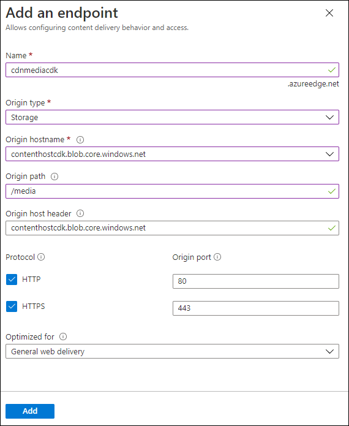

---
lab:
  az204Title: 'Lab 12: Enhance a web application by using the Azure Content Delivery Network'
  az204Module: 'Module 12: Integrate caching and content delivery within solutions'
---

# <a name="lab-12-enhance-a-web-application-by-using-the-azure-content-delivery-network"></a>Lab 12: Verbessern einer Webanwendung mit Azure Content Delivery Network

## <a name="microsoft-azure-user-interface"></a>Microsoft Azure-Benutzeroberfläche

Given the dynamic nature of Microsoft cloud tools, you might experience Azure UI changes that occur after the development of this training content. As a result, the lab instructions and lab steps might not align correctly.

Microsoft updates this training course when the community alerts us to needed changes. However, cloud updates occur frequently, so you might encounter UI changes before this training content updates. <bpt id="p1">**</bpt>If this occurs, adapt to the changes, and then work through them in the labs as needed.<ept id="p1">**</ept>

## <a name="instructions"></a>Anweisungen

### <a name="before-you-start"></a>Vorbereitung

#### <a name="sign-in-to-the-lab-environment"></a>Anmelden bei der Laborumgebung

Melden Sie sich mit den folgenden Anmeldeinformationen bei Ihrer Windows 10-VM an:

- Benutzername: **Admin**

- Kennwort: **Pa55w.rd**

> **Hinweis**: Ihr Kursleiter stellt Anweisungen zum Herstellen einer Verbindung mit der virtuellen Laborumgebung zur Verfügung.

#### <a name="review-the-installed-applications"></a>Überprüfen der installierten Anwendungen

Find the taskbar on your Windows 10 desktop. The taskbar contains the icon for the application that you'll use in this lab:

- Microsoft Edge

## <a name="architecture-diagram"></a>Architekturdiagramm


### <a name="exercise-1-create-azure-resources"></a>Übung 1: Erstellen von Azure-Ressourcen

#### <a name="task-1-open-the-azure-portal"></a>Aufgabe 1: Öffnen des Azure-Portals

1. Wählen Sie auf der Taskleiste das Symbol **Microsoft Edge** aus.

1. Navigieren Sie im geöffneten Browserfenster zum Azure-Portal (<https://portal.azure.com>), und melden Sie sich dann mit dem Konto an, das Sie für dieses Lab verwenden werden.

   > Aufgrund der dynamischen Natur der Microsoft-Cloudtools kann es vorkommen, dass sich die Azure-Benutzeroberfläche nach der Entwicklung dieses Trainingsinhalts ändert.

#### <a name="task-2-create-a-storage-account"></a>Aufgabe 2: Erstellen eines Speicherkontos

1. Verwenden Sie im Azure-Portal das Textfeld **Ressourcen, Dienste und Dokumente durchsuchen**, um nach einem **Speicherkonto** zu suchen, und wählen Sie in der Ergebnisliste den Eintrag **Speicherkonto** aus.

1. Wählen Sie auf dem Blatt  **Speicherkonten**  die Option **+ Erstellen** aus.

1. Führen Sie auf der Registerkarte **Grundlagen** des Blatts **Speicherkonto erstellen** die folgenden Aktionen aus, und wählen Sie dann **Überprüfen und erstellen** aus:

   | Einstellung | Aktion |
   | -- | -- |
   | Dropdownliste **Abonnement** | Übernehmen Sie den Standardwert. |
   | Abschnitt **Ressourcengruppe** | Wählen Sie **Neu erstellen** aus, geben Sie **MarketingContent** ein, und wählen Sie dann **OK** aus. |
   | Textfeld **Speicherkontoname**  | Geben Sie **contenthost** _[Ihr_Name]_ ein. |
   | Dropdownliste **Region** | Wählen Sie **USA, Osten** aus. |
   | Abschnitt **Leistung** | Wählen Sie die Option **Standard** aus. |
   | Dropdownliste **Redundanz** | Wählen Sie **Lokal redundanter Speicher (LRS)** aus. |

    Der folgende Screenshot zeigt die konfigurierten Einstellungen im Blatt **Speicherkonto erstellen**.

    

1. Überprüfen Sie auf der Registerkarte **Überprüfen und erstellen** die Optionen, die Sie in den vorherigen Schritten ausgewählt haben.

1. Wählen Sie **Erstellen** aus, um das Speicherkonto mithilfe Ihrer angegebenen Konfiguration zu erstellen.

    > **Hinweis**: Warten Sie, bis der Erstellungstask abgeschlossen ist, bevor Sie mit diesem Lab fortfahren.

#### <a name="task-3-create-a-web-app-by-using-azure-app-service"></a>Aufgabe 3: Erstellen einer Web-App mit Azure App Service

1. Wählen im Navigationsbereich des Azure-Portals die Option **Ressource erstellen** aus.

1. Geben Sie im Blatt **Ressource erstellen** im Textfeld **Dienste und Marketplace durchsuchen** den Text **Web App** ein, und drücken Sie dann die EINGABETASTE.

1. Wählen Sie im Blatt mit den Suchergebnissen das **Web-App**-Ergebnis und dann **Erstellen** aus.

1. Führen Sie im Blatt **Web-App erstellen** auf der Registerkarte **Grundlagen** die folgenden Aktionen aus, und wählen Sie **Weiter: Docker** aus:

   | Einstellung | Aktion |
   | -- | -- |
   | Dropdownliste **Abonnement** | Übernehmen Sie den Standardwert. |
   | Dropdownliste **Ressourcengruppe** | Wählen Sie **MarketingContent** in der Liste aus. |
   | Textfeld **Name**  | Geben Sie **landingpage** _[Ihr_Name]_ ein. |
   | Abschnitt **Veröffentlichen** | Wählen Sie **Docker-Container** aus. |
   | Abschnitt **Betriebssystem** | Wählen Sie **Linux** aus. |
   | Dropdownliste **Region** | Wählen Sie **USA, Osten** aus. |
   | Abschnitt **Linux-Plan (USA, Osten)** | Daher sind die Lab-Anweisungen und Lab-Schritte möglicherweise nicht mehr zutreffend. |
   | Abschnitt **SKU und Größe** | Übernehmen Sie den Standardwert. |

   Der folgende Screenshot veranschaulicht die konfigurierten Einstellungen auf dem Blatt **Web-App erstellen**.

   

1. Führen Sie auf der Registerkarte **Docker** die folgenden Aktionen aus, und wählen Sie dann **Überprüfen + erstellen** aus:

   | Einstellung | Aktion |
   | -- | -- |
   | Dropdownliste **Optionen** | Wählen Sie **Einzelner Container** aus. |
   | Dropdownliste **Imagequelle** | Wählen Sie **Docker Hub**. |
   | Dropdownliste **Zugriffstyp** | Wählen Sie **Öffentlich (10.0.0.0/24)** . |
   | Textfeld **Image und Tag** | Geben Sie **microsoftlearning/edx-html-landing-page:latest** ein. |

   Der folgende Screenshot veranschaulicht die konfigurierten Einstellungen auf der Registerkarte **Docker**.

   

1. Überprüfen Sie auf der Registerkarte **Überprüfen und erstellen** die Optionen, die Sie in den vorherigen Schritten ausgewählt haben.

1. Wählen Sie **Erstellen** aus, um die Web-App mit Ihrer angegebenen Konfiguration zu erstellen.

    > **Hinweis**: Warten Sie, bis der Erstellungstask abgeschlossen ist, bevor Sie mit diesem Lab fortfahren.

1. Klicken Sie auf dem Blatt **Bereitstellung** auf **Zu Ressource wechseln**.

1. On the <bpt id="p1">**</bpt>App Service Overview<ept id="p1">**</ept> blade, in the <bpt id="p2">**</bpt>Essentials<ept id="p2">**</ept>, record the value of the <bpt id="p3">**</bpt>URL<ept id="p3">**</ept> link. You'll use this value later in the lab.

#### <a name="review"></a>Überprüfung

In dieser Übung haben Sie ein Azure-Speicherkonto und eine Azure-Web-App erstellt, die Sie später in diesem Lab verwenden werden.

### <a name="exercise-2-configure-content-delivery-network-and-endpoints"></a>Übung 2: Konfigurieren von Content Delivery Network und Endpunkten

#### <a name="task-1-open-azure-cloud-shell"></a>Aufgabe 1: Öffnen von Azure Cloud Shell

1. Microsoft aktualisiert diesen Trainingskurs, wenn die Community uns über die erforderlichen Änderungen informiert.

    > Cloudupdates kommen jedoch häufig vor, sodass möglicherweise Änderungen an der Benutzeroberfläche auftreten, bevor diese Trainingsinhalte aktualisiert werden.

1. Führen Sie im Azure-Portal an der **Cloud Shell**-Eingabeaufforderung den folgenden Befehl aus, um die Version des Azure CLI-Tools (Azure Command-Line Interface) abzurufen:

    ```bash
    az --version
    ```

#### <a name="task-2-register-the-microsoftcdn-provider"></a>Aufgabe 2: Registrieren des Microsoft.CDN-Anbieters

1. Führen Sie an der **Cloud Shell**-Eingabeaufforderung im Portal die folgenden Aktionen aus:

    **Wenn dies der Fall ist, stellen Sie sich auf die Veränderungen ein, und arbeiten Sie sie bei Bedarf in den Labs durch.**

    ```bash
    az --help
    ```

    b.  Enter the following command, and then select Enter to get a list of the commands that are available for resource providers:

    ```bash
    az provider --help
    ```

    c.  Enter the following command, and then select Enter to list all currently registered providers:

     ```bash
     az provider list
     ```

    d.  Enter the following command, and then select Enter to list only the namespaces of the currently registered providers:

     ```bash
     az provider list --query "[?registrationState=='Registered'].namespace"
     ```

    e.  Observe the list of currently registered providers. The <bpt id="p1">**</bpt>Microsoft.CDN<ept id="p1">**</ept> provider isn't currently in the list of providers.

    f.  Enter the following command, and then select Enter to get the required flags to register a new provider:

     ```bash
     az provider register --help
     ```

    g.  Enter the following command, and then select Enter to register the <bpt id="p1">**</bpt>Microsoft.CDN<ept id="p1">**</ept> namespace with your current subscription:

     ```bash
     az provider register --namespace Microsoft.CDN
     ```

1. Schließen Sie den Bereich **Cloud Shell** im Portal.

#### <a name="task-3-create-a-content-delivery-network-profile"></a>Aufgabe 3: Erstellen eines Content Delivery Network-Profils

1. Wählen im Navigationsbereich des Azure-Portals die Option **Ressource erstellen** aus.

1. Geben Sie im Blatt **Ressource erstellen** im Textfeld **Dienste und Marketplace durchsuchen** den Text **CDN** ein, und drücken Sie dann die EINGABETASTE.

1. Wählen Sie auf dem Blatt mit den Suchergebnissen für **Marketplace** das Ergebnis **Front Door- und CDN-Profile** und dann **Erstellen** aus.

1. Wählen Sie auf der Seite **Angebote vergleichen** die Option **Weitere Angebote erkunden** aus. Wählen Sie dann **Azure CDN Standard von Akamai** und danach **Weiter** aus.

1. Führen Sie im Blatt **CDN-Profil** auf der Registerkarte **Grundlagen** die folgenden Aktionen aus, und wählen Sie dann **Überprüfen und erstellen** aus:

   | Einstellung | Aktion |
   | -- | -- |
   | Dropdownliste **Abonnement** | Übernehmen Sie den Standardwert. |
   | Dropdownliste **Ressourcengruppe** | Wählen Sie **MarketingContent** in der Liste aus. |
   | Textfeld **Name**  | Geben Sie **contentdeliverynetwork** ein. |
   | Textfeld **Region** | Übernehmen Sie den Standardwert (Global). |
   | Dropdownliste **Tarif** | Wählen Sie **Standard Akamai** aus. |
   | Kontrollkästchen **Jetzt neuen CDN-Endpunkt erstellen** | Nicht ausgewählt |

   Der folgende Screenshot veranschaulicht die konfigurierten Einstellungen im Blatt **CDN-Profil**.

   

1. Überprüfen Sie auf der Registerkarte **Überprüfen und erstellen** die Optionen, die Sie in den vorherigen Schritten ausgewählt haben.

1. Wählen Sie **Erstellen** aus, um das CDN-Profil mit Ihrer angegebenen Konfiguration zu erstellen.
  
    > <bpt id="p1">**</bpt>Note<ept id="p1">**</ept>: Wait for Azure to finish creating the CDN profile before you move forward with the lab. You'll receive a notification when the app is created.

#### <a name="task-4-configure-storage-containers"></a>Aufgabe 4: Konfigurieren von Speichercontainern

1. Wählen im Navigationsbereich des Azure-Portals die Option **Ressourcengruppe** aus.

1. Wählen Sie im Blatt **Ressourcengruppen** die Ressourcengruppe **MarketingContent** aus, die Sie zuvor in diesem Lab erstellt haben.

1. Wählen Sie im Blatt **MarketingContent** das Speicherkonto **contenthost** _[Ihr_Name]_ aus, das Sie zuvor in diesem Lab erstellt haben.

1. Wählen Sie im Blatt **Speicherkonto** den **Container**-Link im Abschnitt **Datenspeicher** aus.

1. Wählen Sie im Abschnitt **Container** die Option **+ Container** aus.

1. Führen Sie im Popupfenster **Neuer Container** die folgenden Aktionen aus, und wählen Sie dann **Erstellen** aus:

   | Einstellung | Aktion |
   | -- | -- |
   | Textfeld **Name**  | Geben Sie **media** ein. |
   | Dropdownliste **Öffentliche Zugriffsebene** | Wählen Sie **Blob (anonymer Lesezugriff nur für Blobs)** aus. |

1. Wählen Sie im Abschnitt **Container** erneut die Option **+ Container** aus.

1. Führen Sie im Popupfenster **Neuer Container** die folgenden Aktionen aus, und wählen Sie dann **Erstellen** aus:

   | Einstellung | Aktion |
   | -- | -- |
   | Textfeld **Name**  | Geben Sie **video** ein. |
   | Dropdownliste **Öffentliche Zugriffsebene** | Wählen Sie **Blob (anonymer Lesezugriff nur für Blobs)** aus. |

1. Sehen Sie sich die aktualisierte Liste der Container an, und vergewissern Sie sich, dass sowohl der **media**- als auch der **video**-Container aufgeführt sind.

#### <a name="task-5-create-content-delivery-network-endpoints"></a>Aufgabe 5: Erstellen der Content Delivery Network-Endpunkte

1. Wählen im Navigationsbereich des Azure-Portals den Link **Ressourcengruppe** aus.

1. Wählen Sie im Blatt **Ressourcengruppen** die Ressourcengruppe **MarketingContent** aus, die Sie zuvor in diesem Lab erstellt haben.

1. Wählen Sie im Blatt **MarketingContent** das CDN-Profil **contentdeliverynetwork** aus, das Sie zuvor in diesem Lab erstellt haben.

1. Wählen Sie im Blatt **CDN-Profil** die Option **+ Endpunkt** aus.

1. Führen Sie im Popupdialogfeld **Endpunkt hinzufügen** die folgenden Aktionen aus, und wählen Sie dann **Hinzufügen** aus:

   | Einstellung | Aktion |
   | -- | -- |
   | Textfeld **Name**  | Geben Sie **cdnmedia** _[Ihr_Name]_ ein. |
   | Dropdownliste **Ursprungstyp** | Wählen Sie **Storage** aus. |
   | Dropdownliste **Hostname des Ursprungs** | Wählen Sie für das Speicherkonto, das Sie zuvor in diesem Lab erstellt haben, die Option **contenthost *[Ihr_Name]* .blob.core.windows.net** aus. |
   | Textfeld **Ursprungspfad** | Geben Sie **/media** ein. |
   | Textfeld **Header des Ursprungshosts** | Übernehmen Sie den Standardwert. |
   | Abschnitte **Protokoll** und **Ursprungsport** | Übernehmen Sie die Standardwerte. |
   | Dropdownliste **Optimiert für** | Wählen Sie **Allgemeine Webbereitstellung** aus. |

   Der folgende Screenshot veranschaulicht die konfigurierten Einstellungen im Dialogfeld **Endpunkt hinzufügen**.

   

1. Wählen Sie im Blatt **CDN-Profil** erneut die Option **+ Endpunkt** aus.

1. Führen Sie im Popupdialogfeld **Endpunkt hinzufügen** die folgenden Aktionen aus, und wählen Sie dann **Hinzufügen** aus:

   | Einstellung | Aktion |
   | -- | -- |
   | Textfeld **Name**  | Geben Sie **cdnvideo** _[Ihr_Name]_ ein. |
   | Dropdownliste **Ursprungstyp** | Wählen Sie **Storage** aus. |
   | Dropdownliste **Hostname des Ursprungs** | Wählen Sie für das Speicherkonto, das Sie zuvor in diesem Lab erstellt haben, die Option **contenthost *[Ihr_Name]* .blob.core.windows.net** aus. |
   | Textfeld **Ursprungspfad** | Geben Sie **/video** ein. |
   | Textfeld **Header des Ursprungshosts** | Übernehmen Sie den Standardwert. |
   | Abschnitte **Protokoll** und **Ursprungsport** | Übernehmen Sie die Standardwerte. |
   | Dropdownliste **Optimiert für** | Wählen Sie **Video on Demand-Medienstreaming** aus. |

   Der folgende Screenshot veranschaulicht die konfigurierten Einstellungen im Dialogfeld **Endpunkt hinzufügen**.

   

1. Wählen Sie im Blatt **CDN-Profil** erneut die Option **+ Endpunkt** aus.

1. Führen Sie im Popupdialogfeld **Endpunkt hinzufügen** die folgenden Aktionen aus, und wählen Sie dann **Hinzufügen** aus:

   | Einstellung | Aktion |
   | -- | -- |
   | Textfeld **Name**  | Geben Sie **cdnweb** _[Ihr_Name]_ ein. |
   | Dropdownliste **Ursprungstyp** | Wählen Sie **Web-App** aus. |
   | Dropdownliste **Hostname des Ursprungs** | Wählen Sie die Option **landingpage *[Ihr_Name]* .azurewebsites.net** für die Web-App aus, die Sie zuvor in diesem Lab erstellt haben. |
   | Textfeld **Ursprungspfad** | Übernehmen Sie den Standardwert. |
   | Textfeld **Header des Ursprungshosts** | Übernehmen Sie den Standardwert. |
   | Abschnitte **Protokoll** und **Ursprungsport** | Übernehmen Sie die Standardwerte. |
   | Dropdownliste **Optimiert für** | Wählen Sie **Allgemeine Webbereitstellung** aus. |

   Der folgende Screenshot veranschaulicht die konfigurierten Einstellungen im Dialogfeld **Endpunkt hinzufügen**.

   

#### <a name="review"></a>Überprüfung

In dieser Übung haben Sie den Ressourcenanbieter für Content Delivery Network (CDN) registriert und dann den Anbieter verwendet, um sowohl ein CDN-Profil als auch Endpunktressourcen zu erstellen.

### <a name="exercise-3-upload-and-configure-static-web-content"></a>Übung 3: Hochladen und Konfigurieren statischer Webinhalte

#### <a name="task-1-observe-the-landing-page"></a>Aufgabe 1: Betrachten der Landing Page

1. Wählen im Navigationsbereich des Azure-Portals die Option **Ressourcengruppe** aus.

1. Wählen Sie im Blatt **Ressourcengruppen** die Ressourcengruppe **MarketingContent** aus, die Sie zuvor in diesem Lab erstellt haben.

1. Wählen Sie im Blatt **MarketingContent** die Web-App **landingpage** _[Ihr_Name]_ aus, die Sie zuvor in diesem Lab erstellt haben.

1. On the <bpt id="p1">**</bpt>App Service<ept id="p1">**</ept> blade, select <bpt id="p2">**</bpt>Browse<ept id="p2">**</ept>. A new browser tab opens and returns the current website. Observe the error message displayed on the screen. The website won't work until you configure the specified settings to reference multimedia content.

1. Kehren Sie zum derzeit geöffneten Browserfenster zurück, in dem das Azure-Portal angezeigt wird.

#### <a name="task-2-upload-storage-blobs"></a>Aufgabe 2: Hochladen von Speicher-Blobs

1. Wählen im Navigationsbereich des Azure-Portals die Option **Ressourcengruppe** aus.

1. Wählen Sie im Blatt **Ressourcengruppen** die Ressourcengruppe **MarketingContent** aus, die Sie zuvor in diesem Lab erstellt haben.

1. Wählen Sie im Blatt **MarketingContent** das Speicherkonto **contenthost** _[Ihr_Name]_ aus, das Sie zuvor in diesem Lab erstellt haben.

1. Wählen Sie im Blatt **Speicherkonto** den **Container**-Link im Abschnitt **Datenspeicher** aus.

1. Wählen Sie im Abschnitt **Container** den **media**-Container und dann **Hochladen** aus.

1. Führen Sie im Popupfenster **Blob hochladen** die folgenden Aktionen aus:

    a.  In the <bpt id="p1">**</bpt>Files<ept id="p1">**</ept> section, select the <bpt id="p2">**</bpt>Folder<ept id="p2">**</ept> icon.

    Suchen Sie auf ihrem Windows 10-Desktop nach der Taskleiste.

    - **campus.jpg**

    - **conference.jpg**

    - **poster.jpg**

    Die Taskleiste enthält die Symbole für die Anwendungen, die Sie in diesem Lab verwenden:  

    > **Hinweis**: Warten Sie, bis das Blob hochgeladen wurde, bevor Sie mit diesem Lab fortfahren.

1. Wählen Sie im Blatt **Container** die Option **Eigenschaften** im Abschnitt **Einstellungen** aus.

1. Record the value in the <bpt id="p1">**</bpt>URL<ept id="p1">**</ept> text box. You'll use this value later in the lab.

1. Schließen Sie das Blatt **Container**.

1. Wählen Sie im Blatt **Container** den **video**-Container und dann **Hochladen** aus.

1. Führen Sie im Popupfenster **Blob hochladen** die folgenden Aktionen aus:

    a.  In the <bpt id="p1">**</bpt>Files<ept id="p1">**</ept> section, select the <bpt id="p2">**</bpt>Folder<ept id="p2">**</ept> icon.

    b.  In the <bpt id="p1">**</bpt>File Explorer<ept id="p1">**</ept> window, browse to <bpt id="p2">**</bpt>Allfiles (F):<ph id="ph1">\\</ph>Allfiles<ph id="ph2">\\</ph>Labs<ph id="ph3">\\</ph>12<ph id="ph4">\\</ph>Starter<ept id="p2">**</ept>, select the <bpt id="p3">**</bpt>welcome.mp4<ept id="p3">**</ept> file, and then select <bpt id="p4">**</bpt>Open<ept id="p4">**</ept>.

    c.  Ensure that <bpt id="p1">**</bpt>Overwrite if files already exist<ept id="p1">**</ept> is selected, and then select <bpt id="p2">**</bpt>Upload<ept id="p2">**</ept>.  

    > **Hinweis**: Warten Sie, bis das Blob hochgeladen wurde, bevor Sie mit diesem Lab fortfahren.

1. Wählen Sie im Blatt **Container** die Option **Eigenschaften** im Abschnitt **Einstellungen** aus.

1. Record the value in the <bpt id="p1">**</bpt>URL<ept id="p1">**</ept> text box. You'll use this value later in the lab.

#### <a name="task-3-configure-web-app-settings"></a>Aufgabe 3: Konfigurieren von Web-App-Einstellungen

1. Wählen im Navigationsbereich des Azure-Portals die Option **Ressourcengruppe** aus.

1. Wählen Sie im Blatt **Ressourcengruppen** die Ressourcengruppe **MarketingContent** aus, die Sie zuvor in diesem Lab erstellt haben.

1. Wählen Sie im Blatt **MarketingContent** die Web-App **landingpage** _[Ihr_Name]_ aus, die Sie zuvor in diesem Lab erstellt haben.

1. Wählen Sie im Blatt **App Service** in der Kategorie **Einstellungen** den Link **Konfiguration** aus.

1. Wählen Sie im Abschnitt **Konfiguration** die Registerkarte **Anwendungseinstellungen** und dann **Neue Anwendungseinstellung** aus.

1. Konfigurieren Sie im Popupfenster **Anwendungseinstellung hinzufügen/bearbeiten** die folgenden Einstellungen, und wählen Sie dann **OK** aus.

   | Einstellung | Aktion |
   | -- | -- |
   | Textfeld **Name**  | Geben Sie **CDNMediaEndpoint** ein. |
   | Textfeld **Wert** | Geben Sie den **URI**-Wert des **media**-Containers im Speicherkonto **contenthost** _[Ihr_Name]_ ein, den Sie sich zuvor in diesem Lab notiert haben. |
   | Kontrollkästchen **Bereitstellungssloteinstellung** | Aktivieren Sie dieses Kontrollkästchen nicht. |

1. Kehren Sie zum Abschnitt **Konfiguration** zurück, und wählen Sie dann **Neue Anwendungseinstellung** aus.

1. Konfigurieren Sie im Popupfenster **Anwendungseinstellung hinzufügen/bearbeiten** die folgenden Einstellungen, und wählen Sie dann **OK** aus.

   | Einstellung | Aktion |
   | -- | -- |
   | Textfeld **Name**  | Geben Sie **CDNVideoEndpoint** ein. |
   | Textfeld **Wert** | Geben Sie den **URI**-Wert des **video**-Containers im Speicherkonto **contenthost** _[Ihr_Name]_ ein, den Sie sich zuvor in diesem Lab notiert haben. |
   | Kontrollkästchen **Bereitstellungssloteinstellung** | Aktivieren Sie dieses Kontrollkästchen nicht. |

1. Return to the <bpt id="p1">**</bpt>Configuration<ept id="p1">**</ept> section, and then select <bpt id="p2">**</bpt>Save<ept id="p2">**</ept>. Select <bpt id="p1">**</bpt>Continue<ept id="p1">**</ept> to confirm your changes.

   > **Hinweis**: Warten Sie, bis die Anwendungseinstellungen gespeichert wurden, bevor Sie mit dem Lab fortschreiten.

#### <a name="task-4-validate-the-corrected-landing-page"></a>Aufgabe 4: Überprüfen der korrigierten Landing Page

1. Wählen im Navigationsbereich des Azure-Portals die Option **Ressourcengruppe** aus.

1. Wählen Sie im Blatt **Ressourcengruppen** die Ressourcengruppe **MarketingContent** aus, die Sie zuvor in diesem Lab erstellt haben.

1. Wählen Sie im Blatt **MarketingContent** die Web-App **landingpage** _[Ihr_Name]_ aus, die Sie zuvor in diesem Lab erstellt haben.

1. Wählen Sie im Blatt **App Service** die Option **Neu starten** und dann **Ja** aus, um zu bestätigen, dass die App neu gestartet werden soll.

   > <bpt id="p1">**</bpt>Note<ept id="p1">**</ept>: Wait for the restart operation to complete before you move forward with the lab. You'll receive a notification when the operation is done.

1. On the <bpt id="p1">**</bpt>App Service<ept id="p1">**</ept> blade, select <bpt id="p2">**</bpt>Browse<ept id="p2">**</ept>. A new browser window or tab will open and return to the current website. Observe the updated website rendering multimedia content of various types.

1. Kehren Sie zum derzeit geöffneten Browserfenster zurück, in dem das Azure-Portal angezeigt wird.

#### <a name="review"></a>Überprüfung

In dieser Übung haben Sie Multimediainhalte als Blobs in Speichercontainer hochgeladen und dann Ihre Web-App aktualisiert, sodass direkt auf die Speicherblobs verwiesen wird.

### <a name="exercise-4-use-content-delivery-network-endpoints"></a>Übung 4: Verwenden von Content Delivery Network Endpunkten

#### <a name="task-1-retrieve-endpoint-uniform-resource-identifiers-uris"></a>Aufgabe 1: Abrufen der Endpunkt-URIs (Uniform Resource Identifiers)

1. Wählen im Navigationsbereich des Azure-Portals den Link **Ressourcengruppe** aus.

1. Wählen Sie im Blatt **Ressourcengruppen** die Ressourcengruppe **MarketingContent** aus, die Sie zuvor in diesem Lab erstellt haben.

1. Wählen Sie im Blatt **MarketingContent** das CDN-Profil **contentdeliverynetwork** aus, das Sie zuvor in diesem Lab erstellt haben.

1. Wählen Sie im Blatt **CDN-Profil** den Endpunkt **cdnmedia** _[Ihr_Name]_ aus.

1. **Hinweis**: Wenn Sie sich zum ersten Mal am Azure-Portal anmelden, wird Ihnen eine Tour durch das Portal angeboten.

1. Schließen Sie das Blatt **Endpunkt**.

1. Wählen Sie im Blatt **CDN-Profil** den Endpunkt **cdnvideo** _[Ihr_Name]_ aus.

1. Wählen Sie **Erste Schritte** aus, um die Tour zu überspringen und mit der Verwendung des Portals zu beginnen.

1. Schließen Sie das Blatt **Endpunkt**.

#### <a name="task-2-test-multimedia-content"></a>Aufgabe 2: Testen der Multimediainhalte

1. Erstellen Sie eine URL für die **campus.jpg**-Ressource, indem Sie die URL für **Endpunkthostname** des **cdnmedia** _[Ihr_Name]_ -Endpunkts, die Sie zuvor im Lab kopiert haben, mit dem relativen Pfad **/campus.jpg** kombinieren.

    > **Hinweis**: Wenn die URL von **Endpunkthostname** beispielsweise `https://cdnmediastudent.azureedge.net/` ist, lautet Ihre neu erstellte URL `https://cdnmediastudent.azureedge.net/campus.jpg`.

1. Erstellen Sie eine URL für die **conference.jpg**-Ressource, indem Sie die URL für **Endpunkthostname** des **cdnmedia** _[Ihr_Name]_ -Endpunkts, die Sie zuvor im Lab kopiert haben, mit dem relativen Pfad **/conference.jpg** kombinieren.

    > **Hinweis**: Wenn die URL von **Endpunkthostname** beispielsweise `https://cdnmediastudent.azureedge.net/` ist, lautet Ihre neu erstellte URL `https://cdnmediastudent.azureedge.net/conference.jpg`.

1. Erstellen Sie eine URL für die **poster.jpg**-Ressource, indem Sie die URL für **Endpunkthostname** des **cdnmedia** _[Ihr_Name]_ -Endpunkts, die Sie zuvor im Lab kopiert haben, mit dem relativen Pfad **/poster.jpg** kombinieren.

    > **Hinweis**: Wenn die URL von **Endpunkthostname** beispielsweise `https://cdnmediastudent.azureedge.net/` ist, lautet Ihre neu erstellte URL `https://cdnmediastudent.azureedge.net/poster.jpg`.

1. Erstellen Sie eine URL für die **welcome.mp4**-Ressource, indem Sie die URL für **Endpunkthostname** des **cdnvideo** _[Ihr_Name]_ -Endpunkts, die Sie zuvor im Lab kopiert haben, mit dem relativen Pfad **/welcome.mp4** kombinieren.

    > **Hinweis**: Wenn die URL von **Endpunkthostname** beispielsweise `https://cdnvideostudent.azureedge.net/` ist, lautet Ihre neu erstellte URL `https://cdnvideostudent.azureedge.net/welcome.mp4`.

1. Aktivieren Sie auf der Taskleiste das Kontextmenü für das **Microsoft Edge**-Symbol, und wählen Sie dann **Neues Fenster** aus.

1. Verweisen Sie im neuen Browserfenster auf die URL, die Sie für die **campus.jpg**-Medienressource erstellt haben, und überprüfen Sie dann, ob die Ressource gefunden wird.

    > <bpt id="p1">**</bpt>Note<ept id="p1">**</ept>: If the content isn't available yet, the CDN endpoint is still initializing. This initialization process can take anywhere from 5 to 15 minutes.

1. Verweisen Sie auf die URL, die Sie für die **conference.jpg**-Medienressource erstellt haben, und überprüfen Sie dann, ob die Ressource gefunden wird.

1. Verweisen Sie auf die URL, die Sie für die **poster.jpg**-Medienressource erstellt haben, und überprüfen Sie dann, ob die Ressource gefunden wird.

1. Verweisen Sie auf die URL, die Sie für die **welcome.mp4**-Videoressource erstellt haben, und überprüfen Sie dann, ob die Ressource gefunden wird.

1. Schließen Sie das Browserfenster, das Sie in dieser Aufgabe geöffnet haben.

#### <a name="task-3-update-the-web-app-settings"></a>Aufgabe 3: Aktualisieren der Web-App-Einstellungen

1. Wählen im Navigationsbereich des Azure-Portals die Option **Ressourcengruppe** aus.

1. Wählen Sie im Blatt **Ressourcengruppen** die Ressourcengruppe **MarketingContent** aus, die Sie zuvor in diesem Lab erstellt haben.

1. Wählen Sie im Blatt **MarketingContent** die Web-App **landingpage** _[Ihr_Name]_ aus, die Sie zuvor in diesem Lab erstellt haben.

1. Wählen Sie im Blatt **App Service** in der Kategorie **Einstellungen** den Link **Konfiguration** aus.

1. Wählen Sie im Abschnitt **Konfiguration** die Registerkarte **Anwendungseinstellungen** aus.

1. Wählen Sie die vorhandene **CDNMediaEndpoint**-Anwendungseinstellung aus.

1. Aktualisieren Sie im Popupdialogfeld **Anwendungseinstellung hinzufügen/bearbeiten** das Textfeld **Wert**, indem Sie die URL für **Endpunkthostname** des **cdnmedia** _[Ihr_Name]_ -Endpunkts eingeben, die Sie zuvor im Lab kopiert haben, und klicken Sie dann auf **OK**.

1. Wählen Sie die vorhandene **CDNVideoEndpoint**-Anwendungseinstellung aus.

1. Aktualisieren Sie im Popupdialogfeld **Anwendungseinstellung hinzufügen/bearbeiten** das Textfeld **Wert**, indem Sie die URL für **Endpunkthostname** des **cdnvideo** _[Ihr_Name]_ -Endpunkts eingeben, die Sie zuvor im Lab kopiert haben, und klicken Sie dann auf **OK**.

1. Wählen Sie **Speichern** und dann zum Bestätigen der Änderungen **Weiter** aus.  

   > **Hinweis**: Warten Sie, bis die Anwendungseinstellungen gespeichert wurden, bevor Sie mit dem Lab fortschreiten.

1. Wählen Sie im Abschnitt **Konfiguration** die Option **Übersicht** aus.

1. Wählen Sie im Abschnitt **Übersicht** die Option **Neu starten** und dann **Ja** aus, um zu bestätigen, dass die App neu gestartet werden soll.

   > <bpt id="p1">**</bpt>Note<ept id="p1">**</ept>: Wait for the restart operation to complete before you continue with the lab. You'll receive a notification when the operation is done.

#### <a name="task-4-test-the-web-content"></a>Aufgabe 4: Testen des Webinhalts

1. Wählen im Navigationsbereich des Azure-Portals den Link **Ressourcengruppe** aus.

1. Wählen Sie im Blatt **Ressourcengruppen** die Ressourcengruppe **MarketingContent** aus, die Sie zuvor in diesem Lab erstellt haben.

1. Wählen Sie im Blatt **MarketingContent** das CDN-Profil **contentdeliverynetwork** aus, das Sie zuvor in diesem Lab erstellt haben.

1. Wählen Sie im Blatt **CDN-Profil** den Endpunkt **cdnweb** _[Ihr_Name]_ aus.

1. Kopieren Sie im Blatt **Endpunkt** den Wert des Links **Endpunkthostname**.

1. Aktivieren Sie auf der Taskleiste das Kontextmenü für das **Microsoft Edge**-Symbol, und wählen Sie dann **Neues Fenster** aus.

1. Verweisen Sie im neuen Browserfenster auf die URL von **Endpunkthostname** für den **cdnweb** _[Ihr_Name]_ -Endpunkt.

1. Betrachten Sie die Website- und Multimediainhalte, die alle über Content Delivery Network bereitgestellt werden.

#### <a name="review"></a>Überprüfung

In dieser Übung haben Sie Ihre Web-App so aktualisiert, dass Content Delivery Network verwendet wird, um Multimediainhalte sowie die Webanwendung selbst bereitzustellen.

### <a name="exercise-5-clean-up-your-subscription"></a>Übung 5: Bereinigen Ihres Abonnements

#### <a name="task-1-open-azure-cloud-shell"></a>Aufgabe 1: Öffnen von Azure Cloud Shell

1. In the Azure portal, select the <bpt id="p1">**</bpt>Cloud Shell<ept id="p1">**</ept> icon <ph id="ph1"></ph> to open a new Bash session. If Cloud Shell defaults to a PowerShell session, select <bpt id="p1">**</bpt>PowerShell<ept id="p1">**</ept>, and then in the drop-down menu, select <bpt id="p2">**</bpt>Bash<ept id="p2">**</ept>.

    > <bpt id="p1">**</bpt>Note<ept id="p1">**</ept>: If this is the first time you're starting <bpt id="p2">**</bpt>Cloud Shell<ept id="p2">**</ept>, when prompted to select either <bpt id="p3">**</bpt>Bash<ept id="p3">**</ept> or <bpt id="p4">**</bpt>PowerShell<ept id="p4">**</ept>, select <bpt id="p5">**</bpt>PowerShell<ept id="p5">**</ept>. When you're presented with the <bpt id="p1">**</bpt>You have no storage mounted<ept id="p1">**</ept> message, select the subscription you're using in this lab, and select <bpt id="p2">**</bpt>Create storage<ept id="p2">**</ept>.

#### <a name="task-2-delete-a-resource-group"></a>Aufgabe 2: Löschen einer Ressourcengruppe

1. Führen Sie im Bereich **Cloud Shell** den folgenden Befehl aus, um die **MarketingContent**-Ressourcengruppe zu löschen:

    ```bash
    az group delete --name MarketingContent --no-wait --yes
    ```

     > **Hinweis**: Der Befehl wird (dem *--nowait*-Parameter entsprechend) asynchron ausgeführt. Dies bedeutet, dass Sie zwar einen weiteren Azure CLI-Befehl in derselben Bash-Sitzung direkt im Anschluss ausführen können, es jedoch einige Minuten dauert, bis die Ressourcengruppen tatsächlich entfernt wurden.

1. Schließen Sie den Bereich **Cloud Shell** im Portal.

#### <a name="task-3-close-the-active-application"></a>Aufgabe 3: Schließen der aktiven Anwendung

1. Schließen Sie die aktuell ausgeführte Microsoft Edge-Anwendung.

#### <a name="review"></a>Überprüfung

In dieser Übung haben Sie Ihr Abonnement bereinigt, indem Sie die in diesem Lab verwendeten Ressourcengruppen entfernt haben.
